<!-- Page 1 -->
3DGS.zip: A survey on
3D Gaussian Splatting Compression Methods
M. T. Bagdasarian1and P. Knoll1and Y. Li3and F. Barthel1
and A. Hilsmann1and P. Eisert1,2and W. Morgenstern1
1Fraunhofer HHI, Germany
2Humboldt-Universität zu Berlin, Germany
3Technische Universität Berlin, Germany
March 6, 2025
Abstract. 3D Gaussian Splatting (3DGS) has emerged as a cutting-edge technique for real-time radi-
ance field rendering, offering state-of-the-art performance in terms of both quality and speed. 3DGS
models a scene as a collection of three-dimensional Gaussians, with additional attributes optimized to
conform to the scene’s geometric and visual properties. Despite its advantages in rendering speed and
image fidelity, 3DGS is limited by its significant storage and memory demands. These high demands
make 3DGS impractical for mobile devices or headsets, reducing its applicability in important areas of
computer graphics. To address these challenges and advance the practicality of 3DGS, this state-of-the-
art report (STAR) provides a comprehensive and detailed examination of compression and compaction
techniques developed to make 3DGS more efficient. We classify existing methods into two categories:
compression, which focuses on reducing file size, and compaction, which aims to minimize the num-
ber of Gaussians. Both methods aim to maintain or improve quality, each by minimizing its respective
attribute: file size for compression and Gaussian count for compaction. We introduce the basic math-
ematical concepts underlying the analyzed methods, as well as key implementation details and design
choices. Our report thoroughly discusses similarities and differences among the methods, as well as
their respective advantages and disadvantages. We establish a consistent framework for comparing the
surveyed methods based on key performance metrics and datasets. Specifically, since these methods
have been developed in parallel and over a short period of time, currently, no comprehensive compari-
son exists. This survey, for the first time, presents a unified framework to evaluate 3DGS compression
techniques. To facilitate the continuous monitoring of emerging methodologies, we maintain a dedi-
cated website that will be regularly updated with new techniques and revisions of existing findings:
https://w-m.github.io/3dgs-compression-survey/.
Overall,
this
STAR
provides
an
intuitive
starting
point
for
researchers
interested
in
ex-
ploring the rapidly growing field of 3DGS compression.
By comprehensively categorizing
and evaluating existing compression and compaction strategies,
our work advances the un-
derstanding and practical application of 3DGS in computationally constrained environments.
1
Introduction
Computer graphics is a constantly evolving field, work-
ing towards more realistic and detailed representations
of the world. Key milestones in this journey include
the introduction of raster graphics in the 1960s, the de-
velopment of ray tracing in the 1980s to enhance real-
ism, and the adoption of real-time GPU rendering in the
2000s, which transformed gaming and interactive ap-
plications. Realistic 3D world representation remains a
crucial and ambitious goal, often considered the "holy
grail" for the future of graphics technology.
One way to represent the real world is to build it from
the ground up with computer graphics methods, while
another is to scan and reconstruct real-world scenes.
The computer vision community has made significant
strides with Neural Radiance Fields (NeRFs) [38], a
novel approach to scene representation that leverages
neural networks to represent volumetric scenes by pre-
dicting the color and density at each point in space.
NeRFs set a new quality standard for rendering, sig-
nificantly boosting research in 3D rendering and novel
view synthesis. However, implicit models like NeRFs
come with inherent challenges. They are computation-
1
arXiv:2407.09510v5  [cs.CV]  5 Mar 2025

<!-- Page 2 -->
ally intensive because the network must be evaluated
billions of times for a single image by querying along
rays for each pixel. This makes them difficult to manip-
ulate and complicates direct editing of scene elements.
Even with advances such as Instant-NGP [41], which
provide much improved training and rendering speeds
for radiance fields, the representation remains implicit,
limiting its flexibility for practical applications.
3D Gaussian Splatting (3DGS) [21] has emerged as
an explicit alternative to NeRFs, which delivers qual-
ity close to the state-of-the-art NeRF approach of Zip-
NeRF [5], while allowing explicit control over scene
elements. 3DGS uses Gaussian Splatting to represent
a scene by distributing a collection of Gaussian el-
lipsoids throughout the volume. These Gaussians ap-
proximate surfaces and volumes, providing an efficient
means of rendering and allowing for more straightfor-
ward scene manipulation and editing.
3DGS builds
on earlier computer graphics work on splatting tech-
niques [51], such as EWA splatting [59], which laid the
foundation for point-based rendering methods. A key
advantage of 3DGS is its ability to handle complex vi-
sual effects, such as view-dependent lighting and trans-
parency, which are vital for achieving accurate and vi-
sually convincing representations of real-world scenes.
As an explicit representation involving Gaussian ellip-
soids, 3DGS is editable and can be composed with
other representations, such as textured meshes, which
are widely used across industries like gaming and film
due to their flexibility, editability, and compatibility
with existing rendering engines. By supporting features
like transparency and view-dependent effects, 3DGS
enhances the versatility of 3D scene recording.
Moreover, 3DGS supports real-time rendering on
high-end GPUs, creating an optimistic outlook for
broader availability of applications on mobile and VR
devices in the near future. Its simplicity also contributes
to its accessibility: the 3DGS format uses a simple ren-
derer with multiple open implementations and a basic
.ply file format [48], which can be read and written by
libraries or implementations in many programming lan-
guages, making 3DGS accessible from the day it was
published. This simplicity has driven rapid adoption
across various fields [52], making 3DGS an attractive
option for both researchers and practitioners. However,
early implementations of 3DGS had significant file size
challenges [44]. Storing all attributes with full preci-
sion often resulted in files of several gigabytes, which
drove a wave of research focused on compression tech-
niques. Compression of 3DGS files provides several
benefits: it allows for faster transmission over slower
connections, enables rendering on lower-end devices by
reducing memory requirements, and supports the cre-
ation of larger, more complex scenes, particularly in
video game development. There is thus a strong mo-
tivation for compression, leading to an ongoing race to
discover the most effective techniques that balance re-
alism and computational efficiency.
The goal of compact scene representation is to
achieve an optimal balance between visual realism and
efficient storage. While NeRFs perform compression
as an integral part of their neural network-based repre-
sentation, 3DGS requires explicit densification - adding
more Gaussian primitives to fill in details - and pruning
- removing redundant primitives to optimize memory
usage and performance. Despite these challenges, the
explicit nature of 3DGS makes it particularly effective
for recording real-world scenes, especially with its abil-
ity to capture subtle lighting effects and transparency.
This survey provides an overview of the different
techniques developed to achieve a compact 3DGS rep-
resentation, summarizing numerous parallel efforts and
evaluating their effectiveness.
By examining these
methods, the survey guides future research and ap-
plications, helping the community identify successful
approaches and areas that require further exploration.
Many of the techniques used for compressing 3DGS
are adaptations of classical methods, tailored for Gaus-
sian splatting, while others introduce entirely new ap-
proaches to reduce data size.
The community has been closing the gap in compres-
sion efficiency between 3DGS and NeRFs, which may
currently serve as an optimal benchmark. By providing
a comprehensive overview, we aim to help researchers
identify effective strategies and avoid pitfalls, facilitat-
ing the development of improved 3DGS compression
methods. Establishing a simple and consistent standard
for compressed 3DGS will promote broader adoption
in the computer graphics community, enhancing its ver-
satility for diverse applications. Such a standard will
streamline compatibility and usability, paving the way
for 3DGS to achieve the ubiquity and practicality of tex-
tured meshes across various use cases.
Scope of this Survey
In this state-of-the-art report, we focus on optimization
techniques for 3D Gaussian Splatting (3DGS) represen-
tations, aiming to optimize memory usage while pre-
serving visual quality and real-time rendering speed.
We focus on compression and compaction methods. We
provide a comprehensive comparison of various com-
pression techniques, with quantitative results for the
most commonly used datasets summarized in a tab-
ulated format.
Specifically, we aim to ensure trans-
parency and create a basis for reproducibility of the in-
cluded approaches. Additionally, we offer a brief ex-
planation of each pipeline and compare and discuss the
main compression and compaction approaches. Rather
than covering all existing 3DGS methods and applica-
tions, our focus is specifically on techniques to optimize
3DGS representations for size or memory footprint; for
a broader overview of 3DGS methods and applications,
we refer readers to [14, 52]. While we include com-
mon approaches shared between neural radiance field
(NeRF) [38] compression and 3DGS compression, we
2

<!-- Page 3 -->
direct readers to [8,28] for NeRF-specific compression
methods. Furthermore, we acknowledge the inclusion
of both peer-reviewed publications from conferences
and journals, as well as preprints on arXiv, within our
state-of-the-art report, recognizing the rapidly evolving
nature of the field of 3D Gaussian splatting.
2
Fundamentals of 3D Gaussian
Splatting (3DGS)
3D Gaussian Splatting [21] introduces a novel approach
to real-time radiance field rendering, achieving state-of-
the-art performance quality and rendering speed. The
technique involves depicting a scene as an ensemble of
3D Gaussian primitives, which are optimized to align
with the scene’s geometry and visual characteristics.
Each 3D Gaussian is characterized by its 59 attributes:
• Position (µ): A 3D vector representing the x, y,
and z coordinates in world space; the mean of the
Gaussian. (3 attributes)
• Covariance matrix (Σ): The covariance matrix,
representing orientation and size of the Gaussian
primitive, can be factorized into the scaling S along
the x, y, and z axes (3 attributes) and rotation R, a
quaternion, which has 4 components. An exponen-
tial activation is used on the scaling parameters. (7
attributes)
• Opacity (o): A single scalar value. A sigmoid
activation is used to constrain the values to range
(0,1). (1 attribute)
• Color (c): View-dependent color is represented by
Spherical Harmonics (SH) coefficients. The first
degree of spherical harmonics is required to give
splats a diffuse color, split into 3 channels (R, G,
B). These are denoted f_dc_{0,1,2} in the .ply
point cloud format.
Additional view-dependent
colors are supported through higher degrees of SH.
3DGS proposes to use degree 3, thus 15 additional
coefficients per color channel. (3 rgb x 16 coeffi-
cients = 48 attributes)
The training of a static 3D Gaussian Splatting scene
utilizes a collection of images as input, in conjunction
with calibrated cameras derived from Structure from
Motion (SfM), which yield a sparse initial point cloud.
For each point within the resulting sparse cloud, a 3D
Gaussian distribution (G(x)) is initialized. The render-
ing of 3D Gaussian primitives, also called splatting, is
achieved by their projection from a three-dimensional
space onto a two-dimensional image plane.
Each
three-dimensional Gaussian is transformed into a two-
dimensional Gaussian (a splat) whose footprint is de-
rived from its covariance matrix and the camera’s view
transformation parameters. For each pixel, colors are
aggregated via alpha-blending, with contributions from
each splat blended according to their depth order. Ulti-
mately, the pixel’s color, denoted as I, is determined as
follows:
I(x) = ∑
i∈N
αi(x)ci
i−1
∏
j=1
(1−α j(x)),
(1)
α(x) = oG(x),
G(x) = e−1
2 (x−µ)T Σ′−1(x−µ)
In this context, N denotes the set of depth-sorted splats
that overlap at a pixel, ci is the color and αi is the con-
tribution of a primitive, that is the product of opacity
(o) and Gaussian falloff. This ensures that splats are
blended in the appropriate sequence, with those situated
closer exerting a more significant impact on the result-
ing pixel color. Throughout the training or optimization
phase, the position, size (as represented by the covari-
ance matrix), opacity, and color of the Gaussian func-
tions are systematically refined to optimally correspond
to the input views.
Differentiable rendering is used
to compute gradients, which allows the adjustment of
Gaussian parameters so that the rendered images align
with the training images.
0
10
0k
100k
200k
300k
400k
500k
600k
700k
800k
opacity
15
10
5
0
scale_0
Figure 1: Histograms of the opacity and the first scaling
attributes for all 3D Gaussians of the bicycle scene (as
trained by 3DGS [21]).
Figure 1 shows histograms of the opacity and the first
scaling attributes for all 3D Gaussians of the bicycle
scene (as trained by 3DGS [21]). Before passing the
values to the renderer, their activation functions are ap-
plied: sigmoid for the opacity, and exponential for the
scale. We can see a peak of very low opacity Gaussians,
demonstrating potential candidates to be removed from
the scene (see Figure 10). In the scaling histogram, we
can see that there are very few large Gaussians, an ef-
fect from applying the adaptive density control. Addi-
tional histograms for the same scene are shown in the
Appendix A.
3

<!-- Page 4 -->
3
Fundamentals of Compression
and Compaction for 3DGS
While Gaussian Splatting scenes can efficiently be ren-
dered in real-time, they come with significant file size
demands, necessitating efficient compression for man-
aging large scenes. For other media data like images,
video, or audio different coding strategies exist to sig-
nificantly reduce data size. Usually, coding methods are
distinguished between lossless and lossy coding. For
lossless coding, redundancy is reduced by exploiting the
different probabilities of the individual symbols. Such
entropy encoding can be achieved, e.g., with Huffman
[18] or arithmetic coding [1]. For correlated sources,
coding efficiency can be further increased by appropri-
ate prediction or transformation of symbols prior to en-
tropy coding. However, depending on source statistics,
lossless coding is often restricted to moderate compres-
sion around a factor of 2. Much higher coding efficiency
can be expected when tolerating small deviations in the
decoded data. Lossy compression targets at removing
irrelevance in the data that cannot perceived by humans
but would need additional bits for encoding. Quantiza-
tion of the predicted or transformed symbols to fewer
code words is a standard approach, either for scalar val-
ues or an entire vector as in vector quantization (see Sec.
3.1). The goal is then to adjust and shift the quantization
error such that is does not become visible.
x
y
z
scale_0
scale_1
scale_2
rot_0
rot_1
rot_2
rot_3
opacity
f_dc_0
f_dc_1
f_dc_2
x
y
z
scale_0
scale_1
scale_2
rot_0
rot_1
rot_2
rot_3
opacity
f_dc_0
f_dc_1
f_dc_2
1.00
0.75
0.50
0.25
0.00
0.25
0.50
0.75
1.00
Figure 2: A correlation heatmap for attributes of all
3D Gaussians of the bicycle scene (as trained by 3DGS
[21]).
As an example, Figure 2 shows a correlation heatmap
for attributes of all 3D Gaussians of the bicycle scene,
as provided by 3DGS [21]. The color channels of the
base colors of the splats ( f_dc) are nearly perfectly cor-
related, likely due to the dominance of luminance over
chrominance changes in this natural scene. This signif-
icant correlation suggests the feasibility of jointly en-
coding the base color channels. Further correlation ex-
ists between the individual scale attributes and also be-
tween scale and opacity, which can be exploited in com-
pression. A full correlation map including all spherical
harmonics attributes can be found in the Appendix A
Beyond standard coding techniques, Gaussian Splat-
ting provides numerous opportunities to modify data to
support more efficient coding. The reason lies in the dif-
ferent ambiguities within the Gaussian Splatting struc-
ture. Different arrangements of splats can lead to the
same visual appearance while differing in their com-
pressibility. This can be exploited in considering addi-
tional losses during training and scene optimization to
limit bit-rate while keeping visual quality. Reparam-
eterizing the 3DGS representation offers another av-
enue for achieving compression without compromis-
ing visual quality. In the following sections, we will
first present several concepts for compression and com-
paction of Gaussian Splatting scenes, while Section 4
will dive into details of individual approaches from the
current state of the art.
3.1
Vector Quantization
Vector quantization techniques are central to many com-
pression strategies, with the goal to reduce data com-
plexity by grouping similar data points together and rep-
resenting them with a shared approximation. Specif-
ically, the original high dimensional dataset is parti-
tioned into clusters, with each cluster being approxi-
mated by a representative feature. The process relies
on algorithms like K-means [33, 35] or LBG [30], it-
eratively assigning data points to clusters, minimizing
the distance between the vectors and their assigned cen-
troids. This leads to the formation of a codebook. Data
compression is achieved by replacing each original vec-
tor with the index of the closest representative vector in
the codebook. Figure 3 illustrates the sequential pro-
cess starting from unorganized Gaussian attributes, pro-
gressing through the clustering, the creation of a code-
book, and the final result of Vector Quantization. The
quality of the quantized representation heavily depends
on the codebook design and the clustering algorithm
used. A well-designed codebook will minimize the er-
ror introduced by quantization while maximizing com-
pression efficiency.
The quantization process can either be performed on
the entire multi-dimensional vectors simultaneously or
individual dimensions of the data space can be treated
as separate quantization tasks. The latter case allows for
more flexible handling of different data attributes, espe-
cially for applications where different properties of the
data require different levels of precision and have differ-
ent distributions and levels of redundancy. In essence,
vector quantization algorithms improve a small set of
vectors to represent a larger set of vectors under some
4

#### Page 4 Images

<!-- Page 5 -->
Figure 3: Vector Quantization steps.
optimization criterion. This results in significant com-
pression gains, making VQ highly efficient when the
data exhibits redundancy or for data-rich applications
where a slight loss of precision is acceptable in ex-
change for dramatic reductions in data size.
Hence,
these approaches play a crucial role in various domains,
from signal processing and image compression to the
emerging field of 3D data representation to compress
complex datasets while maintaining a close approxima-
tion to the original. Especially, it is highly effective for
compressing 3D Gaussian splatting (3DGS) data, where
attributes like positions, colors, or spherical harmonics
are often highly redundant and exhibit natural clustering
tendencies.
3.2
Structuring and Dimensionality Re-
duction
While vector quantization focuses on reducing redun-
dancy by encoding attributes into shared clusters, an al-
ternative perspective integrates structural organization,
spatial redundancy exploitation, and dimensional reduc-
tion. Instead of encoding attributes in isolation, meth-
ods like octrees, hash-grids, and self-organizing grids
reshape and recombine data spatially. These techniques
organize scene elements hierarchically or around repre-
sentative points, enabling efficient reuse of similar prop-
erties across regions. By structuring Gaussians to ex-
ploit contextual relationships—such as proximity, color,
or shape—compression becomes more about the global
arrangement of data, reducing the need to store individ-
ual attributes independently. This shift from attribute-
focused encoding to structural compression highlights
the potential for compact representations through spa-
tial coherence, redundancy management, and transfor-
mations into lower-dimensional forms that preserve es-
sential spatial relationships. In this section, we look at
different methods that provide either a re-structuring of
the data, a dimensionality reduction or factorization, as
well as combinations thereof.
3.2.1
Octrees
Octrees are a spatial partitioning technique used in com-
puter graphics to efficiently represent 3D data like point
clouds and volumetric models [37]. They have been
successfully applied to point cloud compression [47].
Furthermore, octrees have demonstrated their effective-
ness in speeding up Neural Radiance Field (NeRF)
rendering through hierarchical volumetric representa-
tion, enabling real-time performance [56]. Since 3DGS
scenes are effectively point clouds with additional at-
tributes, using octrees for 3DGS becomes straightfor-
ward.
Octrees recursively subdivide 3D space into
smaller cubes (see Figure 4), allowing efficient memory
allocation by focusing on non-empty regions. In addi-
tion, coordinates can be referenced relative to sub-cubes
leading to a smaller average bit-length. In 3DGS, oc-
trees help allocate memory only to occupied parts of the
scene, skipping over empty regions and, reducing mem-
ory usage while preserving detail, making them ideal
for large-scale scenes.
Figure 4: Example of a point cloud with Octree parti-
tioning.
3.2.2
Anchor-based Representations
Anchor points can be used as proxies to predict the
properties of associated Gaussian kernels. Unlike oc-
trees, which partition space into a hierarchical grid, an-
chors group Gaussians by associating them with rep-
resentative points, allowing efficient compression with-
out strict spatial subdivision [34].
Anchors are ini-
tialized by voxelizing the 3D scene and are assigned
position, context features, scaling, and learnable off-
sets.
By deriving Gaussian attributes from these an-
chors rather than storing them individually, redundancy
is reduced, leading to decreased memory usage (Fig. 5).
This approach is conceptually related to the codebooks
used in vector quantization presented in Section 3.1,
where shared representations efficiently reduce storage
requirements while retaining high fidelity.
5

#### Page 5 Images

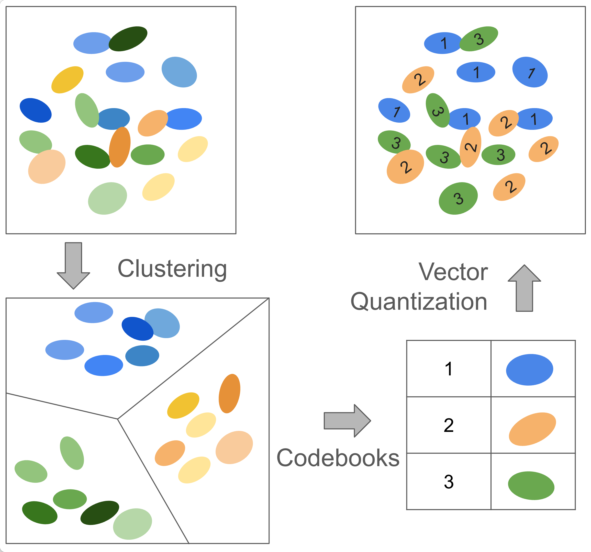

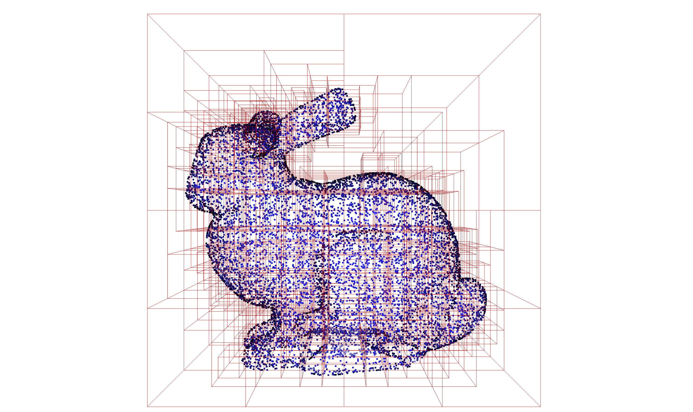

<!-- Page 6 -->
Figure 5: Anchor-based structure. Left: A voxalized
scene with SfM inistialized points. Right: The center
of each voxel becomes an anchor and is associated with
position, feature, scaling and offset. From each anchor
neural Gaussians are spawned.
3.2.3
Multi-Resolution Hash Grids
Hash-grid assisted context modeling leverages multi-
resolution hash grids, inspired by Instant-NGP [41], to
efficiently represent spatial relationships in 3D Gaus-
sian Splatting. Instant-NGP’s multiresolution hash en-
coding uses a compact hash table to store trainable fea-
ture vectors, which are optimized during training to rep-
resent complex spatial details with fewer parameters
compared to dense grid encodings. This method enables
a trade off between memory, performance, and quality
by adjusting parameters such as hash table size, feature
vector size, and the number of hash levels. Unlike tra-
ditional spatial encodings that explicitly manage colli-
sions, the hash-grid approach uses an MLP to implicitly
handle these collisions. This makes this a hybrid ex-
plicit/implicit method, and introduces a small computa-
tional overhead for the feature decoding. For applica-
tion in 3DGS, the features stored in the hash table are
decoded into attributes for individual primitives. Hash
grids are particularly effective in allocating memory to
regions of high importance, as demonstrated by Instant-
NGP, which achieves small, high-quality radiance fields
with minimal parameters. This makes them a very ef-
fective tool for 3DGS compression.
3.2.4
Z-order Curves
Z-order curves, or Morton ordering, work by interleav-
ing the bits of the coordinate values from multiple di-
mensions to create a single one-dimensional index, ef-
fectively mapping multidimensional data into a linear
sequence while preserving spatial locality. Figure 6 ex-
emplifies how a Z-order curve traverses a regular point
grind in 3D space. By ordering the Gaussians according
to their positions along a Z-order curve, spatial coher-
ence can be exploited to improve the efficiency of run-
length or predictive encoding techniques. This makes
Z-order curves useful for spatial indexing and creating
a coherent order for splats. In the context of sparse point
clouds in 3DGS, Z-order curves are used to order splats
based on their positions, which is memory efficient as
it avoids allocating storage to empty regions.
How-
ever, this approach has limitations in terms of main-
taining neighborhood relationships: high-dimensional
neighbors are not always close when mapped linearly,
which affects the efficiency of operations that rely on
true spatial proximity. More sophisticated methods, like
Hilbert curves, can sometimes provide better locality
for such datasets [7], offering improved efficiency in
spatial indexing by ensuring that spatial neighbors are
more likely to remain neighbors in the linear mapping.
Figure 6: Example of a regular 3D point grid traversed
with Z-order curves.
3.2.5
Tri-planes and K-planes
Building on the idea of mapping multidimensional data
into lower-dimensional grids, tri-plane factorization in-
stead projects 3D positions onto three orthogonal 2D
planes to store and retrieve attributes [6].
This cre-
ates a natural 2D organization, where Gaussians that are
spatially close in 3D tend to occupy proximate coordi-
nates on each plane, allowing 2D feature maps to be
saved or edited like images while preserving some local
neighborhood relationships. Rather than storing each
primitive’s parameters individually, tri-plane factoriza-
tion encodes attributes (e.g., color, opacity) as 2D fea-
ture images in the xy, xz, and yz planes. This process
is visualized in Figure 7. The features are combined
via simple operations such as concatenation, summa-
tion or multiplication and then decoded through a small
MLP. Thus, the method is a hybrid of explicit storage
(the planes) and implicit representation (the decoder).
Compared to Z-order curves, which provide a single
linear mapping of 3D points to 1D indices, tri-planes
rely on three parallel 2D projections for more direct spa-
tial correlation in each axis-aligned view. This makes it
straightforward to compress or synthesize the plane im-
ages with standard 2D techniques. It also allows for
synthesis of the feature planes with generative frame-
works such as StyleGAN [20].
Furthermore, exten-
sion to higher-dimensional spaces yields K-Planes [15],
where temporal or additional dimensions can be incor-
porated by factorizing them into extra 2D planes.
As with other dimensionality reduction methods, key
6

#### Page 6 Images

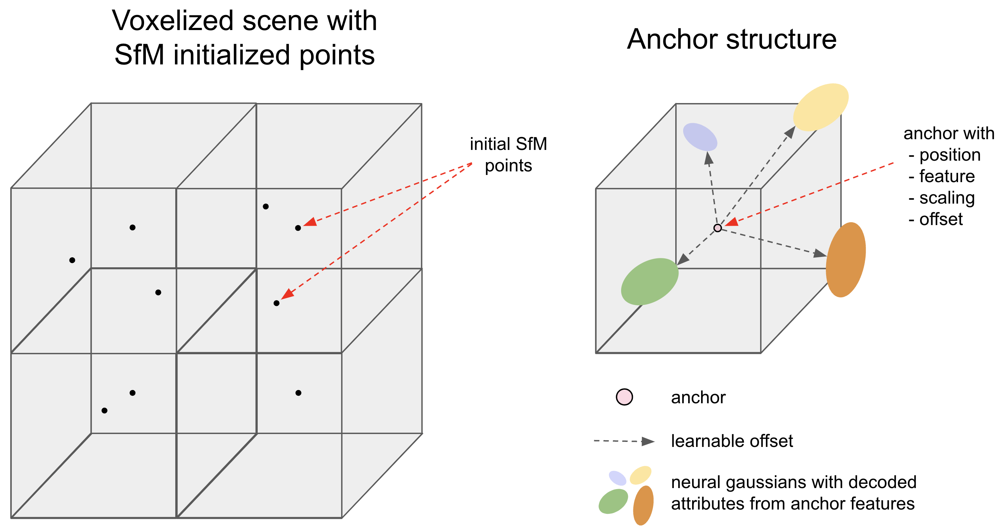

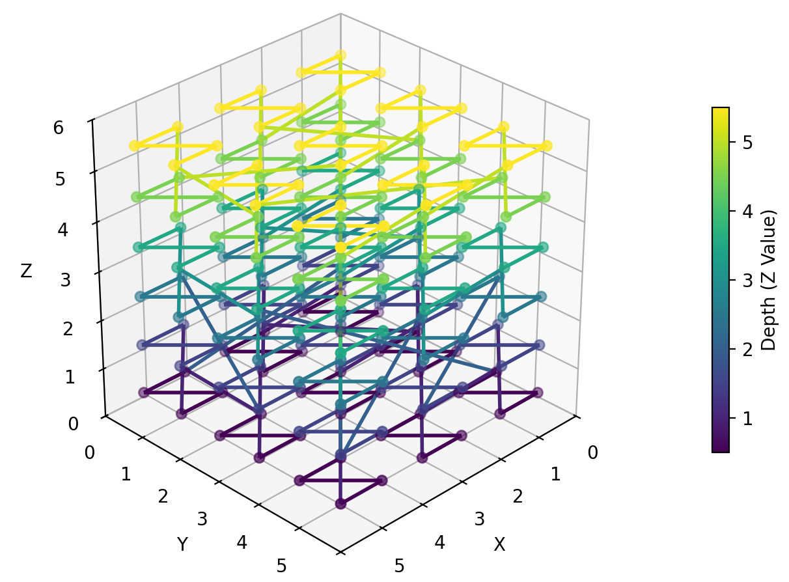

<!-- Page 7 -->
Figure 7: The tri-plane model: A 3D query point is
projected onto three orthogonal planes: xy, xz and yz.
For 3DGS compression, the query can be the position of
the primitive. The planes can store features, which are
decoded into the other attributes (e.g. color, opacity)
with a small MLP.
parameters include the overall resolution of each plane
(trading off granularity versus memory), how features
from the three planes are aggregated, and the complex-
ity of the MLP decoder that maps these aggregated fea-
tures to the final per-Gaussian attributes. Similar to the
Z-order approach, the aim is to exploit spatial coherence
so that splats sharing similar properties lie close in the
2D feature maps. Because tri-plane factorization scales
as O(N2) instead of O(N3), higher resolutions can be
used than in dense voxel grids. This makes tri-plane
factorization useful tool for 3DGS compression.
3.2.6
Self-Organizing Gaussians
Another approach to map high-dimensional Gaussian
parameters into 2D grids is through self-organization.
This method was developed specifically for 3DGS com-
pression [40].
Figure 8 depicts an example of the
primitives of the Truck scene from the Tanks and Tem-
plesdataset reorganized into a 2D grid. The idea is based
on the concept of Self-Organizing Maps [25], an unsu-
pervised learning model that projects high-dimensional
data onto a lower-dimensional grid, preserving the topo-
logical relationships between data points through com-
petitive learning.
Similar in motivation to Z-order
curves and tri-planes, this 2D representation enables the
use of standard image compression techniques, exploit-
ing perceptual redundancies and ensuring local smooth-
ness between neighboring splats. Unlike Z-order curves
and tri-planes, which impose a fixed ordering, the Self-
Organizing Gaussians representation is optimized for
each scene, allowing neighbors in all dimensions to be
modeled effectively. By organizing attributes into mul-
tiple data layers that share a consistent 2D layout, this
technique provides a highly compressible and efficient
representation of the original 3D scene.
Figure 8: The Gaussian primitives of the Truck scene
mapped into a 2D layout using the Self-Organizing
Gaussians approach [40].
An optimal arrangement
is learned which preserves local relationships.
This
learned organization can utilize the available grid space
more efficiently than fixed methods like Z-curves tri-
planes.
3.2.7
Region Adaptive Hierarchical Transform
(RAHT)
RAHT is a bottom-up transform that reorganizes color
attributes along an octree (see also Section 3.2.1 on oc-
trees). At each step, it pairs neighboring voxels accord-
ing to their weights—the number of underlying vox-
els—and produces one low-frequency (DC) and one
high-frequency coefficient [11]. The DC coefficients
propagate upward for further merging, while the high-
frequency coefficients are encoded immediately. Be-
cause the transform adapts to local density by adjusting
the transform matrix to the weights, it effectively pre-
serves small-scale details while reducing redundancy.
Compared to graph-based transforms that require costly
eigen-decompositions, RAHT relies on simple pairwise
operations at each level, making it computationally effi-
cient and suitable for real-time compression. After ap-
plying the transform, the resulting coefficients are quan-
tized and entropy coded using an arithmetic coder with
a Laplacian model, with sub-band parameters encoded
with a Run-Length Golomb-Rice (RLGR) coder. This
approach achieves compression performance compara-
ble to state-of-the-art methods for point-cloud compres-
sion, but at significantly lower complexity. This hierar-
chical scheme is especially effective for attributes that
exhibit strong local correlation, thus it can be adapted
to encode attributes like color or density for 3D Gaus-
sian splatting.
3.2.8
Discussion
The methods discussed form a toolkit to achieve com-
pact and efficient 3D Gaussian Splatting, each with dis-
tinct advantages and disadvantages. Z-curves, tri-plane
factorizations and 2D grid mappings reduce dimen-
sional complexity in a simple and straightforward way.
7

#### Page 7 Images

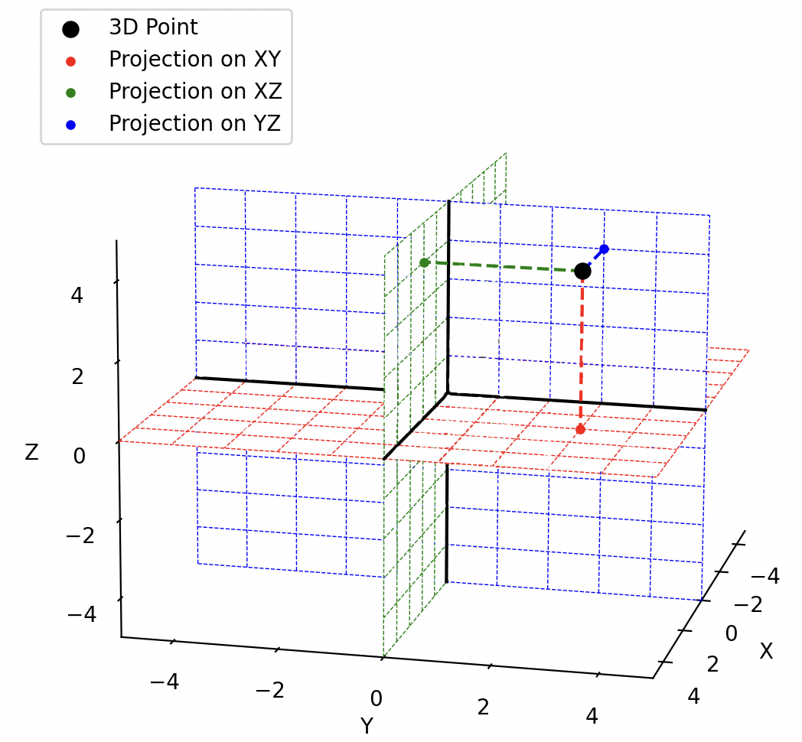

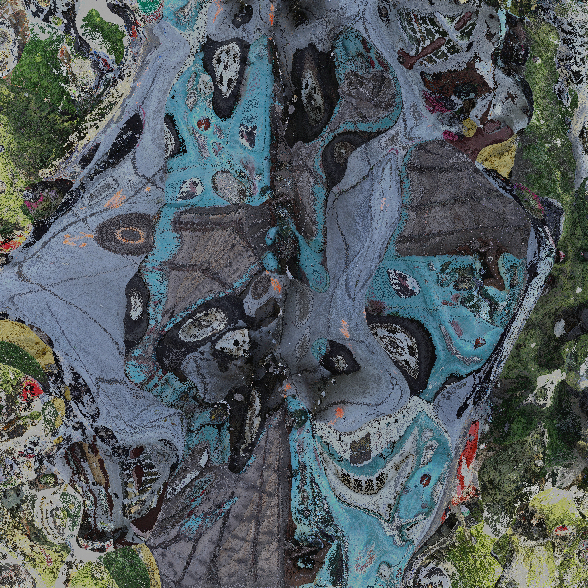

<!-- Page 8 -->
Fixed schemes like Z-order curves provide efficient or-
dering but may struggle with spatial coherence in sparse
datasets.
Adaptive techniques, such as anchor-based
grouping or learned self-organizing mappings, can mit-
igate these issues by dynamically adjusting to scene-
specific redundancies. Tri-planes may not use the avail-
able space efficiently, as empty space in 3D translates
to empty patches in the planes. Self-Organizing Gaus-
sians overcome this by learning a custom, non-linear
mapping per scene. Hash-grids use adaptive, multireso-
lution indexing, which is fast and memory efficient, but
is not an invertible mapping. Hash grids and tri-planes
both store features, which need to be decoded into at-
tributes with an MLP. While explicit methods allow di-
rect access to Gaussian attributes, this implicit feature
storage introduces compactness at the cost of requiring
additional decoding.
Octrees adaptively allocate memory only to occupied
regions, optimizing resource use for complex scenes,
but require advanced attribute compression schemes
like RAHT to exploit local correlations for compres-
sion. Anchor-based methods group Gaussians around
representative points, reducing local redundancy effi-
ciently, similar to vector quantization.
While these
methods are often considered independently, combining
anchor-based representations with structured grids (e.g.,
hash grids, octrees) can enhance both local and global
efficiency. Hybrid approaches allow for flexible spatial
partitioning while maintaining fine-grained control over
Gaussian placement.
All discussed methods are designed for efficient de-
coding, making them suitable for real-time applica-
tions.
However, encoding complexity varies:
Self-
Organizing Gaussians require a computationally expen-
sive optimization to determine element order, anchor-
based methods involve clustering and optimization to
define representative points, and feature-based methods
like tri-planes and hash grids require a training process
to establish features and MLP weights for decoding.
This feature decoding adds a small computational over-
head at decoding and rendering time.
Memory consumption at decoding and rendering
time depends on the representation. For explicit meth-
ods, VRAM (GPU memory) usage is directly tied
to the number of primitives, meaning that reducing
their count through compaction (as discussed in the
following sections) directly lowers memory require-
ments. In contrast, methods like hash grids, tri-planes,
and vector quantization can use less memory over-
all by storing features in compact structures such as
feature planes, hash tables, or codebooks.
However,
their memory usage is constant, meaning that reduc-
ing the number of primitives does not further decrease
VRAM consumption. Depending on whether a system
is memory- or compute-constrained, different trade-offs
may be preferable. Large scenes often demand signif-
icant VRAM, making compact representations benefi-
cial, while compute-constrained devices, such as VR
headsets, may have sufficient memory but benefit from
pre-decoding implicit representations into explicit at-
tributes to reduce runtime computation.
3.3
Attribute Pruning
Attribute pruning refers to the selective reduction of at-
tributes associated with each Gaussian, such as spher-
ical harmonics (SH), to optimize memory usage and
computational efficiency. In 3DGS, spherical harmon-
ics are often used to encode complex lighting and color
information. SH coefficients can become expensive to
store and process, especially as the degree of precision
increases. For example, adopting SH up to degree 3 for
RGB data can result in 48 coefficients (16 per channel),
consuming 81% (48 out of 59 attributes) of the storage
size required for a single Gaussian.
To address this, attribute pruning techniques dynam-
ically adjust the number of SH coefficients for each
Gaussian.
Rather than applying a uniform level of
SH precision across the entire scene, the degree of SH
is tailored based on the specific requirements of each
Gaussian. In less complex regions of the scene, some
Gaussians only need a single degree of SH (basic RGB
color), while more complex regions require higher de-
grees for more detailed representation.
It is also possible to completely forgo spherical har-
monics, and model the view-dependent effects with
other approaches, such as NeRF-like MLPs, or classi-
cal computer graphics shading [19]. These approaches
may use far fewer attributes then third-degree spheri-
cal harmonics, but on the downside require custom, and
potentially slower, rendering.
3.4
Compaction
The key tool for achieving compaction in 3D Gaussian
Splatting (3DGS) is Adaptive Density Control (ADC).
ADC dynamically manages the number of Gaussians
during the optimization process, adjusting their density
based on scene requirements rather than relying on a
fixed number of elements. It adds or removes Gaussians
depending on their contribution to the scene, ensuring
that only the most essential elements are retained.
By assessing criteria such as gradients, pixel cover-
age, and saliency maps, ADC intelligently determines
whether Gaussians should be cloned, split, or removed.
This ensures that additional Gaussians are allocated
where they are most needed, such as in high-frequency
regions, while redundant or less impactful Gaussians
are pruned.
Figure 9 exemplifies the processes for
(a) Gaussian primitive cloning, (b) Gaussian primitive
splitting, and (c) Gaussian primitive pruning. Cloning
produces an identical replica of the chosen Gaussian
which is then incorporated into the scene. The split-
ting algorithm substitutes a Gaussian with a set number
(default N = 2) of child Gaussians. These child Gaus-
sians, after splitting, are situated within the bounds of
8

<!-- Page 9 -->
the removed parent Gaussian. The children’s scaling is
derived from the parent Gaussian’s scaling, reduced by
a factor. The remaining attributes are directly inherited
from the parent Gaussian.
Figure 9: From top to bottom, this figure shows the
following processes: (a) Gaussian cloning, (b) Gaussian
splitting, and (c) Gaussian pruning.
Figure 10 shows how the number of Gaussians, in
this example filtered by opacity, impact the visual qual-
ity of the rendered scene. While there is only minimal
visual quality loss between 5.6 and 4.1 Million Gaus-
sians, you can already spot changes in the rendering of
the bicycle’s spokes. This becomes more evident with
3.0 Million Gaussians. With even less Gaussians (1.0
Million) the bicycle reconstruction becomes transparent
and the grass reconstruction also suffers.
Operating dynamically during both training and ren-
dering, ADC continuously refines the scene representa-
tion. As the scene evolves, ADC ensures efficient Gaus-
sian allocation, leading to a more compact and high-
quality model over time.
4
Efficient
Strategies
for
Com-
pression and Compaction in 3D
Gaussian Splatting
As 3D Gaussian Splatting (3DGS) evolves as a promi-
nent method for real-time scene rendering, its increas-
ing adoption is challenged by substantial storage and
computational requirements.
This section addresses
two essential optimization strategies:
Compression
(Sec.
4.1) and Compaction (Sec.
4.2).
Compres-
sion reduces storage usage by employing methods such
as vector quantization, which clusters similar Gaussian
attributes to reduce redundancy, and structured repre-
sentations that organize Gaussians into more compact
forms like grids or anchor points. Compaction, on the
other hand, focuses on optimizing the number and dis-
tribution of Gaussians, ensuring that only the most es-
sential elements are retained while reducing unneces-
sary data.
Figure 11 illustrates how Compression –
attribute compression and structured representations –
and Compaction intersect. Compaction here includes
Gaussian pruning and densification approaches.
To-
gether, these strategies enhance the efficiency of 3DGS,
making it more practical for a wide range of applica-
tions and devices.
4.1
Compression
The principal objective of compression in 3D Gaussian
Splatting is to preserve the high fidelity of the original
information while substantially reducing data volume.
This objective is realized through different strategies
that address the primary factors contributing to signif-
icant memory usage. 3DGS scenes are composed of a
substantial quantity of Gaussians; hence, the most evi-
dent method to minimize the memory footprint is to de-
crease the number of Gaussians utilized (see Sec. 4.2.2).
When further examining individual Gaussian kernels,
the numerous attributes associated with each Gaussian
necessitate the consideration of efficient representations
for these attributes. Lastly, Gaussians representing a 3D
scene are often not randomly distributed but exhibit spa-
tial relationships and patterns. This inherent structure
can be leveraged to organize and compress the Gaussian
data more efficiently. Most compression methodologies
integrate these various approaches.
In the following sections, we first discuss efficient
methodologies for representing Gaussian attributes
(Sec.
4.1.1), which is then followed by a perspec-
tive on the structured representations of Gaussians
(Sec. 4.1.2).
4.1.1
Efficient Representation of Gaussian At-
tributes
3D Gaussian splatting requires significant storage due
to the extensive number of Gaussians and their associ-
ated attributes. A more efficient representation of these
attributes can mitigate storage requirements without ap-
preciable degradation in quality, thereby achieving the
objective of compression.
Based on the assumption that many Gaussians share
similar attributes, they can be quantized using Vec-
tor Quantization (VQ). Most commonly quantized at-
tributes are then stored in codebooks based on K-means
as in [12, 26, 42–44]. In LightGaussian [12], the au-
thors employ VQ on Spherical Harmonics in combina-
tion with a significance score to omit VQ on Spheri-
cal Harmonics with higher significance. Similarly, [43]
introduces a sensitivity-parameter which describes the
9

#### Page 9 Images

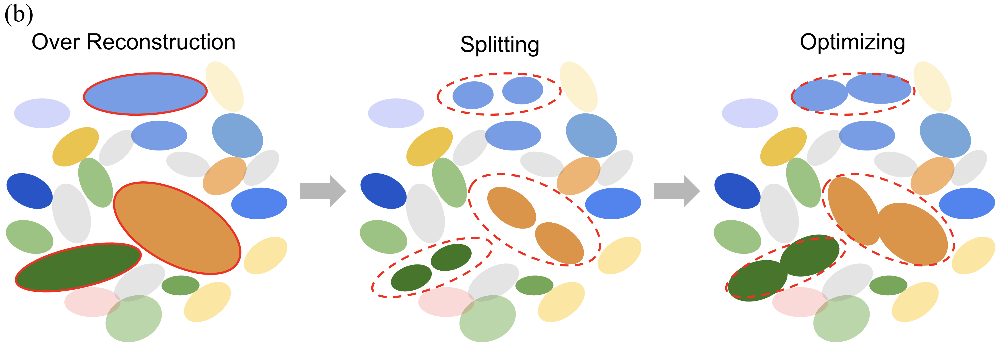

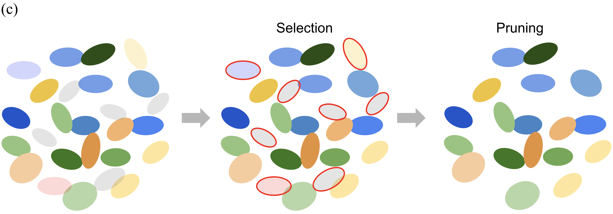

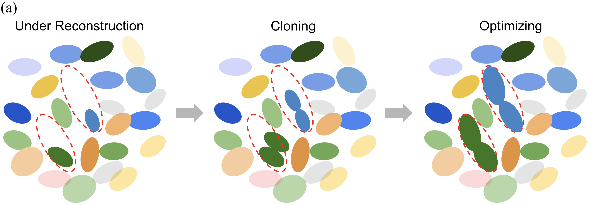

<!-- Page 10 -->
Figure 10: Render of the Gaussian scene bicycle from the Mip-NeRF 360 dataset with Gaussians pruned based
on an opacity criterion.
Figure 11: Venn diagram showing how Compression
approaches notably Attribute Compression and Struc-
tured Representions of Gaussians intesect with Com-
paction approaches.
sensitivity of the reconstruction quality to changes of
the Gaussian attributes. This sensitivity measure is then
used for sensitivity-aware VQ of Gaussian attributes
(e.g. Spherical Harmonics, shape). In [53], the authors
categorize SH coefficients in degrees greater than 0 as
unimportant and thus compressable through VQ. Fur-
thermore for key attributes (opacity, scales, Euler an-
gles, and 0-degree SH coefficients), Xie et al. reduce
the entropy using RAHT before quantization. RDO-
Gaussian [49] use entropy-constrained VQ with code-
books to quantize covariance and color parameters for
a more compact representation. HAC [9] uses an an-
chor structure with associated Gaussians and introduces
an Adaptive Quantization Module (AQM) designed to
dynamically select quantization steps to facilitate en-
tropy coding of the anchor attributes. The researchers
in EAGLES [16] employ a methodology for quantizing
attributes such as rotation, view-dependent color, and
opacity by leveraging a latent vector associated with
each attribute. This latent vector is integrated with a
multilayer perceptron (MLP) decoder, which facilitates
the decoding of latent representations into attribute val-
ues. To ensure differentiability during the training pro-
cess, an additional latent approximation is preserved.
A Straight-Through Estimator (STE) is then utilized to
round the latent approximation before the propagation
of gradients.
As described in Section 2, 3D Gaussians are charac-
terized by 59 attributes, with the majority pertaining to
color representation. Of these, the Spherical Harmonics
(SH) coefficients encompass 48 attributes across three
bands of SH. Notably, 45 out of the 48 SH coefficients
are responsible for depicting view-dependent colors. To
reduce storage, attribute pruning SH coefficients is a
common strategy. In light of this, [44] introduces an
adaptive adjustment mechanism for SH. The authors ad-
vocate for the calculation of an average transmittance
per pixel and per view.
In instances where there is
minimal variation per view, this allows for the reduc-
tion of SH coefficients to lower bands or their complete
removal, thereby significantly diminishing the memory
footprint associated with each Gaussian primitive.
Self-Organizing-Gaussians [40] provide an ablation
experiment, showing that training scenes completely
without any higher-degree spherical harmonics is pos-
sible, still achieving a competitive quality with a much
smaller storage size.
Building upon the preliminary
concept of reducing the number of SH coefficients,
LightGaussian [12] proposes a Knowledge Distillation
scheme, accompanied by pseudo-view augmentation,
to efficiently encapsulate information from higher-order
coefficients into a more condensed form.
It should be noted, that whenever a band or degree of
spherical harmonics is removed, the higher frequency
components of the color representation are also elim-
inated, which inherently leads to a loss of fine detail
in view-dependent effects. This reduction, while ben-
eficial for storage efficiency, inevitably sacrifices some
information that would otherwise capture subtle vari-
ations in lighting and shading across different view-
points.
Another straightforward way to reduce memory is
using lower bit-depth representations (e.g., 16-bit half-
floats instead of 32-bit floats) for attributes that do not
require high precision. In SOG [40], the authors clip
various attribute ranges, including RGB, opacity, and
10

#### Page 10 Images

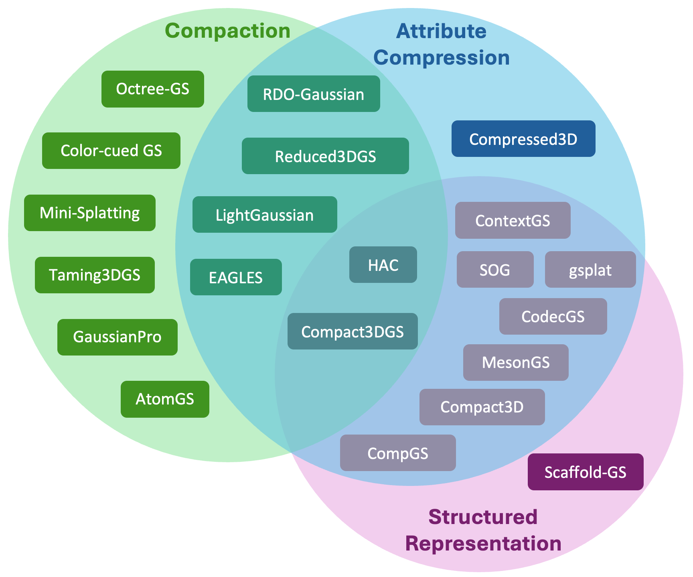

<!-- Page 11 -->
spherical harmonics, based on percentile thresholds to
ensure consistent normalization across models. After
clipping, they quantize these attributes by rounding to
the nearest value within predefined linear ranges q, with
q = 214 for coordinates and q = 26 for scale, opacity,
and rotation and q = 25 for SH. Fan et al. [12] quantize
selective Spherical Harmonics, position, shape, rotation
and opacity attributes. Additionally, packing attributes
using a codec like LZ77 as in MesonGS [53] or JPEG
XL as in [40] reduces remaining storage size.
4.1.2
Structured Representation of Gaussians
In the vanilla approach to 3DGS [21], a final high-
fidelity scene usually consists of millions of unordered
Gaussians. Besides efficiently representing attributes of
single Gaussians by leveraging similarities within at-
tributes as discussed in the previous Sec. 4.1.1, some
compression approaches leverage the correlation be-
tween neighboring Gaussians and find structured rep-
resentations, opening new pathways to compression.
One approach for structuring 3D Gaussians whithin
a scene is the Anchor-Based representation, as intro-
duced in Scaffold-GS [34]. From the initial Structure
from Motion (SfM) derived point cloud a scene is first
voxelized and each voxel center is then treated as an
anchor.
Each anchor is associated with a local con-
text and learnable offsets, acting as representative point
which can spawn new Gaussians in close proximity.
Subsequently a neural network predicts the attributes
i.e.
opacity, color and covariance, of the associated
Gaussians based on anchor features and viewing con-
ditions. This approach effectively reduces the overall
number of parameters required to represent the scene.
ContextGS [50] builds upon the Anchor representation
introduced in Scaffold-GS [34] but divides the anchor
points into hierarchical levels, from coarse to fine. The
anchors are encoded progressively, starting from the
coarsest level. The decoded values of the anchors at a
coarser level are then used to predict the distribution of
nearby anchors at the next finer level, using an MLP.
The hierarchical anchor approach efficiently exploits
the spatial relationships between anchors. In HAC [9],
the Anchor-Based representation is enhanced through
the inclusion of a Hash-Grid Assisted Context. The pri-
mary concept involves simultaneously learning a struc-
tured, compact hash grid for context modeling of anchor
attributes. For each anchor, the anchor’s position is used
to query the hash grid and retrieve an interpolated hash
feature, which subsequently predicts the value distribu-
tions of the anchor attributes to aid in entropy coding
for a highly efficient representation. While also based
on an Anchor-Based representation with anchor primi-
tives and coupled primitives the primitives differ in their
structure CompGS [32]. Anchor primitives serve as ref-
erence and contain geometry attributes (location and co-
variance) and reference embeddings. Coupled primi-
tives only contain residual embeddings to capture de-
viations. The attributes of coupled primitives are pre-
dicted by warping corresponding anchor primitives us-
ing affine transforms derived from anchor and coupled
primitive embeddings.
In order to leverage the similarities among the
color attributes of adjacent Gaussians and to eliminate
the need to store attributes for each Gaussian, Com-
pact3DGS [26] proposes the use of a hash-grid followed
by a small MLP specifically for view-dependent color
attributes. Positions are input into the hash-grid, and
the resultant feature along with the view-direction are
subsequently provided to the MLP in order to retrieve
the color.
An alternative structuring methodology is employed
by SOG [40] and also used in gsplat [22], where
unstructured Gaussians are mapped onto a structured
2D grid to spatially organize Gaussians with simi-
lar attributes closely, enhancing the smoothness of at-
tribute values. This configuration allows for efficient
compression using standard image compression tech-
niques. To further improve smoothness and compress-
ibility, a smoothing regularization term can be added
during training to promote locally smooth configura-
tions of Gaussians on the grid.
An other approach
CodecGS [27] applies feature planes for efficient at-
tribute representation and uses a standard video coding
technique for feature plane compression. The authors
propose a tri-plane architecture to predict Gaussian at-
tributes instead of storing them directly. A progressive
training strategy allows to capture coarse geometric in-
formation initially and gradually add finer details. The
feature planes are optimized by applying a block-wise
discrete cosine transform (DCT) allowing the model
to leverage the spatial correlations within the feature
planes as conventional image signals.
The authors in Compact3D [42] suggest an approach
for organizing the unstructured 3D Gaussians by sort-
ing them according to one of the quantized indices and
subsequently storing them employing Run-Length En-
coding (RLE).
In MesonGS [53], octrees are employed to achieve
compression of the geometrical structure, specifically
the 3D positions of the 3D Gaussians.
4.1.3
Quantitative Comparison of Compression
Methods
This section presents the comparative analysis of 3DGS
compression methods across four datasets: Tanks and
Temples, Mip-NeRF 360, Deep Blending and, Syn-
thetic NeRF. More details on the datasets are provided
in Sec. 5.1. For better comparison Table 1 only in-
cludes approaches that mainly focus on compression,
we provide a separate Table 2 to compare approaches
that mainly focus on compaction (i.e. densification and
pruning).
Furthermore some approaches were miss-
ing the necessary data for quantitative comparison, ap-
proaches that we consider worth mentioning neverthe-
11

<!-- Page 12 -->
less are included in the survey but not in the tables. As
shown in Table 1, the metrics used to evaluate the per-
formance (see Sec. 5.2) of each compression method
are PSNR, SSIM, LPIPS and model size measured in
megabytes.
The objectives for compressing 3DGS vary depend-
ing on the application, with some requiring minimal
model size, while others prioritize a smaller size
alongside optimal perceptual quality.
As there is no
definitive winner that excels across all categories, we
introduce a simple rank, reflecting the average rankings
of the methods across all available datasets, thereby
offering general guidance on the overall performance of
the approaches. To determine the compression dataset
ranks, the ranks for the quality metrics PSNR, SSIM,
and LPIPS are equally weight with the model size.
Consequently, each quality metric contributes one-sixth
to the overall ranking, while the model size accounts
for the remaining half:
ranks
=
rank(PSNR)
6
+
rank(SSIM)
6
+
rank(LPIPS)
6
+
rank(Size[MB])
2
.
The overall method ranking is calculated by averaging
the dataset ranks across all available datasets.
This
approach ensures that methods with incomplete data
are fairly included in the overall comparison. The min
operator is applied to resolve ties in metric rankings,
assigning the lowest rank available to all methods in
the group, while subsequent ranks skip the number of
tied methods.
The methods evaluated show significant variation in
file size, with some achieving high compression rates
at the cost of visual quality, while others strike a bal-
ance between compression and maintaining higher fi-
delity.
While our proposed ranking puts ContextGS-
lowrate [50] on the first place, high variations be-
tween datasets and quality metrics show that there
is not one winning compression strategy.
Depend-
ing on the application and goals, different approaches
should be considered. When size is the main concern
CodecGS [27] stands out for its very small file size
(e.g., just 7.8 MB on Tanks and Temples), all while
maintaining PSNR/SSIM near the top tier.
Further-
more, HAC-lowrate [9], SOG w/o SH [40] and Con-
textGS_lowrate [50] are the best-performing compres-
sion methods, achieving file sizes under 10 MB on the
Tanks and Temples dataset with acceptable levels of vi-
sual quality.
When the emphasis is on perceptual quality (LPIPS)
gsplat [55] proves to be an excellent choice, alongside
ContextGS_highrate [50] and HAC_highrate [9]. It is
noteworthy that the original 3DGS-30K [21] exhibits
the best LPIPS values on both the Mip-NeRF 360 and
the Deep Blending dataset, at the cost of being up to 70
times larger in size.
Taken together,
the top-ranking methods (Con-
textGS [50], HAC [9], CodecGS [27], gsplat [55])
achieve a balanced compromise among PSNR, SSIM,
LPIPS, and size, with slight differences depending on
whether absolute fidelity or smaller storage is the prior-
ity. The prevailing conclusion is that methods integrat-
ing context modeling (ContextGS [50]) or hierarchical
approaches (HAC [9]) tend to dominate in terms of im-
age quality, whereas CodecGS and the "lowrate" vari-
ants are particularly robust for model compression.
Figure 12 illustrates the trade-offs between model
size and performance measured by PSNR for various
3DGS compression methods across different datasets.
The curves highlight how smaller file sizes typically re-
sult in lower PSNR, showing the balance between com-
pression efficiency and visual quality. Some approaches
have additional data points, which for clarity were not
included in the table.
Further figures for the perfor-
mance comparison measured by SSIM and LPIPS as
well as the corresponding compaction figures can be
found in Appendix B.
4.2
Compaction
Compaction in 3D Gaussian Splatting (3DGS) refers to
the optimization of Gaussian kernel distribution in 3D
space to accurately represent scene features while main-
taining computational efficiency. The initial kernel set
often struggles to capture complex details, especially in
high-frequency regions or geometrically intricate areas.
Compaction in 3D Gaussian Splatting (3DGS) lever-
ages Adaptive Density Control (ADC) to dynamically
manage the distribution and density of Gaussians. ADC
can be broadly categorized into two key approaches:
Densification and Pruning. This classification is based
on the primary objectives of each method: Densifica-
tion techniques focus on selectively adding Gaussians
where they are most needed to improve scene fidelity,
while Pruning techniques focus on removing Gaussians
that do not contribute effectively to the scene, avoid-
ing over-reconstruction and inefficiencies. We first in-
troduce densification in Sec. 4.2.1 and pruning in Sec.
4.2.2, outlining how each process contributes to opti-
mizing the representation.
While most of the following methods do not specif-
ically intend to reduce the memory footprint of 3DGS
scenes, they implicitly do so, as they improve the qual-
ity of the scene without using more Gaussian primi-
tives. Consequently, at similar quality, these methods
require less Gaussians and therefore less memory. Note
that some methods mentioned in this section are not in-
cluded in Table 2 due to incomplete evaluations, partic-
ularly in the number of Gaussians, which excludes them
from the comparison.
4.2.1
Densification
These methods use different criteria to determine where
and how to introduce new Gaussians.
For instance,
the Color-cued Efficient Densification method [23]
leverages view-independent spherical harmonics coef-
ficients to assess color cues, refining areas where tra-
12

<!-- Page 13 -->
Table 1: Performance comparison of 3DGS compression methods across four datasets: Tanks and Temples,
Mip-NeRF 360, Deep Blendingand, Synthetic NeRF. The included metrics are PSNR, SSIM, LPIPS and, model
size in MB. The best methods in each category are highlighted ( first , second , third ). The rank represents the
average rankings of the methods across all available datasets. The method highlighted in bold: 3DGS-30K is the
original 3DGS method.
Method
Rank
Tanks and Temples
Mip-NeRF 360
Deep Blending
Synthetic NeRF
PSNR↑
SSIM↑
LPIPS↓
Size
MB↓
PSNR↑
SSIM↑
LPIPS↓
Size
MB↓
PSNR↑
SSIM↑
LPIPS↓
Size
MB↓
PSNR↑
SSIM↑
LPIPS↓
Size
MB↓
ContextGS_lowrate
4.3
24.12 .849 .186
9.9 27.62 .808 .237
13.3 30.09 .907 .265
3.7
HAC-highrate
4.4
24.40 .853 .177
11.8 27.77 .811 .230
22.9 30.34 .906 .258
6.7 33.71 .968 .034 2.0
CodecGS
4.8
23.63 .841 .192
7.8 27.30 .810 .236
10.3 29.81 .906 .251
9.0
HAC-lowrate
5.0
24.04 .846 .187
8.5 27.53 .807 .238
16.0 29.98 .902 .269
4.6 33.24 .967 .037 1.2
gsplat-1.00M
5.3
24.03 .857 .163
16.1 27.29 .811 .229
16.0
ContextGS_highrate 5.8
24.29 .855 .176
12.4 27.75 .811 .231
19.3 30.41 .909 .259
6.9
Compact3D 32K
9.3
23.44 .838 .198
13.0 27.12 .806 .240
19.0 29.90 .907 .251
13.0
Compact3D 16K
9.7
23.39 .836 .200
12.0 27.03 .804 .243
18.0 29.90 .906 .252
12.0
RDO-Gaussian
9.8
23.34 .835 .195
12.0 27.05 .802 .239
23.5 29.63 .902 .252
18.0 33.12 .967 .035 2.3
CompGS
9.8
23.70 .837 .208
10.1 27.26 .803 .239
17.3 29.69 .901 .279
9.2
Reduced3DGS
10.4
23.57 .840 .188
14.0 27.10 .809 .226
29.0 29.63 .902 .249
18.0
SOG w/o SH
10.5
23.15 .828 .198
9.3 26.56 .791 .241
16.7 29.12 .892 .270
5.7 31.37 .959 .043 2.0
MesonGS c3
12.0
23.29 .835 .197
17.4 26.99 .797 .246
25.9 29.48 .903 .252
29.0 32.96 .968 .033 3.5
Compressed3D
12.4
23.32 .832 .194
17.3 26.98 .801 .238
28.8 29.38 .898 .253
25.3 32.94 .967 .033 3.7
MesonGS c1
12.6
23.31 .835 .196
18.5 26.99 .796 .247
28.5 29.50 .903 .251
31.1 32.94 .968 .033 3.9
SOG
12.7
23.56 .837 .186
22.8 27.08 .799 .230
40.3 29.26 .894 .268
17.7 33.23 .966 .034 4.1
Compact3DGS+PP
13.3
23.32 .831 .202
20.9 27.03 .797 .247
29.1 29.73 .900 .258
23.8 32.88 .968 .034 2.8
EAGLES
14.4
23.37 .84
.20
29.0 27.23 .81
.24
54.0 29.86 .91
.25
52.0
Scaffold-GS
14.6
23.96 .853 .177
87.0 27.50 .806 .252 156.0 30.21 .906 .254
66.0
Compact3DGS
14.9
23.32 .831 .201
39.4 27.08 .798 .247
48.8 29.79 .901 .258
43.2 33.33 .968 .034 5.8
LightGaussian
15.3
23.11 .817 .231
22.0 27.28 .805 .243
42.0
32.72 .965 .037 7.8
3DGS-30K
15.3
23.14 .841 .183 411.0 27.21 .815 .214 734.0 29.41 .903 .243 676.0 33.32
EAGLES-Small
17.2
23.10 .82
.22
19.0 26.94 .80
.25
47.0 29.92 .90
.25
33.0
13

<!-- Page 14 -->
10
100
5
7
20
30
50
70
Size [MB]
23.0
23.2
23.4
23.6
23.8
24.0
24.2
24.4
PSNR
Tanks and Temples - Compression Methods - PSNR vs Size [MB]
10
100
7
20
30
50
70
Size [MB]
26.00
26.25
26.50
26.75
27.00
27.25
27.50
27.75
PSNR
Mip-NeRF 360 - Compression Methods - PSNR vs Size [MB]
RDO-Gaussian
gsplat
CompGS
CodecGS
ContextGS
HAC
SOG
Compact3D
MesonGS
Compressed3D
Reduced3DGS
Compact3DGS
LightGaussian
EAGLES
Scaffold-GS
3DGS-30K
10.0
5
7
20
30
50
70
Size [MB]
29.2
29.4
29.6
29.8
30.0
30.2
30.4
PSNR
Deep Blending - Compression Methods - PSNR vs Size [MB]
1.00
2.0
3.0
5.0
7.0
Size [MB]
31.5
32.0
32.5
33.0
33.5
PSNR
Synthetic NeRF - Compression Methods - PSNR vs Size [MB]
Figure 12: PSNR vs. Model Size (MB) for 3D Gaussian Splatting Compression Methods. The graphs com-
pare different 3DGS compression methods across the Tanks and Temples, Mip-NeRF 360, Deep Blending, and
Synthetic NeRF datasets. The x-axis represents the model size (in MB), while the y-axis represents the PSNR,
indicating the visual quality.
ditional structure-from-motion techniques may strug-
gle to capture fine details. FreGS [57] addresses over-
reconstruction by regularizing frequency discrepancies
in rendered images, focusing on the frequency domain.
Meanwhile, Pixel-GS [58] introduces a pixel-aware gra-
dient, targeting under-reconstruction artifacts by incor-
porating cues from multiple views, thus emphasizing
pixel-level information in the densification decision-
making process. Similarly, Revising Densification in
Gaussian Splatting (RDGS) [46] adopts the criteria that
determines whether a Gaussian should be cloned or split
during the optimization. Instead of using the accumu-
lated positional gradient of each Gaussian, RDGS uses
a structural similarity function to address a loss for each
individual Gaussian. If this loss is high enough, the
Gaussian will be split during the regular densification
intervals.
GaussianPro [10] employs a different approach by
using depth and normal maps to guide the growth and
adjustment of Gaussians. It utilizes patch matching [3]
to propagate depth and normal information from neigh-
boring pixels and applies geometric filtering and selec-
tion to identify pixels requiring additional Gaussians.
MVG-Splatting [29] and Mini-Splatting [13] also em-
ploys a depth map to enforce geometric consistency, but
with a more targeted application. Specifically, MVG-
Splatting applies the geometric consistency only in the
near and far regions of the scene to effectively miti-
gate under-reconstruction in these critical regions while
avoiding the risk of over-reconstruction. Mini-Splatting
incorporates depth information after a few optimization
iterations. It relies on the initial training process to es-
timate depth, requiring a few iterations to obtain this
information. This approach ensures geometric accuracy
while still optimizing the overall scene representation.
Taming 3DGS [36] employs a global scoring approach
to guide the addition of Gaussians, ensuring efficient
densification. The global score consists of 1) gradient,
2) pixel coverage, 3) per-view saliency, and 4) core at-
tributes like opacity, depth, and scale. By calculating
this score that reflects both the scene’s structural com-
plexity and visual importance, only the most critical ar-
eas are targeted for Gaussian splitting or cloning, result-
ing in more effective scene representation. AtomGS [31]
takes a different approach by employing a density con-
trol process similar to the original 3DGS, relying on po-
sitional (scaling) gradients. However, it enhances per-
formance through the addition of edge-aware loss, guid-
ing the gradient to better align with the scene’s geom-
etry. While it does not explicitly control densification
with varying criteria, its refinement in gradient guidance
leads to improved density control outcomes.
Some densification approaches adopt a multi-level
strategy for greater flexibility. By down sampling or
up sampling images, this approach generates multiple
Gaussian sets, each finely tuned to different resolution.
For instance, Octree-GS [45] organizes Gaussians ac-
cording to levels of detail using an octree structure [2].
It selectively trains Gaussians based on different views,
adaptively adjusting the levels for training to ensure op-
timal rendering based on the observer’s perspective.
Lastly, Markov Chain Monte Carlo (MCMC) [22]
uses a completely different approach for densifying the
3DGS scene. Instead of cloning and splitting the indi-
vidual Gaussians, they sample a fixed number of Gaus-
sians from a learned probability distribution. Specif-
ically, they add a noise term to the position of the
Gaussians to incorporate exploration during the train-
14

<!-- Page 15 -->
ing, while they also re-spawn Gaussians that drop be-
low an opacity threshold randomly at Gaussians with
high opacity. This way, the method improves the qual-
ity of regions with few initial Gaussian primitives and
the number of Gaussians can directly be controlled.
4.2.2
Pruning
These techniques focus on identifying and removing
redundant Gaussians that contribute minimally to the
scene representation, such as those that are excessively
large, transparent, or provide overlapping information.
Compact3DGS [26], RDO-Gaussian [49], and HAC [9]
introduce additional mask parameters to regularize the
volume of Gaussians, using binary masks throughout
the training process to iteratively eliminate Gaussians
based on their contribution, as indicated by the mask
values. Both LightGaussian [12] and EAGLES [16] use
importance-based scoring systems to efficiently elim-
inate unnecessary Gaussians.
LightGaussian assigns
each Gaussian a global significance score by evaluat-
ing its impact on intersected pixels, pruning those with
lower significance to enhance efficiency without com-
promising rendering quality. Similarly, EAGLES [16]
employs a simplified approach by using a weight com-
posed of transmittance and opacity to represent each
Gaussian’s importance, ensuring that less significant
Gaussians are removed while maintaining overall scene
accuracy.
Papantonakis et al. [44] propose a prun-
ing strategy that eliminates Gaussians based on over-
lap—those with significant overlap with others are con-
sidered redundant and removed to reduce overlap with-
out compromising scene accuracy. SUNDAE [54] uti-
lizes a graph-based pruning approach, constructing a
graph to capture spatial relationships between Gaus-
sians and applying a band-limited graph filter to se-
lectively down-sample them. To counteract the poten-
tial loss of information during this process, a convo-
lutional neural network (CNN) is employed to recover
fine details, ensuring a balance between efficient Gaus-
sian placement and the preservation of visual quality.
4.2.3
Quantitative
Comparison
of
Compaction
Methods
This section presents a comparative analysis of 3DGS
compaction methods across three datasets:
Tanks
and Temples, Mip-NeRF 360, and Deep Blending.
Detailed descriptions of the datasets can be found in
Sec. 5.1. As shown in Table 2, the performance of each
compression method is evaluated using four metrics:
PSNR, SSIM, LPIPS, and the number of Gaussians.
Additionally, we compute an overall rank that averages
the rankings of the methods across all datasets.
To
determine the compaction dataset ranks rankg, the
quality metrics—PSNR, SSIM, and LPIPS—are given
equal weight alongside the number of Gaussians.
Specifically, each quality metric contributes one-sixth
to the total ranking, while the model size (number of
Gaussians, denoted as k Gaussians) accounts for half:
rankg
=
rank(PSNR)
6
+
rank(SSIM)
6
+
rank(LPIPS)
6
+
rank(k Gaussians)
2
.
As for the compression rank calculation the rank for
compaction methods is calculated by averaging the
rankings over all available datasets, to ensure a fair
comparison.
Table 2 highlights that the most efficient com-
paction methods are those that minimize the number
of Gaussians while maintaining reasonable visual qual-
ity. Octree-GS [45] and Mini-Splatting [13] stand out as
the most efficient methods, using the fewest Gaussians
while still delivering competitive PSNR values. These
methods are ideal for applications requiring tight mem-
ory and computation limits. On the other hand, methods
like Taming3DGS (Big) [36] and GaussianPro [10] of-
fer higher quality at the expense of increased Gaussian
count, making them more suitable for use cases that pri-
oritize visual fidelity over extreme compaction.
A closer analysis reveals that even the highest-ranked
method in terms of efficiency, Octree-GS, does not
achieve the best performance across all datasets. This
suggests that different methods focus on optimizing dis-
tinct aspects of the scene.
For example, Octree-GS
excels on datasets like Deep Blending and Tanks and
Temples, where the texture-rich regions are relatively
sparse. Its multi-scale strategy enables flexible adjust-
ments of finer details, which allows users to manually
refine resolution levels in such regions.
In contrast,
methods like Taming3DGS (Big) perform better in more
texture-dense scenes due to their emphasis on higher
Gaussian counts and richer detail capture. This under-
scores the importance of selecting compaction methods
based on the specific application needs.
5
Datasets and Comparison Met-
rics
5.1
Datasets
Performance and quality assessment of 3D Gaussian
Splatting algorithms is typically performed on multiple
datasets. These datasets provide 3D scenes or objects
with various properties, such as varying levels of detail,
lighting conditions, and complexities, which allow for
comprehensive evaluation of the algorithms.
In our survey, we include Tanks and Temples [24],
Mip-NeRF 360 [4], Deep Blending [17] as real-world
datasets, and Synthetic NeRF [39] as a synthetic dataset.
Figure 13 shows a sample image from each included
scene.
From Tanks and Temples we include “truck”
and “train” two unbounded outdoor scenes which have
a centered view point. The Mip-NeRF 360 dataset also
has a centered view point but includes in- and outdoor
scenes. The following scenes are included: “bicycle”,
“bonsai”, “counter”, “flowers”, “garden”, “kitchen”,
“room”, “stump”, “treehill”. From the Deep Blending
15

<!-- Page 16 -->
Table 2: Performance comparison of 3DGS compaction methods across three datasets: Tanks and Temples,
Mip-NeRF 360, and Deep Blending. The included metrics are PSNR, SSIM, LPIPS and, number of Gaussians.
The best methods in each category are highlighted ( first , second , third ). The rank represents the average
rankings of the methods across all available datasets. The method highlighted in bold: 3DGS-30K is the original
3DGS method.
Method
Rank
Tanks and Temples
Mip-NeRF 360
Deep Blending
PSNR↑
SSIM↑
LPIPS↓
k Gauss
PSNR↑
SSIM↑
LPIPS↓
k Gauss
PSNR↑
SSIM↑
LPIPS↓
k Gauss
Octree-GS
2.7
24.68 .866 .153
443 28.05 .819 .217
657 30.49 .912 .241
112
Mini-Splatting
3.4
23.18 .835 .202
200 27.34 .822 .217
490 29.98 .908 .253
350
Taming3DGS
4.8
23.89 .835 .207
290 27.29 .799 .253
630 27.79 .822 .263
270
Taming3DGS (Big) 4.8
24.04 .851 .170 1,840 27.79 .822 .205 3,310 30.14 .907 .235 2,810
AtomGS
4.9
23.70 .849 .166 1,480 27.38 .816 .211 3,140
GaussianPro
5.0
24.09 .862 .185 1,441 27.43 .813 .219 3,403 29.79 .913 .222 2,582
Color-cued GS
5.5
23.18 .830 .198
370 27.07 .797 .249
646 29.71 .902 .255
644
Mini-Splatting-D
5.7
23.23 .853 .140 4,280 27.51 .831 .176 4,690 29.88 .906 .211 4,630
3DGS-30K
6.6
23.14 .841 .183 1,783 27.21 .815 .214 3,362 29.41 .903 .243 2,975
dataset we include “Dr Johnson” and “Playroom” two
indoor scenes with a viewpoint directed outward. The
synthetic scenes: “chair”, “drums”, “ficus”, “hotdog”,
“lego”, “material”, “mic”, “ship” stem from the Syn-
thetic NeRF dataset.
These scenes align with those used in the 3D Gaus-
sian Splatting (3DGS) [21] publication, making them
particularly useful for comparing compression methods,
as most authors have benchmarked against them. While
it would be beneficial to explore larger or more special-
ized scenes in future work, the lack of accessible data
for such comparisons currently limits our scope.
5.2
Comparison Metrics
To evaluate the performance of 3D Gaussian Splatting
(3DGS) compression and compaction methods, we rely
on a set of well-established metrics that assess both
the quality of the rendered scene and the efficiency of
the data representation.
These metrics include Peak
Signal-to-Noise Ratio (PSNR), Structural Similarity In-
dex (SSIM), Learned Perceptual Image Patch Similar-
ity (LPIPS), and model size (in megabytes or number
of Gaussians).
• PSNR is a widely used metric that quantifies the
difference between the original and compressed
image in terms of pixel accuracy. Higher PSNR
values indicate better fidelity and less distortion.
• SSIM measures the perceptual similarity between
two images by considering luminance, contrast,
and structure. A higher SSIM score represents a
closer resemblance between the reference and the
rendered scene
• LPIPS assesses perceptual quality using a learned
model that captures human-like judgments of vi-
sual similarity. Lower LPIPS values indicate better
perceptual quality.
• Model Size is represented either as the file size in
megabytes (MB, with 1 MB = 10002 Bytes) or the
total number of Gaussians in the model. Smaller
sizes reflect more efficient compression or com-
paction.
5.3
Testing Protocols
Initially, our methodology for data compilation for this
survey involved parsing various tables from numerous
3DGS compression publications.
However, we have
then revised our strategy and asked all authors of the
publications referenced in this report to provide us with
data / results in a standardized format.
In order to ensure consistency and comparability
across different approaches, we suggested that authors
adhere to the established testing conventions from the
original 3DGS project. Specifically, this includes us-
ing all 9 scenes from the Mip-NeRF 360 dataset, in-
corporating the extra scenes "flowers" and "treehill"
(see Sec. 5.1), and only using the "train" and "truck"
scenes from Tanks and Temples.
For image evalua-
tion, full-resolution images should be used up to a max-
imum side length of 1600px. For larger test images,
downscaling is required so that the longest dimension
is 1600px, following the standard 3DGS [21] resizing
method, which uses the PIL .resize() function with bicu-
bic resampling. For the 3 COLMAP datasets (Tanks
and Temples, Deep Blending, Mip-NeRF 360), every
8th image must be selected for testing, specifically those
images of index i where i mod 8 ≡0.
For the Syn-
thetic NeRF dataset, authors should follow the prede-
fined train/evaluation split provided by the dataset.
Table 3 provides a comparative analysis of training
and evaluation sizes. The gsplat [55] methodology was
employed to train Mip-NeRF 360 scenes at three dif-
ferent resolutions: full resolution, 1600 pixels (longest
side), and resolutions downscaled by factors of 2 or
4 (longest side < 1600 pixels). The findings indicate
16

<!-- Page 17 -->
Tanks and Temples
Deep Blending
train
truck
Dr Johnson
playroom
Mip-NeRF 360
bonsai
bicycle
counter
flowers
garden
kitchen
room
stump
treehill
Synthetic NeRF
chair
drums
ficus
hotdog
lego
materials
mic
ship
Figure 13: The figure shows a sample image from each scene of the datasets used in evaluation. This selection
covers a broad range of scene types, including small to medium-sized natural environments from Tanks and
Temples, Deep Blending, and Mip-NeRF 360, alongside highly detailed synthetic scenes with fine textures and
reflections provided by Synthetic NeRF. This combination ensures robust evaluation across both real-world and
artificial environments.
17

#### Page 17 Images

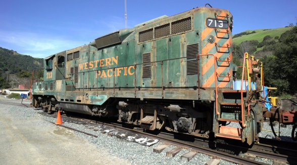

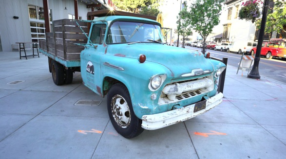

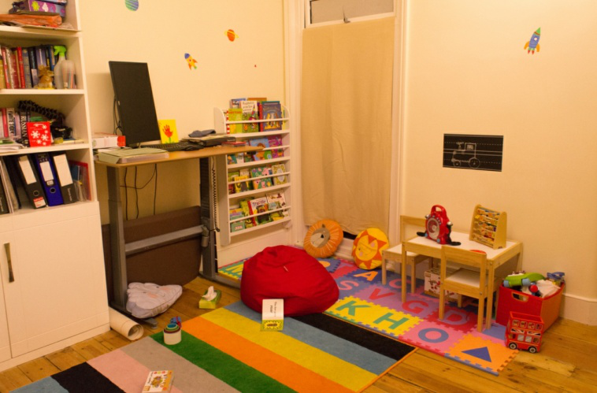

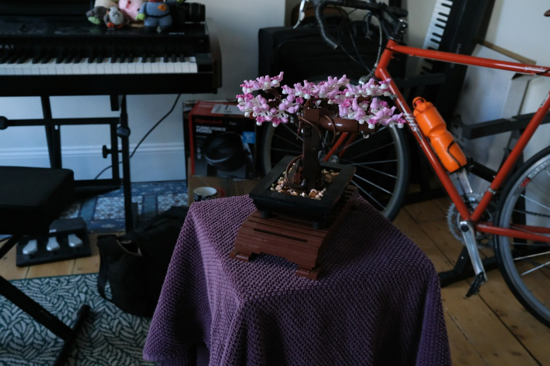

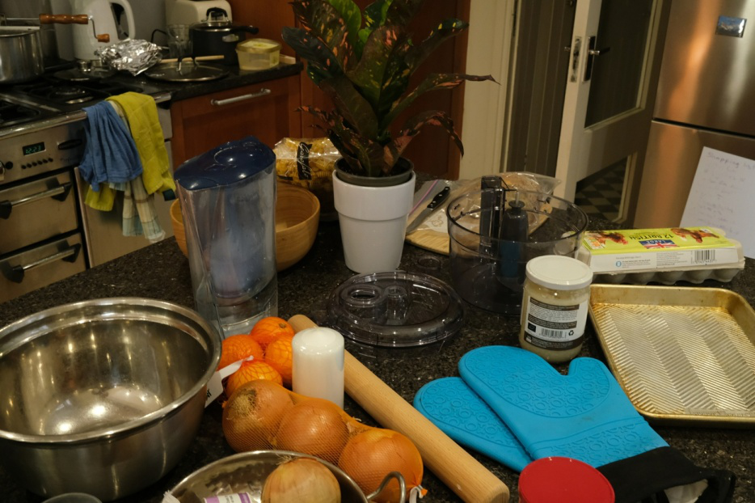

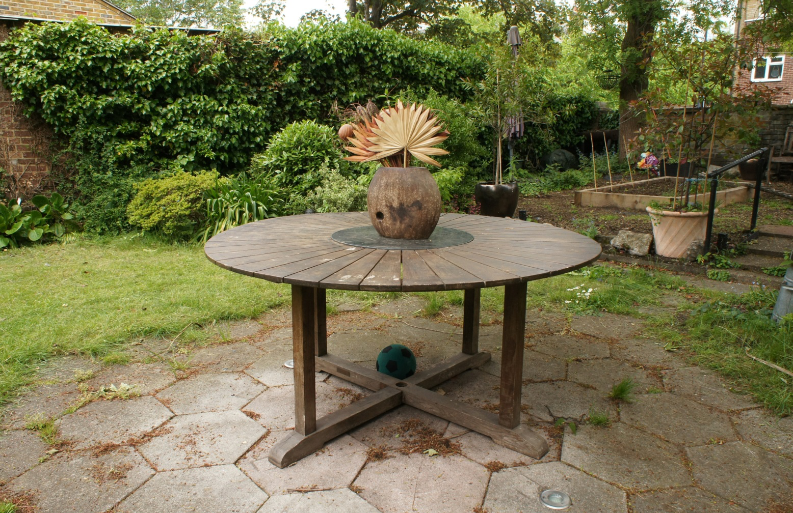

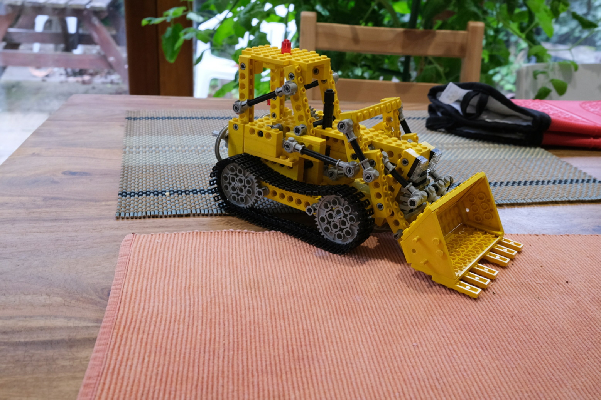

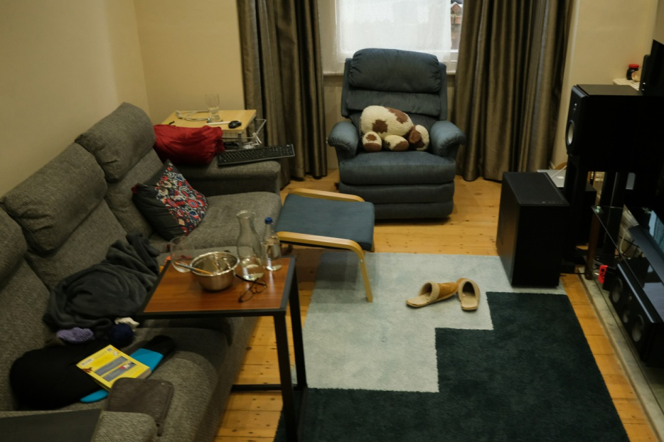

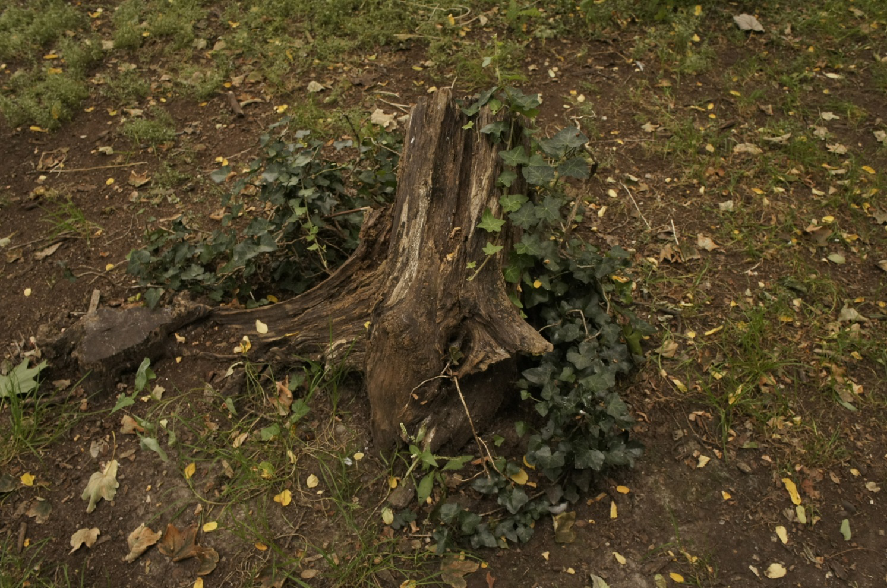

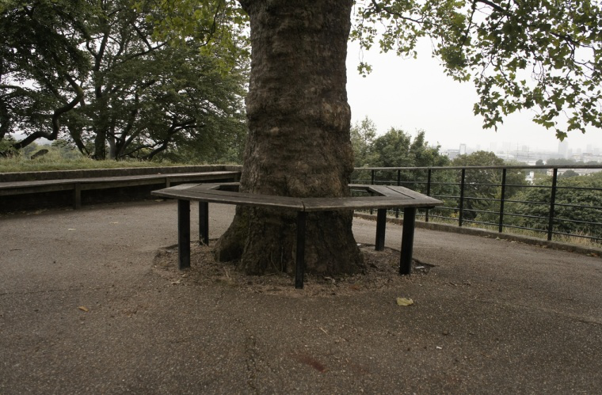

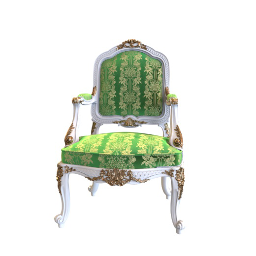

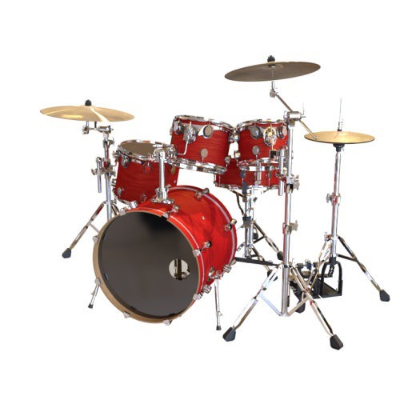

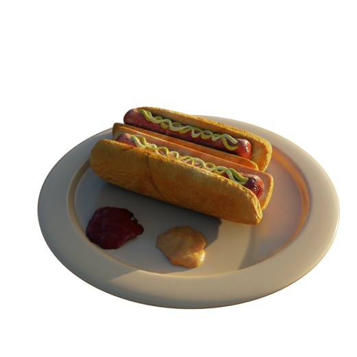

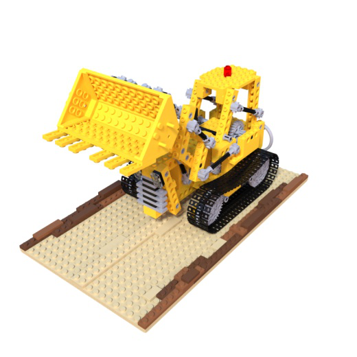

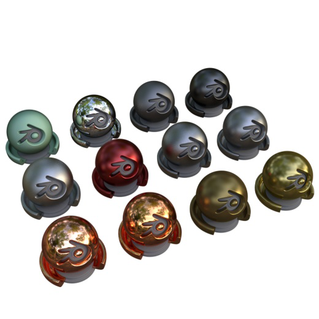

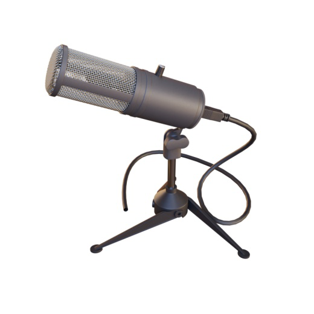

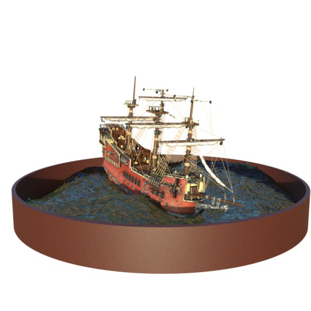

<!-- Page 18 -->
Table 3: PSNR comparison table for training sizes vs.
evaluation sizes.
For this table we used gsplat [55]
to train Mip-NeRF 360 scenes either in full resolution,
with a resolution of 1600 pixels or scaled down with a
factor of 2 or 4 (resulting in a resolution less than 1600
pixels, as used in the implementations [4, 21]). Evalu-
ation is performed using full resolution or 1600 pixels
(longest dimension).
PSNR
PSNR
(eval. res. full) (eval. res. 1600px)
#Gaussians −→
360 K
1 M
360 K
1 M
train. res. full
26.38
26.97
26.33
26.67
scaling factor 2/4
25.58
25.84
26.40
27.02
train. res. 1600px 25.82
26.05
26.69
27.33
that the optimal Peak Signal-to-Noise Ratio (PSNR) re-
sults are achieved when the evaluation resolution cor-
responds precisely to the training resolution. Any de-
viation, whether by increasing or decreasing the eval-
uation resolution relative to the training resolution, re-
sults in a slight reduction in PSNR. Furthermore, uti-
lizing both higher training and evaluation resolutions
enhances PSNR. Additionally, the overall quality is
enhanced when employing 1 million Gaussians com-
pared to 360k Gaussians, which aligns with expecta-
tions, as rendering scenes with 1 million Gaussians cap-
tures more details. Consequently, it is advised to care-
fully select training and evaluation sizes, acknowledg-
ing that this decision affects the final PSNR outcome as
well as the comparative analysis of different compres-
sion approaches.
6
Discussion
The field of 3D Gaussian Splatting (3DGS) has seen rapid advance-
ments, with significant improvements in compression and compaction
techniques aimed at overcoming the high storage demands tradition-
ally associated with 3DGS. While the original implementation of 3D
Gaussian Splatting [21] trained on scenes from the Tanks and Tem-
plesdataset resulted in a data size exceeding 400 MB, the most ef-
fective compression methods achieve more than a 40-fold reduction
in size, all the while enhancing visual quality. This state-of-the-art
report reveals key insights into these developments, providing a foun-
dation for future optimization and application of 3DGS in real-time
rendering.
A crucial finding is that a well-implemented compaction strategy
can be an improvement to most methods. Adaptive Density Control
(ADC), with densification and pruning, has proven to be effective in
significantly enhancing visual quality while reducing the storage foot-
print. This is vital for applications in resource-constrained environ-
ments, such as mobile devices or VR headsets, where storage, mem-
ory and processing power are limited but visual fidelity matters to the
user. Structured representations also play a key role in achieving effi-
cient compression. While various compression techniques have been
developed independently, their interplay remains an open research
area. Understanding the interactions between different methods can
lead to more effective strategies, such as vector quantization reducing
redundancy by encoding similar Gaussians with shared representa-
tions, or structured representations like octrees and hash grids spa-
tially organizing Gaussians to improve compression. Further research
into integrating vector quantization within structured representations
could lead to more effective encodings.
Techniques that prune Gaussian attributes, such as spherical har-
monics (SH) coefficients, must be balanced against compaction strate-
gies like ADC, which reduces the number of Gaussians. Determin-
ing the optimal trade-off between reducing attributes and minimizing
Gaussian count remains an important area of study. Some compres-
sion methods prioritize extreme size reduction through entropy coding
and quantization, while others focus on preserving fidelity using hier-
archical encoding. Hybrid approaches that dynamically adjust com-
pression levels based on scene complexity could be highly beneficial.
Compression techniques must balance reducing file size with main-
taining rendering accuracy. Neural feature encoding techniques, such
as tri-planes or hash grids, significantly reduce storage needs but re-
quire additional computation during rendering. In contrast, explicit
representations with precomputed attributes demand more storage but
enable real-time rendering with minimal overhead. Lossy compres-
sion techniques like pruning or aggressive quantization can introduce
artifacts, particularly in view-dependent rendering. Knowledge distil-
lation techniques that encapsulate high-frequency details into lower-
order representations offer a promising approach to maintaining per-
ceptual quality while reducing complexity.
Another key challenge is the lack of standard benchmarks for eval-
uating 3DGS compression methods.
Current studies use different
datasets, metrics, and experimental conditions, making direct com-
parisons difficult. In this survey we propose basic guidelines to enable
comparison but establishing a unified benchmarking framework with
standardized datasets and evaluation protocols would enhance repro-
ducibility and facilitate progress in the field. In addition, methods
should be evaluated not only on file size and reconstruction quality
but also on real-time performance and energy efficiency, particularly
for deployment on mobile and embedded systems.
Finally, the trade-off between compression efficiency and visual
quality remains a central challenge. Approaches like HAC-highrate
excel in achieving high-quality compression but at the cost of higher
computational overhead. On the other hand, more aggressive com-
pression techniques such as SOG w/o SH reduce memory usage sig-
nificantly but may result in noticeable quality degradation, especially
in scenes requiring fine detail. This trade-off highlights the need for
flexible solutions that can be tuned based on the specific requirements
of the application, whether it’s focused on minimizing storage or max-
imizing visual realism. As the field advances, hybrid approaches that
integrate machine learning-driven optimizations may offer new op-
portunities. Deep learning models could be trained to predict opti-
mal compression strategies based on scene characteristics, dynami-
cally selecting techniques that maximize efficiency while preserving
quality.
7
Conclusion and Future Direc-
tions
3D Gaussian Splatting (3DGS) has emerged as a powerful alternative
to neural radiance fields, offering explicit control over scene elements
while achieving high rendering fidelity. However, its practicality re-
mains constrained by storage and computational costs. Scalability,
ease of use, and adaptability across different platforms can still be im-
proved. This state-of-the-art-report provides an overview of existing
compression and compaction techniques, highlighting key advances
and challenges in the field and the importance of continuing to re-
fine and standardize 3D Gaussian Splatting (3DGS) compression and
compaction techniques to make them more accessible and widely ap-
plicable.
Most current 3DGS compression techniques are designed for static
scenes. However, real-world applications increasingly demand dy-
namic and interactive capabilities.
Existing methods rely on pre-
trained models, limiting adaptability. Developing real-time adaptive
compression strategies that adjust based on scene complexity such as
changing objects or lighting conditions over time, or changing hard-
ware constraints would be a valuable research direction. Further ad-
vancement could enable real-time simulations and enhance interactive
applications such as gaming and virtual reality.
Another improvement could be the creation of multi resolution
18

<!-- Page 19 -->
models with support for level-of-detail (LOD) scaling. Such models
would optimize performance by allowing different parts of a scene to
be rendered with varying levels of detail, depending on real-time re-
quirements. Octrees or feature grids, provide scalable solutions, but
ensuring seamless transitions between different levels of detail with-
out introducing artifacts remains a challenge.
Quantization-aware
training and the development of shared codebooks across scenes or
applications could further improve compression efficiency, allowing
for reduced redundancy and more effective memory usage.
Together, these advancements will help expand the applicability
of 3DGS to encompass to real-time applications, immersive environ-
ments, or large-scale scene representations making 3DGS a more ver-
satile and efficient tool for addressing future challenges in the field of
computational graphics.
8
Short Summaries of Included
Compression Approaches
In this section, we provide short overviews of the key compression
publications surveyed in this report. Each approach offers unique
methods to address the challenges of memory and computational ef-
ficiency in 3D Gaussian Splatting (3DGS), focusing on aspects such
as attribute pruning, vector quantization, and structured representa-
tions. By leveraging different strategies, these methods achieve a bal-
ance between compression ratio, visual quality, and rendering perfor-
mance.
The summaries below highlight the primary innovations of each
technique, the specific problems they address, and their contributions
to advancing 3DGS compression. This section serves as a quick ref-
erence for understanding how each method fits into the broader land-
scape of 3DGS optimization, making it easier to identify the most
suitable approach for applications and research needs.
8.1
ContextGS: Compact 3D Gaussian
Splatting with Anchor Level Context
Model (ContextGS)
The authors of ContextGS [50] proposes the first auto-regressive
model at the anchor level for 3DGS compression. This work divides
anchors into different levels and the anchors that are not coded yet can
be predicted based on the already coded ones in all the coarser levels,
leading to more accurate modeling and higher coding efficiency. To
further improve the efficiency of entropy coding, a low-dimensional
quantized feature is introduced as the hyperprior for each anchor,
which can be effectively compressed. This work can be applied to
both Scaffold-GS and vanilla 3DGS.
8.2
HAC: Hash-grid Assisted Context for
3D Gaussian Splatting Compression
(HAC)
The paper proposes a Hash-grid Assisted Context (HAC) frame-
work [9] for compressing 3D Gaussian Splatting (3DGS) models
by leveraging the mutual information between attributes of unorga-
nized 3D Gaussians (anchors) and hash grid features. Using Scaffold-
GS [34] as a base model, HAC queries the hash grid by anchor lo-
cation to predict anchor attribute distributions for efficient entropy
coding. The framework introduces an Adaptive Quantization Module
(AQM) to dynamically adjust quantization step sizes. Furthermore,
this method employs adaptive offset masking with learnable masks
to eliminate invalid Gaussians and anchors, by leveraging the pruning
strategy introduced by Compact3DGS [26] and additionally removing
anchors if all the attached offsets are pruned.
8.3
Compression
of
3D
Gaussian
Splatting
with
Optimized
Feature
Planes and Standard Video Codecs
(CodecGS)
This method [27] introduces an effective approach for compress-
ing 3D Gaussian Splatting by employing optimized feature planes
and integrating them with standard video codecs. More specifically
CodecGS introduces progressive tri-planes, where the tri-plane takes
3D point positions x as input and predicts the corresponding at-
tributes for each point. A two-phase training, starting with standard
3DGS [21] training followed by feature plane training ensures den-
sification is consistent. Progressive training addresses the instability
of feature plane training due to sparse 3DGS signals. DCT entropy
modeling is employed to transform the feature planes. After training,
feature planes are normalized and converted to 16-bit integers, corre-
sponding to the YUV 16-bit format, and are encoded by a standard
video codec.
8.4
gsplat (gsplat)
This approach leverages 3D Gaussian Splatting as Markov Chain
Monte Carlo (3DGS-MCMC) [22], interpreting the training process
of positioning and optimizing Gaussians as a sampling procedure
rather than minimizing a predefined loss function. Additionally, it
incorporates compression techniques derived from the Morgenstern
et al. paper [40], which organizes the parameters of 3DGS in a 2D
grid, capitalizing on perceptual redundancies found in natural scenes,
thereby significantly reducing storage requirements.
Further com-
pression is achieved by clustering spherical harmonics into discrete
elements and storing them as FP16 values. This technique is imple-
mented in gsplat [55], an open-source library designed for CUDA-
accelerated differentiable rasterization of 3D Gaussians, equipped
with Python bindings.
8.5
Compact3D: Compressing Gaussian
Splat Radiance Field Models with Vec-
tor Quantization (Compact3D)
This approach [42] introduces a vector quantization method based on
the K-means algorithm to quantize the Gaussian parameters in 3D
Gaussian splatting, as many Gaussians may share similar parameters.
Only a small codebook is stored along with the index of the code
for each Gaussian, resulting in a large reduction in the storage of the
learned radiance fields and a reduction of the memory footprint at
rendering time. Additionally, the indices are further compressed by
sorting the Gaussians based on one of the quantized parameters and
storing the indices using a method similar to Run-Length-Encoding
(RLE). To reduce the number of Gaussians, this method applies a
regularizer to encourage zero opacity before pruning Gaussians with
opacity smaller than a threshold.
8.6
CompGS: Efficient 3D Scene Repre-
sentation via Compressed Gaussian
Splatting CompGS
The paper CompGS [32] proposes a hybrid primitive structure with
anchor primitives to predict the attributes of coupled primitives, re-
sulting in compact residual representations. A rate-constrained opti-
mization scheme further enhances compactness by jointly minimizing
both rendering distortion and bit rate. The bit rate of both anchor and
coupled primitives is modeled by entropy estimation.
8.7
End-to-End
Rate-Distortion
Opti-
mized 3D Gaussian Representation
(RDO-Gaussian)
This paper [49] introduces RDO-Gaussian, an end-to-end Rate-
Distortion Optimized 3D Gaussian representation.
The authors
19

<!-- Page 20 -->
achieve flexible, continuous rate control by formulating 3D Gaus-
sian representation learning as a joint optimization of rate and distor-
tion. Rate-distortion optimization is realized through dynamic prun-
ing and entropy-constrained vector quantization (ECVQ). Gaussian
pruning involves learning a mask to eliminate redundant Gaussians,
and adaptive SH pruning assigns varying SH degrees to each Gaus-
sian based on material and illumination needs. The covariance and
color attributes are discretized through ECVQ, which performs vec-
tor quantization.
8.8
Reducing the Memory Footprint of 3D
Gaussian Splatting (Reduced3DGS)
This approach [44] addresses three main issues contributing to large
storage sizes in 3D Gaussian Splatting (3DGS). To reduce the num-
ber of 3D Gaussian primitives, the authors introduce a scale- and
resolution-aware redundant primitive removal method. This extends
opacity-based pruning by incorporating a redundancy score to iden-
tify regions with many low-impact primitives. To mitigate storage
size due to spherical harmonic coefficients, they propose adaptive ad-
justment of spherical harmonic (SH) bands. This involves evaluating
color consistency across views and reducing higher-order SH bands
when view-dependent effects are minimal. Additionally, recognizing
the limited need for high dynamic range and precision for most primi-
tive attributes, they develop a codebook using K-means clustering and
apply 16-bit half-float quantization to the remaining uncompressed
floating point values.
8.9
Compact 3D Scene Representation
via Self-Organizing Gaussian Grids
(SOG)
Compressing 3D data is challenging, but many effective solutions ex-
ist for compressing 2D data (such as images). The authors propose a
new method [40] to organize 3DGS parameters into a 2D grid, dras-
tically reducing storage requirements without compromising visual
quality. This organization exploits perceptual redundancies in natu-
ral scenes. They introduce a highly parallel sorting algorithm, PLAS,
which arranges Gaussian parameters into a 2D grid, maintaining lo-
cal neighborhood structure and ensuring smoothness. This solution is
particularly innovative because no existing method efficiently handles
a 2D grid with millions of points. During training, a smoothness loss
is applied to enforce local smoothness in the 2D grid, enhancing the
compressibility of the data. The key insight is that smoothness needs
to be enforced during training to enable efficient compression.
8.10
MesonGS: Post-training Compres-
sion of 3D Gaussians via Efficient At-
tribute Transformation (MesonGS)
MesonGS [53] employs universal Gaussian pruning by evaluating the
importance of Gaussians through forward propagation, considering
both view-dependent and view-independent features. It transforms
rotation quaternions into Euler angles to reduce storage requirements
and applies region adaptive hierarchical transform (RAHT) to reduce
entropy in key attributes.
Block quantization is performed on at-
tribute channels by dividing them into multiple blocks and performing
quantization for each block individually, using vector quantization for
compressing less important attributes. Geometry is compressed us-
ing an octree, and all elements are packed with the LZ77 codec. A
finetune scheme is implemented post-training to restore quality.
8.11
Compressed 3D Gaussian Splatting
for Accelerated Novel View Synthesis
(Compressed3D)
The authors propose a compressed 3D Gaussian representation [43]
consisting of three main steps: 1. sensitivity-aware clustering, where
scene parameters are measured according to their contribution to the
training images and encoded into compact codebooks via sensitivity-
aware vector quantization; 2. quantization-aware fine-tuning, which
recovers lost information by fine-tuning parameters at reduced bit-
rates using quantization-aware training; and 3.
entropy encoding,
which exploits spatial coherence through entropy and run-length en-
coding by linearizing 3D Gaussians along a space-filling curve. Fur-
thermore, a renderer for the compressed scenes utilizing GPU-based
sorting and rasterization is proposed, enabling real-time novel view
synthesis on low-end devices.
8.12
Compact 3D Gaussian Represen-
tation for Radiance Field (Com-
pact3DGS)
This approach [26] introduces a Gaussian volume mask to prune non-
essential Gaussians and a compact attribute representation for both
view-dependent color and geometric attributes. The volume-based
masking strategy combines opacity and scale to selectively remove
redundant Gaussians. For color attribute compression, spatial redun-
dancy is exploited by incorporating a grid-based (Instant-NGP) neu-
ral field, allowing efficient representation of view-dependent colors
without storing attributes per Gaussian. Given the limited variation in
scale and rotation, geometric attribute compression employs a com-
pact codebook-based representation to identify and reuse similar ge-
ometries across the scene. Additionally, the authors propose quanti-
zation and entropy-coding as post-processing steps for further com-
pression.
8.13
EAGLES: Efficient Accelerated 3D
Gaussians with Lightweight Encod-
ingS (EAGLES)
The authors of this approach [16] observed that in 3DGS, the color
and rotation attributes account for over 80% of memory usage; thus,
they propose compressing these attributes via a latent quantization
framework. Additionally, they quantize the opacity coefficients of the
Gaussians, improving optimization and resulting in fewer floaters or
visual artefacts in novel view reconstructions. To reduce the num-
ber of redundant Gaussians resulting from frequent densification (via
cloning and splitting), the approach employs a pruning stage to iden-
tify and remove Gaussians with minimal influence on the full recon-
struction. For this, an influence metric is introduced, which considers
both opacity and transmittance.
8.14
Scaffold-GS: Structured 3D Gaus-
sians for View-Adaptive Rendering
(Scaffold-GS)
Scaffold-GS [34] introduces anchor points that leverage scene struc-
ture to guide the distribution of local 3D Gaussians. Attributes like
opacity, color, rotation, and scale are dynamically predicted for Gaus-
sians linked to each anchor within the viewing frustum, enabling
adaptation to different viewing directions and distances. Initial an-
chor points are derived by voxelizing the sparse, irregular point cloud
from Structure from Motion (SfM), forming a regular grid. Gaussians
are spatially quantized using voxels to refine and grow the anchors,
with new anchors created at the centers of significant voxels, which
are identified by their average gradient over N training steps. Ran-
dom elimination and opacity-based pruning regulate anchor growth
and refinement.
8.15
LightGaussian:
Unbounded
3D
Gaussian
Compression
with
15x
Reduction and 200+ FPS (Light-
Gaussian)
LightGaussian [12] aims to transform 3D Gaussians to a more effi-
cient and compact form, avoiding the scalability issues that arise from
20

<!-- Page 21 -->
a large number of SfM (Structure from Motion) points for unbounded
scenes. Inspired by Network Pruning, the method identifies Gaus-
sians that minimally contribute to scene reconstruction and employs
a pruning and recovery process, thereby efficiently reducing redun-
dancy in Gaussian counts while maintaining visual effects. Addition-
ally, LightGaussian utilizes knowledge distillation and pseudo-view
augmentation to transfer spherical harmonics coefficients to a lower
degree. Furthermore, the authors propose a Gaussian Vector Quan-
tization based on the global significance of Gaussians to quantize all
redundant attributes, achieving lower bit-width representations with
minimal accuracy losses.
9
Short Summaries of Included
Compaction Approaches
Compaction and pruning jointly involve determining whether to in-
troduce or eliminate Gaussians based on criteria aimed at improv-
ing scene accuracy and optimizing computational resources.
The
original criteria used in 3D Gaussian Splatting often fail to cap-
ture high-frequency details, leading to over-reconstruction or under-
reconstruction. To address this, refined methods have introduced cri-
teria that better balance computational efficiency and realistic scene
modelling. Compaction concentrates on identifying where additional
kernels are needed to capture missing details, especially in complex or
high-frequency areas, while pruning removes redundant or ineffective
ones, ensuring that superfluous kernels—those that do not add value
to the reconstruction—are eliminated and optimizing both efficiency
and rendering fidelity.
9.1
Mini-Splatting: Representing Scenes
with a Constrained Number of Gaus-
sians (Mini-Splatting)
Mini-Splatting [13] enhances Gaussian distribution through Blur
Split, which refines Gaussians in blurred regions, and Depth Reinitial-
ization, which repositions Gaussians based on newly generated depth
points, calculated from the mid-point of ray intersections with Gaus-
sian ellipsoids, thus avoiding artifacts from alpha blending. For sim-
plification, Intersection Preserving retains Gaussians with the greatest
visual impact, while Sampling maintains geometric integrity and ren-
dering quality, reducing complexity.
9.2
Octree-GS: Towards Consistent Real-
time Rendering with LOD-Structured
3D Gaussians (Octree-GS)
Octree-GS [45] introduces an octree structure to 3D Gaussian splat-
ting. Starting with a sparse point cloud, an octree is constructed for
the bounded 3D space, where each level corresponds to a set of anchor
Gaussians assigned to different levels of detail (LOD). This method
selects the necessary LOD based on the observation view, gradually
accumulating Gaussians from higher LODs for final rendering. The
model is trained using standard image reconstruction and volume reg-
ularization losses.
9.3
Taming 3DGS: High-Quality Radi-
ance Fields with Limited Resources
(Taming3DGS)
Taming 3DGS [36] employs a global scoring approach to guide the
addition of Gaussians, ensuring efficient densification. Each Gaussian
is assigned a score based on four factors: 1) gradient, 2) pixel cover-
age, 3) per-view saliency, and 4) core attributes like opacity, depth,
and scale. Gaussians with the top B scores, where B is the desired
number of new Gaussians, are then split or cloned to optimize the
scene’s representation. By calculating a composite score that reflects
both the scene’s structural complexity and visual importance, only the
most critical areas are targeted for Gaussian splitting or cloning, re-
sulting in more effective scene representation.
9.4
AtomGS: Atomizing Gaussian Splat-
ting for High-Fidelity Radiance Field
(AtomGS)
AtomGS [31] prioritizes fine details through Atom Gaussians, which
are isotropic and uniformly sized to align closely with the scene’s
geometry, while large Gaussians are merged to cover smooth sur-
faces.
In addition, Geometry-Guided Optimization uses an Edge-
Aware Normal Loss and multi-scale SSIM to maintain geometric ac-
curacy. The Edge-Aware Normal Loss is calculated as the product of
the normal map, derived from the pre-optimized 3DGS, and the edge
map, which is derived from the gradient magnitude of the ground truth
RGB image.
9.5
Color-cued
Efficient
Densification
Method for 3D Gaussian Splatting
(Color-cued GS)
This method [23] introduces a simple yet effective modification to the
densification process in the original 3D Gaussian Splatting (3DGS).
It leverages the view-independent (0th) spherical harmonics (SH) co-
efficient gradient to better assess color cues for densification, while
using the 2D position gradient more coarsely to refine areas where
structure-from-motion (SfM) struggles to capture fine structures.
9.6
GaussianPro: 3D Gaussian Splatting
with Progressive Propagation (Gaus-
sianPro)
GaussianPro [10] generates depth and normal maps that guide the
growth and adjustment of Gaussians. It employs patch matching to
propagate depth and normal information from neighboring pixels to
generate new values. Geometric filtering and selection then identify
pixels needing additional Gaussians, which are initialized using the
propagated information. It also introduces a planar loss to ensure
Gaussians match real surfaces more closely. This method enforces
consistency between the Gaussian’s rendered normal and the propa-
gated normal using L1 and angular loss.
References
[1] N. Abramson. Information Theory and Coding. McGraw-Hill,
1963.
[2] H. Bai, Y. Lin, Y. Chen, and L. Wang. Dynamic plenoctree for
adaptive sampling refinement in explicit nerf. In Proceedings of
the IEEE/CVF International Conference on Computer Vision,
pages 8785–8795, 2023.
[3] C. Barnes, E. Shechtman, A. Finkelstein, and D. B. Goldman.
Patchmatch: a randomized correspondence algorithm for struc-
tural image editing. ACM Trans. Graph., 28(3), July 2009.
[4] J. T. Barron, B. Mildenhall, D. Verbin, P. P. Srinivasan, and
P. Hedman. Mip-nerf 360: Unbounded anti-aliased neural ra-
diance fields. In Proceedings of the IEEE/CVF Conference on
Computer Vision and Pattern Recognition, pages 5470–5479,
2022.
[5] J. T. Barron, B. Mildenhall, D. Verbin, P. P. Srinivasan, and
P. Hedman. Zip-nerf: Anti-aliased grid-based neural radiance
fields. In Proceedings of the IEEE/CVF International Confer-
ence on Computer Vision, pages 19697–19705, 2023.
[6] E. R. Chan, C. Z. Lin, M. A. Chan, K. Nagano, B. Pan,
S. De Mello, O. Gallo, L. J. Guibas, J. Tremblay, S. Khamis,
et al. Efficient geometry-aware 3d generative adversarial net-
works. In Proceedings of the IEEE/CVF conference on com-
puter vision and pattern recognition, pages 16123–16133, 2022.
21

<!-- Page 22 -->
[7] J. Chen, L. Yu, and W. Wang. Hilbert space filling curve based
scan-order for point cloud attribute compression. IEEE Trans-
actions on Image Processing, 31:4609–4621, 2022.
[8] Y. Chen, Q. Wu, M. Harandi, and J. Cai. How far can we com-
press instant-ngp-based nerf? In Proceedings of the IEEE/CVF
Conference on Computer Vision and Pattern Recognition, pages
20321–20330, 2024.
[9] Y. Chen, Q. Wu, W. Lin, M. Harandi, and J. Cai. Hac: Hash-grid
assisted context for 3d gaussian splatting compression. In Euro-
pean Conference on Computer Vision, pages 422–438. Springer,
2024.
[10] K. Cheng, X. Long, K. Yang, Y. Yao, W. Yin, Y. Ma, W. Wang,
and X. Chen. Gaussianpro: 3d gaussian splatting with progres-
sive propagation. In Forty-first International Conference on Ma-
chine Learning, 2024.
[11] R. L. De Queiroz and P. A. Chou. Compression of 3d point
clouds using a region-adaptive hierarchical transform.
IEEE
Transactions on Image Processing, 25(8):3947–3956, 2016.
[12] Z. Fan, K. Wang, K. Wen, Z. Zhu, D. Xu, and Z. Wang. Light-
gaussian: Unbounded 3d gaussian compression with 15x reduc-
tion and 200+ fps, 2024, 2311.17245.
[13] G. Fang and B. Wang. Mini-splatting: Representing scenes with
a constrained number of gaussians. In European Conference on
Computer Vision, pages 165–181. Springer, 2024.
[14] B. Fei, J. Xu, R. Zhang, Q. Zhou, W. Yang, and Y. He.
3d
gaussian splatting as new era: A survey. IEEE Transactions on
Visualization and Computer Graphics, 2024.
[15] S. Fridovich-Keil, G. Meanti, F. R. Warburg, B. Recht, and
A. Kanazawa. K-planes: Explicit radiance fields in space, time,
and appearance. In Proceedings of the IEEE/CVF Conference
on Computer Vision and Pattern Recognition, pages 12479–
12488, 2023.
[16] S. Girish, K. Gupta, and A. Shrivastava. Eagles: Efficient ac-
celerated 3d gaussians with lightweight encodings. In European
Conference on Computer Vision, pages 54–71. Springer, 2024.
[17] P. Hedman, J. Philip, T. Price, J.-M. Frahm, G. Drettakis, and
G. Brostow.
Deep blending for free-viewpoint image-based
rendering. ACM Transactions on Graphics (ToG), 37(6):1–15,
2018.
[18] D. Huffmann.
A method for the construction of minimum-
redundancy codes. Proceedings of the IRE, 40(9), 1952.
[19] Y. Jiang, J. Tu, Y. Liu, X. Gao, X. Long, W. Wang, and Y. Ma.
Gaussianshader: 3d gaussian splatting with shading functions
for reflective surfaces. In Proceedings of the IEEE/CVF Confer-
ence on Computer Vision and Pattern Recognition, pages 5322–
5332, 2024.
[20] T. Karras. A style-based generator architecture for generative
adversarial networks. arXiv preprint arXiv:1812.04948, 2019.
[21] B. Kerbl, G. Kopanas, T. Leimkühler, and G. Drettakis. 3d gaus-
sian splatting for real-time radiance field rendering. ACM Trans-
actions on Graphics, 42(4), July 2023.
[22] S. Kheradmand, D. Rebain, G. Sharma, W. Sun, Y.-C. Tseng,
H. Isack, A. Kar, A. Tagliasacchi, and K. M. Yi. 3d gaussian
splatting as markov chain monte carlo. In Advances in Neu-
ral Information Processing Systems (NeurIPS), 2024. Spotlight
Presentation.
[23] S. Kim, K. Lee, and Y. Lee.
Color-cued efficient densifica-
tion method for 3d gaussian splatting. In Proceedings of the
IEEE/CVF Conference on Computer Vision and Pattern Recog-
nition (CVPR) Workshops, pages 775–783, June 2024.
[24] A. Knapitsch, J. Park, Q.-Y. Zhou, and V. Koltun. Tanks and
temples: Benchmarking large-scale scene reconstruction. ACM
Transactions on Graphics, 36(4), 2017.
[25] T. Kohonen. The self-organizing map. Proceedings of the IEEE,
78(9):1464–1480, 1990.
[26] J. C. Lee, D. Rho, X. Sun, J. H. Ko, and E. Park. Compact
3d gaussian representation for radiance field. In Proceedings
of the IEEE/CVF Conference on Computer Vision and Pattern
Recognition, pages 21719–21728, 2024.
[27] S. Lee, F. Shu, Y. Sanchez, T. Schierl, and C. Hellge. Compres-
sion of 3d gaussian splatting with optimized feature planes and
standard video codecs, 2025, 2501.03399.
[28] L. Li, Z. Shen, Z. Wang, L. Shen, and L. Bo. Compressing volu-
metric radiance fields to 1 mb. In Proceedings of the IEEE/CVF
Conference on Computer Vision and Pattern Recognition, pages
4222–4231, 2023.
[29] Z. Li, S. Yao, Y. Chu, A. F. Garcia-Fernandez, Y. Yue, E. G.
Lim, and X. Zhu.
Mvg-splatting: Multi-view guided gaus-
sian splatting with adaptive quantile-based geometric consis-
tency densification. arXiv preprint arXiv:2407.11840, 2024.
[30] Y. Linde, A. Buzo, and R. Gray. An algorithm for vector quan-
tizer design. IEEE Transactions on Communications, 28(1):84–
95, 1980.
[31] R. Liu, R. Xu, Y. Hu, M. Chen, and A. Feng. Atomgs: Atom-
izing gaussian splatting for high-fidelity radiance field. arXiv
preprint arXiv:2405.12369, 2024.
[32] X. Liu, X. Wu, P. Zhang, S. Wang, Z. Li, and S. Kwong.
Compgs:
Efficient 3d scene representation via compressed
gaussian splatting. In Proceedings of the 32nd ACM Interna-
tional Conference on Multimedia, 2024.
[33] S. Lloyd. Least squares quantization in pcm. IEEE transactions
on information theory, 28(2):129–137, 1982.
[34] T. Lu, M. Yu, L. Xu, Y. Xiangli, L. Wang, D. Lin, and B. Dai.
Scaffold-gs: Structured 3d gaussians for view-adaptive render-
ing. In Proceedings of the IEEE/CVF Conference on Computer
Vision and Pattern Recognition, pages 20654–20664, 2024.
[35] J. Macqueen. Some methods for classification and analysis of
multivariate observations. In Proceedings of 5-th Berkeley Sym-
posium on Mathematical Statistics and Probability/University
of California Press, 1967.
[36] Mallick and Goel, B. Kerbl, F. Vicente Carrasco, M. Stein-
berger, and F. De La Torre. Taming 3dgs: High-quality radi-
ance fields with limited resources. In SIGGRAPH Asia 2024
Conference Papers, 2024.
[37] D. Meagher. Geometric modeling using octree encoding. Com-
puter graphics and image processing, 19(2):129–147, 1982.
[38] B. Mildenhall, P. P. Srinivasan, M. Tancik, J. T. Barron, R. Ra-
mamoorthi, and R. Ng. Nerf: Representing scenes as neural
radiance fields for view synthesis. In ECCV, 2020.
[39] B. Mildenhall, P. P. Srinivasan, M. Tancik, J. T. Barron, R. Ra-
mamoorthi, and R. Ng. Nerf: Representing scenes as neural ra-
diance fields for view synthesis. Communications of the ACM,
65(1):99–106, 2021.
[40] W. Morgenstern, F. Barthel, A. Hilsmann, and P. Eisert. Com-
pact 3d scene representation via self-organizing gaussian grids.
In Computer Vision – ECCV 2024, pages 18–34, Cham, 2025.
Springer Nature Switzerland.
[41] T. Müller, A. Evans, C. Schied, and A. Keller. Instant neural
graphics primitives with a multiresolution hash encoding. ACM
transactions on graphics (TOG), 41(4):1–15, 2022.
[42] K. Navaneet, K. P. Meibodi, S. A. Koohpayegani, and H. Pirsi-
avash. Compact3d: Compressing gaussian splat radiance field
models with vector quantization, 2024, 2311.18159.
[43] S. Niedermayr, J. Stumpfegger, and R. Westermann.
Com-
pressed 3d gaussian splatting for accelerated novel view synthe-
sis. In Proceedings of the IEEE/CVF Conference on Computer
Vision and Pattern Recognition, pages 10349–10358, 2024.
[44] P. Papantonakis, G. Kopanas, B. Kerbl, A. Lanvin, and G. Dret-
takis. Reducing the memory footprint of 3d gaussian splatting.
Proceedings of the ACM on Computer Graphics and Interactive
Techniques, 7(1):1–17, May 2024.
22

<!-- Page 23 -->
[45] K. Ren, L. Jiang, T. Lu, M. Yu, L. Xu, Z. Ni, and B. Dai. Octree-
gs: Towards consistent real-time rendering with lod-structured
3d gaussians. arXiv preprint arXiv:2403.17898, 2024.
[46] S. Rota Bulò, L. Porzi, and P. Kontschieder. Revising densifica-
tion in gaussian splatting. In European Conference on Computer
Vision, pages 347–362. Springer, 2024.
[47] R. Schnabel and R. Klein. Octree-based point-cloud compres-
sion. PBG@ SIGGRAPH, 3:111–121, 2006.
[48] G. Turk. The ply polygon file format. Recuperado de, 1994.
[49] H. Wang, H. Zhu, T. He, R. Feng, J. Deng, J. Bian, and Z. Chen.
End-to-end rate-distortion optimized 3d gaussian representa-
tion. In European Conference on Computer Vision, pages 76–
92. Springer, 2024.
[50] Y. Wang, Z. Li, L. Guo, W. Yang, A. Kot, and B. Wen. Con-
textGS : Compact 3d gaussian splatting with anchor level con-
text model. In The Thirty-eighth Annual Conference on Neural
Information Processing Systems, 2024.
[51] L. Westover. Splatting: A Parallel, Feed-Forward Volume Ren-
dering Algorithm. PhD thesis, Univ. of North Carolina at Chapel
Hill, 1991.
[52] T. Wu, Y.-J. Yuan, L.-X. Zhang, J. Yang, Y.-P. Cao, L.-Q. Yan,
and L. Gao. Recent advances in 3d gaussian splatting. Compu-
tational Visual Media, pages 1–30, 2024.
[53] S. Xie, W. Zhang, C. Tang, Y. Bai, R. Lu, S. Ge, and Z. Wang.
Mesongs: Post-training compression of 3d gaussians via effi-
cient attribute transformation. In European Conference on Com-
puter Vision. Springer, 2024.
[54] R. Yang, Z. Zhu, Z. Jiang, B. Ye, X. Chen, Y. Zhang, Y. Chen,
J. Zhao, and H. Zhao. Spectrally pruned gaussian fields with
neural compensation. arXiv preprint arXiv:2405.00676, 2024.
[55] V. Ye, M. Turkulainen, and the Nerfstudio team. gsplat.
[56] A. Yu, R. Li, M. Tancik, H. Li, R. Ng, and A. Kanazawa.
PlenOctrees for real-time rendering of neural radiance fields. In
ICCV, 2021.
[57] J. Zhang, F. Zhan, M. Xu, S. Lu, and E. Xing. Fregs: 3d gaus-
sian splatting with progressive frequency regularization. In Pro-
ceedings of the IEEE/CVF Conference on Computer Vision and
Pattern Recognition, pages 21424–21433, 2024.
[58] Z. Zhang, W. Hu, Y. Lao, T. He, and H. Zhao. Pixel-gs: Den-
sity control with pixel-aware gradient for 3d gaussian splatting.
In European Conference on Computer Vision, pages 326–342.
Springer, 2024.
[59] M. Zwicker, H. Pfister, J. Van Baar, and M. Gross. Ewa splat-
ting. IEEE Transactions on Visualization and Computer Graph-
ics, 8(3):223–238, 2002.
A
Additional figures on attribute
statistics.
B
Additional figures for compres-
sion and compaction.
23

<!-- Page 24 -->
60
40
20
0
20
40
60
0M
1M
2M
x
80
60
40
20
0
y
50
0
50
100
z
15
10
5
0
0M
1M
2M
scale_0
20
15
10
5
0
scale_1
20
15
10
5
0
scale_2
1
0
1
2
3
0M
1M
2M
rot_0
2
1
0
1
2
rot_1
2
1
0
1
2
rot_2
2
1
0
1
2
0M
1M
2M
rot_3
5
0
5
10
15
opacity
2
0
2
4
6
8
f_dc_0
2
0
2
4
6
8
0M
1M
2M
f_dc_1
2
0
2
4
6
8
10
f_dc_2
0.50
0.25
0.00
0.25
0.50
0.75
f_rest_0
0.75
0.50
0.25
0.00
0.25
0.50
0M
1M
2M
f_rest_1
0.50
0.25
0.00
0.25
0.50
0.75
f_rest_2
0.75
0.50
0.25
0.00
0.25
0.50
0.75
f_rest_3
0.75
0.50
0.25
0.00
0.25
0.50
0.75
0M
1M
2M
f_rest_4
0.50
0.25
0.00
0.25
0.50
0.75
f_rest_5
0.50
0.25
0.00
0.25
0.50
0.75
f_rest_6
0.50
0.25
0.00
0.25
0.50
0.75
0M
1M
2M
f_rest_7
0.75
0.50
0.25
0.00
0.25
0.50
0.75
f_rest_8
0.75
0.50
0.25
0.00
0.25
0.50
0.75
f_rest_9
Figure 14: Histograms of attributes for all splats of the bicycle scene, as provided by 3DGS [21]. Only the first
12 of 48 spherical harmonics attributes are shown for brevity. All attributes are plotted as stored in their files, with
their values not activated.
24

<!-- Page 25 -->
x
y
z
scale_0
scale_1
scale_2
rot_0
rot_1
rot_2
rot_3
opacity
f_dc_0
f_dc_1
f_dc_2
f_rest_0
f_rest_15
f_rest_30
f_rest_1
f_rest_16
f_rest_31
f_rest_2
f_rest_17
f_rest_32
f_rest_3
f_rest_18
f_rest_33
f_rest_4
f_rest_19
f_rest_34
f_rest_5
f_rest_20
f_rest_35
f_rest_6
f_rest_21
f_rest_36
f_rest_7
f_rest_22
f_rest_37
f_rest_8
f_rest_23
f_rest_38
f_rest_9
f_rest_24
f_rest_39
f_rest_10
f_rest_25
f_rest_40
f_rest_11
f_rest_26
f_rest_41
f_rest_12
f_rest_27
f_rest_42
f_rest_13
f_rest_28
f_rest_43
f_rest_14
f_rest_29
f_rest_44
x
y
z
scale_0
scale_1
scale_2
rot_0
rot_1
rot_2
rot_3
opacity
f_dc_0
f_dc_1
f_dc_2
f_rest_0
f_rest_15
f_rest_30
f_rest_1
f_rest_16
f_rest_31
f_rest_2
f_rest_17
f_rest_32
f_rest_3
f_rest_18
f_rest_33
f_rest_4
f_rest_19
f_rest_34
f_rest_5
f_rest_20
f_rest_35
f_rest_6
f_rest_21
f_rest_36
f_rest_7
f_rest_22
f_rest_37
f_rest_8
f_rest_23
f_rest_38
f_rest_9
f_rest_24
f_rest_39
f_rest_10
f_rest_25
f_rest_40
f_rest_11
f_rest_26
f_rest_41
f_rest_12
f_rest_27
f_rest_42
f_rest_13
f_rest_28
f_rest_43
f_rest_14
f_rest_29
f_rest_44
1.00
0.75
0.50
0.25
0.00
0.25
0.50
0.75
1.00
Figure 15: A correlation heatmap for all attributes of all splats of the bicycle scene, as provided by 3DGS [21].
The color channel correlation seen in the smaller version of this map in Figure 2 is seen repeated in the rest of
the attributes of the spherical harmonics (SH), although slowly decreasing in the higher degrees. But there are
additional correlations between blocks of these SH attributes, showing potential for compression. The plot also
demonstrates the large part of the required space the spherical harmonics attributes take in 3DGS with third-degree
SH.
25

#### Page 25 Images

<!-- Page 26 -->
10
100
5
7
20
30
50
70
Size [MB]
0.81
0.82
0.83
0.84
0.85
0.86
0.87
SSIM
Tanks and Temples - Compression Methods - SSIM vs Size [MB]
10
100
7
20
30
50
70
Size [MB]
0.77
0.78
0.79
0.80
0.81
0.82
SSIM
Mip-NeRF 360 - Compression Methods - SSIM vs Size [MB]
RDO-Gaussian
gsplat
IGS
HAC
SOG
CompGS
MesonGS
Compressed3D
Reduced3DGS
Compact3DGS
LightGaussian
EAGLES
Scaffold-GS
3DGS-30K
10.0
5
7
20
30
50
70
Size [MB]
0.895
0.900
0.905
0.910
0.915
0.920
0.925
SSIM
Deep Blending - Compression Methods - SSIM vs Size [MB]
1.00
2.0
3.0
5.0
7.0
Size [MB]
0.960
0.962
0.964
0.966
0.968
0.970
0.972
0.974
SSIM
Synthetic NeRF - Compression Methods - SSIM vs Size [MB]
Figure 16: SSIM vs. Model Size (MB) for 3D Gaussian Splatting Compression Methods. The graphs com-
pare different 3DGS compression methods across the Tanks and Temples, Mip-NeRF 360, Deep Blending, and
Synthetic NeRF datasets. The x-axis represents the model size (in MB), while the y-axis represents the SSIM,
indicating the visual quality.
10
100
5
7
20
30
50
70
Size [MB]
0.14
0.16
0.18
0.20
0.22
LPIPS
Tanks and Temples - Compression Methods - LPIPS vs Size [MB]
10
100
7
20
30
50
70
Size [MB]
0.20
0.22
0.24
0.26
0.28
0.30
LPIPS
Mip-NeRF 360 - Compression Methods - LPIPS vs Size [MB]
RDO-Gaussian
gsplat
IGS
HAC
SOG
CompGS
MesonGS
Compressed3D
Reduced3DGS
Compact3DGS
LightGaussian
EAGLES
Scaffold-GS
3DGS-30K
10.0
5
7
20
30
50
70
Size [MB]
0.25
0.26
0.27
0.28
0.29
LPIPS
Deep Blending - Compression Methods - LPIPS vs Size [MB]
1.00
2.0
3.0
5.0
7.0
Size [MB]
0.032
0.034
0.036
0.038
0.040
0.042
LPIPS
Synthetic NeRF - Compression Methods - LPIPS vs Size [MB]
Figure 17: LPIPS vs. Model Size (MB) for 3D Gaussian Splatting Compression Methods. The graphs com-
pare different 3DGS compression methods across the Tanks and Temples, Mip-NeRF 360, Deep Blending, and
Synthetic NeRF datasets. The x-axis represents the model size (in MB), while the y-axis represents the LPIPS,
indicating the visual quality.
26

<!-- Page 27 -->
0.0
0.5
1.0
1.5
2.0
2.5
3.0
3.5
4.0
#Gaussians
1e6
23.2
23.4
23.6
23.8
24.0
24.2
24.4
24.6
PSNR
Tanks and Temples - Compaction Methods - PSNR vs #Gaussians
1
2
3
4
#Gaussians
1e6
27.2
27.4
27.6
27.8
28.0
PSNR
Mip-NeRF 360 - Compaction Methods - PSNR vs #Gaussians
0
1
2
3
4
#Gaussians
1e6
28.0
28.5
29.0
29.5
30.0
30.5
PSNR
Deep Blending - Compaction Methods - PSNR vs #Gaussians
Color-cued GS
GaussianPro
Mini-Splatting
Octree-GS
Taming3DGS
3DGS-30K
Figure 18: PSNR vs. #Gaussians ×106 for 3D Gaussian Splatting Compression Methods. The graphs compare
different 3DGS compression methods across the Tanks and Temples, Mip-NeRF 360, Deep Blending, and Syn-
thetic NeRF datasets. The x-axis represents the number of Gaussians ×106, while the y-axis represents the PSNR,
indicating the visual quality.
0.0
0.5
1.0
1.5
2.0
2.5
3.0
3.5
4.0
#Gaussians
1e6
0.830
0.835
0.840
0.845
0.850
0.855
0.860
0.865
SSIM
Tanks and Temples - Compaction Methods - SSIM vs #Gaussians
1
2
3
4
#Gaussians
1e6
0.800
0.805
0.810
0.815
0.820
0.825
0.830
SSIM
Mip-NeRF 360 - Compaction Methods - SSIM vs #Gaussians
0
1
2
3
4
#Gaussians
1e6
0.82
0.84
0.86
0.88
0.90
SSIM
Deep Blending - Compaction Methods - SSIM vs #Gaussians
Color-cued GS
GaussianPro
Mini-Splatting
Octree-GS
Taming3DGS
3DGS-30K
Figure 19: SSIM vs. #Gaussians ×106 for 3D Gaussian Splatting Compression Methods. The graphs compare
different 3DGS compression methods across the Tanks and Temples, Mip-NeRF 360, Deep Blending, and Syn-
thetic NeRF datasets. The x-axis represents the number of Gaussians ×106, while the y-axis represents the SSIM,
indicating the visual quality.
27

<!-- Page 28 -->
0.0
0.5
1.0
1.5
2.0
2.5
3.0
3.5
4.0
#Gaussians
1e6
0.14
0.15
0.16
0.17
0.18
0.19
0.20
0.21
LPIPS
Tanks and Temples - Compaction Methods - LPIPS vs #Gaussians
1
2
3
4
#Gaussians
1e6
0.18
0.19
0.20
0.21
0.22
0.23
0.24
0.25
LPIPS
Mip-NeRF 360 - Compaction Methods - LPIPS vs #Gaussians
0
1
2
3
4
#Gaussians
1e6
0.21
0.22
0.23
0.24
0.25
0.26
LPIPS
Deep Blending - Compaction Methods - LPIPS vs #Gaussians
Color-cued GS
GaussianPro
Mini-Splatting
Octree-GS
Taming3DGS
3DGS-30K
Figure 20: LPIPS vs. #Gaussians ×106 for 3D Gaussian Splatting Compression Methods. The graphs com-
pare different 3DGS compression methods across the Tanks and Temples, Mip-NeRF 360, Deep Blending, and
Synthetic NeRF datasets. The x-axis represents the number of Gaussians ×106, while the y-axis represents the
LPIPS, indicating the visual quality.
28

