<!-- Page 1 -->
HDR-GS: Efficient High Dynamic Range Novel
View Synthesis at 1000x Speed via Gaussian Splatting
Yuanhao Cai 1, Zihao Xiao 1, Yixun Liang 2, Minghan Qin 3,
Yulun Zhang 4,∗, Xiaokang Yang 4, Yaoyao Liu 5, Alan Yuille 1
1 Johns Hopkins University, 2 HKUST, 3 Tsinghua University,
4 Shanghai Jiao Tong University, 5 University of Illinois Urbana-Champaign
Abstract
High dynamic range (HDR) novel view synthesis (NVS) aims to create photoreal-
istic images from novel viewpoints using HDR imaging techniques. The rendered
HDR images capture a wider range of brightness levels containing more details
of the scene than normal low dynamic range (LDR) images. Existing HDR NVS
methods are mainly based on NeRF. They suffer from long training time and slow
inference speed. In this paper, we propose a new framework, High Dynamic Range
Gaussian Splatting (HDR-GS), which can efficiently render novel HDR views and
reconstruct LDR images with a user input exposure time. Specifically, we design
a Dual Dynamic Range (DDR) Gaussian point cloud model that uses spherical
harmonics to fit HDR color and employs an MLP-based tone-mapper to render
LDR color. The HDR and LDR colors are then fed into two Parallel Differentiable
Rasterization (PDR) processes to reconstruct HDR and LDR views. To establish the
data foundation for the research of 3D Gaussian splatting-based methods in HDR
NVS, we recalibrate the camera parameters and compute the initial positions for
Gaussian point clouds. Comprehensive experiments show that HDR-GS surpasses
the state-of-the-art NeRF-based method by 3.84 and 1.91 dB on LDR and HDR
NVS while enjoying 1000× inference speed and only costing 6.3% training time.
Code and data are released at https://github.com/caiyuanhao1998/HDR-GS
1
Introduction
126
38.3
0.972
0.013
34
542
0.018
0.122
36.4
0.956
Inference Speed
Training Time
LPIPS
SSIM
PSNR
HDR-GS (Ours)
HDR-NeRF
Figure 1: HDR-GS vs. HDR-NeRF.
Our HDR-GS achieves better PSNR
in dB, SSIM, and LPIPS performance
with shorter training time in minutes
and faster inference speed in fps.
Compared to normal low dynamic range (LDR) images, high dy-
namic range (HDR) images capture a broader range of luminance
levels to retain the details in dark and bright regions, allowing
for more accurate representation of real-world scenes. Novel
view synthesis (NVS) aims to produce photo-realistic images of
a scene at unobserved viewpoints, given a set of posed images
of the same scene. NVS has been widely applied in autonomous
driving [1–4], image editing [5–8], digital human [9–12], etc.
NVS is a challenging topic in computer vision because the lim-
ited capacity of camera sensor usually leads to a low dynamic
range (from 0 to 255) of luminance in rendered images. This re-
sults in the loss of image details in very bright or dark areas, color
distortions, and a limited capacity to display subtle gradations
in light and shadow that the human eye can normally perceive.
Hence, there is a growing demand to render HDR (from 0 to +∞)
views for better image quality and visualization performance.
∗Corresponding Author.
38th Conference on Neural Information Processing Systems (NeurIPS 2024).
arXiv:2405.15125v4  [cs.CV]  26 Oct 2024

<!-- Page 2 -->
HDR-GS (Ours)
3DGS - LDR
Ours - LDR
Ours - HDR
Viewpoint 9
Viewpoint 11
Viewpoint 17
Viewpoint 24
3DGS
∆𝑡= 0.5 𝑠
∆𝑡= 2 𝑠
∆𝑡= 8 𝑠
∆𝑡= 32 𝑠
∆𝑡= 0.5 𝑠
∆𝑡= 2 𝑠
∆𝑡= 8 𝑠
∆𝑡= 32 𝑠
Figure 2: Comparisons of point clouds (left) and rendered views (right) between the original 3DGS [15] (top)
and our HDR-GS (bottom). (i) 3DGS [15] renders blurry LDR views when training with images under different
exposures. Its point clouds suffer from severe color distortion and can not accurately represent the scene. In
addition, 3DGS cannot control the exposure of the rendered images. (ii) Our HDR-GS can not only reconstruct
clear HDR images with 3D consistency but also render LDR views with controllable exposure time ∆t.
Existing HDR NVS methods are mainly based on neural radiance fields (NeRF) [13]. However, the
ray tracing scheme in NeRF is very time-consuming because it needs to sample many 3D points and
then compute their densities and colors for every single ray, severely slowing down the training and
inference processes. For instance, the state-of-the-art NeRF-based method HDR-NeRF [14] takes 9
hours to train and 8.2 s to infer an image at the spatial size of 400×400. This limitation impedes the
application of NeRF-based algorithms in rendering real-time dynamic scenes.
Recently, 3D Gaussian Splatting (3DGS) [15] has achieved impressive inference speed than NeRF-
based methods while yielding comparable results on LDR NVS, which inspires another technical
route for HDR NVS. However, directly applying the original 3DGS to HDR imaging may encounter
three issues. Firstly, the dynamic range of the rendered image is still limited to [0, 255], which
severely degrades the visual quality. Secondly, training 3DGS with images under different exposures
may lead to a non-convergence problem because the spherical harmonics (SH) of 3D Gaussians can
not adaptively model the change of exposures. This results in artifacts, blur, and color distortion in
the rendered images, as shown in the upper part of Fig. 2. Thirdly, 3DGS cannot adapt the exposure
level of the synthesized views, which limits its applications, especially in AR/VR, film, and gaming
where specific moods and atmospheres are usually evoked by controlling the lighting condition.
To cope with these problems, we propose a novel 3DGS-based method, namely High Dynamic
Range Gaussian Splatting (HDR-GS), for 3D HDR imaging. More advanced than the original 3DGS,
our HDR-GS can not only render HDR views but also reconstruct LDR images with a controllable
exposure time, as depicted in the lower part of Fig. 2. Specifically, we present a Dual Dynamic
Range (DDR) Gaussian point cloud model that can jointly model the HDR and LDR colors. We
achieve this by using the SH of 3D point clouds to model the HDR color. Then three independent
MLPs are employed to model the classical nonparametric camera response function (CRF) calibration
process [16] in RGB channels, respectively. By this means, the HDR color of the 3D point is
tone-mapped to the corresponding LDR color with the user input exposure time. Subsequently, the
HDR and LDR colors are fed into two Parallel Differentiable Rasterization (PDR) processes to render
the HDR and LDR images. In addition, we also notice that existing datasets only provide the camera
poses in the normalized device coordinate (NDC) system, which is not suitable for 3DGS-based
methods. To establish the data foundation for the research of 3DGS-based methods in HDR imaging,
we recalibrate the camera parameters and compute SfM [17] points to initialize 3D Gaussians. With
the proposed techniques, HDR-GS outperforms state-of-the-art (SOTA) NeRF-based methods by 1.91
dB on the HDR novel view synthesis task while enjoying 1000× inference speed and only requiring
6.3% training time, as shown in Fig. 1. In a nutshell, our contributions can be summarized as:
2

#### Page 2 Images

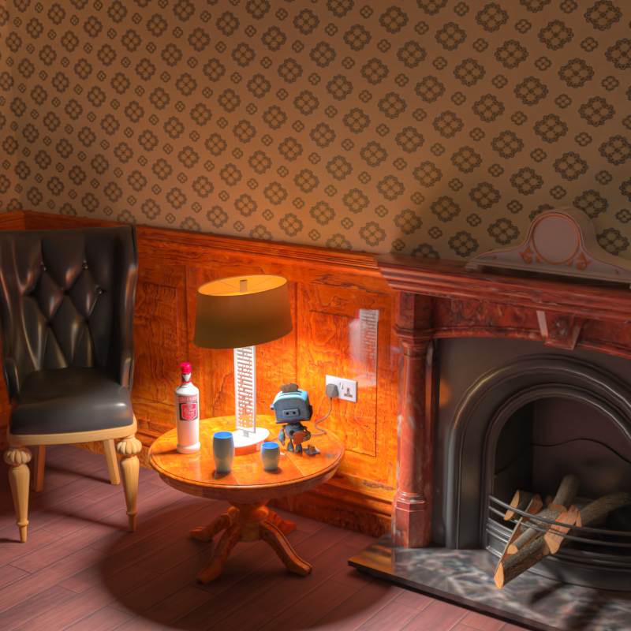

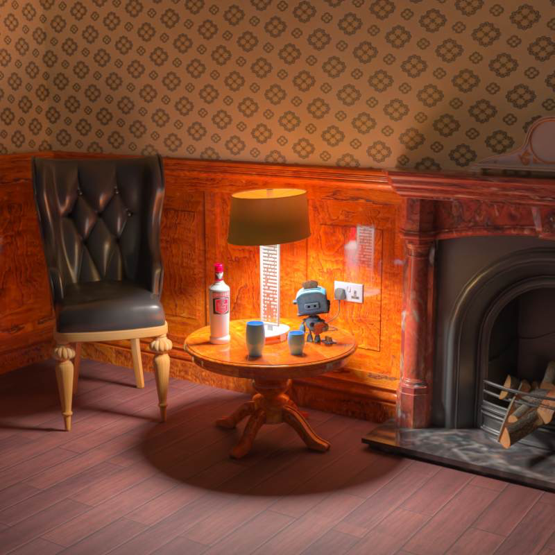

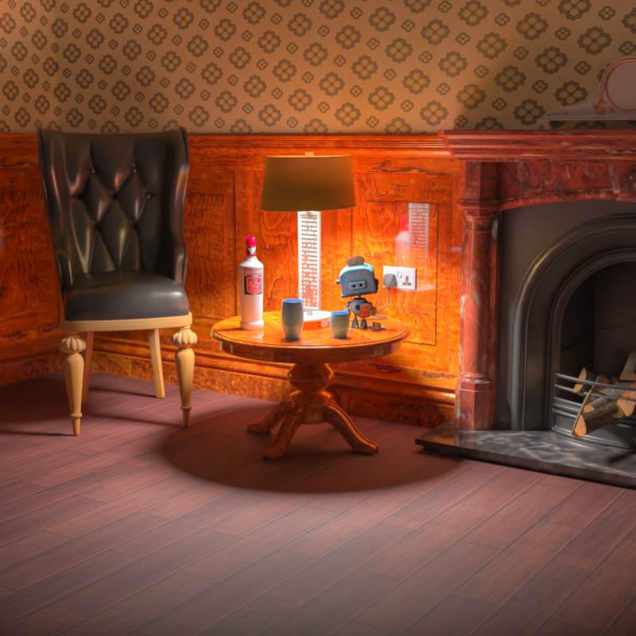

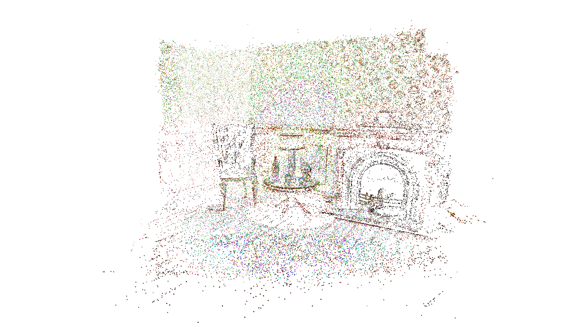

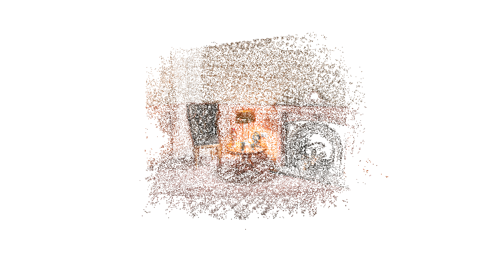

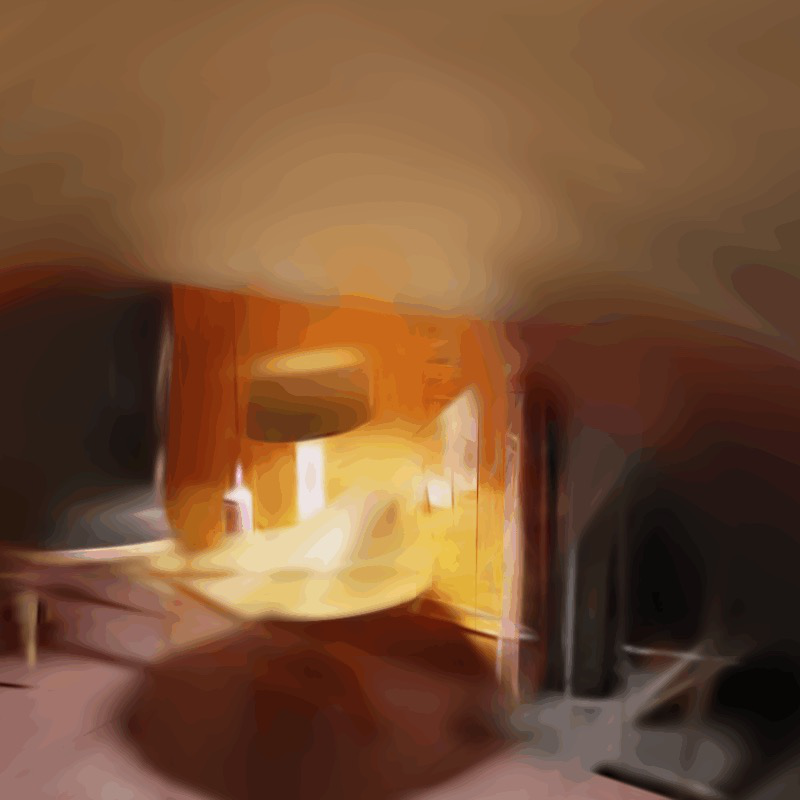

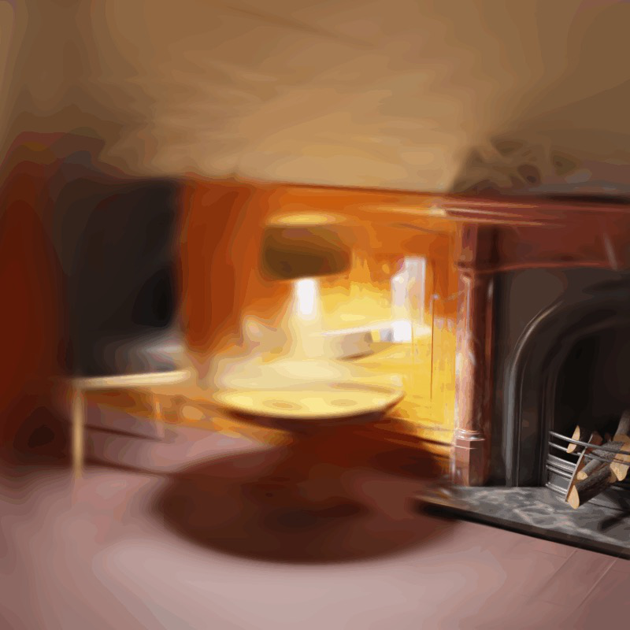

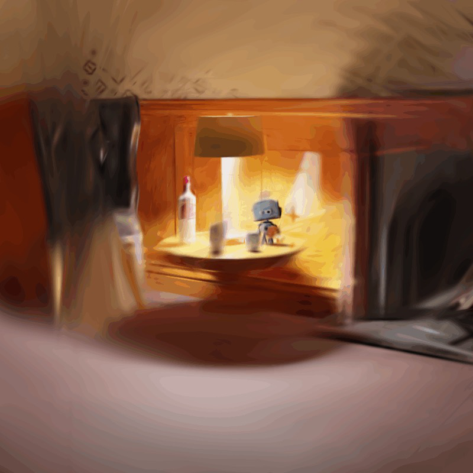

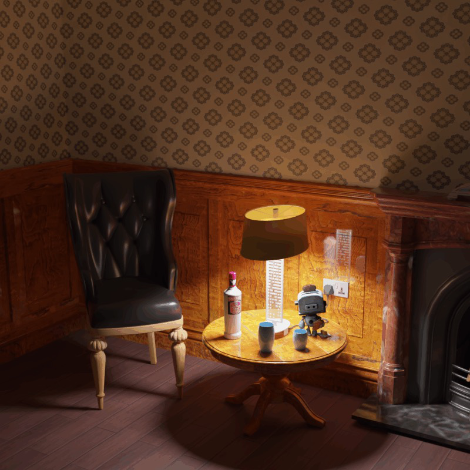

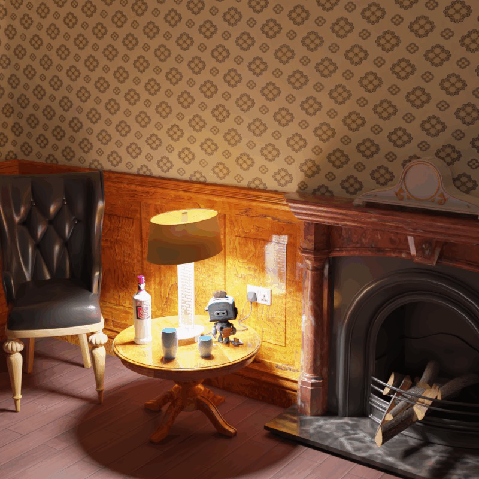

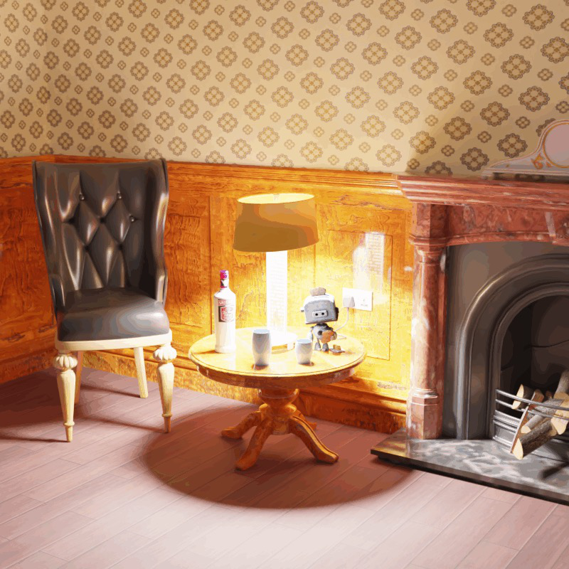

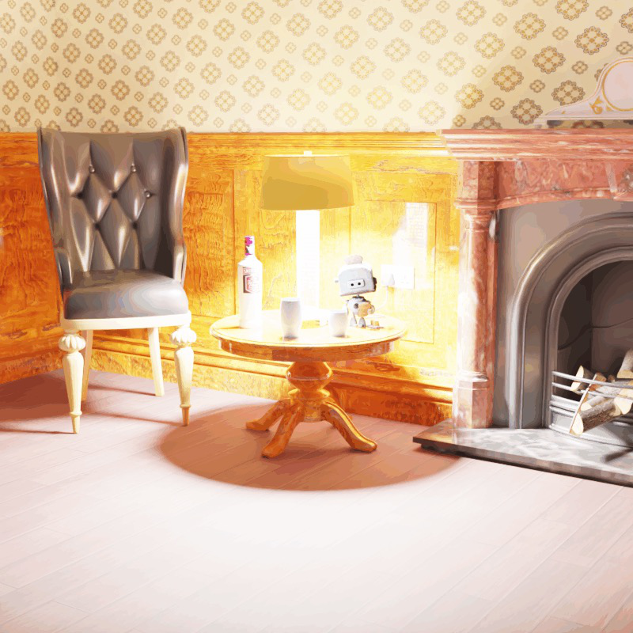

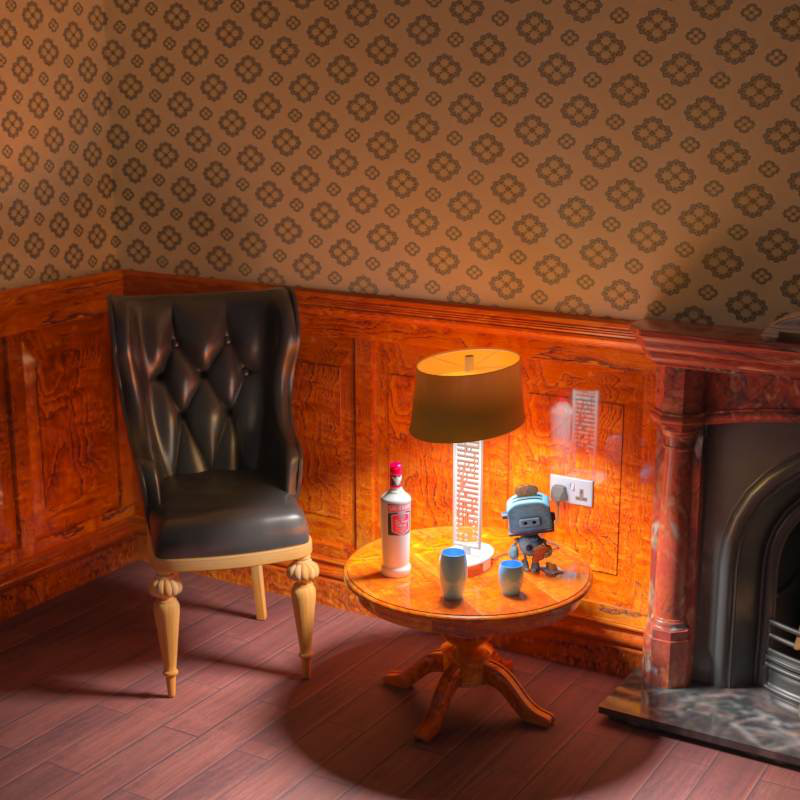

<!-- Page 3 -->
(i) We propose a novel framework, HDR-GS, for 3D HDR imaging. To the best of our knowledge,
this is the first attempt to explore the potential of Gaussian splatting in 3D HDR reconstruction.
(ii) We present a Dual Dynamic Range Gaussian point cloud model with two Parallel Differentiable
Rasterization processes that can render HDR images and LDR views with controllable exposure time.
(iii) We establish a data foundation by recalibrating camera parameters and computing initial points
for 3DGS-based methods on the multi-view HDR datasets [14]. Experiments show that our HDR-GS
dramatically outperforms SOTA methods while enjoying much faster training and inference speed.
2
Related Work
High Dynamic Range Imaging. Conventional HDR imaging [18] techniques recover HDR images
by directly fusing a series of LDR images under different exposure levels at a fixed pose [19] or
calibrating the camera response function (CRF) from the LDR images [16,20]. These traditional
methods yield compelling results in static scenes but produce unpleasant ghost artifacts in dynamic
scenes. To address this issue, later works [21–25] adopt an optical estimator to detect motion regions
in the LDR images and then remove or align these regions in further fusion. With the development of
deep learning, convolutional neural networks (CNNs) [26–29] and Transformers [30–35] have been
used to learn an implicit mapping function from an LDR image to its HDR counterpart. Yet, these 2D
HDR imaging methods lack 3D perception capabilities and are unable to render novel HDR views.
Neural Radiance Field. NeRF [13] learns an implicit mapping function from the position of a 3D
point and view direction to the point color and volume density. NeRF achieves impressive performance
on the NVS task, inspiring many follow-up works to improve its reconstruction quality [36–40] and
inference speed [41–47] or expand its application area [14,48–51]. For example, Huang et al. present
HDR-NeRF [14] that employs an MLP following the vanilla NeRF to learn an implicit mapping from
physical radiance to digital color. Although good results are achieved, these NeRF-based methods
suffer from slow training and inference speed due to their time-consuming ray-tracing scheme.
Gaussian Splatting. 3DGS [15] explicitly represents a scene by millions of Gaussian point clouds.
Its parallelized rasterization in view rendering allows it to enjoy much faster inference speed than
NeRF-based methods that suffer from the time-consuming ray-tracing scheme. Thus, 3DGS has been
rapidly and widely applied in many areas such as dynamic scene rendering [52–54], SLAM [55–58],
inverse rendering [59–61], digital human [62–64], 3D generation [65–67], medical imaging [68,69],
etc. However, the illuminance modeled by 3DGS is still limited to a low dynamic range. The potential
of 3DGS in HDR imaging still remains under-explored. This work aims to fill this research gap.
3
Method
Figure 3 depicts the overall framework of our HDR-GS. To begin with, we use the structure-from-
motion (SfM) [17] algorithm to recalibrate the camera parameters of the scene and initialize the
Gaussian point clouds, as shown in Fig. 3 (a). Then we propose a Dual Dynamic Range (DDR)
Gaussian point cloud model to jointly fit the HDR and LDR colors, as illustrated in Fig. 3 (b). The 3D
Gaussians directly use the spherical harmonics (SH) to model the HDR color. Then three independent
MLPs are employed to learn the tone-mapping operation in RGB channels. This tone-mapper renders
the LDR color from the corresponding HDR color and a controllable exposure time ∆t. Subsequently,
the LDR and HDR colors are fed into two Parallel Differentiable Rasterization (PDR) processes to
render the HDR and LDR images, as depicted in Fig. 3 (c). In this section, we first introduce the DDR
point cloud model, then PDR processes, and finally the initialization and optimization of HDR-GS.
3.1
Dual Dynamic Range Gaussian Point Cloud Model
A scene can be represented by a set of our Dual Dynamic Range (DDR) Gaussian point clouds G as
G = {Gi(µi, Σi, αi, cl
i, ch
i , ∆t, θ) | i = 1, 2, . . . , Np},
(1)
where Np is the number of 3D Gaussians and Gi represents the i-th Gaussian. Its center position,
covariance, opacity, LDR color, and HDR color are denoted as µi ∈R3, Σi ∈R3×3, αi ∈R,
3

<!-- Page 4 -->
Sparse LDR Views
(a) Recalibration and Initialization
Training
Iteration
(b) Dual Dynamic Range Gaussian Point Cloud Model
Low Dynamic Range
High Dynamic Range
fc 
ReLU
fc
Sigmoid
fc
ReLU
fc
Sigmoid
fc
ReLU
fc
Sigmoid
Controllable
Exposure Time
∆𝑡
Splatting at Camera Pose 𝐌!"# 
Splatting at Camera Pose 𝐌!"#
𝝁!
𝝁"
𝝁#
HDR
Rasterization
𝝁!
𝝁"
𝝁#
LDR
Rasterization
LDR Image 𝐈!(∆𝑡)
HDR Image 𝐈"
(c) Parallel Differentiable Rasterization
Camera Poses
…
…
…
Tone Mapper
𝜃
𝐹!"#
!𝐈!
" 𝑡#
𝒄#
!
𝒄#
"
Figure 3: Pipeline of our method. (a) SfM [17] algorithm is used to recalibrate camera parameters and initialize
3D Gaussians. (b) Dual Dynamic Range Gaussian point clouds use spherical harmonics to model the HDR color.
Three MLPs are employed to tone-map the LDR color from the HDR color and user input exposure time. (c) The
HDR and LDR colors are fed into two Parallel Differentiable Rasterization to render the HDR and LDR views.
cl
i ∈R3, and ch
i ∈R3. Besides these attributes, each Gi also contains an exposure time ∆t ∈R that
controls the light intensity of the LDR view and three global-shared MLPs with parameters θ.
Σi is represented by a rotation matrix Ri ∈R3 and a scaling matrix Si ∈R3 as
Σi = RiSiS⊤
i R⊤
i .
(2)
µi, Ri, Si, αi, and θ are learnable parameters. The tone-mapping operation fT M(·) models the
camera response function (CRF) that non-linearly maps the HDR color ch
i into the LDR color cl
i as
cl
i = fT M(ch
i · ∆t),
(3)
where the exposure time ∆t can be read from the metadata of photos. We propose to employ MLPs to
learn the tone-mapping process. There are two options. The first option is to directly model fT M(·),
which may result in the vanishing gradient problem because the multiplication operations may cause
numerical overflow or underflow. Besides, the multiplication also leads to the nonlinearity and
discontinuity of the input signal of MLPs, which also exacerbates the training instability. The second
option is following the traditional non-parametric CRF calibration method of Debevec and Malik [16]
that transforms fT M(·) from linear domain to logarithmic domain to enhance the stability of MLP
training. We adopt the second option. Specifically, fT M(·) in Eq. (3) is inversed and transformed as
log f −1
T M(cl
i) = log ch
i + log ∆t,
(4)
where log(·) refers to the natural logarithm function and its base is e = 2.71828 · · · . Subsequently,
we take the inverse function of Eq. (4) on both sides and reformulate it as
cl
i = (log f −1
T M)−1(log ch
i + log ∆t).
(5)
Then we use three MLPs θ to model the function (log f −1
T M)−1 in RGB channels independently
because the RGB colors are tone-mapped by different CRFs. For simplicity, we define the mapping
function of our tone-mapper θ as gθ(x) ≜(log f −1
T M)−1(x) . Then Eq. (5) is reformulated as
cl
i = gθ(log ch
i + log ∆t),
(6)
here log ch
i is modeled by the spherical harmonics (SH) with a set of coefficients k = {km
l |0 ≤l ≤
L, −l ≤m ≤l} ∈R(L+1)2×3. Each km
l
∈R3 is a set of three coefficients corresponding to the
RGB components. L is the degree of SH. Then ch
i at the view direction d = (θ, ϕ) is derived by
ch
i (d, k) = exp(
L
X
l=0
l
X
m=−l
km
l Y m
l (θ, ϕ)),
(7)
4

#### Page 4 Images

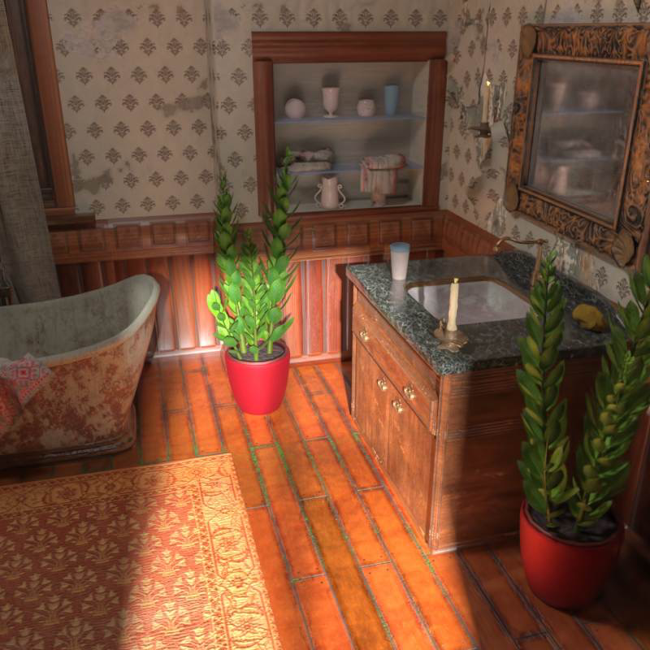

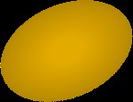

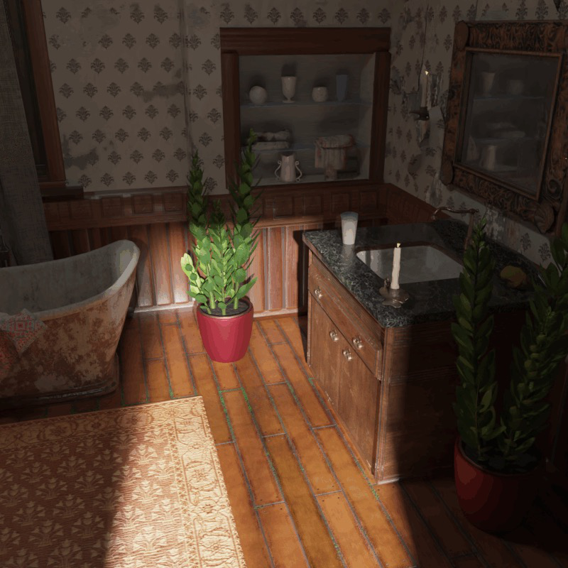

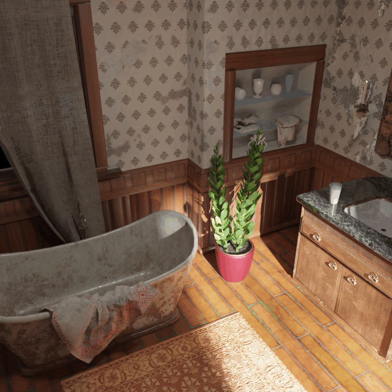

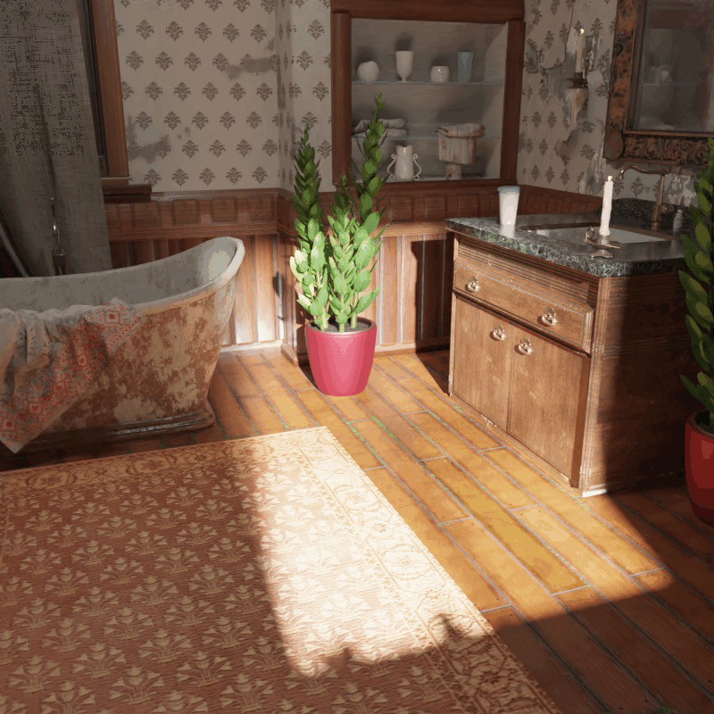

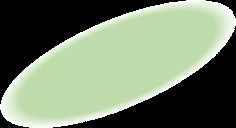

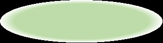

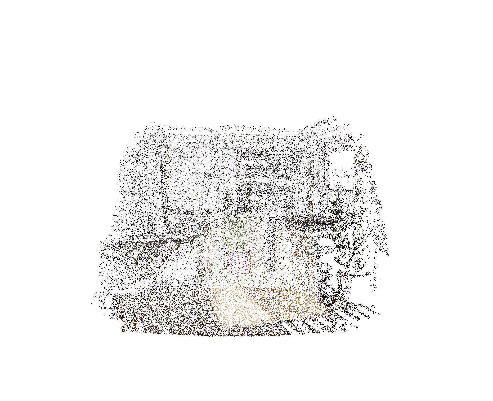

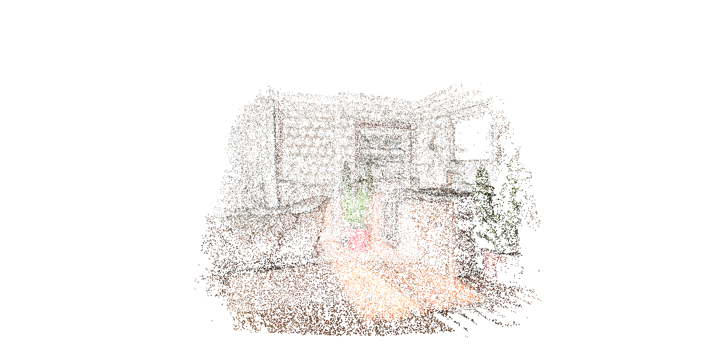

<!-- Page 5 -->
where Y m
l
: S2 →R is the SH function that maps 3D points on the sphere to real numbers and exp(·)
represents the the exponential function. By substituting Eq. (7) into Eq. (6), we obtain cl
i as
cl
i(d, k, ∆t) = gθ(
L
X
l=0
l
X
m=−l
km
l Y m
l (θ, ϕ) + log ∆t + b),
(8)
here we add a constant bias b ∈R that helps adjust the SH function to better fit the data. The detailed
architecture of our MLP-based tone-mapper θ is shown in Fig. 3 (b). gθ(·) equals to the process that
the RGB channels of log ci
h respectively undergo an independent MLP containing a fully connected
(fc) layer, a ReLU activation, an fc layer, and a sigmoid activation to produce the LDR color cl
i.
3.2
Parallel Differentiable Rasterization
The computed HDR color ch
i in Eq. (7) and LDR color cl
i in Eq. (8) of Gaussian point clouds are fed
into two parallel differentiable rasterization processes to jointly render the HDR and LDR views, as
shown in Fig. 3 (c). The HDR rasterization FHDR and LDR rasterization FLDR are represented as
Ih = FHDR(Mint, Mext, {µi, Σi, αi, ch
i }Np
i=1),
Il(∆t) = FLDR(Mint, Mext, {µi, Σi, αi, cl
i(∆t)}Np
i=1),
(9)
where Ih and Il(∆t) ∈RH×W ×3 denote the rendered HDR image and LDR image with the exposure
time ∆t, H and W refers to the height and width of the images, Mext ∈R4×4 represents the extrinsic
matrix, and Mint ∈R3×4 refers to the intrinsic matrix. Please note that we omit d and k in ch
i and
cl
i for simplicity. Then we introduce the details of the parallel rasterization processes. First of all, we
derive the possibility value of the i-th 3D Gaussian distribution at the point position x ∈R3 as
P(x|µi, Σi) = exp
−1
2(x −µi)⊤Σ−1
i (x −µi)

.
(10)
Subsequently, the splatting operation projects the 3D Gaussians to the 2D imaging plane. In this
projection process, the center position µi is firstly transferred from the world coordinate system to
the camera coordinate system and then projected to the image coordinate system as
evi = [vi, 1]⊤= Mext eµi = Mext [µi, 1]⊤,
eui = [ui, 1]⊤= Mint evi = Mint [vi, 1]⊤, (11)
where ui ∈R2 and vi ∈R3 refer to the image coordinate and camera coordinate of µi. eui, evi,
and eµi are the homogeneous versions of ui, vi, and µi, respectively. The 3D covariance Σi is also
transferred from the world coordinate system to Σ
′
i ∈R3×3 in the camera coordinate system as
Σ
′
i = JiWiΣiW⊤
i J⊤
i ,
(12)
where Ji ∈R3×3 represents the Jacobian matrix of the affine approximation of the projective
transformation MintMext. Wi ∈R3×3 is the viewing transformation obtained by taking the first
three rows and columns of Mext. Similar to previous works [15, 68, 70, 71], the 2D covariance
matrix Σ
′′
i ∈R2×2 is derived by directly skipping the third row and column of Σ
′
i. Subsequently,
the 2D projection is divided into non-overlapping tiles. The 3D Gaussians (µi,Σi) are assigned to
the tiles where their 2D projections (ui,Σ
′′
i ) cover. For each tile, the assigned 3D Gaussians are
sorted according to the view space depth. Then the RGB value Ih(p) and Il(p|∆t) ∈R3 at pixel p is
obtained by blending N ordered points overlapping pixel p in the corresponding tile as
Ih(p) =
X
j∈N
ch
j σj
j−1
Y
k=1
(1 −σk),
Il(p|∆t) =
X
j∈N
cl
j(∆t) σj
j−1
Y
k=1
(1 −σk),
(13)
where σj = αjP(xj|µj, Σj) and xj is the j-th intersection 3D point between the ray, which starts
from the optical center of the camera and lands at pixel p, and the Gaussian point clouds in 3D space.
ch
j and cl
j(∆t) are the HDR color and LDR color with exposure time ∆t of xj, respectively.
5

<!-- Page 6 -->
3.3
Initialization and Optimization
An obstacle to the research of 3DGS-based methods in 3D HDR imaging is that the original multi-
view HDR datasets [14] only provide the camera poses in the normalized device coordinate (NDC)
system. This NDC system is not suitable for 3DGS-based methods for two main reasons. Firstly,
NDC focuses on describing the positions on the 2D screen after perspective projection. However,
3D Gaussian is an explicit 3D representation. 3DGS requires transforming and projecting Gaussian
point clouds in 3D space. Secondly, NDC rescales the coordinates into the range [-1, 1] or [0, 1].
The voxel resolution is limited, making it challenging to capture fine details in the scene. Besides,
the original datasets [14] do not provide SfM [17] point clouds for the initialization of 3DGS.
To address these issues and establish a data foundation for the research of 3DGS-based algorithms in
3D HDR imaging, we use the SfM algorithm [17] to recalibrate the camera parameters and compute
the initial positions for 3D Gaussians. The mapping function of SfM FSfM is summarized as
Mint, {Mj
ext}Nv
j=1, Np, {µi}Np
i=1 = FSfM({ˆIl
j(ts)}Nv
j=1),
(14)
where Nv represents the number of viewpoints and ˆIl
j(ts) ∈RH×W ×3 refers to the LDR image at
the j-th viewpoint with the exposure time ts in the multi-view HDR datasets [14]. The intrinsic
matrix Mint does not change with the viewpoint. Please note that we take the HDR views under the
same exposure time as the inputs of SfM algorithms because SfM is based on multi-view feature
detection and matching. Changes in exposure conditions may degrade the accuracy of SfM. Then we
use the computed Np and {µi}Np
i=1 in Eq. (14) to initialize G in Eq. (1). Other learnable parameters
of G are randomly initialized. The recalibrated camera pose-image data pairs {Mj
ext,ˆIl
j(∆t)}Nv
j=1 in
Eq. (14) are used to train our HDR-GS with the weighted sum of L1 loss and D-SSIM loss as
Lp =
B
X
j=1
L1(Il
j(∆tj),ˆIl
j(∆tj)) + λ · LD-SSIM(Il
j(∆tj),ˆIl
j(∆tj)),
(15)
where B is the training batch size and λ is a hyperparameter. Similar to HDR-NeRF [14] that uses
the ground truth CRF correction coefficient C0 to restrict the HDR color on the synthetic scenes, we
also enforce a constraint to the rendered HDR image in the µ-law [14,23,72,73] LDR domain as
Lc =
B
X
j=1


log(1 + µ · norm(Ih
j ))
log(1 + µ)
−log(1 + µ · norm(ˆIh
j ))
log(1 + µ)


2
2 ,
(16)
where µ is the amount of compression. norm(·) is the min-max normalization. Ih
j and ˆIh
j ∈RH×W ×3
denote the rendered and ground-truth HDR image at the j-th viewpoint. The overall training loss is
L = Lp + γ · Lc,
(17)
where γ is a hyperparameter that controls the relative importance between Lp and Lc. We do not
use Lc in the real scenes since the ground truth HDR images are not provided in the real datasets.
Therefore, we set γ = 0.6 and 0 in the experiments on the synthetic and real datasets, respectively.
4
Experiments
4.1
Experimental Settings
Dataset. We adopt the multi-view image datasets collected by [14], including 4 real scenes captured
by a camera and 8 synthetic scenes created by the software Blender [74]. Images with 5 different
exposure time {t1, t2, t3, t4, t5} are captured at 35 different viewpoints. Following HDR-NeRF [14],
images at 18 views with exposure time randomly selected from {t1, t3, t5} are used for training while
other 17 views at exposure time {t1, t3, t5} and {t2, t4} and HDR images are used for testing.
Implementation Details. We implement HDR-GS by PyTorch [75]. The models are trained with the
Adam optimizer [76] (β1 = 0.9, β2 = 0.999, and ϵ = 1×10−15) for 3×104 iterations. The learning
rate for point cloud position is initially set to 1.6×10−4 and exponentially decays to 1.6×10−6.
The learning rates for point feature, opacity, scaling, and rotation are set to 2.5×10−3, 5×10−2,
5×10−3, and 1×10−3. The learning rate for the tone mapper network is initially set as 5×10−4 and
exponentially decays to 5×10−5. All experiments are conducted on a single RTX A5000 GPU.
6

<!-- Page 7 -->
Method
Training
Inference
LDR-OE (t1, t3, t5)
LDR-NE (t2, t4)
HDR
Time (min)
Speed (fps)
PSNR↑
SSIM↑
LPIPS↓
PSNR↑
SSIM↑
LPIPS↓
PSNR↑
SSIM↑
LPIPS↓
NeRF [13]
405
0.190
13.97
0.555
0.376
14.51
0.522
0.428
—
—
—
3DGS [15]
38
121
19.46
0.690
0.276
18.97
0.778
0.309
—
—
—
NeRF-W [80]
437
0.178
29.83
0.936
0.047
29.22
0.927
0.050
—
—
—
HDR-NeRF [14]
542
0.122
39.07
0.973
0.026
37.53
0.966
0.024
36.40
0.936
0.018
HDR-GS (Ours)
34
126
41.10
0.982
0.011
36.33
0.977
0.016
38.31
0.972
0.013
Table 1: Quantitative results on the synthetic datasets. Metrics are averaged over all scenes. LDR-OE
denotes the LDR results with exposure time t1, t3, and t5. LDR-NE denotes the LDR results with
exposure time t2 and t4. HDR denotes the HDR results. HDR-GS yields the best results on all tracks.
∆𝑡= 8 𝑠
𝑡= 32 𝑠
NeRF
3DGS
NeRF-W
HDR-NeRF
HDR-GS (Ours)
Ground Truth
∆𝑡= 0.5 𝑠
dog
sofa
Figure 4: LDR visual comparisons on the synthetic scenes. Previous methods introduce unpleasant black spots
or render blurry images. Our method controls the exposure better while reconstructing more detailed structures.
Evaluation Metrics. We adopt the peak signal-to-noise ratio, PSNR (higher is better), and structural
similarity index measure, SSIM [77] (higher is better), to quantitatively evaluate the objective
performance. Learned perceptual image patch similarity, LPIPS [78] (lower is better), is adopted as
the perceptual metric. Similar to [14], we also quantitatively evaluate the rendered HDR images in
the tone-mapped domain and qualitatively show HDR results tone-mapped by Photomatix pro [79].
In addition, frames per second, fps (higher is faster), is used to measure the model inference speed.
4.2
Quantitative Results
Comparisons on the Synthetic Datasets. The quantitative results of LDR and HDR NVS on the
synthetic datasets are reported in Table 1. We compare our HDR-GS with three NeRF-based methods
(NeRF [13], NeRF-W [80], and HDR-NeRF [14]) and the original 3DGS [15]. Table 1 lists the
training time, inference speed, PSNR, SSIM, and LPIPS results on LDR-OE, LDR-NE, and HDR.
LDR-OE represents the LDR NVS results with exposure time t1, t3, and t5. LDR-NE denotes the
LDR NVS results with exposure time t2 and t4. HDR refers to the HDR NVS results. Please note
that only HDR-NeRF and HDR-GS can output both LDR and HDR views. Other methods can only
render LDR images. Our method outperforms SOTA methods on all tracks except for the PSNR on
LDR-NE. (i) When compared to the recent best method HDR-NeRF, our HDR-GS outperforms it by
2.03 and 1.91 dB on LDR-OE and HDR tracks while enjoying 1000× faster inference speed and only
costing 6.3% training time. (ii) When compared to the original 3DGS, our HDR-GS is 21.64 and
17.36 dB higher on LDR-OE and LDR-NE, respectively. Interestingly, HDR-GS is slightly faster
7

#### Page 7 Images

<!-- Page 8 -->
Method
LDR-OE (t1, t3, t5)
LDR-NE (t2, t4)
PSNR↑
SSIM↑
LPIPS↓
PSNR↑
SSIM↑
LPIPS↓
NeRF [13]
14.95
0.661
0.308
14.44
0.731
0.255
3DGS [15]
17.19
0.806
0.103
19.50
0.727
0.152
NeRF-W [80]
28.55
0.927
0.094
28.64
0.923
0.089
HDR-NeRF [14]
31.63
0.948
0.069
31.43
0.943
0.069
HDR-GS (Ours)
35.47
0.970
0.022
31.66
0.965
0.030
Table 2: Quantitative results on the real datasets. Metrics are averaged across all scenes. LDR-OE
represents the LDR results with exposure time t1, t3, and t5. LDR-NE denotes the LDR results with
exposure time t2 and t4. HDR refers to the HDR results. HDR-GS yields the best results on all tracks.
Δ𝑡= 0.17 𝑠
NeRF
3DGS
NeRF-W
HDR-NeRF
HDR-GS (Ours)
Ground Truth
Δ𝑡= 0.1 𝑠
box
luckycat
Figure 5: LDR visual comparisons on the real scenes. Previous methods introduce unpleasant black spots or
render blurry images. Our method controls the exposure better while reconstructing more detailed structures.
than 3DGS. This is because 3DGS cannot adapt to different exposure levels. It is fragile and hard to
converge when training with LDR images under different lighting intensities. The color change of
the scene misleads the adaptive density control in 3DGS to split more Gaussian point clouds with
distorted color to represent the complex variances in exposure levels, prolonging the training process.
To intuitively show the superiority of our method, Fig. 1 plots a radar chart that features concentric
polygons representing the HDR NVS performance across 5 metrics of the SOTA method HDR-NeRF
and our HDR-GS. It can be observed that our HDR-GS forms a much larger outermost polygon fully
enclosing that of HDR-NeRF, indicating superior performance across all evaluated aspects. These
results strongly demonstrate the advantages of our method in effectiveness and model efficiency.
Comparisons on the Real Datasets. Table 2 shows the quantitative comparisons on the real datasets.
Please note that the real datasets do not provide HDR ground truth for quantitative evaluation. Hence,
we only report the LDR NVS results in Table 2. When compared to the recent best method HDR-
NeRF, our HDR-GS is 3.84 and 0.23 dB higher in PSNR on LDR-OE and LDR-NE. When compared
to the original 3DGS, HDR-GS significantly surpasses it by 18.28 and 12.16 dB on LDR-OE and
LDR-NE. These results suggest the outstanding generalization ability and effectiveness of our method.
4.3
Qualitative Results
LDR Novel View Rendering. The comparisons of LDR novel view rendering with different exposure
times on the synthetic (dog and sofa) and real (box and luckycat) scenes are shown in Fig. 4 and 5. It
can be observed that NeRF, 3DGS, and NeRF-W fail to control the exposure. They either introduce
black stripes and spots, or over-smooth the image, or over-enhance the image while distorting the
color. HDR-NeRF can adapt the light intensity but it also produces blurry images. In contrast, our
8

#### Page 8 Images

<!-- Page 9 -->
Method
Baseline
+ Camera Recalibration
+ SfM Points
+ DDR Model
HDR
−
−
−
38.31
LDR-OE
12.35
14.62
19.46
41.10
LDR-NE
11.83
14.41
18.97
36.33
(a) Break-down ablation study towards better performance
Domain
Linear
Logarithmic
HDR
26.18
38.31
LDR-OE
29.53
41.10
LDR-NE
27.44
36.33
(b) Study on the CRF domain
Exposure
{t3}
{t1, t5}
{t1, t3, t5}
{t1, t2, t3, t4, t5}
HDR
22.86
32.06
38.31
38.50
LDR-OE
23.11
34.73
41.10
41.32
LDR-NE
22.37
32.90
36.33
36.48
(c) Study on the exposure times used in training
ts (s)
t1 = 0.125
t2 = 0.25
t3 = 2
t4 = 8
t5 = 32
HDR
36.88
37.90
38.16
38.31
38.05
LDR-OE
39.71
41.07
40.98
41.10
41.21
LDR-NE
35.28
35.92
36.25
36.33
36.20
(d) Study on the exposure time ts in recalibration
Table 3: Ablations on the synthetic datasets. The PSNR results on HDR, LDR-OE, and LDR-NE are reported.
HDR-NeRF
HDR-GS (Ours)
HDR-NeRF
HDR-GS (Ours)
Ground Truth
HDR-NeRF
HDR-GS (Ours)
Ground Truth
HDR-NeRF
HDR-GS (Ours)
HDR-NeRF
HDR-GS (Ours)
box
box
luckycat
luckycat
computer
computer
sofa
sofa
sofa
dog
dog
dog
Figure 6: HDR visual comparisons on the synthetic (upper) and real (lower) scenes. Our method can recover
the details in both dark and bright regions while suppressing color distortion. Please zoom in for a better view.
HDR-GS can not only control the exposure level of LDR views according to the user input time but
also reconstruct clearer images with high-frequency textures and structural contents.
HDR Novel View Rendering. The comparisons of HDR novel view synthesis on the synthetic
(upper) and real (lower) datasets are depicted in Fig. 6. Please note that only HDR-NeRF and
our HDR-GS can reconstruct HDR images. As can be seen, HDR-NeRF yields low-contrast and
over-smooth images while sacrificing fine-grained details and introducing undesirable chromatic
artifacts and black spots. On the contrary, our HDR-GS can render more perceptually pleasing HDR
images with sharper textures and preserve the color and spatial smoothness of homogeneous regions.
4.4
Ablation Study
In this section, we adopt the synthetic datasets to conduct ablation study. Table 3 lists the PSNR
results averaged across all scenes on the LDR-OE, LDR-NE, and HDR tracks, respectively.
Break-down Ablation. We adopt 3DGS [15] trained with the original coordinates (NDC) as the
baseline to conduct a break-down ablation on the synthetic datasets. Our goal is to study the effect of
each component towards higher performance. The results are reported in Table 3a. (i) The baseline
model can only render LDR views. It achieves 12.35 and 11.83 dB on LDR-OE and LDR-NE. (ii)
When using the recalibrated camera poses, the model yields an improvement of 2.27 and 2.58 dB on
LDR-OE and LDR-NE because it is liberated from the constraint of the NDC system. (iii) When we
apply the SfM points for the initialization of 3D Gaussians, the model gains by 4.84 dB and 4.56 dB
9

#### Page 9 Images

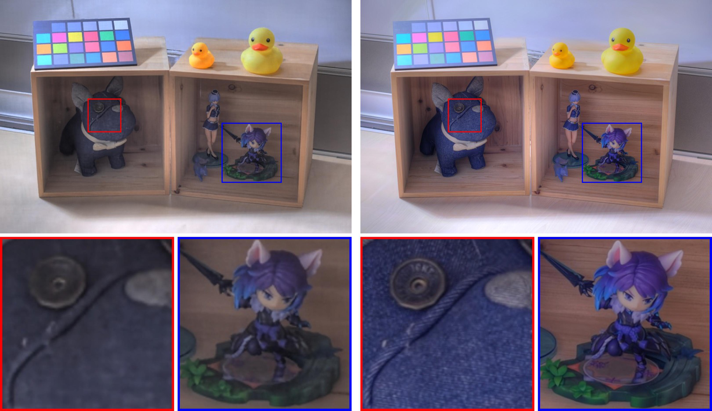

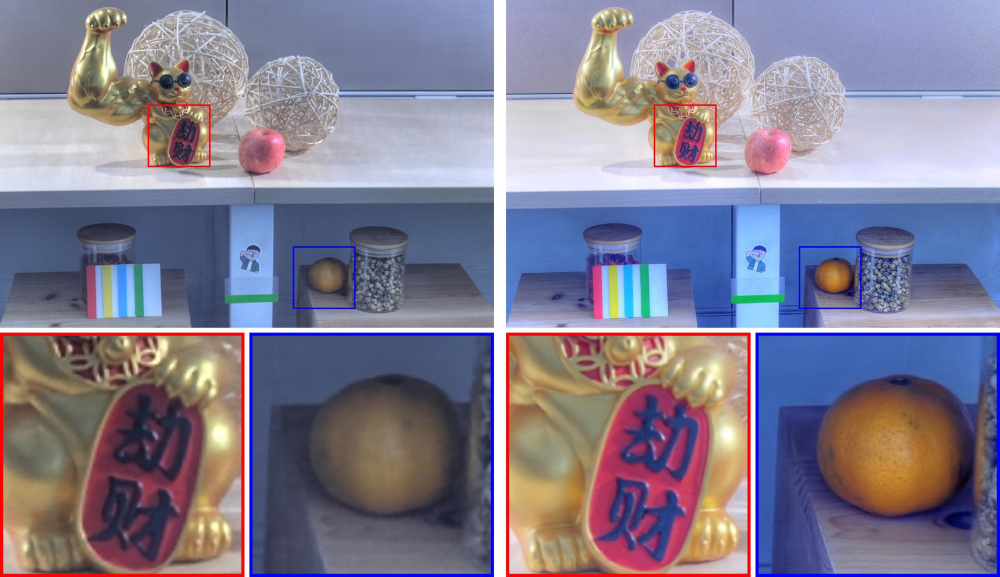

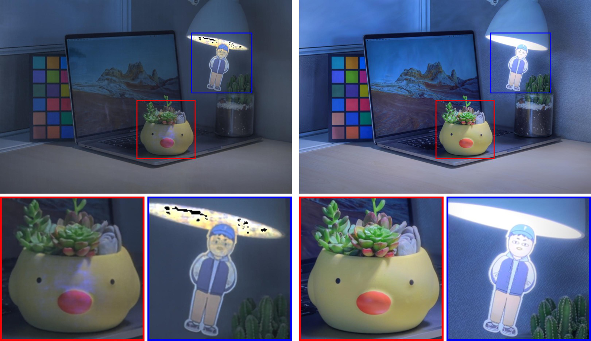

<!-- Page 10 -->
because the SfM points provide a general shape of Gaussian point clouds to alleviate the overfitting
issues of 3DGS. However, the model still cannot render HDR views nor change the exposure level
of the LDR views until now, leading to limited LDR NVS performance. (iv) Then we apply our
DDR point clouds, the model is enabled to render HDR views with 38.31 dB in PSNR performance.
Besides, the model yields 21.64 and 17.36 dB improvements on LDR-OE and LDR-NE because our
DDR point clouds allow the model to adapt the lighting intensity with controllable exposure time.
CRF Domain. We conduct experiments to compare the effects of modeling CRF in linear domain
and logarithmic domain. As shown in Table 3b, when the MLPs θ directly models fT M(·) in Eq. (3),
our method yields poor results of only 26.18, 29.53, and 27.44 dB on HDR, LDR-OE, and LDR-
NE. In contrast, when the MLPs θ models gθ(·) in Eq. (6), the performance is 12.13, 11.57, and
8.89 dB higher on HDR, LDR-OE, and LDR-NE. This is because the multiplication in fT M(·)
is transferred into the addition in gθ(·), which enhances the training stability by suppressing the
numerical nonlinearity and discontinuity problems. This evidence verifies our analysis in Sec. 3.1.
Exposure Time Used for Training. We conduct experiments in Table 3c to study the effect of the
number of exposure times used in training. (i) According to the research of Debevec and Malik [16],
modeling CRF requires at least two exposures. Thus, when we only use a single exposure {t3},
HDR-GS fails to reconstruct HDR views and LDR images with novel exposure time. (ii) When
two exposures {t1, t5} are used for training, HDR-GS gains by 9.20, 11.62, and 10.53 dB on HDR,
LDR-OE, and LDR-NE. (iii) The performance of using three exposures {t1, t3, t5} is close to that of
using five exposures {t1, t2, t3, t4, t5}. Hence, it is a reasonable choice to use three exposure times.
Recalibration of Camera Parameters. In Eq. (14), we use the SfM algorithm to recalibrate the
camera parameters and compute the initial positions of 3D Gaussians at the same exposure time ts.
Here, we conduct experiments to study the effect of ts in Table 3d. The performance achieves its
maximum value when ts = t4 = 8 seconds. Therefore, the optimal choice of ts is t4 = 8 s.
5
Limitation and Broader Impact
The main limitation of this work is that the memory usage of 3DGS-based methods is non-trivial and
maybe unaffordable to some low-RAM mobile devices. HDR imaging is a very important topic in
computational photography. Nowadays, billions of LDR images are captured by mobile phones and
cameras. Therefore, how to enhance the quality of these images, adapt the exposure level, and render
HDR views is worth studying. Our HDR-GS is capable of reconstructing better HDR and LDR
views with controllable exposure time at 1000× speed than SOTA methods, showing great value in
practical applications. Until now, 3D HDR imaging techniques have no negative social impact yet.
Our proposed HDR-GS does not present any negative foreseeable societal consequences, either.
6
Conclusion
This paper focuses on studying the efficiency problem of 3D HDR imaging. We propose the first
Gaussian Splatting-based framework, HDR-GS, for HDR novel view synthesis. Our HDR-GS is
based on the Dual Dynamic Range Gaussian point clouds that can jointly model HDR color and
LDR color with user input exposure time. Then, the HDR and LDR colors are fed into two Parallel
Differentiable Rasterization processes to render the HDR and LDR views. To avoid the limitations of
NDC system and establish a data foundation for the research of 3DGS-based methods, we recalibrate
the camera parameters and compute the initial positions for Gaussian point clouds. Experiments show
that our HDR-GS outperforms the SOTA NeRF-based method by 1.91 and 3.84 dB on HDR and LDR
novel view rendering, while enjoying 1000× inference speed and requiring only 6.3% training time.
Acknowledgement
This work was supported by the office of Naval Research with award N000142412696.
10

<!-- Page 11 -->
References
[1] Z. Yang, Y. Chai, D. Anguelov, Y. Zhou, P. Sun, D. Erhan, S. Rafferty, and H. Kretzschmar, “Surfelgan:
Synthesizing realistic sensor data for autonomous driving,” in CVPR, 2020.
[2] S. Huang, Z. Gojcic, Z. Wang, F. Williams, Y. Kasten, S. Fidler, K. Schindler, and O. Litany, “Neural lidar
fields for novel view synthesis,” in ICCV, 2023.
[3] G. Wang, Z. Chen, C. C. Loy, and Z. Liu, “Sparsenerf: Distilling depth ranking for few-shot novel view
synthesis,” in ICCV, 2023.
[4] M. Tancik, V. Casser, X. Yan, S. Pradhan, B. Mildenhall, P. P. Srinivasan, J. T. Barron, and H. Kretzschmar,
“Block-nerf: Scalable large scene neural view synthesis,” in CVPR, 2022.
[5] S. Liu, X. Zhang, Z. Zhang, R. Zhang, J.-Y. Zhu, and B. Russell, “Editing conditional radiance fields,” in
ICCV, 2021.
[6] J. Sun, X. Wang, Y. Shi, L. Wang, J. Wang, and Y. Liu, “Ide-3d: Interactive disentangled editing for
high-resolution 3d-aware portrait synthesis,” ACM ToG, 2022.
[7] Y.-J. Yuan, Y.-T. Sun, Y.-K. Lai, Y. Ma, R. Jia, and L. Gao, “Nerf-editing: geometry editing of neural
radiance fields,” in CVPR, 2022.
[8] S. Kobayashi, E. Matsumoto, and V. Sitzmann, “Decomposing nerf for editing via feature field distillation,”
in NeurIPS, 2022.
[9] L. Liu, M. Habermann, V. Rudnev, K. Sarkar, J. Gu, and C. Theobalt, “Neural actor: Neural free-view
synthesis of human actors with pose control,” ACM TOG, 2021.
[10] T. Hu, K. Sarkar, L. Liu, M. Zwicker, and C. Theobalt, “Egorenderer: Rendering human avatars from
egocentric camera images,” in ICCV, 2021.
[11] J. Zheng, Y. Jang, A. Papaioannou, C. Kampouris, R. A. Potamias, F. P. Papantoniou, E. Galanakis,
A. Leonardis, and S. Zafeiriou, “Ilsh: The imperial light-stage head dataset for human head view synthesis,”
in ICCV, 2023.
[12] Z. Zheng, H. Huang, T. Yu, H. Zhang, Y. Guo, and Y. Liu, “Structured local radiance fields for human
avatar modeling,” in CVPR, 2022.
[13] B. Mildenhall, P. Srinivasan, M. Tancik, J. Barron, R. Ramamoorthi, and R. Ng, “Nerf: Representing
scenes as neural radiance fields for view synthesis,” in ECCV, 2020.
[14] X. Huang, Q. Zhang, Y. Feng, H. Li, X. Wang, and Q. Wang, “Hdr-nerf: High dynamic range neural
radiance fields,” in CVPR, 2022.
[15] B. Kerbl, G. Kopanas, T. Leimkühler, and G. Drettakis, “3d gaussian splatting for real-time radiance field
rendering,” ACM Transactions on Graphics, 2023.
[16] P. E. Debevec and J. Malik, “Recovering high dynamic range radiance maps from photographs,” in
SIGGRAPH, 1997.
[17] J. L. Schönberger and J.-M. Frahm, “Structure-from-motion revisited,” in CVPR, 2016.
[18] R. Szeliski, Computer vision: algorithms and applications. Springer Nature, 2022.
[19] T. Mertens, J. Kautz, and F. Van Reeth, “Exposure fusion,” in Pacific Conference on Computer Graphics
and Applications, 2007.
[20] G. Ward, E. Reinhard, and P. Debevec, “High dynamic range imaging & image-based lighting,” in
SIGGRAPH, 2008.
[21] T. Grosch et al., “Fast and robust high dynamic range image generation with camera and object movement,”
Vision, Modeling and Visualization, RWTH Aachen, 2006.
[22] K. Jacobs, C. Loscos, and G. Ward, “Automatic high-dynamic range image generation for dynamic scenes,”
IEEE Computer Graphics and Applications, 2008.
[23] N. K. Kalantari, R. Ramamoorthi, et al., “Deep high dynamic range imaging of dynamic scenes.,” ACM
ToG, 2017.
[24] O. T. Tursun, A. O. Akyüz, A. Erdem, and E. Erdem, “The state of the art in hdr deghosting: A survey and
evaluation,” in Computer Graphics Forum, 2015.
[25] Q. Yan, Y. Zhu, and Y. Zhang, “Robust artifact-free high dynamic range imaging of dynamic scenes,”
Multimedia Tools and Applications, 2019.
[26] G. Eilertsen, J. Kronander, G. Denes, R. K. Mantiuk, and J. Unger, “Hdr image reconstruction from a
single exposure using deep cnns,” ACM TOG, 2017.
[27] Z. Khan, M. Khanna, and S. Raman, “Fhdr: Hdr image reconstruction from a single ldr image using
feedback network,” in IEEE Global Conference on Signal and Information Processing, 2019.
11

<!-- Page 12 -->
[28] J. Kim, S. Lee, and S.-J. Kang, “End-to-end differentiable learning to hdr image synthesis for multi-
exposure images,” in AAAI, 2021.
[29] Z. Liu, W. Lin, X. Li, Q. Rao, T. Jiang, M. Han, H. Fan, J. Sun, and S. Liu, “Adnet: Attention-guided
deformable convolutional network for high dynamic range imaging,” in CVPRW, 2021.
[30] R. Chen, B. Zheng, H. Zhang, Q. Chen, C. Yan, G. Slabaugh, and S. Yuan, “Improving dynamic hdr
imaging with fusion transformer,” in AAAI, 2023.
[31] Z. Liu, Y. Wang, B. Zeng, and S. Liu, “Ghost-free high dynamic range imaging with context-aware
transformer,” in ECCV, 2022.
[32] J. W. Song, Y.-I. Park, K. Kong, J. Kwak, and S.-J. Kang, “Selective transhdr: Transformer-based selective
hdr imaging using ghost region mask,” in ECCV, 2022.
[33] H. Jin, Y. Li, F. Luan, Y. Xiangli, S. Bi, K. Zhang, Z. Xu, J. Sun, and N. Snavely, “Neural gaffer: Relighting
any object via diffusion,” in NeurIPS, 2024.
[34] Y. Yu, H. Wang, T. Luo, H. Fan, and L. Zhang, “Magic: Multi-modality guided image completion,” in
ICLR, 2024.
[35] Y. Yu, Z. Zeng, H. Hua, J. Fu, and J. Luo, “Promptfix: You prompt and we fix the photo,” in NeurIPS,
2024.
[36] J. T. Barron, B. Mildenhall, M. Tancik, P. Hedman, R. Martin-Brualla, and P. P. Srinivasan, “Mip-nerf: A
multiscale representation for anti-aliasing neural radiance fields,” in ICCV, 2021.
[37] J. T. Barron, B. Mildenhall, D. Verbin, P. P. Srinivasan, and P. Hedman, “Mip-nerf 360: Unbounded
anti-aliased neural radiance fields,” in CVPR, 2022.
[38] D. Verbin, P. Hedman, B. Mildenhall, T. Zickler, J. T. Barron, and P. P. Srinivasan, “Ref-nerf: Structured
view-dependent appearance for neural radiance fields,” in CVPR, 2022.
[39] W. Hu, Y. Wang, L. Ma, B. Yang, L. Gao, X. Liu, and Y. Ma, “Tri-miprf: Tri-mip representation for
efficient anti-aliasing neural radiance fields,” in ICCV, 2023.
[40] J. T. Barron, B. Mildenhall, D. Verbin, P. P. Srinivasan, and P. Hedman, “Zip-nerf: Anti-aliased grid-based
neural radiance fields,” in ICCV, 2023.
[41] T. Müller, A. Evans, C. Schied, and A. Keller, “Instant neural graphics primitives with a multiresolution
hash encoding,” ACM ToG, 2022.
[42] C. Reiser, R. Szeliski, D. Verbin, P. Srinivasan, B. Mildenhall, A. Geiger, J. Barron, and P. Hedman, “Merf:
Memory-efficient radiance fields for real-time view synthesis in unbounded scenes,” TOG, 2023.
[43] A. Chen, Z. Xu, A. Geiger, J. Yu, and H. Su, “Tensorf: Tensorial radiance fields,” in ECCV, 2022.
[44] R. Li, H. Gao, M. Tancik, and A. Kanazawa, “Nerfacc: Efficient sampling accelerates nerfs,” in ICCV,
2023.
[45] L. Yariv, P. Hedman, C. Reiser, D. Verbin, P. P. Srinivasan, R. Szeliski, J. T. Barron, and B. Mildenhall,
“Bakedsdf: Meshing neural sdfs for real-time view synthesis,” in SIGGRAPH, 2023.
[46] Z. Chen, T. Funkhouser, P. Hedman, and A. Tagliasacchi, “Mobilenerf: Exploiting the polygon rasterization
pipeline for efficient neural field rendering on mobile architectures,” in CVPR, 2023.
[47] T. Hu, S. Liu, Y. Chen, T. Shen, and J. Jia, “Efficientnerf efficient neural radiance fields,” in CVPR, 2023.
[48] Z. Cui, L. Gu, X. Sun, X. Ma, Y. Qiao, and T. Harada, “Aleth-nerf: Illumination adaptive nerf with
concealing field assumption,” in AAAI, 2024.
[49] Y. Cai, J. Wang, A. Yuille, Z. Zhou, and A. Wang, “Structure-aware sparse-view x-ray 3d reconstruction,”
in CVPR, 2024.
[50] L. Ma, X. Li, J. Liao, Q. Zhang, X. Wang, J. Wang, and P. V. Sander, “Deblur-nerf: Neural radiance fields
from blurry images,” in CVPR, 2022.
[51] N. Pearl, T. Treibitz, and S. Korman, “Nan: Noise-aware nerfs for burst-denoising,” in CVPR, 2022.
[52] Z. Yang, H. Yang, Z. Pan, X. Zhu, and L. Zhang, “Real-time photorealistic dynamic scene representation
and rendering with 4d gaussian splatting,” arXiv preprint arXiv:2310.10642, 2023.
[53] G. Wu, T. Yi, J. Fang, L. Xie, X. Zhang, W. Wei, W. Liu, Q. Tian, and X. Wang, “4d gaussian splatting for
real-time dynamic scene rendering,” arXiv preprint arXiv:2310.08528, 2023.
[54] J. Luiten, G. Kopanas, B. Leibe, and D. Ramanan, “Dynamic 3d gaussians: Tracking by persistent dynamic
view synthesis,” arXiv preprint arXiv:2308.09713, 2023.
[55] N. Keetha, J. Karhade, K. M. Jatavallabhula, G. Yang, S. Scherer, D. Ramanan, and J. Luiten, “Splatam:
Splat, track & map 3d gaussians for dense rgb-d slam,” arXiv preprint arXiv:2312.02126, 2023.
12

<!-- Page 13 -->
[56] V. Yugay, Y. Li, T. Gevers, and M. R. Oswald, “Gaussian-slam: Photo-realistic dense slam with gaussian
splatting,” arXiv preprint arXiv:2312.10070, 2023.
[57] H. Matsuki, R. Murai, P. H. Kelly, and A. J. Davison, “Gaussian splatting slam,” arXiv preprint
arXiv:2312.06741, 2023.
[58] C. Yan, D. Qu, D. Wang, D. Xu, Z. Wang, B. Zhao, and X. Li, “Gs-slam: Dense visual slam with 3d
gaussian splatting,” arXiv preprint arXiv:2311.11700, 2023.
[59] Z. Liang, Q. Zhang, Y. Feng, Y. Shan, and K. Jia, “Gs-ir: 3d gaussian splatting for inverse rendering,”
arXiv preprint arXiv:2311.16473, 2023.
[60] T. Xie, Z. Zong, Y. Qiu, X. Li, Y. Feng, Y. Yang, and C. Jiang, “Physgaussian: Physics-integrated 3d
gaussians for generative dynamics,” arXiv preprint arXiv:2311.12198, 2023.
[61] Y. Jiang, J. Tu, Y. Liu, X. Gao, X. Long, W. Wang, and Y. Ma, “Gaussianshader: 3d gaussian splatting with
shading functions for reflective surfaces,” arXiv preprint arXiv:2311.17977, 2023.
[62] X. Liu, X. Zhan, J. Tang, Y. Shan, G. Zeng, D. Lin, X. Liu, and Z. Liu, “Humangaussian: Text-driven 3d
human generation with gaussian splatting,” arXiv preprint arXiv:2311.17061, 2023.
[63] M. Kocabas, J.-H. R. Chang, J. Gabriel, O. Tuzel, and A. Ranjan, “Hugs: Human gaussian splats,” arXiv
preprint arXiv:2311.17910, 2023.
[64] S. Hu and Z. Liu, “Gauhuman: Articulated gaussian splatting from monocular human videos,” arXiv
preprint arXiv:, 2023.
[65] J. Tang, J. Ren, H. Zhou, Z. Liu, and G. Zeng, “Dreamgaussian: Generative gaussian splatting for efficient
3d content creation,” arXiv preprint arXiv:2309.16653, 2023.
[66] T. Yi, J. Fang, G. Wu, L. Xie, X. Zhang, W. Liu, Q. Tian, and X. Wang, “Gaussiandreamer: Fast generation
from text to 3d gaussian splatting with point cloud priors,” arXiv preprint arXiv:2310.08529, 2023.
[67] Y. Liang, X. Yang, J. Lin, H. Li, X. Xu, and Y. Chen, “Luciddreamer: Towards high-fidelity text-to-3d
generation via interval score matching,” arXiv preprint arXiv:2311.11284, 2023.
[68] Y. Cai, Y. Liang, J. Wang, A. Wang, Y. Zhang, X. Yang, Z. Zhou, and A. Yuille, “Radiative gaussian
splatting for efficient x-ray novel view synthesis,” in ECCV, 2024.
[69] R. Zha, T. J. Lin, Y. Cai, J. Cao, Y. Zhang, and H. Li, “R2-gaussian: Rectifying radiative gaussian splatting
for tomographic reconstruction,” in NeurIPS, 2024.
[70] M. Zwicker, H. Pfister, J. Van Baar, and M. Gross, “Ewa volume splatting,” in Proceedings Visualization,
2001. VIS’01., IEEE, 2001.
[71] G. Kopanas, J. Philip, T. Leimkühler, and G. Drettakis, “Point-based neural rendering with per-view
optimization,” in Computer Graphics Forum, 2021.
[72] K. R. Prabhakar, S. Agrawal, D. K. Singh, B. Ashwath, and R. V. Babu, “Towards practical and efficient
high-resolution hdr deghosting with cnn,” in ECCV, 2020.
[73] Q. Yan, D. Gong, Q. Shi, A. v. d. Hengel, C. Shen, I. Reid, and Y. Zhang, “Attention-guided network for
ghost-free high dynamic range imaging,” in CVPR, 2019.
[74] “Blender.” https://www.blender.org/.
[75] A. Paszke, S. Gross, F. Massa, A. Lerer, J. Bradbury, G. Chanan, T. Killeen, Z. Lin, N. Gimelshein,
L. Antiga, et al., “Pytorch: An imperative style, high-performance deep learning library,” in NeurIPS,
2019.
[76] D. P. Kingma and J. L. Ba, “Adam: A method for stochastic optimization,” in ICLR, 2015.
[77] Z. Wang, A. C. Bovik, H. R. Sheikh, and E. P. Simoncell, “Image quality assessment: from error visibility
to structural similarity,” TIP, 2004.
[78] R. Zhang, P. Isola, A. A. Efros, E. Shechtman, and O. Wang, “The unreasonable effectiveness of deep
features as a perceptual metric,” in CVPR, 2018.
[79] “Photomatix Pro 6.” https://www.hdrsoft.com/.
[80] R. Martin-Brualla, N. Radwan, M. S. Sajjadi, J. T. Barron, A. Dosovitskiy, and D. Duckworth, “Nerf in the
wild: Neural radiance fields for unconstrained photo collections,” in CVPR, 2021.
13

<!-- Page 14 -->
NeurIPS Paper Checklist
1. Claims
Question: Do the main claims made in the abstract and introduction accurately reflect the
paper’s contributions and scope?
Answer: [Yes]
Justification: Please refer to the abstract and introduction.
Guidelines:
• The answer NA means that the abstract and introduction do not include the claims
made in the paper.
• The abstract and/or introduction should clearly state the claims made, including the
contributions made in the paper and important assumptions and limitations. A No or
NA answer to this question will not be perceived well by the reviewers.
• The claims made should match theoretical and experimental results, and reflect how
much the results can be expected to generalize to other settings.
• It is fine to include aspirational goals as motivation as long as it is clear that these goals
are not attained by the paper.
2. Limitations
Question: Does the paper discuss the limitations of the work performed by the authors?
Answer: [Yes]
Justification: Please refer to Sec. 5
Guidelines:
• The answer NA means that the paper has no limitation while the answer No means that
the paper has limitations, but those are not discussed in the paper.
• The authors are encouraged to create a separate "Limitations" section in their paper.
• The paper should point out any strong assumptions and how robust the results are to
violations of these assumptions (e.g., independence assumptions, noiseless settings,
model well-specification, asymptotic approximations only holding locally). The authors
should reflect on how these assumptions might be violated in practice and what the
implications would be.
• The authors should reflect on the scope of the claims made, e.g., if the approach was
only tested on a few datasets or with a few runs. In general, empirical results often
depend on implicit assumptions, which should be articulated.
• The authors should reflect on the factors that influence the performance of the approach.
For example, a facial recognition algorithm may perform poorly when image resolution
is low or images are taken in low lighting. Or a speech-to-text system might not be
used reliably to provide closed captions for online lectures because it fails to handle
technical jargon.
• The authors should discuss the computational efficiency of the proposed algorithms
and how they scale with dataset size.
• If applicable, the authors should discuss possible limitations of their approach to
addressing problems of privacy and fairness.
• While the authors might fear that complete honesty about limitations might be used by
reviewers as grounds for rejection, a worse outcome might be that reviewers discover
limitations that aren’t acknowledged in the paper. The authors should use their best
judgment and recognize that individual actions in favor of transparency play an impor-
tant role in developing norms that preserve the integrity of the community. Reviewers
will be specifically instructed to not penalize honesty concerning limitations.
3. Theory Assumptions and Proofs
Question: For each theoretical result, does the paper provide the full set of assumptions and
a complete (and correct) proof?
Answer: [NA]
14

<!-- Page 15 -->
Justification: This paper does not include any theoretical results.
Guidelines:
• The answer NA means that the paper does not include theoretical results.
• All the theorems, formulas, and proofs in the paper should be numbered and cross-
referenced.
• All assumptions should be clearly stated or referenced in the statement of any theorems.
• The proofs can either appear in the main paper or the supplemental material, but if
they appear in the supplemental material, the authors are encouraged to provide a short
proof sketch to provide intuition.
• Inversely, any informal proof provided in the core of the paper should be complemented
by formal proofs provided in the appendix or supplemental material.
• Theorems and Lemmas that the proof relies upon should be properly referenced.
4. Experimental Result Reproducibility
Question: Does the paper fully disclose all the information needed to reproduce the main ex-
perimental results of the paper to the extent that it affects the main claims and/or conclusions
of the paper (regardless of whether the code and data are provided or not)?
Answer: [Yes]
Justification: Please refer to Sec. 3 and Sec. 4.1 for details. Code and data are publicly
available at https://github.com/caiyuanhao1998/HDR-GS
Guidelines:
• The answer NA means that the paper does not include experiments.
• If the paper includes experiments, a No answer to this question will not be perceived
well by the reviewers: Making the paper reproducible is important, regardless of
whether the code and data are provided or not.
• If the contribution is a dataset and/or model, the authors should describe the steps taken
to make their results reproducible or verifiable.
• Depending on the contribution, reproducibility can be accomplished in various ways.
For example, if the contribution is a novel architecture, describing the architecture fully
might suffice, or if the contribution is a specific model and empirical evaluation, it may
be necessary to either make it possible for others to replicate the model with the same
dataset, or provide access to the model. In general. releasing code and data is often
one good way to accomplish this, but reproducibility can also be provided via detailed
instructions for how to replicate the results, access to a hosted model (e.g., in the case
of a large language model), releasing of a model checkpoint, or other means that are
appropriate to the research performed.
• While NeurIPS does not require releasing code, the conference does require all submis-
sions to provide some reasonable avenue for reproducibility, which may depend on the
nature of the contribution. For example
(a) If the contribution is primarily a new algorithm, the paper should make it clear how
to reproduce that algorithm.
(b) If the contribution is primarily a new model architecture, the paper should describe
the architecture clearly and fully.
(c) If the contribution is a new model (e.g., a large language model), then there should
either be a way to access this model for reproducing the results or a way to reproduce
the model (e.g., with an open-source dataset or instructions for how to construct
the dataset).
(d) We recognize that reproducibility may be tricky in some cases, in which case
authors are welcome to describe the particular way they provide for reproducibility.
In the case of closed-source models, it may be that access to the model is limited in
some way (e.g., to registered users), but it should be possible for other researchers
to have some path to reproducing or verifying the results.
5. Open access to data and code
Question: Does the paper provide open access to the data and code, with sufficient instruc-
tions to faithfully reproduce the main experimental results, as described in supplemental
material?
15

<!-- Page 16 -->
Answer: [Yes]
Justification: Code and data are available at https://github.com/caiyuanhao1998/
HDR-GS
Guidelines:
• The answer NA means that paper does not include experiments requiring code.
• Please see the NeurIPS code and data submission guidelines (https://nips.cc/
public/guides/CodeSubmissionPolicy) for more details.
• While we encourage the release of code and data, we understand that this might not be
possible, so “No” is an acceptable answer. Papers cannot be rejected simply for not
including code, unless this is central to the contribution (e.g., for a new open-source
benchmark).
• The instructions should contain the exact command and environment needed to run to
reproduce the results. See the NeurIPS code and data submission guidelines (https:
//nips.cc/public/guides/CodeSubmissionPolicy) for more details.
• The authors should provide instructions on data access and preparation, including how
to access the raw data, preprocessed data, intermediate data, and generated data, etc.
• The authors should provide scripts to reproduce all experimental results for the new
proposed method and baselines. If only a subset of experiments are reproducible, they
should state which ones are omitted from the script and why.
• At submission time, to preserve anonymity, the authors should release anonymized
versions (if applicable).
• Providing as much information as possible in supplemental material (appended to the
paper) is recommended, but including URLs to data and code is permitted.
6. Experimental Setting/Details
Question: Does the paper specify all the training and test details (e.g., data splits, hyper-
parameters, how they were chosen, type of optimizer, etc.) necessary to understand the
results?
Answer: [Yes]
Justification: Please refer to Sec. 4.1 for the implementation details of training and testing.
Guidelines:
• The answer NA means that the paper does not include experiments.
• The experimental setting should be presented in the core of the paper to a level of detail
that is necessary to appreciate the results and make sense of them.
• The full details can be provided either with the code, in appendix, or as supplemental
material.
7. Experiment Statistical Significance
Question: Does the paper report error bars suitably and correctly defined or other appropriate
information about the statistical significance of the experiments?
Answer: [Yes]
Justification: Please refer to the experiment part, i.e., Sec. 4.
Guidelines:
• The answer NA means that the paper does not include experiments.
• The authors should answer "Yes" if the results are accompanied by error bars, confi-
dence intervals, or statistical significance tests, at least for the experiments that support
the main claims of the paper.
• The factors of variability that the error bars are capturing should be clearly stated (for
example, train/test split, initialization, random drawing of some parameter, or overall
run with given experimental conditions).
• The method for calculating the error bars should be explained (closed form formula,
call to a library function, bootstrap, etc.)
• The assumptions made should be given (e.g., Normally distributed errors).
16

<!-- Page 17 -->
• It should be clear whether the error bar is the standard deviation or the standard error
of the mean.
• It is OK to report 1-sigma error bars, but one should state it. The authors should
preferably report a 2-sigma error bar than state that they have a 96% CI, if the hypothesis
of Normality of errors is not verified.
• For asymmetric distributions, the authors should be careful not to show in tables or
figures symmetric error bars that would yield results that are out of range (e.g. negative
error rates).
• If error bars are reported in tables or plots, The authors should explain in the text how
they were calculated and reference the corresponding figures or tables in the text.
8. Experiments Compute Resources
Question: For each experiment, does the paper provide sufficient information on the com-
puter resources (type of compute workers, memory, time of execution) needed to reproduce
the experiments?
Answer: [Yes]
Justification: Please refer to Sec. 4.1.
Guidelines:
• The answer NA means that the paper does not include experiments.
• The paper should indicate the type of compute workers CPU or GPU, internal cluster,
or cloud provider, including relevant memory and storage.
• The paper should provide the amount of compute required for each of the individual
experimental runs as well as estimate the total compute.
• The paper should disclose whether the full research project required more compute
than the experiments reported in the paper (e.g., preliminary or failed experiments that
didn’t make it into the paper).
9. Code Of Ethics
Question: Does the research conducted in the paper conform, in every respect, with the
NeurIPS Code of Ethics https://neurips.cc/public/EthicsGuidelines?
Answer: [Yes]
Justification: The research conducted in the paper conform, in every respect, with the
NeurIPS Code of Ethics.
Guidelines:
• The answer NA means that the authors have not reviewed the NeurIPS Code of Ethics.
• If the authors answer No, they should explain the special circumstances that require a
deviation from the Code of Ethics.
• The authors should make sure to preserve anonymity (e.g., if there is a special consid-
eration due to laws or regulations in their jurisdiction).
10. Broader Impacts
Question: Does the paper discuss both potential positive societal impacts and negative
societal impacts of the work performed?
Answer: [Yes]
Justification: Please refer to Sec. 5
Guidelines:
• The answer NA means that there is no societal impact of the work performed.
• If the authors answer NA or No, they should explain why their work has no societal
impact or why the paper does not address societal impact.
• Examples of negative societal impacts include potential malicious or unintended uses
(e.g., disinformation, generating fake profiles, surveillance), fairness considerations
(e.g., deployment of technologies that could make decisions that unfairly impact specific
groups), privacy considerations, and security considerations.
17

<!-- Page 18 -->
• The conference expects that many papers will be foundational research and not tied
to particular applications, let alone deployments. However, if there is a direct path to
any negative applications, the authors should point it out. For example, it is legitimate
to point out that an improvement in the quality of generative models could be used to
generate deepfakes for disinformation. On the other hand, it is not needed to point out
that a generic algorithm for optimizing neural networks could enable people to train
models that generate Deepfakes faster.
• The authors should consider possible harms that could arise when the technology is
being used as intended and functioning correctly, harms that could arise when the
technology is being used as intended but gives incorrect results, and harms following
from (intentional or unintentional) misuse of the technology.
• If there are negative societal impacts, the authors could also discuss possible mitigation
strategies (e.g., gated release of models, providing defenses in addition to attacks,
mechanisms for monitoring misuse, mechanisms to monitor how a system learns from
feedback over time, improving the efficiency and accessibility of ML).
11. Safeguards
Question: Does the paper describe safeguards that have been put in place for responsible
release of data or models that have a high risk for misuse (e.g., pretrained language models,
image generators, or scraped datasets)?
Answer: [NA]
Justification: This paper poses no such risks.
Guidelines:
• The answer NA means that the paper poses no such risks.
• Released models that have a high risk for misuse or dual-use should be released with
necessary safeguards to allow for controlled use of the model, for example by requiring
that users adhere to usage guidelines or restrictions to access the model or implementing
safety filters.
• Datasets that have been scraped from the Internet could pose safety risks. The authors
should describe how they avoided releasing unsafe images.
• We recognize that providing effective safeguards is challenging, and many papers do
not require this, but we encourage authors to take this into account and make a best
faith effort.
12. Licenses for existing assets
Question: Are the creators or original owners of assets (e.g., code, data, models), used in
the paper, properly credited and are the license and terms of use explicitly mentioned and
properly respected?
Answer: [Yes]
Justification: We have carefully credited all previous works we used in the paper. The
license and terms are properly respected.
Guidelines:
• The answer NA means that the paper does not use existing assets.
• The authors should cite the original paper that produced the code package or dataset.
• The authors should state which version of the asset is used and, if possible, include a
URL.
• The name of the license (e.g., CC-BY 4.0) should be included for each asset.
• For scraped data from a particular source (e.g., website), the copyright and terms of
service of that source should be provided.
• If assets are released, the license, copyright information, and terms of use in the
package should be provided. For popular datasets, paperswithcode.com/datasets
has curated licenses for some datasets. Their licensing guide can help determine the
license of a dataset.
• For existing datasets that are re-packaged, both the original license and the license of
the derived asset (if it has changed) should be provided.
18

<!-- Page 19 -->
• If this information is not available online, the authors are encouraged to reach out to
the asset’s creators.
13. New Assets
Question: Are new assets introduced in the paper well documented and is the documentation
provided alongside the assets?
Answer: [Yes]
Justification: We provide our source code with instructions.
Guidelines:
• The answer NA means that the paper does not release new assets.
• Researchers should communicate the details of the dataset/code/model as part of their
submissions via structured templates. This includes details about training, license,
limitations, etc.
• The paper should discuss whether and how consent was obtained from people whose
asset is used.
• At submission time, remember to anonymize your assets (if applicable). You can either
create an anonymized URL or include an anonymized zip file.
14. Crowdsourcing and Research with Human Subjects
Question: For crowdsourcing experiments and research with human subjects, does the paper
include the full text of instructions given to participants and screenshots, if applicable, as
well as details about compensation (if any)?
Answer: [NA]
Justification: This paper does not involve crowdsourcing nor research with human subjects.
Guidelines:
• The answer NA means that the paper does not involve crowdsourcing nor research with
human subjects.
• Including this information in the supplemental material is fine, but if the main contribu-
tion of the paper involves human subjects, then as much detail as possible should be
included in the main paper.
• According to the NeurIPS Code of Ethics, workers involved in data collection, curation,
or other labor should be paid at least the minimum wage in the country of the data
collector.
15. Institutional Review Board (IRB) Approvals or Equivalent for Research with Human
Subjects
Question: Does the paper describe potential risks incurred by study participants, whether
such risks were disclosed to the subjects, and whether Institutional Review Board (IRB)
approvals (or an equivalent approval/review based on the requirements of your country or
institution) were obtained?
Answer: [NA]
Justification: This paper does not involve crowdsourcing nor research with human subjects.
Guidelines:
• The answer NA means that the paper does not involve crowdsourcing nor research with
human subjects.
• Depending on the country in which research is conducted, IRB approval (or equivalent)
may be required for any human subjects research. If you obtained IRB approval, you
should clearly state this in the paper.
• We recognize that the procedures for this may vary significantly between institutions
and locations, and we expect authors to adhere to the NeurIPS Code of Ethics and the
guidelines for their institution.
• For initial submissions, do not include any information that would break anonymity (if
applicable), such as the institution conducting the review.
19

