<!-- Page 1 -->
Hier-SLAM: Scaling-up Semantics in SLAM with a Hierarchically
Categorical Gaussian Splatting
Boying Li1∗, Zhixi Cai1, Yuan-Fang Li1, Ian Reid2, and Hamid Rezatofighi1
Abstract— We propose Hier-SLAM, a semantic 3D Gaus-
sian Splatting SLAM method featuring a novel hierarchical
categorical representation, which enables accurate global 3D
semantic mapping, scaling-up capability, and explicit semantic
label prediction in the 3D world. The parameter usage in
semantic SLAM systems increases significantly with the growing
complexity of the environment, making it particularly challeng-
ing and costly for scene understanding. To address this problem,
we introduce a novel hierarchical representation that encodes
semantic information in a compact form into 3D Gaussian
Splatting, leveraging the capabilities of large language models
(LLMs). We further introduce a novel semantic loss designed to
optimize hierarchical semantic information through both inter-
level and cross-level optimization. Furthermore, we enhance the
whole SLAM system, resulting in improved tracking and map-
ping performance. Our Hier-SLAM outperforms existing dense
SLAM methods in both mapping and tracking accuracy, while
achieving a 2x operation speed-up. Additionally, it achieves
on-par semantic rendering performance compared to existing
methods while significantly reducing storage and training time
requirements. Rendering FPS impressively reaches 2,000 with
semantic information and 3,000 without it. Most notably, it
showcases the capability of handling the complex real-world
scene with more than 500 semantic classes, highlighting its
valuable scaling-up capability. The open-source code is available
at https://github.com/LeeBY68/Hier-SLAM.
I. INTRODUCTION
Visual Simultaneous Localization and Mapping (SLAM)
is a critical technique for ego-motion estimation and scene
perception, widely employed in multiple robotics tasks for
drones [1], self-driving cars [2], as well as in applications
such as Augmented Reality (AR) and Virtual Reality (VR)
[3]. Semantic information, which provides high-level knowl-
edge about the environment, is fundamental for comprehen-
sive scene understanding and essential for intelligent robots
to perform complex tasks. Recent advancements in image
segmentation and map representations have significantly en-
hanced the performance of Semantic Visual SLAM [4], [5].
Recently, 3D Gaussian Splatting has emerged as a popular
3D world representation [6], [7], [8] due to its rapid rendering
and optimization capabilities, attributed to the highly paral-
lelized rasterization of 3D primitives. Specifically, 3D Gaus-
sian Splatting effectively models the continuous distributions
of geometric parameters using Gaussian distribution. This
1
Faculty
of
Information
Technology,
Monash
University,
Australia.
2 Mohamed bin Zayed University of Artificial Intelligence,
United
Arab
Emirates.
∗
Corresponding
author:
Boying
Li
(boying.li@monash.edu)
This work is supported by the DARPA Assured Neuro Symbolic Learning
and Reasoning (ANSR) program under award number FA8750-23-2-1016.
The work has received partial funding from The Australian Research
Council Discovery Project ARC DP2020102427.
Scene
wall
door
window
floor
rug
cabinet
stool
sofa
table
plane
plane
plane
soft
plane
cube
plane
plane
soft
Structure
Furniture
Decor
Object
Background
…
…
…
…
Hierarchical representation:
Background
Object
Structure
Decor
Furniture
Plane
Cube
Soft
Wall
Cabinet
Floor
Sofa
Stool
Door
Coarse-to-fine understanding
(a)
(b)
Fig. 1.
(a). The global 3D Gaussian map generated by Hier-SLAM with
learned semantic labels is shown on the left. The hierarchical structure of the
semantic information is organized on the right, considering both semantic
and geometric attributes (the second blue box). The proposed hierarchical
categorical representation compresses semantic data, reducing both memory
usage and training time of the semantic SLAM. (b). The rendered semantic
map at different levels shows a coarse-to-fine understanding, beneficial for
real-world scenarios with shifting perspectives from distant to close.
capability not only enhances performance but also facilitates
efficient optimization, which is especially advantageous for
SLAM tasks. SLAM problem involves a complex optimiza-
tion space, encompassing both camera poses and global map
optimizations at the same time. The adoption of 3D Gaussian
Splatting has led to the development of several SLAM
systems [9], [10], [11], [12], [13], demonstrating promising
performance in geometric understanding of unknown envi-
ronments. However, the lack of semantic information in these
approaches limits their ability to fully comprehend the global
environment, restricting their potential in downstream tasks
such as visual navigation, planning, and autonomous driving.
Thus, it is highly desirable to extend the original 3D Gaus-
sian Splatting with semantic capabilities while preserving its
advantageous probabilistic representation. A straightforward
approach would be to augment 3D points with a discrete
semantic label and parameterize its distribution with a cate-
gorical discrete distribution, i.e., a flat Softmax embedding
representation. However, 3D Gaussian Splatting is already a
storage-intensive representation [14], [15], requiring a large
number of 3D primitives with multiple parameters to achieve
realistic rendering. Adding semantic distribution parameters
would result in significantly increased storage demands and
processing time, growing linearly with the number of se-
mantic classes. This makes it particularly impractical for
complex scene understanding. Recent works formulate se-
mantic classes using non-distributional approaches to handle
this complexity. The work [16] directly learns a 3-channel
RGB visualization for semantic maps instead of the semantic
label learning. Another work [17] uses a flat semantic
arXiv:2409.12518v4  [cs.RO]  10 Mar 2025

#### Page 1 Images

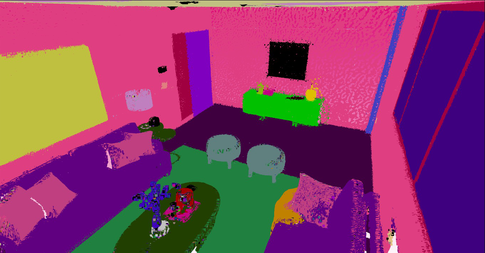

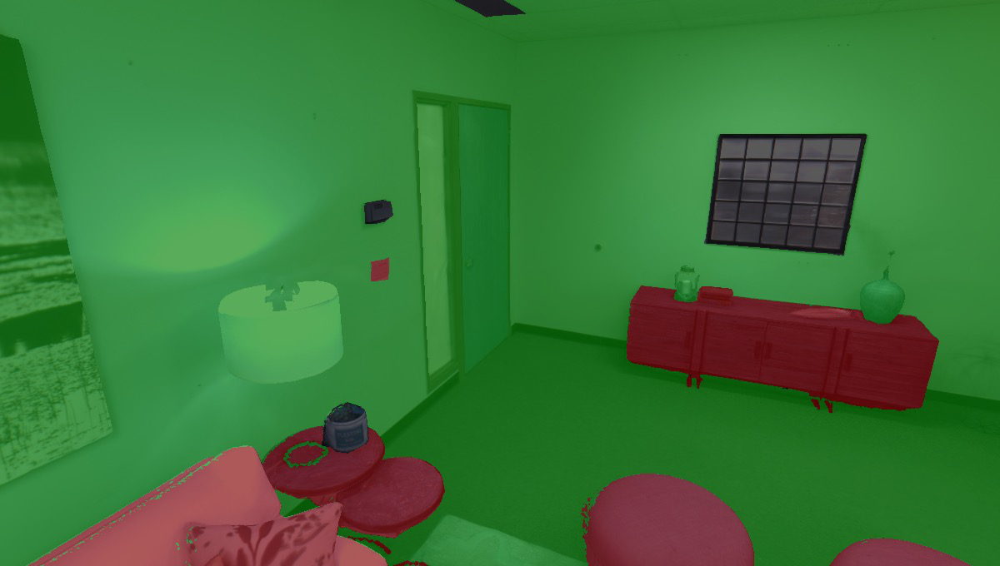

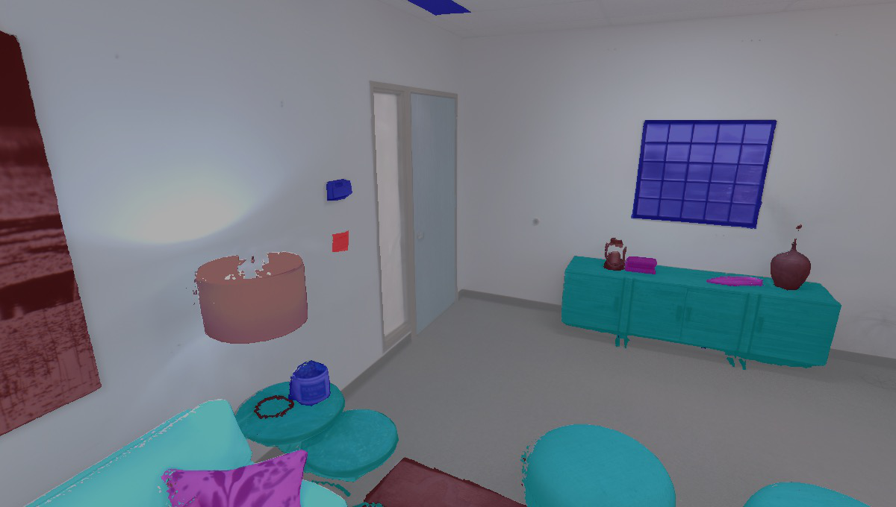

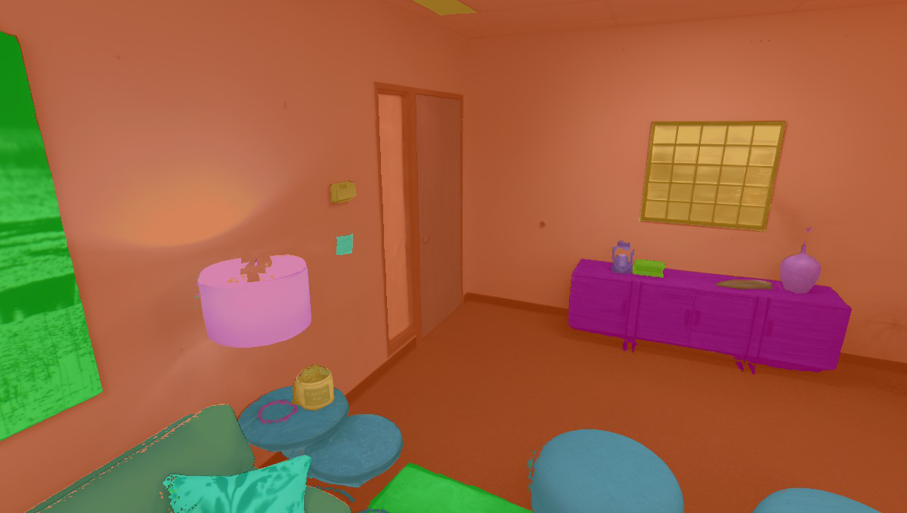

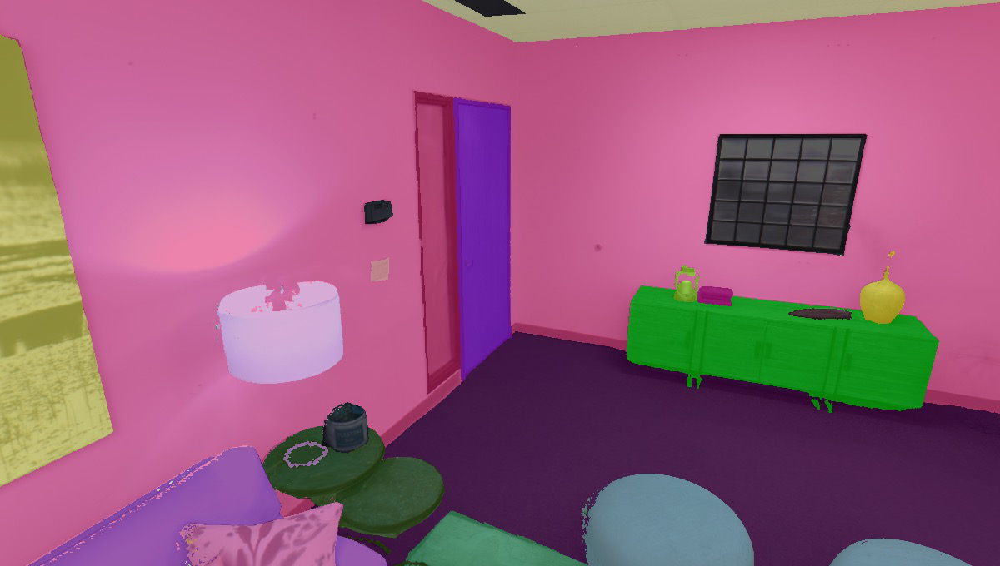

<!-- Page 2 -->
representation with supervision from pre-trained foundation
models to produces a 3D semantic embedding feature map.
Unlike flat representations, semantic information naturally
organises into a hierarchical structure of classes, as illustrated
in Fig. 1. This hierarchical relationship can be effectively
represented as a tree structure, allowing for efficient encoding
of extensive information with a relatively small number of
nodes, i.e., a compact code. For instance, a binary tree with a
depth of 10 can cover 210 classes, enabling the representation
of 1,024 classes using just symbolic 20 codes (i.e., 2×10,
through 2-dimensional Softmax coding for each level).
Building on this concept, we propose Hier-SLAM, a Se-
mantic Gaussian Splatting SLAM leveraging the hierarchical
categorical representation for semantic information. Specifi-
cally, taking both semantic and geometric attributes into con-
sideration, a well-designed tree is established with the help of
Large Language Models (LLMs), which significantly reduces
memory usage and training time, effectively compressing
data while preserving its physical meaning. Additionally, we
introduce a hierarchical loss for the proposed representation,
incorporating both inter-level and cross-level optimizations.
This strategy facilitates a coarse-to-fine understanding of
scenes, which aligns well with real-world applications, par-
ticularly those involving observations from distant to nearby
views. Furthermore, we enhance and refine the Gaussian
SLAM to improve both performance and running speed.
The main contributions of this paper include:
1) We propose a novel hierarchical representation that
encodes semantic information by considering both geometric
and semantic aspects, with assistance from LLMs. This tree
coding effectively compacts the semantic information while
preserving its physical hierarchical structure.
2) We introduce a novel optimization loss for the se-
mantic hierarchical representation, incorporating both inter-
level and cross-level optimizations, ensuring comprehensive
refinement across all levels of the hierarchical coding.
3) We conduct experiments on both synthetic and real-
world datasets. The results demonstrate that our SLAM
system outperforms existing methods in localization and
mapping performance while achieving faster speeds. For
semantic understanding, our method achieves on-par se-
mantic rendering performance while significantly reducing
storage and training time. In complex real-world scenes,
our approach, for the first time, demonstrates a valuable
scaling-up capability, successfully handling more than 500
semantic classes—an important step toward the semantic
understanding of complex environments.
II. RELATED WORK
a) 3D Gaussian Splatting SLAM: 3D Gaussian Splat-
ting has emerged as a promising 3D representation recently.
With the usage of 3D Gaussian Splatting, SplaTAM [9]
leverages silhouette guidance for pose estimation and map
reconstruction in RGBD SLAM systems. MonoGS [10] im-
plements both monocular and RGBD SLAM using 3D Gaus-
sian Splatting. 3D Gaussian Splatting has demonstrated its
strong capabilities across various Gaussian Splatting SLAM
tasks [11], [12], [13]. However, integrating semantic under-
standing into SLAM tasks makes optimization particularly
challenging, as it combines three high-dimensional optimiza-
tion problems with different value ranges and convergence
characteristics that to be optimized jointly. In this paper, we
leverage hierarchical coding for semantic information and
employ a suitable optimization strategy to ensure effective
optimization across the hierarchical representation.
b) Neural Implicit Semantic SLAM: Semantic SLAM
has been a longstanding research topic in the field of
computer vision and robotics [4], [18], [19], [20], [21].
Many works [5], [22], [23] have utilized the neural implicit
representation for semantic mapping and localization tasks.
DNS-SLAM [5] leverages 2D semantic priors combined
with a coarse-to-fine geometry representation to integrate
semantic information into the established map. SNI-SLAM
[22] incorporates appearance, geometry, and semantic fea-
tures into a collaborative feature space to enhance the
robustness of the entire SLAM system. However, these
methods are constrained by the limitations of neural implicit
map representations, which is known to suffer from slow
convergence, which leads to inefficiency and performance
degradation when combined with semantic objectives [24],
[25]. In contrast, Gaussian Splatting offers advantages with
its fast rendering performance and high-density reconstruc-
tion quality at the same time.
c) Gaussian Splatting Semantic SLAM: With the re-
cent emergence of 3D Gaussian Splatting, SGS-SLAM [16]
integrated additional RGB 3-channels to learn semantic
visualization map, rather than true semantic understanding.
SemGauss-SLAM [17] employs a flat semantic representa-
tion, supervised by a large pre-trained foundation model.
However, these methods neglect the natural hierarchical
characteristics of the real world. Furthermore, the reliance
on large foundation models increases the complexity of
the neural network and its computational demands, with
performance heavily dependent on the embeddings from
these pre-trained models. In this paper, we introduce a
simple yet effective hierarchical representation for semantic
understanding, eliminating the dependency on foundation
models, enabling a coarse-to-fine semantic understanding for
the unknown environments.
III. METHOD
A. Hierarchical representation
Tree Parametrization. We propose a hierarchical tree
representation to encode semantic information, represented
as G = (V,E). The node set V = ∪L
l=0 {vl} comprises all
classes, where {vl} represents the set of nodes at the l-
th level of the tree. The edge set E = ∪L−1
m=0 {em} captures
the subordination relationships, encompassing both semantic
attribution and geometric prior knowledge. Similarly we use
the subscript m to indicate the level of the tree. In this way,
the i-th semantic class gi, regarded as a single leaf node in
the tree view, can be expressed hierarchically as:
gi = {vi
l,ei
m | l = 0,1,...,L; m = 0,1,...,L−1},
(1)

<!-- Page 3 -->
Mapping
Tracking
3D Semantic Gaussian Splatting map 
Losses
Render
Input
…
…
…
LLM
Validator
l = 0
l = 1
l = 2
l = 3
Leaf-to-root generation
Hierarchical representation:
Loop-based critic operation
𝑳𝐈𝐧𝐭𝐞𝐫
𝟎
𝑳𝐈𝐧𝐭𝐞𝐫
𝟏
𝑳𝐈𝐧𝐭𝐞𝐫
𝟐
𝑳𝐈𝐧𝐭𝐞𝐫
𝟑
𝑳𝐂𝐫𝐨𝐬𝐬
𝑳𝐈𝐧𝐭𝐞𝐫
l = 0
l = 1
l = 2
l = 3
…
Hierarchical representation
Fig. 2.
Left: Overview of the Hier-SLAM pipeline. The global 3D Gaussian map is initialized with the first image. The system then alternates between
Tracking and Mapping steps as new frames are processed (see Section III-C). Top Right: Hierarchical representation of semantic information. The Tree
Generation process uses a Loop-based critic operation, including a LLM and a Validator, to create a tree coding from leaf-to-root. This tree is used to
establish hierarchical coding for each Gaussian primitive (see Section III-A). Additionally, a novel loss combining Inter-level Loss LInter and Cross-level
Loss LCross is proposed for hierarchical semantic optimization (see Section III-B). Bottom Right: An example of hierarchical semantic rendering.
which corresponds to the root-to-leaf path: gi = vi
0
e0
−→
vi
1
e1
−→···
eL−2
−−→vi
L−1
eL−1
−−→vi
L. Take a leaf node class
’Wall’
as
an
example,
a
4-level
tree
coding
can
be as:

vwall
0
: Background
	
→

vwall
1
: Structure
	
→

vwall
2
: Plane
	
→

vwall
3
: Wall
	
. Among these nodes, the
relationships such as ‘include’ and ‘possessing’ are repre-
sented by the edge information em :→. In this way, any
semantic concept can be coded in a progressive, hierarchical
manner, incorporating both semantic and geometric perspec-
tives. Moreover, the standard flat representation can be seen
as a single-level tree coding from the hierarchical viewpoint.
LLM-based Tree Generation. We utilize Large Language
Models (LLMs), GPT-4o-mini [26], to generate the hierar-
chical tree representation due to its efficient performance.
Specifically, a set of semantic class labels is provided to the
LLMs, which iteratively clusters them into groups, regarding
as the coarser-level classes. This process is repeated layer
by layer from leaf to root, ultimately forming a complete
hierarchical tree. However, when dealing with a large number
of semantic class labels in a complex environment, the results
are often unsatisfactory because the LLM tends to cluster
only a subset of the input classes, leaving out many classes
and incorrectly including unseen classes in the hierarchy.
To address this issue, we employ a loop-based critic opera-
tion, including an LLM followed by a validator. Specifically,
during the clustering process from the l-level to the (l −1)-
level, the l-level semantic classes {vl} are used as the prompt
input to the LLM. The LLM then generates the clustering
result

v′
l
	
→

v′
l−1
	
. It is important to note that the cluster-
ing result

v′
l
	
may differ from the input {vl}, as the LLM
may introduce unseen classes or omit certain semantic labels.
By comparing the clustering result

v′
l
	
and the prompt
input {vl}, the validator will identify three components: the
successfully grouped nodes

v′
l
	success, the unseen classes

v′
l
	unseen, and the omitted semantic nodes

v′
l
	omitted. The
successfully grouped nodes

v′
l
	success will be retained, while
the unseen classes

v′
l
	unseen will be removed. Next, the
omitted nodes

v′
l
	omitted are used as the input prompt for
the LLM to do the clustering in the subsequent iteration. At
the same iteration, the clustering nodes

v′
l−1
	
generated
by previous iteration are also provided to the LLM as a
reference, suggesting that

v′
l
	omitted can either be clustered
into the previously generated clusters or form new groups.
This procedure loops until

v′
l
	omitted = /0, indicating that
no classes are omitted. In this way, we obtain all clustering
results from the l-level to the (l −1)-level. The proposed
loop-based critic operation progresses from leaf to root,
terminating when the LLM generates fewer than θ clusters.
We set θ = 4, ensuring that the number of nodes in the finest
level remains small. It is worth noting that the tree generation
is performed offline before the SLAM operation.
Tree Encoding. For each 3D Gaussian primitive, its
semantic embedding h is composed of the embedding hl of
each level:
h = f(hl) ∈RN,
hl ∈Rn,
l = 0,1,...,L
(2)
where we use l to represents l-th level of the tree and f
stands for the concatenation operation. As shown in Fig. 2,
the overall dimension of the hierarchical embedding is the
sum of the dimensions across all levels N = ∑L
l=0 n, where the
dimension n of each embedding hl is equal to the maximum
number of nodes at the l-th level.
B. Hierarchical loss
To fully optimize the hierarchical semantic coding effec-
tively, we propose the hierarchical loss as follows:
LSemantic = ω1LInter +ω2LCross
(3)
where LInter and LCross stands for the Inter-level loss and
Cross-level loss respectively. We use ω1 and ω2 to balance
the weights between each loss. The Inter-level loss LInter is
employed within each level:
LInter =
L
∑
l=0
Lce(softmax(hl),P l)
(4)

#### Page 3 Images

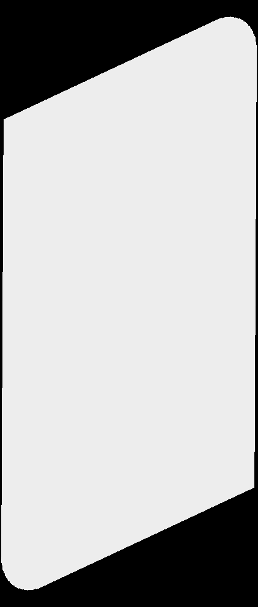

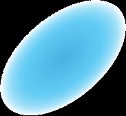

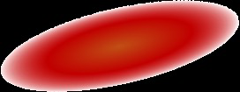

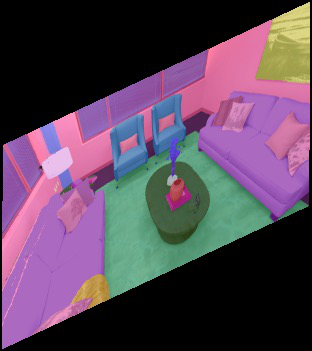

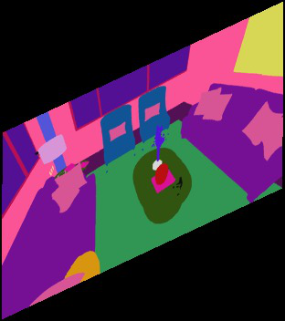

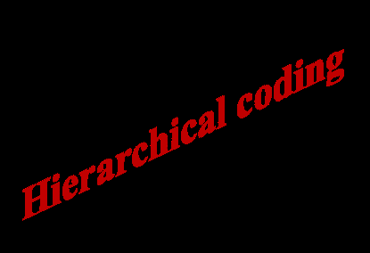

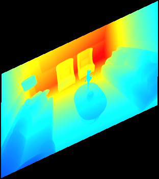

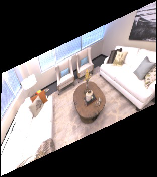

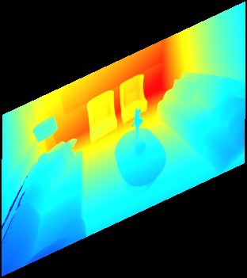

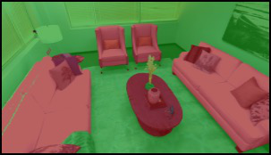

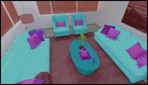

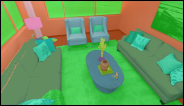

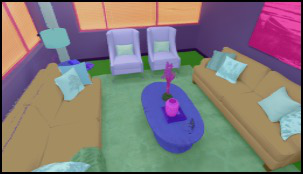

<!-- Page 4 -->
where Lce represents the cross-entropy loss, and P l stands for
the semantic ground truth for the l-th level. In contrast, the
Cross-level loss is computed based on the entire hierarchical
coding. First, a linear layer F shared between all Gaussian
primitives is used to transform the hierarchical embeddings
into flat coding. Following is a softmax(F(h)) operation to
convert the embeddings into probabilities. The Cross-level
loss LCross is then defined as follows:
LCross = Lce (softmax(F(h)),P )
(5)
where P denotes semantic ground truth in flat representation.
C. Gaussian Splatting Semantic Mapping and Tracking
The pipeline of our Hier-SLAM is illustrated in Fig. 2.
We will detail the submodules in this subsection.
Semantic 3D Gaussian representation. We adopt Gaus-
sian primitives with hierarchical semantic embedding for the
scene representation. Each semantic Gaussian is represented
as the combination of color c, the center position µ, the
radius r, the opacity o, and its semantic embedding h. And
the influence of each Gaussian according to the standard
Gaussian equation is G = o exp

−||X−µ||2
2r2

, where X stands
for the 3D point.
Following [6], each semantic 3D Gaussian primitive is
projected to the 2D image space using the tile-based dif-
ferentiable α-compositing rendering. The semantic map is
rasterized as follows:
H =
n
∑
i=1
hiGi(X)Ti
with
Ti =
i−1
∏
j=1
(1−Gj(X))
(6)
The rendered color image C, depth image D, and the silhou-
ette image S are defined as follows:
C =
n
∑
i=1
ciGi(X)Ti, D =
n
∑
i=1
diGi(X)Ti, S =
n
∑
i=1
Gi(X)Ti
(7)
In contrast to previous work [9], which employs separate
forward and backward rendering modules for different pa-
rameters, we adopt unified forward and backward modules
that handle all parameters, including semantic, color, depth,
and silhouette images, significantly improving the overall
efficiency of the SLAM system.
Tracking. The tracking step aims to estimate each frame’s
pose. We adopt constant velocity model to initialize the
pose of every incoming frame, following a pose optimization
while fixing the global map, using the rendering color and
depth losses:
LTrack = M
w1LDepth +w2LColor

(8)
where LDepth and LColor stands for the L1-loss for the
rendered depth and color information. We use weights w1
and w2 to balance the two losses and the optimization is only
performed on the silhouette-visible image M = (S > δ).
Mapping. The global map information, including the
semantic information, is optimized in the mapping procedure
with fixed camera poses. The optimization losses include the
depth, color, and the semantic losses:
LMap = w3MLDepth +w4L′
Color +w5LSemantic
(9)
where LSemantic is the proposed semantic loss introduced in
Section III-B, and L′
Color is the weighted sum of SSIM color
loss and L1-Loss. And we use w3, w4, and w5 for balancing
different terms.
IV. EXPERIMENTS
A. Experiment settings
The experiments are conducted on both synthetic and real-
world datasets, including 6 scenes from ScanNet [28] and
8 sequences from Replica [27]. Following the evaluation
metrics used in previous SLAM works [9], [29], we leverage
ATE RMSE (cm) to assess SLAM tracking accuracy. For
mapping performance, we use Depth L1 (cm) to evalu-
ate accuracy. To assess image rendering quality, we adopt
PSNR (dB), SSIM, and LPIPS metrics. Similar to previous
methods [17], [5], [22], due to the lack of direct metrics
for evaluating 3D semantic understanding in 3D Gaussian
Splatting representations, we rely on 2D semantic segmen-
tation performance, measured by mIoU (mean Intersection
over Union across all classes), to reflect global semantic
information. To demonstrate the improved efficiency, we also
measure the running time of the proposed SLAM method.
We compare our method against state-of-the-art dense vi-
sual SLAM approaches, including both NeRF-based and
3D Gaussian SLAM methods, to highlight its effectiveness.
Additionally, we include state-of-the-art semantic SLAM
techniques, covering both NeRF-based and Gaussian-based
methods, to showcase our hierarchical semantic understand-
ing and scaling-up capability. The experiments are conducted
in the Nvidia L40S GPU. For experimental settings, the
semantic embedding of each Gaussian primitive is initialized
randomly. We set semantic optimization loss weights ω1 and
ω2 to1.0 and 0.0, respectively, for the first η iterations, where
η is set to 15. Afterwards, ω1 and ω2 are adjusted to 1.0
and 5.0, respectively. This means that we first use the Inter-
level loss to initialize the hierarchical coding, followed by
incorporating the Cross-level loss to refine the embedding.
For tracking loss, we set δ = 0.99, w1 = 1.0, w2 = 0.5. For
mapping, we set w3 = 1.0, w4 = 0.5, w5 = 0.2, respectively.
B. SLAM Performance
Tracking Accuracy. We present the tracking performance
on the Replica [27] and ScanNet [28] datasets in Tab. I and
Tab. II, respectively. On the Replica dataset, our proposed
method surpasses all current approaches. For the ScanNet
dataset, the performance of all methods is lower than on
the synthetic dataset due to the noisy, sparse depth sensor
input and the limited color image quality caused by motion
blur. We evaluate all six sequences, showing that our method
performs comparably to state-of-the-art methods [9], [29].
Mapping Performance. In Tab. III, we evaluate the
mapping performance using the L1 depth loss in Replica
[27]. The results show that our method surpasses all existing
approaches, demonstrating superior mapping capabilities.
Rendering Quality. Similar to Point-SLAM [34] and
NICE-SLAM [29], we evaluate rendering quality on in-
put
views
from
8
sequences
of
the
Replica
dataset
[27]. The evaluation uses average PSNR, SSIM, and
LPIPS metrics. Our methods achieves superior performance

<!-- Page 5 -->
Ours
GT
Coarse-to-fine
Fig. 3.
Visualization of our semantic rendering performance on the Replica [27] dataset. The first four rows demonstrate rendered semantic segmentation
in a coarse-to-fine manner. The fifth row exhibits the finest semantic rendering, equivalent to the flat representation with 102 original semantic classes
from the Replica dataset. The last row visualizes the semantic ground truth for comparison.
TABLE I
LOCALIZATION PERFORMANCE ATE RMSE (CM) ON THE REPLICA
DATASET. BEST RESULTS ARE HIGHLIGHTED AS FIRST , SECOND .
Methods
Avg.
R0
R1
R2
Of0 Of1 Of2 Of3 Of4
iMap [30]
4.15
6.33 3.46 2.65 3.31 1.42 7.17 6.32 2.55
NICE-SLAM [29]
1.07
0.97 1.31 1.07 0.88 1.00 1.06 1.10 1.13
Vox-Fusion [31]
3.09
1.37 4.70 1.47 8.48 2.04 2.58 1.11 2.94
co-SLAM [32]
1.06
0.72 0.85 1.02 0.69 0.56 2.12 1.62 0.87
ESLAM [33]
0.63
0.71 0.70 0.52 0.57 0.55 0.58 0.72 0.63
Point-SLAM [34]
0.52
0.61 0.41 0.37 0.38 0.48 0.54 0.69 0.72
MonoGS [10]
0.79
0.47 0.43 0.31 0.70 0.57 0.31 0.31 3.2
SplaTAM [9]
0.36
0.31 0.40 0.29 0.47 0.27 0.29 0.32 0.55
Hier-SLAM (Ours*)
0.32
0.24 0.44 0.25 0.28 0.17 0.29 0.37 0.49
SNI-SLAM [22]
0.46
0.50 0.55 0.45 0.35 0.41 0.33 0.62 0.50
DNS SLAM [5]
0.45
0.49 0.46 0.38 0.34 0.35 0.39 0.62 0.60
SemGauss-SLAM [17]
0.33
0.26 0.42 0.27 0.34 0.17 0.32 0.36 0.49
Hier-SLAM (Ours)
0.33
0.21 0.49 0.24 0.29 0.16 0.31 0.37 0.53
Ours* represents our proposed system without semantic information.
(Hier-SLAM:
PSNR ↑: 35.70, SSIM ↑: 0.980, LPIPS ↓:
0.067) compared to the state-of-the-art approaches, where
the best performances being: (SpltaTAM [9]: PSNR ↑:
34.11, SSIM ↑: 0.968, LPIPS ↓: 0.102), and (SemGauss-
SLAM [17]: PSNR ↑: 35.03, SSIM ↑: 0.982, LPIPS ↓: 0.062).
Detail performances are provided in the Appendix.
Running time. Running times for all methods are shown
in Tab. IV. Compared to state-of-the-art dense visual SLAM
approaches, our method (Ours*) achieves up to 2.4× faster
tracking and 2.2× faster mapping than the SOTA performance
[9]. When incorporating semantic information, our method
remains efficient, leveraging hierarchical semantic coding to
achieve nearly 3× faster tracking and 1.2× faster mapping
compared with the semantic SLAM with flat semantic cod-
ing. Notably, our Hier-SLAM achieves a rendering speed
of 2000 FPS. For Hier-SLAM without semantic information,
the rendering speed increases to 3000 FPS.
C. Hierarchical semantic understanding
We conduct semantic understanding experiments in syn-
thetic dataset Replica [27] to demonstrate the comprehensive
performance of our proposed method. Replica [27] is a
synthetic indoor dataset comprising a total of 102 semantic
classes with high-quality semantic ground truth.
We establish a five-level tree to encode these original
classes hierarchically. The semantic rendering performance
is illustrated in Fig. 3, where the first five rows show the
progression from level-0 to level-4, moving from coarse to
fine understanding. The coarsest semantic rendering, i.e.,
level-0 which shown in the first row, includes segmentation
covering 4 broad classes: Background, Object, Other, and
Void. In contrast, the finest level encompasses all 102 original
semantic classes. For example, the hierarchical understanding
of the class ’Stool’ progresses from Object →Furniture →
Plane →Chair →Stool, as depicted in the second column.
From Fig. 3, we observe that our method achieves precise
semantic rendering at each level, providing a comprehensive
coarse-to-fine semantic understanding for overall scenes.
Similar to previous methods [17], [5], [22], we present
TABLE II
LOCALIZATION PERFORMANCE ATE RMSE (CM) ON THE SCANNET
DATASET. BEST RESULTS ARE HIGHLIGHTED AS
FIRST ,
SECOND ,
THIRD .
Methods
Avg.
0000
0059
0106 0169 0181 0207
NICE-SLAM [29]
10.70
12.00 14.00
7.90 10.90 13.40 6.20
Vox-Fusion [31]
26.90
68.84 24.18
8.41 27.28 23.30 9.41
Point-SLAM [34]
12.19
10.24
7.81
8.65 22.16 14.77 9.54
SplaTAM [9]
11.88
12.83 10.10 17.72 12.08 11.10 7.46
SemGauss-SLAM [17]
–
11.87
7.97
–
8.70
9.78
8.97
Hier-SLAM (Ours*)
11.80
12.83
9.57
17.54 11.54 11.78 7.55
Hier-SLAM (Ours)
11.36
11.45
9.61
17.80 11.93 10.04 7.32
Ours* represents our proposed system without semantic information.

#### Page 5 Images

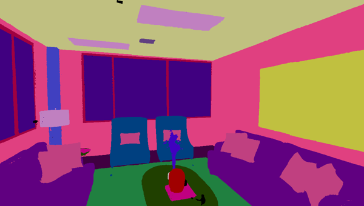

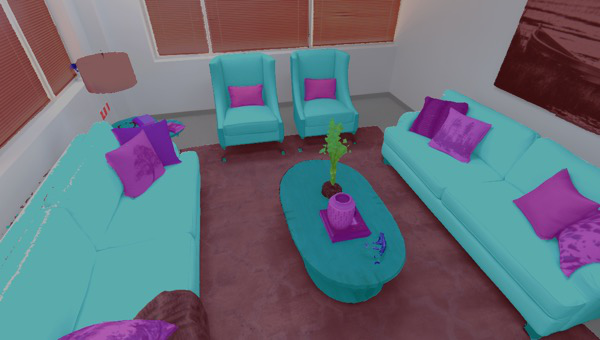

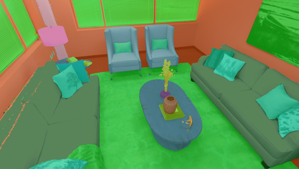

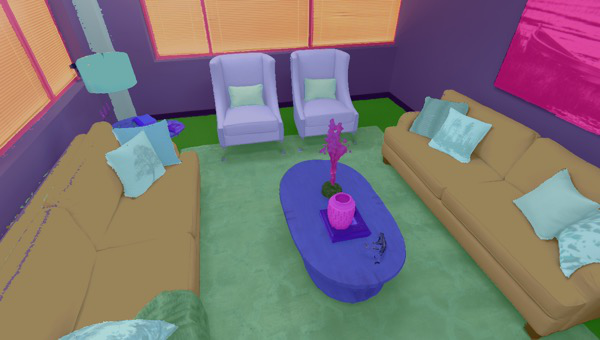

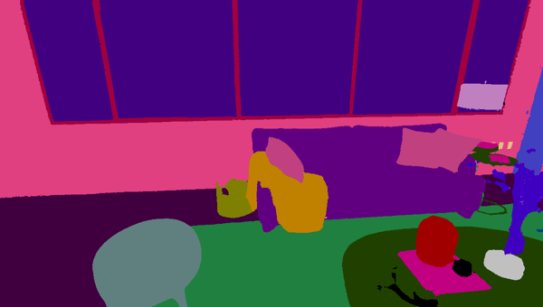

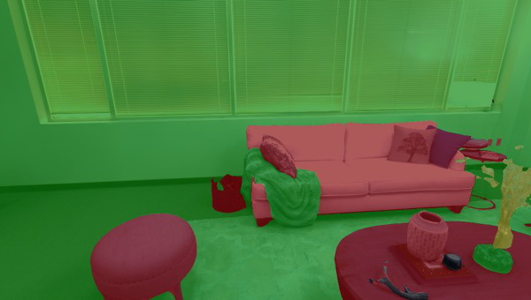

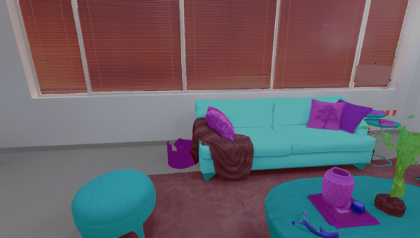

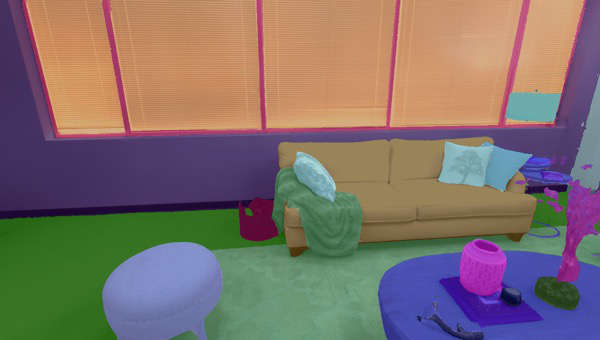

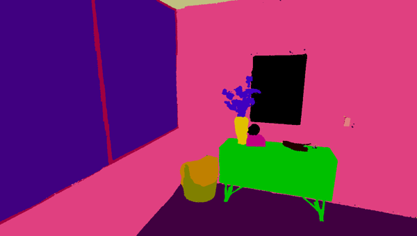

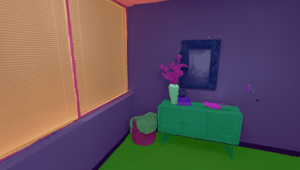

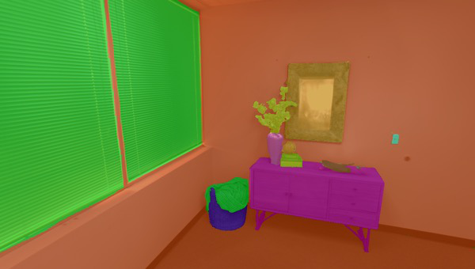

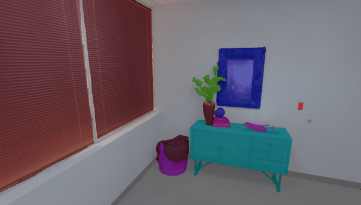

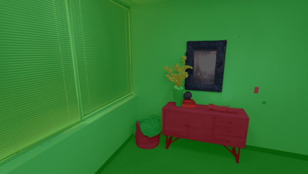

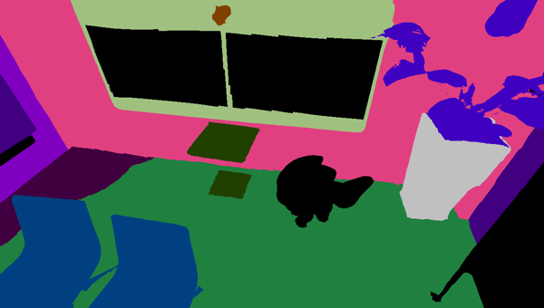

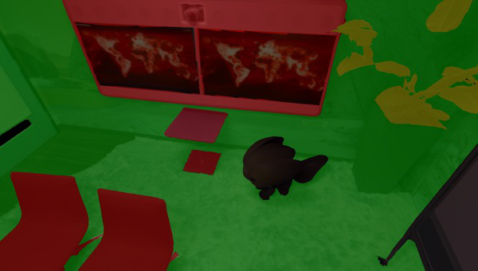

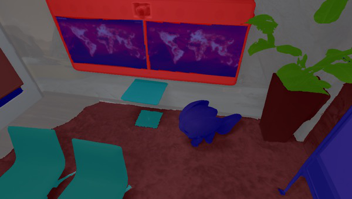

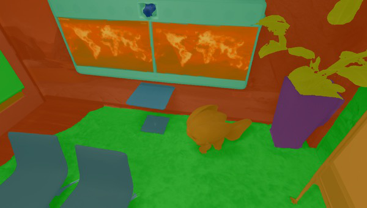

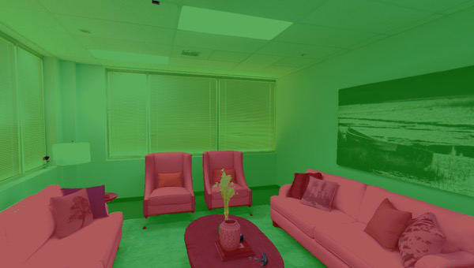

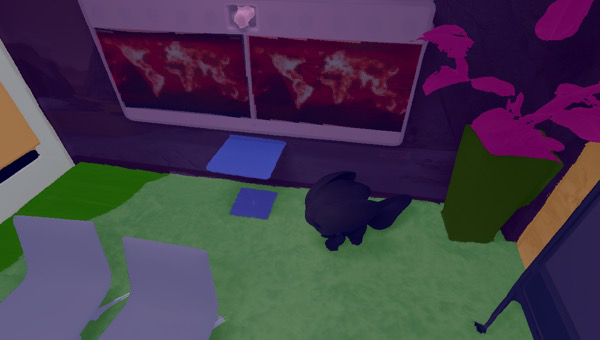

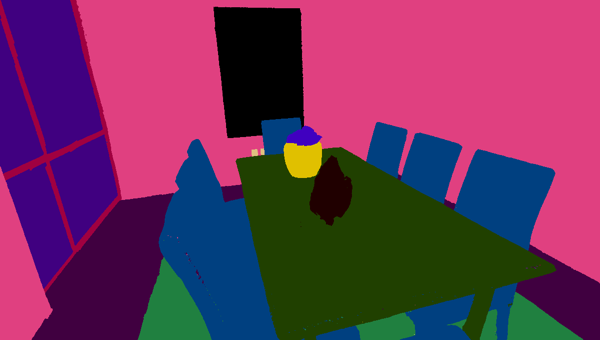

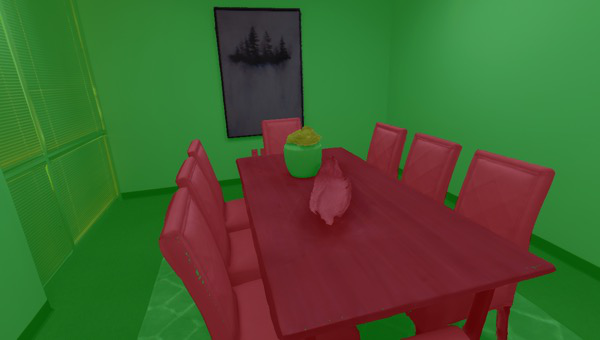

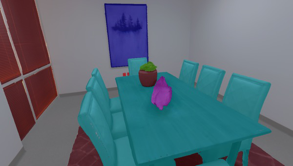

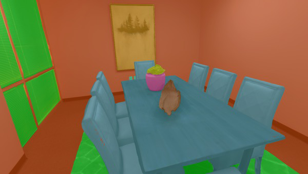

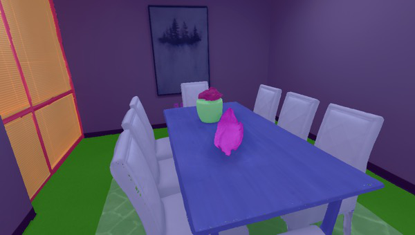

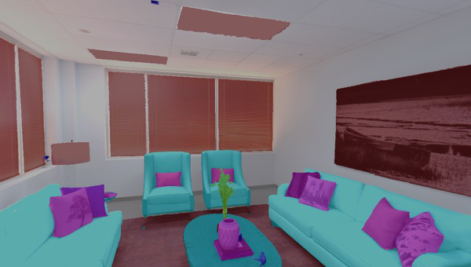

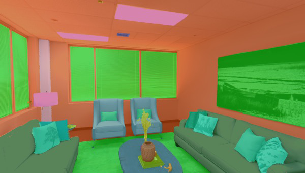

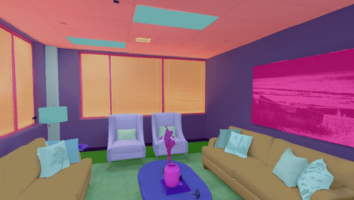

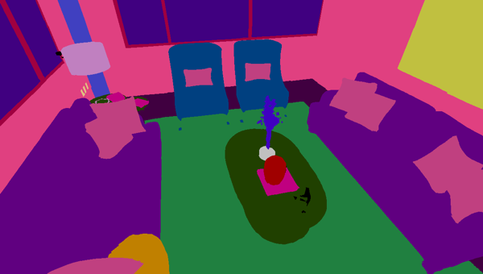

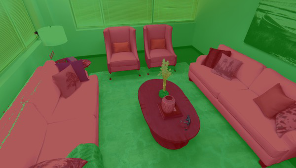

<!-- Page 6 -->
TABLE III
RECONSTRUCTION METRIC DEPTH L1 (CM) COMPARISON ON REPLICA.
BEST RESULTS ARE HIGHLIGHTED AS
FIRST ,
SECOND .
Methods
Avg. R0
R1
R2 Of0 Of1 Of2 Of3 Of4
NICE-SLAM [29]
2.97 1.81 1.44 2.04 1.39 1.76 8.33 4.99 2.01
Vox-Fusion [31]
2.46 1.09 1.90 2.21 2.32 3.40 4.19 2.96 1.61
Co-SLAM [32]
1.51 1.05 0.85 2.37 1.24 1.48 1.86 1.66 1.54
ESLAM [33]
0.95 0.73 0.74 1.26 0.71 1.02 0.93 1.03 1.18
SNI-SLAM [22]
0.77 0.55 0.58 0.87 0.55 0.97 0.89 0.75 0.97
SemGauss-SLAM [17] 0.50 0.54 0.46 0.43 0.29 0.22 0.51 0.98 0.56
Hier-SLAM (Ours)
0.49 0.58 0.40 0.40 0.29 0.19 0.51 0.95 0.57
TABLE IV
RUNTIME ON REPLICA/R0. BEST RESULTS ARE HIGHLIGHTED AS FIRST.
Methods
Tracking
Mapping
Tracking
Mapping
/Iteration (ms) /Iteration (ms) /Frame (s) /Frame (s)
NICE-SLAM [29]
122.42
104.25
1.22
6.26
SplaTAM [9]
44.27
50.07
1.77
3.00
Hier-SLAM (Ours*)
18.71
22.93
0.75
1.38
Hier-SLAM (Ours)
46.90
148.66
1.88
8.92
Hier-SLAM (Ours)
61.23
170.30
2.45
10.22
Hier-SLAM (Ours**)
168.94
204.25
6.75
12.26
First & Second block results are from NVIDIA GeForce RTX 4090
and NVIDIA L40S, respectively.
Ours* represents our proposed system without semantic information.
Ours** represents our proposed system using flat semantic encoding.
our quantitative results, evaluated in mIoU (%) across all
original semantic classes (102 classes) in Tab. V, where the
rendered semantic map is compared against the semantic
ground truth. Additionally, we also report mIoU evaluated
on a subset of semantic classes in the second block of Tab.
V. To demonstrate the efficiency of our proposed method,
we report the storage usage (MB) and runtime in the last
part of Tab. V and Tab. IV, respectively. From Tab. V, our
flat coding version achieves the best performance among all
methods, attaining an mIoU of 90.35% on all 102 semantic
classes, at the cost of large storage usage. In contrast,
the hierarchical representation achieves a competitive mIoU
while requiring only 910.50 MB of storage, which is 66%
less than the flat version. Since works [22], [17], [16] report
mIoU only on a subset of classes, making direct comparison
unfair, we report the same evaluation procedure as [16]. Our
method achieves an mIoU of 95.58% with a storage usage
of 910.50 MB, demonstrating superior semantic rendering
performance compared to state-of-the-art methods [22], [16]
while maintaining efficient storage usage. Meanwhile, [17]
benefits significantly from a large foundation model pre-
trained on much larger and more diverse datasets, making the
comparison less fair. In terms of training time, Tab. IV shows
that our proposed method requires only 36% of the time for
frame tracking and 83% for frame mapping compared to the
flat version. Overall, our method achieves performance on
par with SOTA semantic SLAM while significantly reducing
both storage requirements and training time, benefiting from
the proposed hierarchical semantic representation.
D. Scaling up capability
To demonstrate the scaling-up capability, we apply our
proposed method to the real-world complex dataset, ScanNet
[28], which covers up to 550 unique semantic classes. Unlike
Replica [27], where the semantic ground truth is synthesized
TABLE V
SEMANTIC PERFORMANCE MIOU (%) AND PARAMETER USAGE (MB)
ON REPLICA. RESULTS ARE HIGHLIGHTED AS
FIRST ,
SECOND .
Methods
Avg.
R0
R1
R2
Of0
mIoU (%)
total 102 classes
NIDS-SLAM [23]
82.37
82.45 84.08 76.99 85.94
DNS-SLAM [5]
84.77
88.32 84.90 81.20 84.66
Hier-SLAM (Ours**)
90.35
91.21 90.62 89.11 90.45
Hier-SLAM (Ours)
76.44
76.62 78.31 80.39 70.43
mIoU (%)
subset classes
SNI-SLAM [22]
87.41
88.42 87.43 86.16 87.63
SemGauss-SLAM [17]
96.34
96.30 95.82 96.51 96.72
SGS-SLAM [16]
92.72
92.95 92.91 92.10 92.90
Hier-SLAM (Ours†)
95.58
95.25 95.81 95.73 95.52
Param (MB)
Hier-SLAM (Ours**)
2662.25 2355 3072 2560 2662
Hier-SLAM (Ours)
910.50
793
1126
843
880
Ours** represents our proposed system using flat semantic encoding.
Ours† represents our method with a hierarchical representation,
evaluated on a subset of semantic classes, consistent with [16].
First & Second block mIou (%) results are evaluated over a total of
102 semantic classes and a subset of classes, respectively.
Coarse to fine
Localization-ATE-RMSE: 13.67 cm    PSNR: 22.30    MS-SSIM: 0.798    LPIPS: 0.256    Depth-L1-error: 6.92 cm
Fig. 4.
Visualization of the established semantic 3D map across multiple
levels, demonstrating a coarse-to-fine semantic understanding of the com-
plex scene. The bottom of the figure displays localization, mapping, and
rendering performance, providing a comprehensive overview.
from a global world model and can be considered ideal,
the semantic annotations in ScanNet are significantly noisier.
Additionally, the dataset features noisy depth sensor inputs
and blurred color images, making semantic understanding
particularly challenging in this scenes. Using the flat seman-
tic representation cannot even run successfully due to storage
limitations. In contrast, we establish the hierarchical tree with
the assistance of LLMs, which guide the compaction of the
coding from the original 550 semantic classes to 72 semantic
codings, resulting in over 7 times reduction in coding usage.
As visualized in Fig. 4, our estimated 3D global semantic
map at different levels demonstrates a coarse-to-fine semantic
understanding, showcasing our method’s scaling-up capabil-
ity in handling this complex scene.
V. CONCLUSIONS
We present Hier-SLAM, a novel semantic 3D Gaussian
Splatting SLAM method with a hierarchical categorical rep-
resentation, which can generate explicit global 3D semantic
label map with scaling-up capability. Specifically, we in-
troduce a compact hierarchical representation for semantic
encoding, integrating it into 3D Gaussian Splatting with
LLMs assistance. We further propose a novel semantic loss
for optimizing hierarchical semantic information across inter-
and cross-levels. Our refined SLAM system achieves superior
or on-par performance with existing dense SLAM methods
in tracking, mapping, and semantic understanding while run-
ning faster and significantly reducing storage. Hier-SLAM
delivers exceptional rendering at up to 2,000/3,000 FPS
(with/without semantics) and effectively handles complex
real-world scenes, demonstrating strong scalability.

#### Page 6 Images

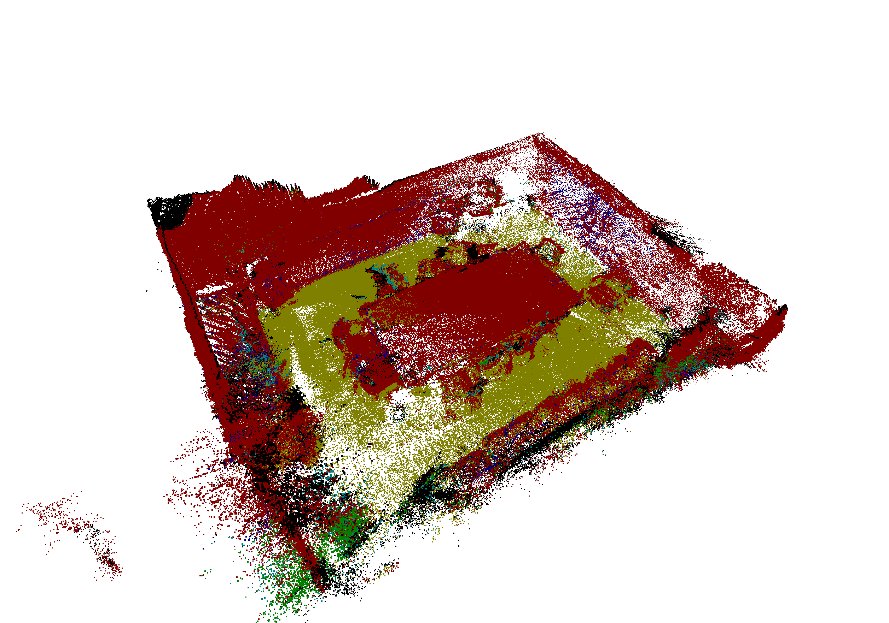

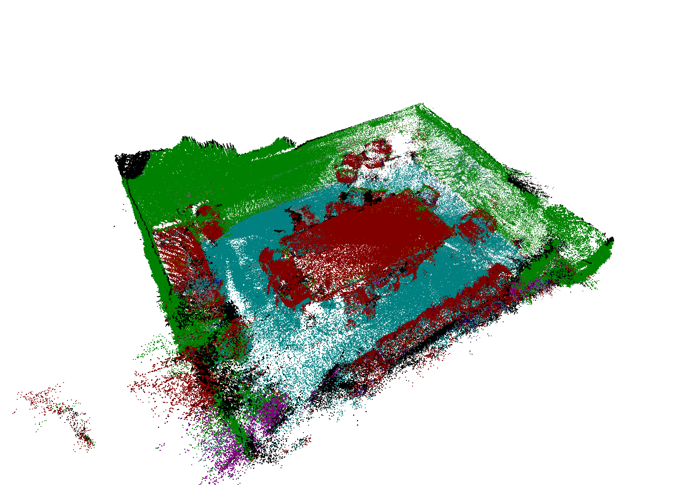

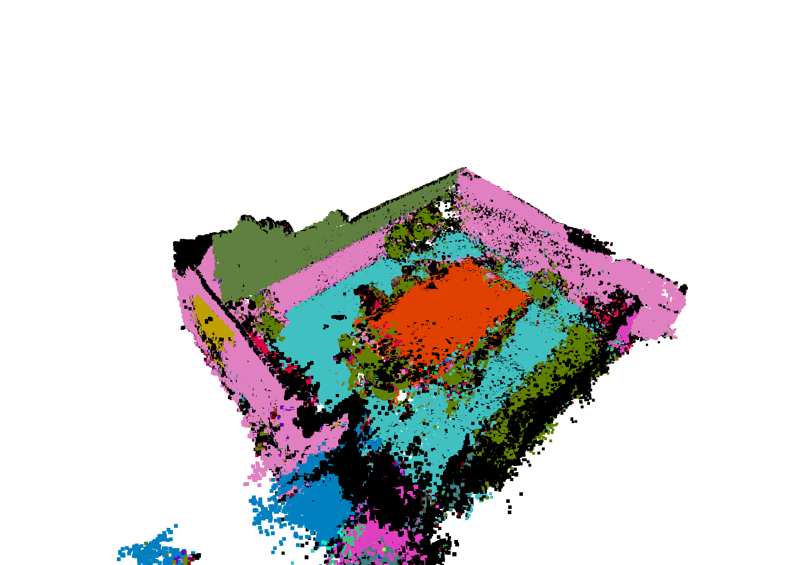

<!-- Page 7 -->
REFERENCES
[1] Lionel Heng, Dominik Honegger, Gim Hee Lee, Lorenz Meier, Petri
Tanskanen, Friedrich Fraundorfer, and Marc Pollefeys. Autonomous
visual mapping and exploration with a micro aerial vehicle. Journal
of Field Robotics, 31(4):654–675, 2014.
[2] Henning Lategahn, Andreas Geiger, and Bernd Kitt. Visual slam for
autonomous ground vehicles. In Proceedings of the IEEE International
Conference on Robotics and Automation, pages 1732–1737. IEEE,
2011.
[3] Denis Chekhlov, Andrew P Gee, Andrew Calway, and Walterio Mayol-
Cuevas. Ninja on a plane: Automatic discovery of physical planes for
augmented reality using visual slam. In Proceedings of the IEEE/ACM
International Symposium on Mixed and Augmented Reality, pages 1–4.
IEEE Computer Society, 2007.
[4] Yun Chang, Yulun Tian, Jonathan P How, and Luca Carlone. Kimera-
multi: a system for distributed multi-robot metric-semantic simul-
taneous localization and mapping.
In Proceedings of the IEEE
International Conference on Robotics and Automation, pages 11210–
11218. IEEE, 2021.
[5] Kunyi Li, Michael Niemeyer, Nassir Navab, and Federico Tombari.
Dns slam: Dense neural semantic-informed slam.
arXiv preprint
arXiv:2312.00204, 2023.
[6] Bernhard Kerbl, Georgios Kopanas, Thomas Leimk¨uhler, and George
Drettakis. 3d gaussian splatting for real-time radiance field rendering.
ACM Transactions on Graphics, 42(4):139–1, 2023.
[7] Zehao Yu, Anpei Chen, Binbin Huang, Torsten Sattler, and Andreas
Geiger. Mip-splatting: Alias-free 3d gaussian splatting. In Proceedings
of the IEEE International Conference on Computer Vision and Pattern
Recognition, pages 19447–19456, June 2024.
[8] Guanjun Wu, Taoran Yi, Jiemin Fang, Lingxi Xie, Xiaopeng Zhang,
Wei Wei, Wenyu Liu, Qi Tian, and Xinggang Wang.
4d gaussian
splatting for real-time dynamic scene rendering. In Proceedings of
the IEEE International Conference on Computer Vision and Pattern
Recognition, pages 20310–20320, June 2024.
[9] Nikhil Keetha, Jay Karhade, Krishna Murthy Jatavallabhula, Geng-
shan Yang, Sebastian Scherer, Deva Ramanan, and Jonathon Luiten.
Splatam: Splat, track & map 3d gaussians for dense rgb-d slam. In
Proceedings of the IEEE International Conference on Computer Vision
and Pattern Recognition, 2023.
[10] Hidenobu Matsuki, Riku Murai, Paul HJ Kelly, and Andrew J Davison.
Gaussian splatting slam. In Proceedings of the IEEE International
Conference on Computer Vision and Pattern Recognition, pages
18039–18048, 2024.
[11] Chi Yan, Delin Qu, Dan Xu, Bin Zhao, Zhigang Wang, Dong Wang,
and Xuelong Li.
Gs-slam: Dense visual slam with 3d gaussian
splatting. In Proceedings of the IEEE International Conference on
Computer Vision and Pattern Recognition, pages 19595–19604, 2024.
[12] Huajian Huang, Longwei Li, Hui Cheng, and Sai-Kit Yeung. Photo-
slam: Real-time simultaneous localization and photorealistic mapping
for monocular stereo and rgb-d cameras. In Proceedings of the IEEE
International Conference on Computer Vision and Pattern Recogni-
tion, pages 21584–21593, 2024.
[13] Vladimir Yugay, Yue Li, Theo Gevers, and Martin R Oswald.
Gaussian-slam: Photo-realistic dense slam with gaussian splatting.
arXiv preprint arXiv:2312.10070, 2023.
[14] Tao Lu, Mulin Yu, Linning Xu, Yuanbo Xiangli, Limin Wang, Dahua
Lin, and Bo Dai.
Scaffold-gs: Structured 3d gaussians for view-
adaptive rendering. In Proceedings of the IEEE International Con-
ference on Computer Vision and Pattern Recognition, pages 20654–
20664, 2024.
[15] Yihang Chen, Qianyi Wu, Jianfei Cai, Mehrtash Harandi, and Weiyao
Lin.
Hac: Hash-grid assisted context for 3d gaussian splatting
compression. Proceedings of the European conference on computer
vision, 2024.
[16] Mingrui Li, Shuhong Liu, and Heng Zhou. Sgs-slam: Semantic gaus-
sian splatting for neural dense slam. arXiv preprint arXiv:2402.03246,
2024.
[17] Siting Zhu, Renjie Qin, Guangming Wang, Jiuming Liu, and Hesheng
Wang. Semgauss-slam: Dense semantic gaussian splatting slam. arXiv
preprint arXiv:2403.07494, 2024.
[18] Boying Li, Danping Zou, Yuan Huang, Xinghan Niu, Ling Pei, and
Wenxian Yu. Textslam: Visual slam with semantic planar text features.
IEEE Transactions on Pattern Analysis and Machine Intelligence,
2023.
[19] Antoni Rosinol, Marcus Abate, Yun Chang, and Luca Carlone.
Kimera: an open-source library for real-time metric-semantic local-
ization and mapping.
In Proceedings of the IEEE International
Conference on Robotics and Automation, pages 1689–1696. IEEE,
2020.
[20] Boying Li, Danping Zou, Daniele Sartori, Ling Pei, and Wenxian
Yu. Textslam: Visual slam with planar text features. In 2020 IEEE
International Conference on Robotics and Automation (ICRA), pages
2102–2108. IEEE, 2020.
[21] Muhammad Sualeh and Gon-Woo Kim. Simultaneous localization and
mapping in the epoch of semantics: a survey. International Journal
of Control, Automation and Systems, 17(3):729–742, 2019.
[22] Siting Zhu, Guangming Wang, Hermann Blum, Jiuming Liu, Liang
Song, Marc Pollefeys, and Hesheng Wang. Sni-slam: Semantic neural
implicit slam. In Proceedings of the IEEE International Conference
on Computer Vision and Pattern Recognition, 2024.
[23] Yasaman Haghighi, Suryansh Kumar, Jean-Philippe Thiran, and Luc
Van Gool.
Neural implicit dense semantic slam.
arXiv preprint
arXiv:2304.14560, 2023.
[24] Tao Hu, Shu Liu, Yilun Chen, Tiancheng Shen, and Jiaya Jia. Effi-
cientnerf efficient neural radiance fields. In Proceedings of the IEEE
International Conference on Computer Vision and Pattern Recogni-
tion, pages 12902–12911, June 2022.
[25] Jeffrey Yunfan Liu, Yun Chen, Ze Yang, Jingkang Wang, Sivabalan
Manivasagam, and Raquel Urtasun.
Real-time neural rasterization
for large scenes.
In Proceedings of the IEEE/CVF International
Conference on Computer Vision, pages 8416–8427, October 2023.
[26] Gpt-4o-mini, 2024. https://platform.openai.com/docs/
models/gpt-4o-mini.
[27] Julian Straub, Thomas Whelan, Lingni Ma, Yufan Chen, Erik Wij-
mans, Simon Green, Jakob J Engel, Raul Mur-Artal, Carl Ren, Shobhit
Verma, et al. The replica dataset: A digital replica of indoor spaces.
arXiv preprint arXiv:1906.05797, 2019.
[28] Angela Dai, Angel X. Chang, Manolis Savva, Maciej Halber, Thomas
Funkhouser, and Matthias Niessner.
Scannet: Richly-annotated 3d
reconstructions of indoor scenes.
In Proceedings of the IEEE In-
ternational Conference on Computer Vision and Pattern Recognition,
July 2017.
[29] Zihan Zhu, Songyou Peng, Viktor Larsson, Weiwei Xu, Hujun Bao,
Zhaopeng Cui, Martin R Oswald, and Marc Pollefeys.
Nice-slam:
Neural implicit scalable encoding for slam.
In Proceedings of
the IEEE International Conference on Computer Vision and Pattern
Recognition, pages 12786–12796, 2022.
[30] Edgar Sucar, Shikun Liu, Joseph Ortiz, and Andrew J Davison. imap:
Implicit mapping and positioning in real-time. In Proceedings of the
IEEE/CVF International Conference on Computer Vision, pages 6229–
6238, 2021.
[31] Xingrui Yang, Hai Li, Hongjia Zhai, Yuhang Ming, Yuqian Liu, and
Guofeng Zhang. Vox-fusion: Dense tracking and mapping with voxel-
based neural implicit representation. In Proceedings of the IEEE/ACM
International Symposium on Mixed and Augmented Reality, pages
499–507. IEEE, 2022.
[32] Hengyi Wang, Jingwen Wang, and Lourdes Agapito. Co-slam: Joint
coordinate and sparse parametric encodings for neural real-time slam.
In Proceedings of the IEEE International Conference on Computer
Vision and Pattern Recognition, pages 13293–13302, 2023.
[33] Mohammad Mahdi Johari, Camilla Carta, and Franc¸ois Fleuret. Eslam:
Efficient dense slam system based on hybrid representation of signed
distance fields. In Proceedings of the IEEE International Conference
on Computer Vision and Pattern Recognition, pages 17408–17419,
2023.
[34] Erik Sandstr¨om, Yue Li, Luc Van Gool, and Martin R Oswald.
Point-slam: Dense neural point cloud-based slam. In Proceedings of
the IEEE/CVF International Conference on Computer Vision, pages
18433–18444, 2023.

<!-- Page 8 -->
APPENDIX
TABLE VI
RENDERING PERFORMANCE PSNR, SSIM, LPIPS ON REPLICA. BEST RESULTS ARE HIGHLIGHTED AS
FIRST ,
SECOND .
Methods
Metrics
Avg.
room0
room1
room2
office0
office1
office2
office3
office4
Visual SLAM
NICE-SLAM [29]
PSNR ↑
24.42
22.12
22.47
24.52
29.07
30.34
19.66
22.23
24.94
SSIM ↑
0.809
0.689
0.757
0.814
0.874
0.886
0.797
0.801
0.856
LPIPS ↓
0.233
0.330
0.271
0.208
0.229
0.181
0.235
0.209
0.198
Vox-Fusion [31]
PSNR ↑
24.41
22.39
22.36
23.92
27.79
29.83
20.33
23.47
25.21
SSIM ↑
0.801
0.683
0.751
0.798
0.857
0.876
0.794
0.803
0.847
LPIPS ↓
0.236
0.303
0.269
0.234
0.241
0.184
0.243
0.213
0.199
Co-SLAM [32]
PSNR ↑
30.24
27.27
28.45
29.06
34.14
34.87
28.43
28.76
30.91
SSIM ↑
0.939
0.910
0.909
0.932
0.961
0.969
0.938
0.941
0.955
LPIPS ↓
0.252
0.324
0.294
0.266
0.209
0.196
0.258
0.229
0.236
ESLAM [33]
PSNR ↑
29.08
25.32
27.77
29.08
33.71
30.20
28.09
28.77
29.71
SSIM ↑
0.929
0.875
0.902
0.932
0.960
0.923
0.943
0.948
0.945
LPIPS ↓
0.239
0.313
0.298
0.248
0.184
0.228
0.241
0.196
0.204
SplaTAM [9]
PSNR ↑
34.11
32.86
33.89
35.25
38.26
39.17
31.97
29.70
31.81
SSIM ↑
0.968
0.978
0.969
0.979
0.977
0.978
0.969
0.949
0.949
LPIPS ↓
0.102
0.072
0.103
0.081
0.092
0.093
0.102
0.121
0.152
Semantic SLAM
SNI-SLAM [22]
PSNR ↑
29.43
25.91
28.17
29.15
31.85
30.34
29.13
28.75
30.97
SSIM ↑
0.921
0.884
0.900
0.921
0.935
0.925
0.930
0.932
0.936
LPIPS ↓
0.237
0.307
0.292
0.265
0.185
0.211
0.230
0.209
0.198
SGS-SLAM [16]
PSNR ↑
34.66
32.50
34.25
35.10
38.54
39.20
32.90
32.05
32.75
SSIM ↑
0.973
0.976
0.978
0.981
0.984
0.980
0.967
0.966
0.949
LPIPS ↓
0.096
0.070
0.094
0.070
0.086
0.087
0.101
0.115
0.148
SemGauss-SLAM [17]
PSNR ↑
35.03
32.55
33.32
35.15
38.39
39.07
32.11
31.60
35.00
SSIM ↑
0.982
0.979
0.970
0.987
0.989
0.972
0.978
0.972
0.978
LPIPS ↓
0.062
0.055
0.054
0.045
0.048
0.046
0.069
0.078
0.093
Hier-SLAM (Ours)
PSNR ↑
35.70
32.83
34.68
36.33
39.75
40.93
33.29
32.48
35.33
SSIM ↑
0.980
0.976
0.979
0.987
0.988
0.989
0.975
0.971
0.976
LPIPS ↓
0.067
0.060
0.063
0.052
0.050
0.049
0.083
0.081
0.094
I. DETAILED RESULTS ON RENDERING QUALITY
The detailed rendering quality results are presented in Tab.
VI, demonstrating that our method outperforms state-of-the-
art approaches.

