<!-- Page 1 -->
JOURNAL OF LATEX CLASS FILES, VOL. 14, NO. 8, AUGUST 2021
1
MBA-SLAM: Motion Blur Aware Gaussian
Splatting SLAM
Peng Wang∗, Lingzhe Zhao∗, Yin Zhang, Shiyu Zhao, Peidong Liu†
Abstract—Emerging 3D scene representations, such as Neural Radiance Fields (NeRF) and 3D Gaussian Splatting (3DGS), have
demonstrated their effectiveness in Simultaneous Localization and Mapping (SLAM) for photo-realistic rendering, particularly when
using high-quality video sequences as input. However, existing methods struggle with motion-blurred frames, which are common in
real-world scenarios like low-light or long-exposure conditions. This often results in a significant reduction in both camera localization
accuracy and map reconstruction quality. To address this challenge, we propose a dense visual deblur SLAM pipeline (i.e. MBA-SLAM)
to handle severe motion-blurred inputs and enhance image deblurring. Our approach integrates an efficient motion blur-aware tracker
with either neural radiance fields or Gaussian Splatting based mapper. By accurately modeling the physical image formation process of
motion-blurred images, our method simultaneously learns 3D scene representation and estimates the cameras’ local trajectory during
exposure time, enabling proactive compensation for motion blur caused by camera movement. In our experiments, we demonstrate
that MBA-SLAM surpasses previous state-of-the-art methods in both camera localization and map reconstruction, showcasing superior
performance across a range of datasets, including synthetic and real datasets featuring sharp images as well as those affected by
motion blur, highlighting the versatility and robustness of our approach. Code is available at https://github.com/WU-CVGL/MBA-SLAM.
Index Terms—SLAM, Deblur, Neural Radiance Fields, 3D Gaussian Splatting
✦
1
INTRODUCTION
Simultaneous Localization and Mapping (SLAM) is a fun-
damental problem in 3D vision with broad applications,
including autonomous driving, robotic navigation, and vir-
tual reality. While traditional sparse SLAM methods [1],
[2] use sparse point clouds for map reconstruction, recent
learning-based dense SLAM systems [3]–[6] focus on gen-
erating dense maps, which are essential for downstream
applications.
Due to their ability to enable photo-realistic 3D scene
representations, Neural Radiance Fields (NeRF) [7] and
3D Gaussian Splatting (3DGS) [8] have been explored in
conjunction with SLAM systems [9]–[17], demonstrating
significant improvements in map representation and high-
fidelity surface reconstruction. However, existing methods
heavily rely on high-quality, sharp RGB-D inputs, which
poses challenges when dealing with motion-blurred frames,
often encountered in low-light or long-exposure conditions.
Such conditions can significantly degrade the localization
and mapping performance of these methods. The difficulties
that motion-blurred images present to dense visual SLAM
systems stem from two primary factors: 1) inaccurate pose
estimation during tracking: current photo-realistic dense
visual SLAM algorithms depend on sharp images to esti-
mate camera poses by maximizing photometric consistency.
However, motion-blurred images, commonly occurring in
Peng Wang is with the College of Computer Science and Technology at
Zhejiang University and the School of Engineering at Westlake University,
Hangzhou, China. (Email:wangpeng@westlake.edu.cn)
All the other authors are with the School of Engineering, Westlake
University, Hangzhou, Zhejiang, China. Email: (zhaolingzhe, zhangyin,
zhaoshiyu, liupeidong@westlake.edu.cn).
Peng Wang and Lingzhe Zhao contributed equally.
Peidong Liu is the corresponding author.
real-world scenarios, violate this assumption, making it dif-
ficult to accurately recover poses from blurred frames. These
inaccurately tracked poses, in turn, affect the mapping pro-
cess, leading to inconsistent multi-view geometry. 2) incon-
sistent multi-view geometry in mapping: the mismatched
features between multi-view blurry images introduce er-
roneous 3D geometry information, resulting in poor 3D
map reconstruction. This will degrade map reconstruction
quality, which subsequently affects the tracking process.
Combined these two factors, existing dense virtual SLAM
systems would usually exhibit performance degradation
when handling motion-blurred images.
To address these challenges, we introduce MBA-SLAM,
a photo-realistic dense RGB-D SLAM pipeline designed to
handle motion-blurred inputs effectively. Our approach in-
tegrates the physical motion blur imaging process into both
the tracking and mapping stages. Specifically, we employ a
continuous motion model within the SE(3) space to char-
acterize the camera motion trajectory within exposure time.
Given the typically short exposure duration, the trajectory
of each motion-blurred image is represented by its initial
and final poses at the start and end of the exposure time
respectively. During tracking, we firstly render a reference
sharp image corresponding to the latest keyframe, from our
learned 3D scene representation. The rendered image can
then be reblurred to match the current captured blurry im-
age based on the predicted motion trajectory from previous
optimization iteration. We enforce the photo-metric consis-
tency between the tracked blurry image and the reblurred
image to further refine the camera motion trajectory within
exposure time. In the mapping stage, we jointly optimize
the trajectories of a set of sparsely selected frames (i.e.
keyframes) and the 3D scene representation by minimizing
the photo-metric consistency loss. Two commonly used
0000–0000/00$00.00 © 2021 IEEE
arXiv:2411.08279v2  [cs.CV]  8 Aug 2025

<!-- Page 2 -->
JOURNAL OF LATEX CLASS FILES, VOL. 14, NO. 8, AUGUST 2021
2
scene representations are explored in our implementation,
i.e. implicit neural radiance fields
[12] and explicit 3D
Gaussian Splatting
[8]. Both representations exhibit dif-
ferent advantages and disadvantages. In particular, NeRF-
based implementation is able to achieve higher frame rates
(FPS) but exhibits lower rendering quality than 3D-GS based
implementation. In contrary, 3D-GS based implementation
delivers better rendering quality at the expense of lower
FPS. We present both implementations to satisfy the require-
ments of different usage scenarios.
We evaluate the performance of MBA-SLAM thoroughly
by using both the sharp and blurry datasets, against prior
state-of-the-art methods. In particularly, we conducted eval-
uations with both a public synthetic blurry dataset [18] and
a self-captured blurry dataset. The real dataset is collected
with a RealSense RGB-D camera under low-lighting condi-
tions. To further evaluate the performance of MBA-SLAM
on sharp images, we exploit the commonly used public
datasets from Replica [19], ScanNet [20] and TUM RGB-
D [21]. The experimental results demonstrate that MBA-
SLAM not only delivers more robust performance with
blurry images, but also has superior performance with sharp
images, than prior state-of-the-art methods.
In summary, our contributions are as follows:
•
We present a novel photometric bundle adjustment
formulation specifically designed for motion blurred
images, establishing an RGB-D 3DGS/NeRF-based
SLAM pipeline that demonstrates robustness against
motion blur.
•
Our SLAM pipeline is enhanced by integrating a
motion blur-aware tracker, resulting in improved
tracking accuracy, which in turn leads to superior
mapping performance.
•
We illustrate how this formulation enables the acqui-
sition of precise camera trajectories and high-fidelity
3D scene maps from motion-blurred inputs.
•
Our experimental results demonstrate the supe-
rior tracking and mapping performance of MBA-
SLAM across various datasets, outperforming pre-
vious state-of-the-art NeRF-based and 3DGS-based
SLAM methods, including both synthetic and real
motion blurred datasets.
•
Our method also performs well and surpasses pre-
vious state-of-the-art dense visual SLAM pipelines
on commonly used standard datasets with sharp
images.
MBA-SLAM is based on three preliminary seminar pa-
pers of the authors, i.e., MBA-VO [18], BAD-NeRF [22], and
BAD-Gaussians [23], which have been accepted by ICCV
2021 (oral), CVPR 2023, and ECCV 2024, respectively. In this
paper, we extend these works in several significant ways: 1)
we integrate them into a comprehensive SLAM pipeline, by
exploiting the motion blur aware tracker from MBA-VO [18]
and the motion blur aware bundle adjustment algorithm
from either BAD-NeRF [22] or BAD-Gaussians [23]; 2) we
replace the vanilla NeRF representation of BAD-NeRF [22]
with a more efficient tri-plane based representation, signif-
icantly improving the training efficiency by a factor of 100
times; 3) all the experimental evaluations are newly con-
ducted to thoroughly verify the effectiveness of the pipeline,
against prior state-of-the-art methods.
2
RELATED WORK
In the subsequent section, our attention will be primarily
directed towards a comprehensive review of methodologies
closely aligned with our work.
2.1
Radiance Fields based Photo-realistic Dense Vi-
sual SLAM.
Numerous approaches have emerged aiming to integrate
NeRF into SLAM frameworks [9]–[13], [24], [25] to achieve
dense map reconstruction. The pioneering work iMAP [9]
initially proposed employing a single MLP to represent the
entire scene, while NICE-SLAM [10] extended iMAP [9] by
encoding the scene with hierarchical, grid-based features
and decoding them using pre-trained MLPs. Subsequent
works such as Point-SLAM [26], CoSLAM [11], and ES-
LAM [12] have further enhanced representation accuracy
and efficiency by incorporating neural points, hash grids,
and feature planes, respectively. Additionally, approaches
like Orbeez-SLAM [25] and GO-SLAM [24] amalgamate the
tracking components from ORB-SLAM2 [1] and DROID-
SLAM [27] to mitigate tracking drift errors. With the emer-
gence of 3DGS [8], several works have deployed the 3DGS
map representation for SLAM
[14]–[17], SplaTAM [15].
While these methods excel in processing high-quality, sharp
input data, their performance is significantly compromised
when dealing with imperfect inputs such as motion blur.
Additionally, visual odometries, like those used in Orbeez-
SLAM [25] and GO-SLAM [24], often struggle to track
frames affected by motion blur. In contrast, we leverage
the motion blur-aware visual odometry introduced in our
preliminary work [18], which estimates local motion tra-
jectories within the exposure time rather than relying on
instantaneous poses. This adaptation significantly enhances
the robustness of our full SLAM system to motion blur.
2.2
NeRF/3DGS for Deblurring.
Several scene deblurring methods based on NeRF [7] and
3DGS [8] have emerged, such as Deblur-NeRF [28], DP-
NeRF [29], Deblur-GS [30] and BAGS [31]. These methods
aim to reconstruct sharp scene representations from sets of
motion-blurred images by estimating the blur kernel while
fixing the inaccurate camera poses recovered from blurred
images during training NeRF and 3DGS. BAD-NeRF [22]
and its extension, ExBlurF [32] and BAD-Gaussians [23],
employ joint learning of camera motion trajectories within
exposure time and radiance fields, adhering to the physical
blur process. Despite these advancements, the accurate ini-
tialization of camera poses from COLMAP [33] remains a
prerequisite, and challenges pertaining to low convergence
efficiency persist, hindering their seamless integration into
SLAM systems.
2.3
Classic SLAM Algorithms.
Visual odometry is the process of determining the rela-
tive motion of a camera based on captured images. Direct

<!-- Page 3 -->
JOURNAL OF LATEX CLASS FILES, VOL. 14, NO. 8, AUGUST 2021
3
Is 
Keyframe?
Motion Blur Aware 
Tracker
Current Frame
Rendered Sharp Image and Depth
Tracked Trajectory
Tracking Process
Differentiable 
Rendering
Average
loss
Mapping Process
Generated Data
Previous Input Keyframe Data
Trajectory
Cameras
Tstart
Tend
OR
3DGS
Radiance  Fields
Yes
Operation
Gradient
Exposure Time
…
…
Fig. 1. The pipeline of MBA-SLAM. Our framework consists of blur aware tracking process and bundle adjustment deblurring mapping process.
Tracking: Given the current blurry frame, the mapper first renders a virtual sharp image of the lastest blurry keyframe from the 3D scene. Our
motion blur-aware tracker directly estimates the camera motion trajectory during the exposure time, represented by the camera positions at the
start and end of the exposure (i.e.Tstart and Tend). Intermediate camera poses can be interpolated in SE(3) space. Mapping: Our mapper
generates virtual sharp images along the camera trajectory, following the standard rendering procedures of Radiance Fields or Gaussian Splatting.
The blurry image can then be synthesized by averaging these virtual images, adhering to the physical image formation model of motion-blurred
images. Finally, the scene representation and camera trajectory are jointly optimized by minimizing the loss between the synthesized images and
the input data.
methods, such as LSD-SLAM [34] and DSO [2], along with
their numerous variants [35]–[38], optimize the camera pose
simultaneously with the 3D scene by minimizing the photo-
metric loss across multi-view images. In contrast, feature-
based visual odometries [1], [39], [40] estimate pose and
scene structure by enforcing consistency between the loca-
tions of keypoints extracted from raw images and their cor-
responding projections. While some recent learning-based
approaches [41]–[43] treat the joint optimization of poses
and scenes as an end-to-end regression problem, they re-
main relatively nascent compared to the more established
direct and feature-based geometric methods in terms of scal-
ability and performance. Nonetheless, the performance of
these visual odometry systems can be significantly compro-
mised by motion-blurred images, as they typically assume
that the captured images are sharp. Previous work [44]
attempted to address motion blur in visual odometry by
assuming smooth motion between neighboring frames and
trying to linearly interpolate the motion within the expo-
sure time. However, this method heavily relies on initial
motion predictions to make critical decisions regarding cor-
respondences. In contrast, MBA-VO [18] adopts a different
approach by directly optimizing the local camera motion
trajectory to re-blur patches, implicitly solving the data
association problem using a direct image alignment strategy.
More thorough reviews on classic VO/SLAM algorithms
can refer to [45].
3
METHOD
In this section, we detail our approach, Motion Blur-Aware
Dense Visual SLAM (MBA-SLAM), designed to process
streams of motion-blurred RGB images and corresponding
depth data. The primary objective of MBA-SLAM is to
reconstruct high-quality dense 3D scenes while accurately
estimating camera motion trajectories. This is achieved
by integrating two key components: a motion blur-aware
tracker and a bundle-adjusted deblur mapper based on
either NeRF [7] or 3D Gaussian Splatting [8].
The front-end tracker estimates the local camera motion
trajectory within the exposure time of the current blurry
frame, relative to the latest virtual sharp keyframe image
rendered from the learned 3D scene representations. The
back-end mapper operates by jointly learning the implicit
or explicit scene representation and estimating camera tra-
jectories. Sec. 3.1 introduces the physical formation pro-
cess of motion blurry images, while Sec. 3.2 elaborates on
how the tracker estimates camera motion trajectories from
motion-blurred images through direct image alignment. In
Sec. 3.3, the camera trajectories and scene representation
are estimated by maximizing the photometric consistency
between synthesized and real captured blurry images. Each
component will be detailed in the following sections.
3.1
Motion Blur Image Formation Model
The process of physical motion blur image formation en-
compasses the digital camera’s acquisition of photons over

#### Page 3 Images

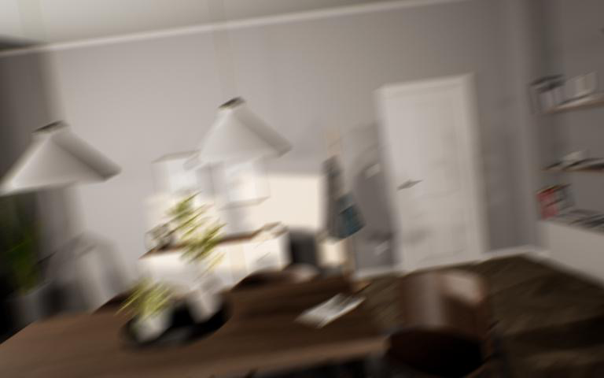

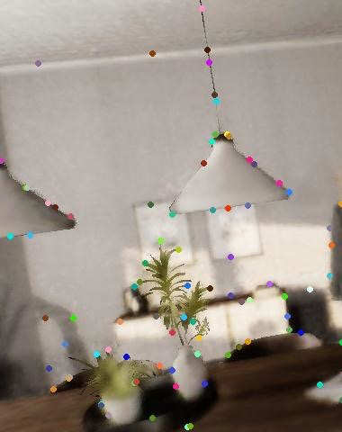

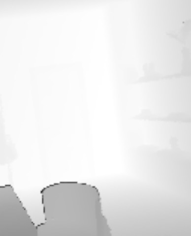

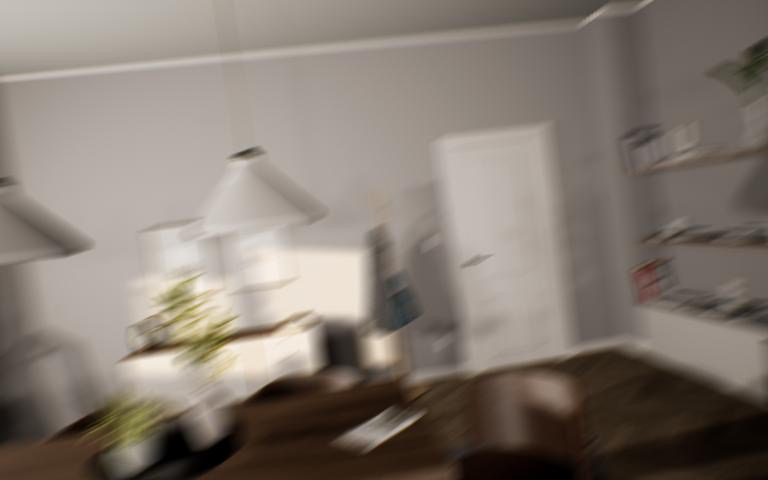

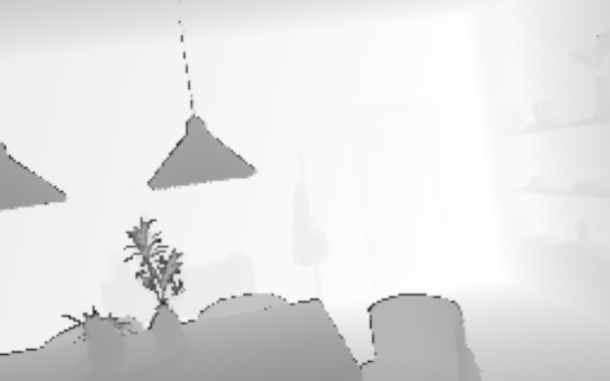

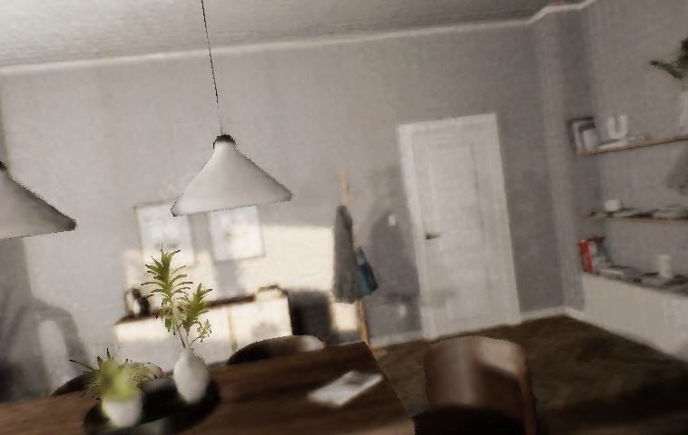

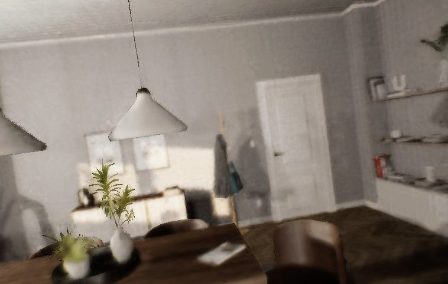

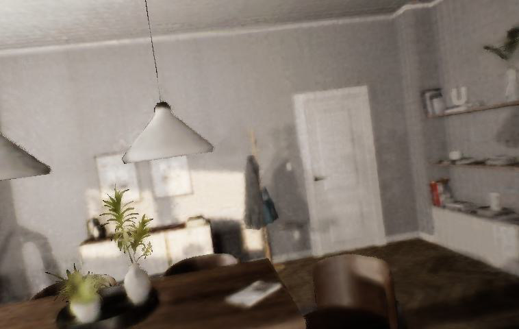

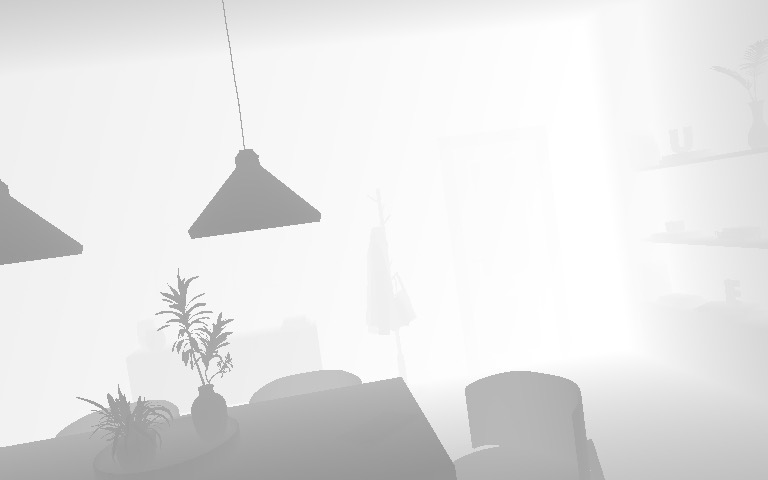

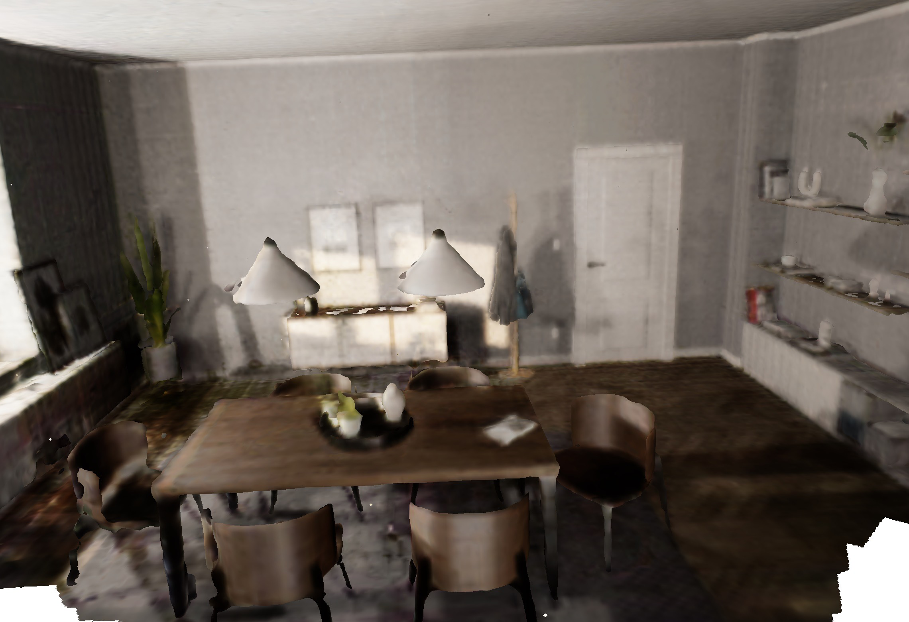

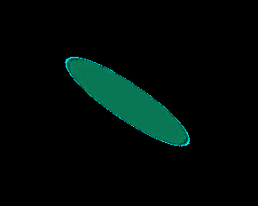

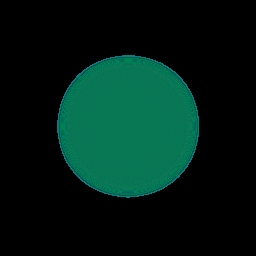

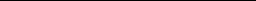

<!-- Page 4 -->
JOURNAL OF LATEX CLASS FILES, VOL. 14, NO. 8, AUGUST 2021
4
the duration of exposure, converting them into quantifiable
electric charges. Mathematically, this intricate process ne-
cessitates the integration across a sequence of virtual sharp
images:
B(x) = ϕ
Z τ
0
It(x)dt,
(1)
where B(x) ∈RW×H×3 denotes the captured image, W
and H represent its width and height, x ∈R2 is the pixel
location, ϕ serves as a normalization factor, τ is the camera
exposure time, It(x) ∈RW×H×3 is the virtual sharp image
captured at timestamp t within the exposure time. The
blurred image B(x) caused by camera motion within the
exposure time, is a composite of virtual images It(x) at each
t. The discrete approximation of this model is described as
follows:
B(x) ≈1
n
n−1
X
i=0
Ii(x),
(2)
where n is the number of discrete samples.
The level of motion blur in an image is directly influ-
enced by the motion of the camera during the exposure
duration. For instance, a camera moving swiftly would
entail minimal relative motion, particularly with shorter
exposure times, whereas a slow-moving camera could result
in motion-blurred images, especially noticeable in low-light
scenarios with long exposure time. Consequently, it can be
inferred that B(x) exhibits differentiability with respect to
each virtual sharp image Ii(x).
3.2
Motion Blur Aware Tracker
3.2.1
Direct Image Alignment with Sharp Images
Prior to presenting our direct image alignment algorithm
designed for blurry images, we provide an overview of
the original algorithm tailored for sharp images. This direct
image alignment algorithm forms the fundamental compo-
nent of direct visual odometry approaches. It estimates the
camera pose of current tracked frame by minimizing the
photometric error between the latest keyframe and current
frame. This process is formally defined as follows:
T∗= argmin
T
m−1
X
i=0
∥Iref(xi) −Icur(ˆxi)∥2
2 ,
(3)
where T ∈SE(3) is the transformation matrix from the
reference image Iref to the current image Icur, m denotes the
number of sampled pixels used for motion estimation, xi ∈
R2 is the location of the ith pixel, ˆxi ∈R2 is the pixel location
corresponding to pixel xi in current image Icur. Robust loss
function (e.g. huber loss) is typically also applied to the error
residuals to ensure robust pose estimation. The image points
xi and ˆxi are interconnected by the camera pose T and the
depth di as
ˆxi = π(T · π−1(xi, di)),
(4)
where π : R3 →R2 is the camera projection function,
responsible for projecting points in 3D space onto the image
plane; conversely, π−1 : R2 × R →R3 is the inverse
projection function, which facilitates the transformation of a
2D point from the image plane back into 3D space by incor-
porating the corresponding depth di. This formulation can
be extended seamlessly to multi-frame scenarios, enabling
the joint optimization of camera poses, 3D scene structures,
and camera intrinsic parameters (i.e. commonly referred to
as photometric bundle adjustment).
Direct
VO
methods
assume
photoconsistency
(i.e. Eq. (3)) for the correct transformation T. However,
varying motion blur in images Iref and Icur invalidates
the photoconsistency loss, as local appearance differs for
corresponding points. This is common in settings with
non-linear
trajectories,
like
augmented/mixed/virtual
reality applications, leading to varying levels of motion blur
in images.
3.2.2
Camera Motion Trajectory modeling
Accurate compensation for motion blur necessitates mod-
eling the local camera trajectory over the exposure pe-
riod. One strategy involves parameterizing solely the final
camera pose and then linearly interpolating between the
previous frame and the new estimate. This interpolation
enables the creation of virtual images to depict the motion
blur, as outlined in Eq. (2). However, this method might
fail when faced with camera trajectories exhibiting sudden
directional changes, a common occurrence with hand-held
and head-mounted cameras.
For robustness, we opt to parameterize the local camera
trajectory independently of the previous frame. Specifically,
we parameterize two camera poses: one at the beginning
of the exposure Tstart ∈SE(3) and another at the end
Tend ∈SE(3). Between the two poses we employ linear
interpolation of poses in the Lie-algebra of SE(3). Thus, The
virtual camera pose at time t ∈[0, τ] is represented as
Tt = Tstart · exp( t
τ · log(T−1
start · Tend)),
(5)
where τ is the exposure time. For efficiency, we decompose
Eq. (5) as
¯qt = ¯qstart ⊗exp( t
τ · log((¯qstart)−1 ⊗¯qend)),
(6)
tt = tstart + t
τ (tend −tstart),
(7)
where ⊗is the product operator for quaternions, T∗=
[R∗|t∗] ∈SE(3), R∗∈SO(3) and t∗∈R3. We rep-
resent the rotation matrix R∗with unit quaternion ¯q∗=
qx∗
qy∗
qz∗
qw∗
T .
Our motion blur-aware tracker aims to estimate both
Tstart and Tend for each frame. While our current approach
employs linear interpolation between the two poses, higher-
order splines could potentially capture more intricate cam-
era motions. Nevertheless, our experiments revealed that
the linear model worked well enough, since the exposure
time is usually relatively short.
Here are some more detailed explanations regarding the
interpolation and derivations of the related Jacobian.
Local parameterization of rotation: For the real implementa-
tion, we use the local parameterization for the update of the
rotation. The plus operation for unit quaternion ¯q is defined
as
¯q′ = ¯q ⊗∆¯q,
(8)

<!-- Page 5 -->
JOURNAL OF LATEX CLASS FILES, VOL. 14, NO. 8, AUGUST 2021
5
where ∆¯q = exp(∆r), ∆r =
∆rx
∆ry
∆rz
T and
∆rx →0, ∆ry →0, ∆rz →0. The Jacobian with respect
to ∆r can thus be derived as1
∂¯q′
∂∆r = Q(¯q) ·


0.5
0
0
0
0.5
0
0
0
0.5
0
0
0

.
(9)
Jacobian related to translation: We can simplify Eq. (7) as
tt = τ −t
τ
tstart + t
τ tend.
(10)
The Jacobians, i.e.
∂tt
∂tstart ∈R3×3 and
∂tt
∂tend ∈R3×3 can thus
be derived as
∂tt
∂tstart
=


τ−t
τ
0
0
0
τ−t
τ
0
0
0
τ−t
τ

,
(11)
∂tt
∂tend
=


t
τ
0
0
0
t
τ
0
0
0
t
τ

.
(12)
Jacobian related to rotation: We decompose Eq. (6) as
¯qstart
end = (¯qstart)−1 ⊗¯qend,
(13)
r = t
τ · log(¯qstart
end ),
(14)
¯qstart
t
= exp(r),
(15)
¯qt = ¯qstart ⊗¯qstart
t
.
(16)
We can rewrite both Eq. (13) and Eq. (16) as
¯qstart
end = Q((¯qstart)−1) · ¯qend = ˆQ(¯qend) · (¯qstart)−1,
(17)
¯qt = Q(¯qstart) · ¯qstart
t
= ˆQ(¯qstart
t
) · ¯qstart.
(18)
The Jacobian
∂¯qt
∂¯qstart ∈R4×4 can thus be derived as
∂¯qt
∂¯qstart
= ˆQ(¯qstart
t
) + Q(¯qstart) · ∂¯qstart
t
∂¯qstart
,
(19)
∂¯qstart
t
∂¯qstart
= ∂¯qstart
t
∂r
·
∂r
∂¯qstart
end
· ˆQ(¯qend) · ∂(¯qstart)−1
∂¯qstart
.
(20)
Similarly for the Jacobian
∂¯qt
∂¯qend ∈R4×4, we can derive it as
∂¯qt
∂¯qend
= Q(¯qstart) · ∂¯qstart
t
∂r
·
∂r
∂¯qstart
end
· Q((¯qstart)−1). (21)
Note that both ∂¯q0
t
∂r and
∂r
∂¯q0τ are the Jacobians related to the
exponential mapping and logarithm mapping respectively.
∂(¯qstart)−1
∂¯qstart
is the Jacobian related to the inverse of quater-
nion.
The Jacobians with respect to the local parameterization
can then be computed as
∂¯qt
∂∆rstart
=
∂¯qt
∂¯qstart
· Q(¯qstart) ·


0.5
0
0
0
0.5
0
0
0
0.5
0
0
0

,
(22)
∂¯qt
∂∆rend
=
∂¯qt
∂¯qend
· Q(¯qend) ·


0.5
0
0
0
0.5
0
0
0
0.5
0
0
0

.
(23)
1. Q(¯q) and ˆQ(¯q) are the matrix forms of quaternion multiplication.
Iref
Bcur
Iref
Bcur
Fig. 2. Pixel point transfer strategies. Note that we assume the pixel
center lies at the grid intersection, e.g.the green grid is considered as a
3×3 patch.
3.2.3
Direct Image Alignment with Blurry Images
Our motion blur-aware tracker operates by directly aligning
the keyframe, assumed to be sharp, with the current frame,
which may suffer from motion blur. To exploit photometric
consistency during alignment, we must either de-blur the
current frame or re-blur the keyframe. In our approach,
we opt for the latter option as re-blurring is generally
simpler and more robust compared to motion deblurring,
particularly for images severely affected by motion blur.
Each sampled pixel in Iref with a known depth is trans-
fered to the current (blurry) image Bcur using (4). We then
identify the nearest integer position pixel in the current
blurry image for each projected point. Assuming the 3D
point lies on a fronto-parallel plane (with respect to Iref),
we leverage this plane to transfer the selected pixel back
into the reference view. Further details are provided in
Fig. 2. To synthesize the re-blurred pixel from the reference
view (facilitating comparison with the real captured pixel
intensity), we interpolate between Tstart and Tend. For each
virtual view Tt sampled uniformly within [0, τ], the pixel
coordinate (i.e.the red pixel in Fig. 2) is transferred back into
the reference image and image intensity values are obtained
by bi-linear interpolation. The re-blurred pixel intensity is
then computed by averaging over the intensity values (as
in (2)):
ˆBcur(x) = 1
n
n−1
X
i=0
Iref(x
iτ
n−1 ),
(24)
where x
iτ
n−1 ∈R2 corresponds to the transferred point at
time t =
iτ
n−1 in the sharp reference frame, n is the number
of virtual frames used to synthesize the blurry image2. The
tracker then optimizes over the Tstart and Tend to minimize
the photoconsistency loss between the real captured inten-
sities in current frame and the synthesized pixel intensities
from the reference image via re-blurring:
T∗
start, T∗
end = argmin
Tstart, Tend
m−1
X
i=0

Bcur(xi) −ˆBcur(xi)

 .
(25)
2. In our experiments, we employ a fixed number of virtual frames.
Nonetheless, this quantity can be dynamically adjusted based on the
blur level to optimize computational resources.

<!-- Page 6 -->
JOURNAL OF LATEX CLASS FILES, VOL. 14, NO. 8, AUGUST 2021
6
Iref
Ii
)
Iref
%
%&
x
x() (+,-)
⁄
Ii
p23
4
5
Fig. 3. Geometric relationship between x ∈R2 (i.e.the red pixel) of
the virtual sharp image Ii and x
iτ
n−1 ∈R2 (i.e.the black pixel) of the
reference image Iref. The right figure is its simplified 2D top-down view
of the left figure.
In practice, many direct image alignment methods use
local patches to facilitate convergence. In contrast to direct
image alignment algorithm for sharp images, which typi-
cally selects the local patch from the reference image (e.g.the
green 3 × 3 grid on the left of Fig. 2), we instead select
the local patch from the current blurry image (e.g.the red
3 × 3 grid on the right of Fig. 2) since this simplifies the
re-blurring step of our pipeline.
3.2.4
More Details on the Transfer
We further demonstrate the relationship between x ∈R2
and x
iτ
n−1 ∈R2 from Eq. (24) in the following notations.
We denote the depth of the fronto-parallel plane as d, repre-
senting the estimated depth of the corresponding sampled
keypoint from Iref (i.e.the green pixel in Fig. 2); additionally,
we denote the camera pose of the virtual frame Ii captured
at timestamp
iτ
n−1 relative to the reference keyframe Iref as
Ti ∈SE(3), which can be computed from Eq. (5) as
Ti = Tstart · exp(
i
n −1τ · log(T−1
start · Tend)),
(26)
where Tstart ∈SE(3) and Tend ∈SE(3) are the relative
camera poses, defined from the current camera coordinate
frame to the reference camera coordinate frame, correspond-
ing to the blurry image at the beginning and end of the
image capture process respectively, τ is the camera exposure
time. Note that while the fronto-parallel plane is defined
in the reference camera frame, it may not remain fronto-
parallel with respect to the ith virtual camera frame.
We will illustrate the relationship in Fig. 3 to mitigate
potential confusion. We denote the translation vector pref
i
of Tref
i
with [px, py, pz]T and represent the rotation Rref
i
with unit quaternion, i.e.¯q = [qx, qy, qz, qw]T . We denote d
as the depth of the frontal-parallel plane with respect to the
reference key-frame. We can then compute the distance d′
between the camera center of the ith virtual camera to the
frontal-parallel plane as
d′ = d −pz.
(27)
The unitary ray of pixel x ∈R2 in the ith image Ii can be
computed by the back-projection function π−1 : R2 →R3
as
x,
y,
z
T = π−1(x),
(28)
where x2+y2+z2 = 1. We can then compute cosine function
of the angle (i.e.θ) between the unitary ray and the plane
normal of the frontal parallel plane as
λ = cos(θ) = (Rref
i
· π−1(x))T ·
0,
0,
1
T ,
(29)
from which we can further simply it as
λ = 2x(qxqz −qwqy)+2y(qxqw+qyqz)+z(q2
w−q2
x−q2
y +q2
z).
(30)
The length of the line segment L, which goes through pixel
point x from camera center of the ith camera and intersects
with the frontal-parallel plane, can then be simply computed
as
|L| = d′
λ = d −pz
λ
.
(31)
The 3D intersection point p3d between the line segment L
and the frontal parallel plane can thus be computed as
p3d = |L|
x,
y,
z
T = d −pz
λ
x,
y,
z
T ,
(32)
where the p3d is represented in the coordinate frame of
the ith camera. To compute the corresponding pixel point
x
iτ
n−1 in the reference image Iref, we need transform the 3D
point p3d to the reference camera coordinate frame and then
project it to the image plane. It can be formally defined as
p′
3d = Tref
i
· p3d,
(33)
x
iτ
n−1 = π(p′
3d),
(34)
where p′
3d is the 3D point p3d represented in the reference
camera, π : R3 →R2 is the camera projection function.
Jacobian derivations: The pose of the ith virtual camera,
i.e.Tref
i
, relates to Tref
0
and Tref
τ
via Eq. (5). To estimate
both Tref
0
and Tref
τ
, we need to have the Jacobian of
x
iτ
n−1 with respect to Tref
i
. Since the relationship between
x
iτ
n−1 and Tref
i
is complex, as derived above, we use the
Mathematica Symbolic Toolbox3 for the ease of Jacobian
derivations. The details are as follows.
α0 = qxx + qyy + qzz,
α1 = qyx −qwz −qxy,
(35)
α2 = qwy −qxz + qzx,
α3 = qwx + qyz −qzy,
(36)
α4 = qwz + qxy −qyx,
β0 = −2(qwqz −qxqy),
(37)
β1 = 2(qwqy + qxqz),
β2 = 2(qwqz + qxqy),
(38)
β3 = −2(qwqx −qyqz),
β4 = −2(qwqy −qxqz),
(39)
β5 = 2(qwqx + qyqz),
(40)
γ0 = x(q2
w + q2
x −q2
y −q2
z) + yβ0 + zβ1,
(41)
γ1 = xβ2 + y(q2
w −q2
x + q2
y −q2
z) + zβ3,
(42)
γ2 = xβ4 + yβ5 + z(q2
w −q2
x −q2
y + q2
z),
(43)
∂p′
3d
∂px
=


1
0
0

,
∂p′
3d
∂py
=


0
1
0

,
∂p′
3d
∂pz
=


−γ0/λ
−γ1/λ
1 −γ2/λ

,
(44)
3. https://www.wolfram.com/mathematica/

<!-- Page 7 -->
JOURNAL OF LATEX CLASS FILES, VOL. 14, NO. 8, AUGUST 2021
7
∂p′
3d
∂qx
= 2d −pz
λ


α0 −α2γ0/λ
α1 −α2γ1/λ
α2 −α2γ2/λ

,
(45)
∂p′
3d
∂qy
= 2d −pz
λ


α4 + α3γ0/λ
α0 + α3γ1/λ
−α3 + α3γ2/λ

,
(46)
∂p′
3d
∂qz
= 2d −pz
λ


−α2 + α0γ0/λ
α3 −α0γ1/λ
α0 −α0γ2/λ

,
(47)
∂p′
3d
∂qw
= 2d −pz
λ


α3 −α4γ0/λ
α2 −α4γ1/λ
α4 −α4γ2/λ

.
(48)
The Jacobian
∂x
iτ
n−1
∂p′
3d
∈R2×3 is related to the camera
projection function. For a pinhole camera model with the
intrinsic parameters fx, fy, cx, cy, it can be derived as
∂x
iτ
n−1
∂p′
3d
=


fx
p′
3dz
0
−
fxp′
3dx
(p′
3dz )2
0
fy
p′
3dz
−
fyp′
3dy
(p′
3dz )2

,
(49)
where p′
3d = [p′
3dx, p′
3dy, p′
3dz]T .
Based on the above derivations, we implemented the
forward and backpropagation processes by pure CUDA,
enabling our tracker to accurately estimate the local camera
motion trajectory in real-time.
3.3
Motion Blur Aware Mapper
The motion blur image formation model can be seamlessly
integrated with various scene representation methods. We
implement this in two versions: an implicit Radiance Fields
version [7] and an explicit Gaussian Splatting version [8],
which can be freely switched between.
3.3.1
Preliminaries: 3D Scene Representations
We review the rendering processes of NeRF [7] and
3DGS [8], as our backend mapper can utilize either NeRF
or 3DGS.
Implicit Radiance Fields. Following [12], [46], we embrace
implicit scene representation comprises appearance and
geometry tri-planes along with corresponding decoders.
Formally, the volumetric rendering [47], [48] process can be
delineated as follows.
Given an image pixel location x with depth λ, we can
sample a specific 3D point Xw along the ray from camera
pose, and its corresponding appearance features fa4 and
geometry features fg can be retrieved as:
fa = Fa-xy(Xw) + Fa-xz(Xw) + Fa-yz(Xw),
(50)
fg = Fg-xy(Xw) + Fg-xz(Xw) + Fg-yz(Xw),
(51)
where {Fa-xy, Fa-xz, Fa-yz} and {Fg-xy, Fg-xz, Fg-yz} are
appearance and geometry tri-planes, respectively.
4. We abbreviate fa(Xw) and fg(Xw) as fa and fg, respectively.
Then the raw color c, signed distance function s and
volume density σ can be computed as:
c = ha (fa) , s = hg (fg) , σ = β · sigmoid (−β · s) ,
(52)
where ha and hg are appearance and geometry decoders,
respectively, β is a learnable parameter regulating the sharp-
ness of the surface boundary. Following volume rendering
principles [47], we can compute the pixel color and depth
by sampling 3D points along the ray as follows:
wi = exp(−
i−1
X
k=1
σk)(1 −exp(−σi)),
(53)
I(x) =
n
X
i=1
wici,
D(x) =
n
X
i=1
widi,
(54)
where n is the number of sampled 3D points along the ray,
both ci and σi are the predicted color and volume density
of the ith sampled 3D point via Eq. (52), di is the depth of
the ith sampled point.
Explicit Gaussian Splatting. 3DGS [8] represents the scene
with a series of Gaussians, where each Gaussian G, is
parameterized by its mean position µ ∈R3, 3D covariance
Σ ∈R3×3, opacity o ∈R and color c ∈R3. The distribution
of each scaled Gaussian is defined as:
G(x) = e−1
2 (x−µ)⊤Σ−1(x−µ).
(55)
To ensure the semi-definite physical property of 3D con-
variance Σ and enable differentiable rasterization, 3DGS [8]
represents the 3D convariance Σ and 2D convariance Σ′ ∈
R2×2 as follows:
Σ = RSST RT ,
Σ′ = JRcΣRT
c JT ,
(56)
where S ∈R3 is the scale, R ∈R3×3 is the rotation matrix
stored by a quaternion q ∈R4, J ∈R2×3 is the Jacobian
of the affine approximation of the projective transformation
and Rc is the rotation part of the rendering camera pose
Tc = {Rc ∈R3×3, tc ∈R3}.
Afterward, each pixel color is rendered by rasterizing
these N sorted 2D Gaussians based on their depths, follow-
ing the formulation:
I(x) =
N
X
i
ciαiTi,
D(x) =
N
X
i
diαiTi,
(57)
where ci and di are the color and depth of each Gaussian,
Ti = Qi−1
j
(1 −αj) and αi = oi · exp(−1
2∆T
i Σ′−1∆i).
3.3.2
Blur Aware Mapper
Based on Eq. (2) and Eq. (5), we can also integrate the motion
blur formation process to our mapper (either Radiance
Fields [12] or 3DGS [8]), enabling the rendering of latent
sharp images within the exposure time. If the mapper is
Radiance Fields [12], the learnable parameters are tri-planes
(Fa, Fg), decoders (ha, hg) and β; else if the mapper is
3DGS [8], the learnable parameters are mean position µ,
3D covariance Σ, opacity o and color c. The objective of our
blur aware mapper is now to estimate both Tstart and Tend
for each frame, alongside the mapper parameters.

<!-- Page 8 -->
JOURNAL OF LATEX CLASS FILES, VOL. 14, NO. 8, AUGUST 2021
8
ArchViz-1
ArchViz-2
ArchViz-3
Fig. 4. Estimated trajectories of MBA-SLAM from the motion blurred image sequences of the ArchViz dataset. It demonstrates that MBA-
SLAM can estimate accurate trajectories, although the camera motions are very challenging.
3.3.3
Loss Functions
Given a batch of pixels R, the photo-metric color loss and
geometric depth loss are:
Lc =
1
|R|
X
x∈R

B(x) −Bgt(x)

 ,
(58)
Ld =
1
|R|
X
x∈R

D(x) −Dgt(x)

 ,
(59)
where B(x) is the blurry color synthesized from Mθ using
the above image formation model, which involves averag-
ing all rendered colors along the camera trajectory, Bgt(x)
denotes the corresponding real captured blurry image. D(x)
is the rendered depth from the middle pose of the camera
trajectory as Dgt(x) typically denotes the measured depth.
Excluding the color and depth losses that are used in
common, there are also some seperate losses used in Radi-
ance Fields or Gaussian Splatting.
If the scene representation is based on NeRF: For rapid con-
vergence and accurate geometry reconstruction, we apply
the free space loss Lfs and SDF loss Lsdf to the sampled
points, as the same with ESLAM [12]. We refer to prior
works [12] for more details about these two losses.
The total loss function for Radiance Fields mapper is:
L = λcLc + λdLd + λfsLfs + λsdfLsdf.
(60)
If the scene representation is based on Gaussian Splatting:
To prevent the 3D Gaussian kernels from becoming overly
skinny, we apply the scale regularization loss [49] to a batch
of Gaussians G:
Lreg =
1
|G|
X
g∈G
max{max(Sg)/ min(Sg), r} −r,
(61)
where Sg are the scales of 3DGS [8] in Eq. (56). This loss
constrains the ratio between the maximum and minor axis
lengths to prevent the Gaussian from becoming too thin.
Combined SSIM loss ssim(B(x) −Bgt(x)), the final loss
for Gaussian Splatting Mapper is:
L = λcLc + λdLd + λssimLssim + λregLreg.
(62)
We implemented Our-NeRF version approach based on
implicit tri-plane based radiance fields [12], and Our-GS
version based on 3D Gaussian Splatting [8].
TABLE 1
Tracking comparison (ATE RMSE [cm]) of the proposed method vs.
the SOTA methods on the synthetic #ArchViz dataset. ✗denotes
that tracking fails while ✖denotes the method can not successfully run
on the ArchViz dataset due to code error. The best and second-best
results are colored. MBA-SLAM achieves best tracking performance in
Radiance Fields and Gaussian Splatting approaches, respectively.
Method
ArchViz-1 ArchViz-2
ArchViz-3
Avg.
iMAP [9]
255.75
186.87
756.55
399.72
NICE-SLAM [10]
✖
✖
✖
-
VoxFusion [50]
5.54
16.82
249.30
90.55
CoSLAM [11]
5.28
4.67
14.17
8.04
ESLAM [12]
20.12
12.61
✖
-
Point-SLAM [26]
289.56
181.27
596.25
355.69
Ours-NeRF
0.98
1.13
2.96
1.69
SplaTAM [15]
36.88
✗
763.93
-
RTG-SLAM [51]
✖
17.49
26.78
-
Photo-SLAM [17]
4.57
0.64
2.01
2.41
MonoGS [16]
1.92
2.96
38.37
14.42
Ours-GS
0.75
0.36
1.41
0.84
4
EXPERIMENTS
The experimental setup across different datasets is described
in Sec. 4.1. We show that MBA-SLAM outperforms state-of-
the-art dense visual SLAM methods on blurred datasets in
Sec. 4.2 and sharp datasets in Sec. 4.3. Runtime analysis and
ablation studies are conducted in Sec. 4.4 and Sec. 4.5.
4.1
Experimental Setup
Baselines.
We compared our method with state-of-the-
art NeRF-based approaches: iMAP [9], NICE-SLAM [10],
Vox-Fusion [50] CoSLAM [11], ESLAM [12] and Point-
SLAM [26]. Further, we also report the results of Gaus-
sian Splatting based visual SLAMs, i.e.GS-SLAM [14] and
SplaTAM [15]. As for Gaussian Splatting SLAMs, we extract
the mesh from the estimated camera poses and rendered
images and depths, following GS-SLAM [14].
Datasets.
To evaluate the robustness and performance of
MBA-SLAM, we conducted thorough assessments across a
wide range of scenes sourced from diverse datasets, cover-
ing scenarios both with and without camera motion blur.
Motion blur data:
Our evaluation encompasses synthetic
blur datasets like ArchViz [18] that are rendered by the
Unreal game engine5 with a camera being quickly shaken
back and forth, and 3 selected part sequence with motion
blur from ScanNet [20] and TUM RGB-D [21]. Futher, we
5. https://www.unrealengine.com

#### Page 8 Images

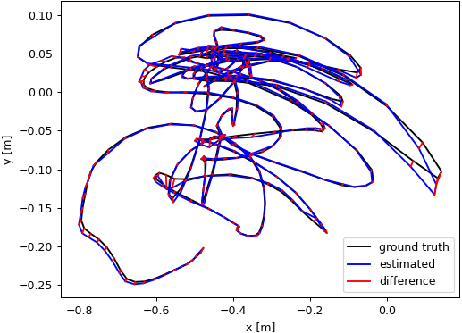

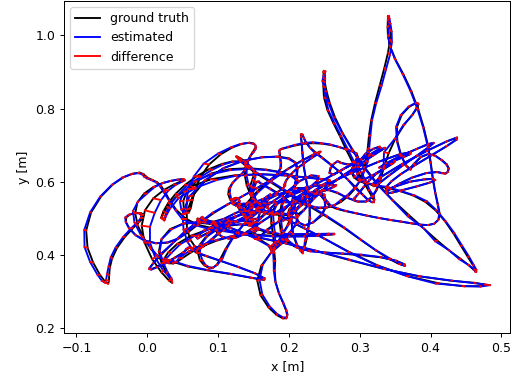

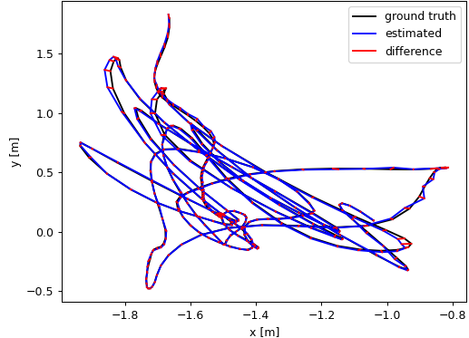

<!-- Page 9 -->
JOURNAL OF LATEX CLASS FILES, VOL. 14, NO. 8, AUGUST 2021
9
captured another 3 motion blur sequences with Realsense
RGB-D camera. The groundtruth trajectory is provided
by an indoor motion capturing system6. Standard sharp
data: Additionally, we incorporate three standard public
3D benchmarks commonly used in previous state-of-the-art
methods: Replica [19], ScanNet [20] and TUM RGB-D [21].
Metrics. We utilize the widely adopted absolute trajectory
error (i.e.ATE RMSE) [21] to assess tracking performance.
In evaluating reconstruction and geometric accuracy, we
employ the culled mesh [52] to compute the 2D Depth L1
metric (cm), as well as 3D metrics such as Precision (%),
Recall (%) and F1-score (< 1cm %). To fairly compare these
baselines, we run all the methods 5 times and report the
average results. We further evaluate the rendering qual-
ity using classical signal-to-noise ratio (PSNR), SSIM and
LPIPS [53] metrics.
Implementation Details.
Tracker: To enhance efficiency,
we sub-sample high-gradient pixels to derive sparse key-
points, ensuring uniform distribution across the image.
Additionally, we define 9 × 9 local patches around each
sampled sparse keypoint to facilitate better convergence.
The energy function undergoes optimization in a coarse-to-
fine manner, supplemented by the application of a robust
huber loss function for improved robustness. The CUDA-
accelerated backpropagation process implemented in our
tracker is well-suited for real-time applications.
Mapper:
We implement the mapper using either Radiance Fields or
3DGS. If mapper is Radiance Fields: We interpolate 7 virtual
images between Tstart and Tend (n in Eq. 2) following [22].
Other details are same as [12]. If mapper is Gaussian Splatting:
We implement the GS version of MBA-SLAM using PyTorch
within the gsplat framework [54]. The number of virtual
images is set to 13. The coefficients and regularization r for
Lreg is 1e1 and 1.0. Other configurations are as default in
gsplat. As for Gaussians management, we add gaussians
for new frame at those areas that alpha value is smaller
than 0.5 and we adopt the default splitting, cloning, and
pruning strategy in gsplat. For Gaussian color initialization,
we directly utilize input blur color and depth information
on these pixels to spawn newly added Gaussian primitives.
Additionally, we have created interfaces in the tracker to
facilitate PyTorch data transmission from the mapper to our
CUDA-implemented tracker.
4.2
Evaluation on Blur Datasets
Evaluation on Synthetic Blur Dataset: ArchViz.
Tracking: The results in Table 1 illustrate that the tracking
performance of our method outperforms other state-of-
the-art NeRF-SLAM and Gaussian-SLAM systems on the
synthetic motion blur ArchViz datasets provided by [18].
Additionally, it reveals that pure implicit SLAMs, such
as CoSLAM [11] and ESLAM [12], perform better than
methods based on explicit points or Gaussians, i.e. Point-
SLAM [26] and SplaTAM [15], when faced with challeng-
ing motion-blurred sequences. Fig. 4 demonstrates the es-
timated trajectories of MBA-SLAM on the motion-blurred
sequences from the ArchViz dataset. Both quantitative and
6. https://www.vicon.com
TABLE 2
Rendering and Reconstruction comparison of the proposed method
vs. the SOTA methods on the synthetic #ArchViz dataset. ✗
denotes that rendering fails or unmeaningful rendering while ✖denotes
the method can not successfully run on the ArchViz dataset due to
code error. MBA-SLAM achieves best tracking performance in
Radiance Fields and Gaussian Splatting approaches, respectively.
Method
Metric
Arch1 Arch2 Arch3 Avg. Metric-Rec. Arch1
NICESL
AM [10]
PSNR ↑
-
Precision ↑
SSIM ↑
✖
✖
✖
-
Recall ↑
✖
LPIPS ↓
-
F1 ↑
VoxFus
ion [50]
PSNR ↑
17.97
17.07
13.52
16.19 Precision ↑
38.01
SSIM ↑
0.519
0.447
0.392
0.452 Recall ↑
51.44
LPIPS ↓
0.511
0.593
0.790
0.631 F1 ↑
43.71
CoSLA
M [11]
PSNR ↑
22.97
21.98
21.45
22.13 Precision ↑
55.71
SSIM ↑
0.841
0.685
0.744
0.756 Recall ↑
61.59
LPIPS ↓
0.361
0.570
0.477
0.469 F1 ↑
58.50
ESL
AM [12]
PSNR ↑
21.07
23.87
-
Precision ↑
44.61
SSIM ↑
0.766
0.785
✖
-
Recall ↑
54.88
LPIPS ↓
0.446
0.475
-
F1 ↑
48.22
Point
SLAM [26]
PSNR ↑
15.90
18.29
-
Precision ↑
1.45
SSIM ↑
0.493
✗
0.563
-
Recall ↑
18.21
LPIPS ↓
0.549
0.479
-
F1 ↑
2.68
Ours
NeRF
PSNR ↑
24.77
26.35
24.13
25.08 Precision ↑
82.49
SSIM ↑
0.905
0.875
0.880
0.887 Recall ↑
90.56
LPIPS ↓
0.312
0.372
0.370
0.351 F1 ↑
86.95
Spla
TAM [15]
PSNR ↑
17.69
-
Precision ↑
15.57
SSIM ↑
0.538
✗
✗
-
Recall ↑
28.49
LPIPS ↓
0.542
-
F1 ↑
20.21
RTG
SLAM [51]
PSNR ↑
20.08
17.99
-
Precision ↑
SSIM ↑
✖
0.558
0.595
-
Recall ↑
✖
LPIPS ↓
0.551
0.538
-
F1 ↑
Photo
SLAM [17]
PSNR ↑
23.45
27.49
23.70
24.88 Precision ↑
52.69
SSIM ↑
0.823
0.897
0.846
0.855 Recall ↑
63.88
LPIPS ↓
0.387
0.363
0.396
0.382 F1 ↑
53.76
Mono
GS [16]
PSNR ↑
23.18
27.14
20.56
23.63 Precision ↑
44.43
SSIM ↑
0.852
0.884
0.696
0.811 Recall ↑
57.61
LPIPS ↓
0.337
0.329
0.427
0.364 F1 ↑
50.17
Ours-GS
PSNR ↑
28.45
30.16
27.85
28.82 Precision ↑
83.71
SSIM ↑
0.956
0.951
0.943
0.950 Recall ↑
93.67
LPIPS ↓
0.148
0.172
0.171
0.164 F1 ↑
88.41
TABLE 3
Tracking comparison (ATE RMSE [cm]) of the proposed method vs.
the SOTA methods on the real-world #TUM, ScanNet: left and
real captured #Realsense: right dataset. Our method achieves
better tracking performance in real blurry dataset.
Method
pub1
pub2
pub3
Avg.
seq1
seq2
seq3
Avg.
NICE-SLAM [10]
5.27
3.64
2.96
3.96
16.38
15.61
9.84
13.94
Vox-Fusion [50]
9.90
2.95
3.83
5.56
11.10
52.01
20.01
27.71
CoSLAM [11]
6.32
1.58
2.75
3.55
12.97
7.63
7.15
9.25
ESLAM [12]
4.71
1.29
2.44
2.81
11.58
6.49
8.06
8.71
Point-SLAM [26]
5.13
3.16
2.56
3.62
10.52
9.18
235.79
85.16
Ours-NeRF
3.53
1.42
2.08
2.34
9.75
7.32
5.54
7.54
SplaTAM [15]
4.89
3.29
2.58
3.59
33.56
14.51
7.26
18.44
RTG-SLAM [51]
21.83
15.23
-
-
8.97
✖
✖
-
Photo-SLAM [17]
3.89
3.47
2.36
3.24
8.64
96.30
2.49
35.81
MonoGS [16]
5.52
3.07
2.28
3.62
8.92
6.13
9.94
8.33
Ours-GS
4.16
2.78
2.16
3.03
8.79
5.56
3.27
5.87
qualitative results highlight the effectiveness of our pro-
posed algorithm for handling motion-blurred image se-
quences.
Rendering: Table 2 presents the quantitative rendering
results (in the left three columns) on the ArchViz dataset.
The results demonstrate that our method significantly sur-
passes other state-of-the-art methods, thanks to the physical
motion blur image formation model. The qualitative results
shown in Fig. 5 illustrate that our method can recover and
render high-quality images from motion-blurred sequences,

<!-- Page 10 -->
JOURNAL OF LATEX CLASS FILES, VOL. 14, NO. 8, AUGUST 2021
10
Input
Groundtruth
CoSLAM [11]
Spla
TAM [15]
ESLAM [12]
MonoGS [16]
Point
SLAM [26]
Photo
SLAM [17]
Ours-NeRF
Ours-GS
Fig. 5. Qualitative rendering results of different methods with synthetic ArchViz datasets. It demonstrates that MBA-SLAM can restore and
render sharp images from blurry input and outperform other dense visual SLAMs. Best viewed in high resolution.
particularly in areas with rich textures (e.g. green leaves)
and sharp edges.
Reconstruction: Since the ArchViz dataset does not pro-
vide ground truth meshes, we utilize TSDF Fusion [55]
to extract reference meshes from the ground truth camera
poses, sharp images, and depth data. We only report the
reconstruction metrics for ArchViz1 as a reference (in the
right column of Table 2) because there are many unseen
areas in ArchViz2 and ArchViz3, which should be excluded
from the extracted mesh using the ’unseen points’ file that
we do not have when computing metrics with the ground
truth mesh. The visualization results in Fig. 6 demonstrate
that MBA-SLAM achieves a satisfying reconstructed mesh
with clear boundaries and rich details.
Evaluation on Real Blur Dataset.
Tracking: We conduct further experiments on real cap-
tured motion blur datasets, and the quantitative tracking
results are presented in Table 3. ‘pub1-pub3’ refer to the
selected motion-blurred sequences from the public Scan-
Net [20] and TUM RGB-D [21] datasets, while ‘seq1-seq3’
denote our collected datasets using a Realsense RGB-D
camera. MBA-SLAM achieves best tracking performance on
average in both public and our captured datasets.
Rendering: Fig. 7 and Fig. 8 present qualitative exam-
ples of rendering from public datasets and our captured
dataset. Although other state-of-the-art methods (e.g., Point-
SLAM [26] and SplaTAM [15]) can achieve impressive per-
formance on images that are not severely blurred, they
struggle to restore sharp images and often introduce un-
pleasant artifacts in severely blurred cases. In contrast, our
method consistently delivers robust performance regardless
of the level of motion blur and effectively captures fine
details (e.g., sofa, desk, chair legs, etc.).
TABLE 4
Tracking comparison (ATE RMSE [cm]) of the proposed method vs.
the SOTA methods on the #Replica dataset. The best and
second-best results are colored.
Method
Rm0
Rm1
Rm2
Of0
Of1
Of2
Of3
Of4
Avg.
iMAP [9]
3.12
2.54
2.31
1.69
1.03
3.99
4.05
1.93
2.58
NICE-SLAM [10]
1.69
2.04
1.55
0.99
0.90
1.39
3.97
3.08
1.95
Vox-Fusion [50]
0.59
1.08
0.81
6.32
1.02
0.98
0.67
0.95
1.55
CoSLAM [11]
0.70
0.95
1.35
0.59
0.55
2.03
1.56
0.72
1.00
ESLAM [12]
0.71
0.70
0.52
0.57
0.55
0.58
0.72
0.63
0.63
Point-SLAM [26]
0.56
0.47
0.30
0.35
0.62
0.55
0.72
0.73
0.54
Ours-NeRF
0.34
0.43
0.30
0.25
0.33
0.68
0.48
0.46
0.41
GS-SLAM [14]
0.48
0.53
0.33
0.52
0.41
0.59
0.46
0.70
0.50
SplaTAM [15]
0.31
0.40
0.29
0.47
0.27
0.29
0.32
0.55
0.36
RTG-SLAM [51]
0.18
0.19
0.10
0.16
0.13
0.22
0.23
0.24
0.18
Photo-SLAM [17]
0.33
0.34
0.19
0.43
0.33
0.87
0.40
0.53
0.43
MonoGS [16]
0.44
0.32
0.31
0.44
0.52
0.23
0.17
2.25
0.58
Ours-GS
0.25
0.13
0.25
0.32
0.30
0.74
0.26
0.58
0.35
4.3
Evaluation on Standard Sharp Datasets
To demonstrate that our method can also handle commonly
used standard sharp datasets, we conduct the following
experiments without modeling the blur process in either
our tracker or mapper, following the exact same settings
as in prior works by setting the number of virtual images in
Eq. (2) to 1.
Evaluation on Synthetic Dataset: Replica.
Tracking: The quantitative tracking results are presented
in Table 4. Our method outperforms most previous state-
of-the-art approaches, including both NeRF-based SLAMs
(e.g., NICE-SLAM [10], CoSLAM [11], ESLAM [12], and
Point-SLAM [26]) and Gaussian Splatting-based SLAMs
(e.g., GS-SLAM [14], SplaTAM [15], Photo-SLAM [17] and
MonoGS [16], except RTG-SLAM [51]), in terms of both
tracking accuracy and running speed (as shown in Table 8).
Notably, our CUDA-implemented tracker operates in real
time, with the running speed primarily limited by the back-

#### Page 10 Images

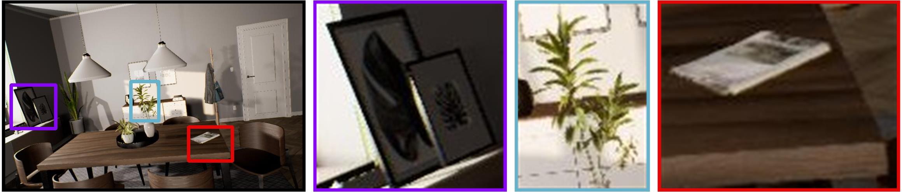

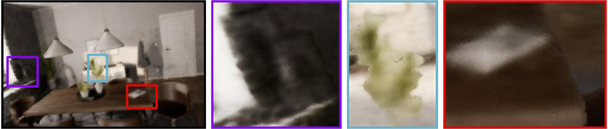

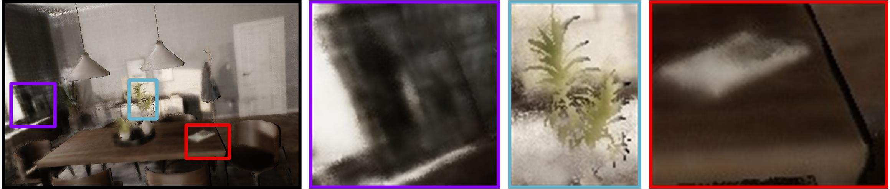

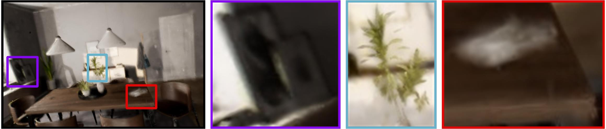

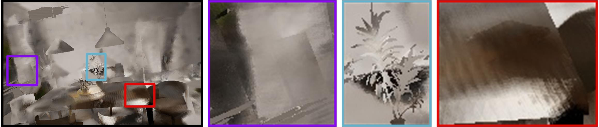

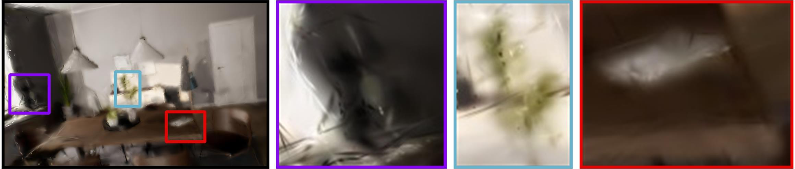

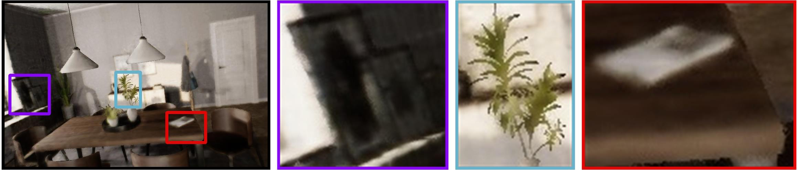

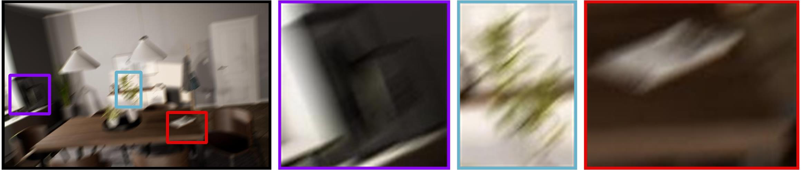

<!-- Page 11 -->
JOURNAL OF LATEX CLASS FILES, VOL. 14, NO. 8, AUGUST 2021
11
Point
SLAM [26]
VoxFu
sion [50]
CoSLAM [11]
ESLAM [12]
Ours-NeRF
Spla
TAM [15]
Photo
SLAM [17]
MonoGS [16]
Ours-GS
Reference
Fig. 6. Qualitative mesh visualization of different methods with ArchViz-1 datasets. The result reveals that implicit Radiance Fields
(e.g.CoSLAM, ESLAM) deliver better reconstruction mesh performance than explicit point based methods (i.e.Point-SLAM, SplaTAM). MBA-SLAM
always achieves best performance, no matter Ours-NeRF or Our-GS. RTG-SLAM fails to reconstruct mesh.

#### Page 11 Images

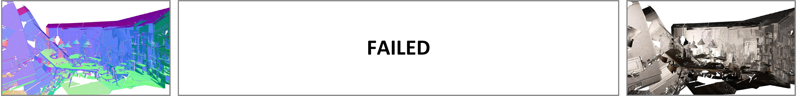

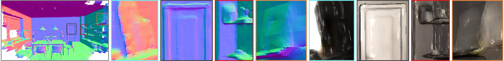

<!-- Page 12 -->
JOURNAL OF LATEX CLASS FILES, VOL. 14, NO. 8, AUGUST 2021
12
Input
CoSLAM [11]
ESLAM [12]
Point
SLAM [26]
Spla
TAM [15]
RTG
SLAM [51]
Photo
SLAM [17]
MonoGS [16]
Ours-GS
Fig. 7. Qualitative rendering results of different methods with the real public ScanNet and TUM RGB-D datasets. The experimental results
demonstrate that our method achieves superior performance over prior methods on the real public dataset.
end mapper. The tracking results for office2 in Table 4
are not as strong as those for the other sequences due to the
reduced number of features in office2, which hampers
our feature-based tracker.
Rendering: We also compare the rendering performance
of MBA-SLAM with dense visual SLAMs in Table 5. The re-
sults demonstrate that MBA-SLAM achieves the second-best
performance after Point-SLAM, outperforming the third-
best implicit dense visual SLAM by 0.6 PSNR in the Our-
NeRF version and delivering superior or comparable results
to other 3DGS-SLAM approaches.
Reconstruction: The quantitative evaluations of 3D mesh

#### Page 12 Images

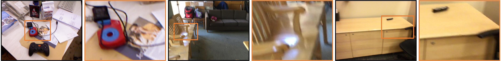

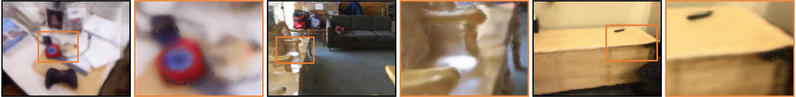

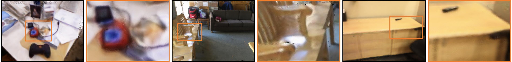

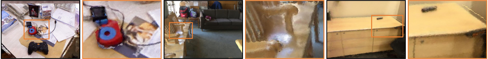

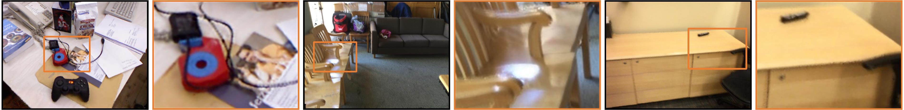

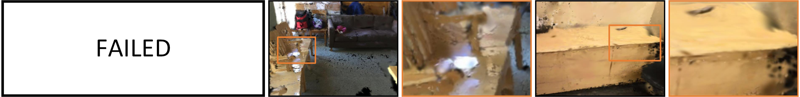

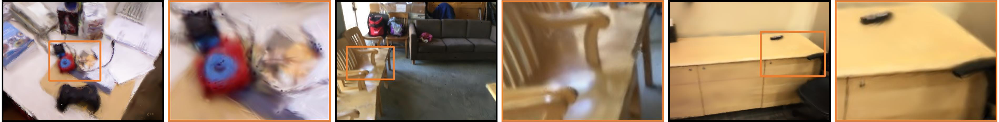

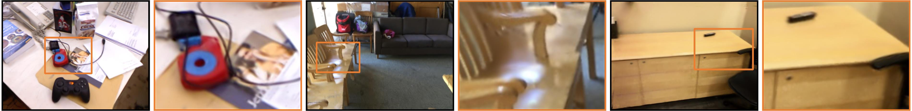

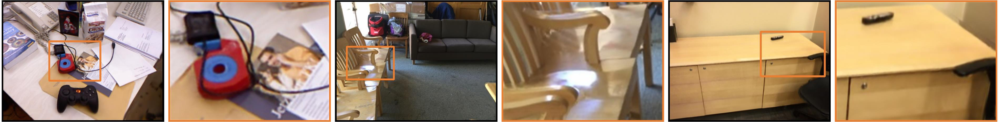

<!-- Page 13 -->
JOURNAL OF LATEX CLASS FILES, VOL. 14, NO. 8, AUGUST 2021
13
Input
CoSLAM [11]
ESLAM [12]
Point
SLAM [26]
Spla
TAM [15]
RTG
SLAM [51]
Photo
SLAM [17]
MonoGS [16]
Ours-GS
Fig. 8. Qualitative rendering results of different methods with our real captured Realsense datasets. The experimental results demonstrate
that our method achieves superior performance over prior methods on the real captured dataset as well. Note that the first column shows an
incorrect view rendered by Photo-SLAM, attributed to a failure in tracking.
reconstruction against other state-of-the-art dense visual
SLAMs are presented in Table 6. MBA-SLAM surpasses
all other SLAM systems except Point-SLAM in Preci-
sion, Recall, and F1 metrics on average, achieving com-
parable Depth L1 performance with SplaTAM [15] and
MonoGS [16]. Qualitative mesh visualizations are shown in
Fig. 9, where we observe that CoSLAM [11] and ESLAM [12]
produce plausible geometry, but lack detail, resulting in
over-smoothed mesh outcomes. In contrast, SplaTAM [15],
Photo-SLAM [17] and MonoGS [16] deliver more details,
albeit with increased artifacts and protrusions. Compared
to these methods, MBA-SLAM provides high-fidelity recon-
struction results with more accurate geometric details and
fewer artifacts.
Evaluation on Real Datasets: ScanNet and TUM RGB-D.
Tracking: The quantitative tracking results in Table 7
demonstrate that MBA-SLAM achieves average camera lo-
calization performance comparable to other state-of-the-art
methods. Furthermore, our NeRF version outperforms all

#### Page 13 Images

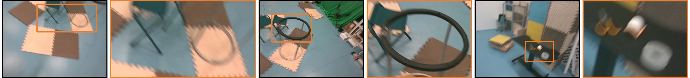

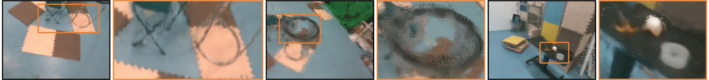

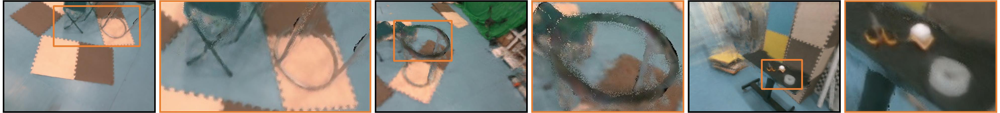

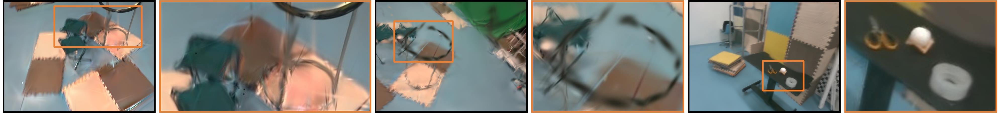

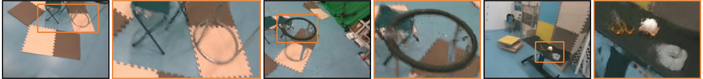

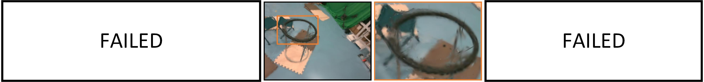

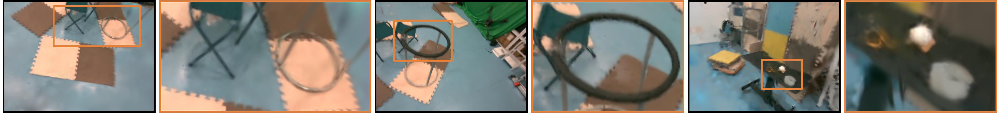

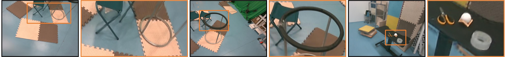

<!-- Page 14 -->
JOURNAL OF LATEX CLASS FILES, VOL. 14, NO. 8, AUGUST 2021
14
NICE
SLAM [10]
CoSLAM [11]
ESLAM [12]
Point
SLAM [26]
Ours-NeRF
SplaTAM [15]
RTG
SLAM [51]
Photo
SLAM [17]
MonoGS [16]
Ours-GS
Groundtruth
Fig. 9. Qualitative mesh visualization results of different methods with Replica datasets. It demonstrates MBA-SLAM surpasses other state-
of-the-art dense visual SLAMs even on standard sharp datasets. Note that RTG-SLAM produces incomplete meshes due to the presence of
numerous holes in the rendered depth maps.

#### Page 14 Images

<!-- Page 15 -->
JOURNAL OF LATEX CLASS FILES, VOL. 14, NO. 8, AUGUST 2021
15
TABLE 5
Rendering Performance on Replica. While Point-SLAM outperforms
other NeRF-based SLAM methods, it suffers from significantly longer
mapping optimization times — over 30 times slower than CoSLAM,
ESLAM, and our NeRF-based system, as shown in Table 8.
Method
Metric
Rm0
Rm1
Rm2
Of0
Of1
Of2
Of3
Of4 Avg.
FPS
NICESL
AM [10]
PSNR ↑22.12 22.47 24.52 29.07 30.34 19.66 22.23 24.94 24.42
SSIM ↑0.689 0.757 0.814 0.874 0.886 0.797 0.801 0.856 0.809
0.30
LPIPS ↓0.330 0.271 0.208 0.229 0.181 0.235 0.209 0.198 0.233
VoxFus
ion [50]
PSNR ↑22.39 22.36 23.92 27.79 29.83 20.33 23.47 25.21 24.41
SSIM ↑0.683 0.751 0.798 0.857 0.876 0.794 0.803 0.847 0.801
3.88
LPIPS ↓0.303 0.269 0.234 0.241 0.184 0.243 0.213 0.199 0.236
CoSL
AM [11]
PSNR ↑27.27 28.45 29.06 34.14 34.87 28.43 28.76 30.91 30.24
SSIM ↑0.910 0.909 0.932 0.961 0.969 0.938 0.941 0.955 0.939
3.68
LPIPS ↓0.324 0.294 0.266 0.209 0.196 0.258 0.229 0.236 0.252
ESL
AM [12]
PSNR ↑25.32 27.77 29.08 33.71 30.20 28.09 28.77 29.71 29.08
SSIM ↑0.875 0.902 0.932 0.960 0.923 0.943 0.948 0.945 0.929
2.82
LPIPS ↓0.313 0.298 0.248 0.184 0.228 0.241 0.196 0.204 0.336
Point
SLAM [26]
PSNR ↑32.40 34.08 35.50 38.26 39.16 33.99 33.48 33.49 35.05
SSIM ↑0.974 0.977 0.982 0.983 0.986 0.960 0.960 0.979 0.975
1.33
LPIPS ↓0.113 0.116 0.111 0.100 0.118 0.156 0.132 0.142 0.124
Ours
NeRF
PSNR ↑28.20 29.84 29.92 35.27 35.03 27.03 29.49 32.01 30.85
SSIM ↑0.926 0.926 0.938 0.969 0.968 0.926 0.956 0.963 0.947
2.75
LPIPS ↓0.265 0.262 0.244 0.167 0.182 0.281 0.182 0.178 0.220
GSSL
AM [14]
PSNR ↑31.56 32.86 32.59 38.70 41.17 32.36 32.03 32.92 34.27
SSIM ↑0.968 0.973 0.971 0.986 0.993 0.978 0.970 0.968 0.975
386.90
LPIPS ↓0.094 0.075 0.093 0.050 0.033 0.094 0.110 0.112 0.082
SplaT
AM [15]
PSNR ↑32.34 33.66 35.34 38.39 39.33 32.18 30.27 32.37 34.24
SSIM ↑0.974 0.969 0.983 0.982 0.983 0.968 0.953 0.950 0.970
234.83
LPIPS ↓0.073 0.097 0.069 0.080 0.091 0.096 0.119 0.148 0.097
RTG
SLAM [51]
PSNR ↑25.53 29.91 31.19 36.65 37.19 29.88 29.96 33.11 31.68
SSIM ↑0.900 0.919 0.937 0.984 0.985 0.958 0.959 0.952 0.949
456.89
LPIPS ↓0.269 0.212 0.193 0.096 0.108 0.187 0.172 0.158 0.174
Photo
SLAM [17]
PSNR ↑31.68 35.50 36.78 38.97 39.78 33.94 34.26 36.77 35.96
SSIM ↑0.948 0.970 0.987 0.984 0.988 0.975 0.973 0.969 0.974 1084.00
LPIPS ↓0.100 0.080 0.061 0.076 0.079 0.126 0.095 0.078 0.087
Mono
GS [16]
PSNR ↑34.55 36.72 37.28 40.06 41.57 35.13 35.71 36.03 37.13
SSIM ↑0.969 0.982 0.989 0.991 0.989 0.990 0.987 0.982 0.985
769.00
LPIPS ↓0.071 0.069 0.071 0.051 0.073 0.073 0.079 0.064 0.069
Ours
GS
PSNR ↑35.68 34.75 38.63 40.86 42.26 33.26 33.69 36.69 36.98
SSIM ↑0.989 0.980 0.994 0.993 0.995 0.988 0.990 0.991 0.990
497.63
LPIPS ↓0.034 0.064 0.030 0.025 0.029 0.074 0.041 0.049 0.043
other approaches on the ScanNet dataset. The “-” symbol
indicates that GS-SLAM is not open-sourced, so we are
unable to report the results.
Rendering: Since the public ScanNet and TUM RGB-D
datasets are captured with motion blur, we conduct render-
ing experiments while modeling blur, as shown in Fig. 7.
4.4
Efficiency Evaluations
Table 8 and Table 9 report the runtime of MBA-SLAM
and state-of-the-art methods on the standard Replica and
blurred ArchViz datasets. We also report the scene repre-
sentation memory usage on Replica. The results in Table 8
indicate that our NeRF version SLAM system achieves near
real-time speed at 22.57 FPS compared to other NeRF-based
SLAMs, while our Gaussian Splatting version achieves
1.97 FPS, which is slower than GS-SLAM [14] but faster
than SplaTAM [15]. Furthermore, our NeRF and Gaussian
Splatting versions achieve the best tracking performance
among Radiance Fields based and Gaussian Splatting based
SLAMs, respectively. For runtime on the blurred dataset
presented in Table 9, we additionally report Our-NeRF* and
Our-GS*, which indicate that we do not model the blur
formation process in our tracking and mapping. This results
in faster FPS due to reduced mapping time, but it leads
to a significant decrease in tracking accuracy compared to
modeling the blur process (i.e., Our-NeRF and Our-GS).
The presence of motion blurred images complicates accurate
TABLE 6
Mesh reconstruction comparison of the proposed method vs. the
SOTA methods on #Replica dataset.
Method
Metric
Rm0
Rm1
Rm2
Of0
Of1
Of2
Of3
Of4 Avg.
NICESL
AM [10]
Depth L1 ↓
1.92
1.37
1.83
1.47
1.50
2.68
2.84
1.95
1.95
Precision ↑48.74 57.51 53.91 61.72 65.57 47.65 52.68 44.92 54.09
Recall ↑
38.35 42.04 41.21 47.14 50.22 39.53 42.01 36.66 42.15
F1 ↑
42.92 48.57 46.71 53.45 56.88 43.21 46.74 40.37 47.36
VoxFus
ion [50]
Depth L1 ↓
0.55
0.63
1.00
2.96
1.30
1.25
1.37
0.76
1.23
Precision ↑95.03 92.65 85.76 46.04 83.88 87.98 90.10 86.37 83.48
Recall ↑
75.58 69.41 68.37 41.64 65.22 68.47 71.10 66.42 65.78
F1 ↑
84.59 79.37 76.09 43.13 73.39 77.01 79.83 75.09 73.56
CoSLA
M [11]
Depth L1 ↓
0.87
0.91
2.26
1.17
1.25
2.13
2.30
1.51
1.55
Precision ↑90.30 83.18 80.68 85.81 92.84 67.64 69.23 87.77 82.18
Recall ↑
74.60 65.59 67.30 73.78 76.12 55.80 58.55 70.20 67.74
F1 ↑
81.70 73.35 73.38 79.34 83.65 61.15 63.45 77.98 74.25
ESL
AM [12]
Depth L1 ↓
0.58
0.72
0.85
0.92
1.03
1.56
1.49
0.76
0.99
Precision ↑94.24 87.45 91.69 93.57 92.31 90.83 90.23 87.71 91.00
Recall ↑
84.31 82.15 82.02 87.23 81.68 79.43 78.39 77.26 81.56
F1 ↑
88.99 84.78 86.59 90.29 86.17 84.18 82.20 82.05 85.66
PointSL
AM [26]
Depth L1 ↓
0.53
0.22
0.46
0.30
0.57
0.49
0.51
0.46
0.44
Precision ↑91.95 99.04 97.89 99.00 99.37 98.05 96.61 93.98 96.99
Recall ↑
82.48 86.43 84.64 89.06 84.99 81.44 81.17 78.51 83.59
F1 ↑
86.90 92.31 90.78 93.77 91.62 88.98 88.22 85.55 89.77
Ours
NeRF
Depth L1 ↓
0.52
0.37
0.71
0.56
0.92
1.68
1.12
0.51
0.80
Precision ↑96.08 96.31 93.11 95.03 95.20 87.34 90.59 93.66 93.42
Recall ↑
85.41 85.68 82.13 88.72 83.72 74.60 78.63 80.55 82.43
F1 ↑
90.42 90.69 87.28 91.77 89.08 79.78 84.10 86.58 87.46
Spla
TAM [15]
Depth L1 ↓
0.49
0.37
0.59
0.43
0.63
0.97
1.15
0.71
0.67
Precision ↑96.08 95.66 95.58 97.43 98.03 94.62 86.49 89.26 94.14
Recall ↑
83.68 83.63 83.16 87.64 83.27 79.29 74.06 75.05 81.22
F1 ↑
89.11 88.64 88.94 92.27 90.05 86.55 80.22 81.54 87.17
RTGS
LAM [51]
Depth L1 ↓
0.79
0.85
1.49
0.98
1.12
1.97
1.78
0.92
1.24
Precision ↑79.75 83.49 78.79 81.66 82.40 76.44 70.12 77.43 78.76
Recall ↑
79.46 75.38 71.52 75.20 71.93 68.34 63.72 69.86 71.93
F1 ↑
80.05 79.21 75.25 78.29 75.58 72.66 66.68 72.51 75.03
PhotoSL
AM [17]
Depth L1 ↓
0.87
0.41
0.98
0.45
0.72
1.21
1.34
0.64
0.83
Precision ↑85.89 94.20 91.59 93.84 96.04 92.96 88.07 91.63 91.78
Recall ↑
81.74 83.71 80.12 87.09 83.24 77.82 75.32 75.86 80.61
F1 ↑
82.31 89.23 85.27 91.98 90.16 84.72 82.04 82.45 86.02
Mono
GS [16]
Depth L1 ↓
0.69
0.39
0.61
0.55
0.67
1.39
0.96
0.68
0.74
Precision ↑88.24 94.93 95.31 93.14 97.75 94.04 90.17 86.85 92.55
Recall ↑
81.56 83.31 82.93 84.35 83.04 78.68 76.09 73.82 80.47
F1 ↑
85.40 88.74 88.38 88.53 89.93 86.12 82.86 79.81 86.22
Ours
GS
Depth L1 ↓
0.47
0.39
0.56
0.35
0.63
1.46
1.51
0.55
0.74
Precision ↑96.63 95.31 96.64 98.26 98.37 94.27 94.17 94.02 95.96
Recall ↑
84.05 83.96 83.59 88.27 83.66 79.07 79.24 78.81 82.58
F1 ↑
89.90 89.28 89.64 93.01 90.42 86.00 86.06 85.74 88.76
TABLE 7
Tracking comparison (ATE RMSE [cm]) of the proposed method vs.
the SOTA methods on the real-world #TUM: left and #ScanNet:
right dataset. MBA-SLAM achieves better tracking performance. ”-”
indicates GS-SLAM is not open sourced and we can not get the results.
Method
desk
xyz
off
Avg.
0059
0106
0169
Avg.
NICE-SLAM [10]
4.26
31.73
3.87
13.29
12.25
8.09
10.28
10.21
Vox-Fusion [50]
3.52
1.49
26.01
10.34
8.95
8.41
9.50
8.95
CoSLAM [11]
2.70
1.90
2.60
2.40
12.29
9.57
6.62
9.49
ESLAM [12]
2.47
1.11
2.42
2.00
9.24
7.82
6.78
7.95
Point-SLAM [26]
4.34
1.31
3.48
3.04
7.81
8.65
22.16
12.87
Ours-NeRF
2.49
1.05
2.58
2.04
6.68
7.54
6.22
6.81
GS-SLAM [14]
3.20
1.30
6.60
3.70
-
-
-
-
SplaTAM [15]
3.35
1.24
5.16
3.25
10.10
17.72
12.08
13.30
RTG-SLAM [51]
1.66
0.38
1.13
1.06
11.57
14.85
19.34
15.25
Photo-SLAM [17]
2.53
0.32
0.99
1.28
7.12
6.96
8.05
7.38
MonoGS [16]
1.50
1.44
1.49
1.47
7.76
10.91
15.58
11.42
Ours-GS
2.11
1.37
2.46
1.98
7.57
11.71
13.54
10.94
camera pose estimation, highlighting the robustness of our
approach. Without modeling blur, MBA-SLAM achieves
comparable or better performance in tracking accuracy
and system FPS compared with other methods, except for
CoSLAM FPS in the pub3 sequence. When modeling the
blur process, MBA-SLAM demonstrates improved perfor-
mance in tracking ATE and rendering (e.g., Fig. 5, Fig. 7
and Fig. 8), albeit with slower system FPS due to the
increased mapping time required. Despite this, MBA-SLAM

<!-- Page 16 -->
JOURNAL OF LATEX CLASS FILES, VOL. 14, NO. 8, AUGUST 2021
16
TABLE 8
Runtime and memory usage on Replica #Room0. The decoder
parameters and embedding denote the parameter number of MLPs and
the memory usage of the scene representation. Ours-NeRF achieves
22.57 FPS, while the speed of Ours-GS is slower than GS-SLAM but
faster than SlaTAM. Our tracking achieves best performance in
Radiance Fields and Gaussian Splatting approaches, respectively.
Method
Tracking
Mapping
Keyframe
System
ATE
Scene
[ms×it] ↓
[ms×it] ↓
Number ↓
FPS ↑
[cm] ↓
Embedding↓
NICE-SLAM [10]
6.64 × 10
28.63 × 60
400
2.91
1.69
48.48 MB
CoSLAM [11]
6.01 × 10
13.18 × 10
400
16.64
0.70
6.36 MB
ESLAM [12]
6.85 × 8
19.87 × 15
500
13.42
0.71
27.12 MB
Point-SLAM [26]
4.36 × 40
34.81 × 300
417
0.42
0.56
12508.62 MB
Ours-NeRF
34.48 × 1
19.96 × 15
296
22.57
0.34
27.12 MB
GS-SLAM [14]
11.9 × 10
12.8 × 100
–
8.34
0.48
198.04 MB
SplaTAM [15]
36.25 × 40
35.33 × 60
2000
0.47
0.34
253.34 MB
RTG-SLAM [51]
60.93 × 1
4.88 × 100
400
9.90
0.18
52.26 MB
Photo-SLAM [16]
41.18 × 1
19.40 × 100
156
6.61
0.33
59.88 MB
MonoGS [16]
2.54 × 100
26.56 × 100
308
1.63
0.42
193.71 MB
Ours-GS
34.23 × 1
75.63 × 100
134
1.97
0.25
242.08 MB
TABLE 9
Runtime and performance on blur dataset #pub3 and #ArchViz-1.
✗denotes failed running due to code bugs. Our-NeRF* and Ours-GS*
indicate we do not model blur formation process, as other methods.
Method
pub3
ArchViz-1
Tracking
Mapping
System
ATE
Tracking
Mapping
System
ATE
Image
[ms×it] ↓
[ms×it] ↓
FPS ↑
[cm]↓[ms×it] ↓[ms×it] ↓
FPS ↑
[cm]↓PSNR↑
NICE-SLAM [10] 32.72×200
49.76×60
0.15
2.96
✗
CoSLAM [11]
3.89×20
15.81×20
6.33
2.75
8.36×50
31.00×40
2.39
5.28
22.97
ESLAM [12]
16.09×200
32.49×60
0.31
2.44
10.32×40
36.24×30
2.42
20.21
21.07
PointSLAM [12]
29.91×200
27.84×150
0.17
2.56
30.99×60 67.22×300
0.20
289.56
15.90
Ours-NeRF*
16.56×1
30.07×60
2.22
2.45
10.73×1
13.82×50
1.99
1.77
23.51
Ours-NeRF
39.64×1
44.74×60
1.49
2.08
35.91×1
36.23×50
0.76
0.98
24.77
SplaTAM [15]
10.59×200
12.06×30
0.47
2.58
18.46×60
22.34×80
0.56
36.88
17.69
RTG-SLAM [51]
✗
43.92 × 1
5.12×100
7.04
✗
✗
Photo-SLAM [16]
36.35×1
13.80×100
3.81
2.36
31.32×1
16.4×100
1.13
4.57
23.45
MonoGS [16]
4.39×100
64.65×10
2.31
2.28
5.33×100
19.7×100
1.05
1.92
23.18
Ours-GS*
17.15×1
29.87×100
1.34
2.53
22.14×1
15.29×100
0.90
4.58
22.32
Ours-GS
19.10×1
192.71×160
0.13
2.16
23.91×1
54.95×160
0.17
0.75
28.44
consistently provides the capability for real-time tracking.
4.5
Ablation Study
Effect of Our Tracker. Table 10 and Table 11 present the
ablation study of integrating our tracker on the Replica
Room0, office0 and ArchViz ArchViz-1, ArchViz-2
datasets, compared with the frame-to-frame tracking meth-
ods: hash-grid based CoSLAM, tri-plane-based ESLAM and
3DGS-based MonoGS. The results demonstrate that our
fully CUDA-implemented frame-to-frame tracker signifi-
cantly enhances both tracking performance (in terms of ATE
and speed) and mapping quality (e.g., PSNR) on both sharp
and blurred datasets, compared with NeRF/3DGS-based
frame-to-map tracking methods. Explanation of Table 10
and Table 11: CoSLAM, ESLAM, and MonoGS are the
original frame-to-map models. In CoSLAM-ours, ESLAM-
ours, and MonoGS-ours, we replace the tracking mod-
ules with our frame-to-frame approach while retaining the
original mapping. For fair comparison, we add a physical
motion blur model to both tracking and mapping, result-
ing in COSLAM-blur, ESLAM-blur, and MonoGS-blur. Cor-
respondingly, COSLAM-blur-ours, ESLAM-blur-ours, and
MonoGS-blur-ours are the blur-aware variants that use
our frame-to-frame tracking while preserving the blur-
aware mapping components. Furthermore, by integrating
our CUDA-implemented tracker, the system can achieve
real-time tracking speeds, as shown in Table 8 and Table 9.
Number of Virtual Images. We evaluate the effect of the
number of interpolated virtual images (i.e. n in Eq. (2))
within the exposure time. For this experiment, we select two
sequences from the synthetic ArchViz dataset: ArchViz-1
and ArchViz-3, representing sequences with low and high
TABLE 10
Ablation studies on the sharp datasets #Room0 and #Office0
compare custom NeRF and 3DGS-based frame-to-map (f2m) tracking
with our proposed frame-to-frame (f2f) tracking.
Method
Room0
Office0
Tracking
ATE↓PSNR↑SSIM↑LPIPS↓ATE↓PSNR↑SSIM↑LPIPS↓
FPS↑
COSLAM (f2m) [11]
0.70
27.27
0.910
0.324
0.59
34.14
0.961
0.209
16.64
COSLAM-ours (f2f)
0.32
28.86
0.931
0.272
0.34
35.45
0.969
0.171
29.06
ESLAM (f2m) [12]
0.71
25.32
0.875
0.313
0.57
33.71
0.960
0.184
18.25
ESLAM-ours (f2f)
0.34
28.20
0.916
0.265
0.25
35.27
0.969
0.167
29.00
MonoGS (f2m) [16]
0.42
34.55
0.969
0.071
0.45
40.06
0.991
0.051
3.94
MonoGS-ours (f2f)
0.31
35.07
0.976
0.066
0.36
40.23
0.993
0.049
29.21
TABLE 11
Ablation studies on the blur datasets #ArchViz-1 and #ArchViz-2
compare custom NeRF and 3DGS-based frame-to-map (f2m) tracking
with our frame-to-frame (f2f) tracking.
Method
ArchViz-1
ArchViz-2
Tracking
ATE↓PSNR↑SSIM↑LPIPS↓ATE↓PSNR↑SSIM↑LPIPS↓
FPS↑
COSLAM (f2m)
5.28
22.97
0.841
0.361
4.67
21.98
0.685
0.570
2.39
COSLAM-blur (f2m)
0.87
25.08
0.904
0.292
1.09
26.03
0.866
0.359
0.61
COSLAM-blur-ours (f2f)
0.61
25.43
0.922
0.265
0.71
26.72
0.893
0.314
29.16
ESLAM (f2m)
20.12
21.07
0.766
0.446
12.61
23.87
0.785
0.475
2.42
ESLAM-blur (f2m)
2.46
23.96
0.873
0.328
3.59
25.23
0.831
0.406
0.57
ESLAM-blur-ours (f2f)
0.98
24.77
0.905
0.312
1.13
26.35
0.875
0.372
27.85
MonoGS (f2m)
1.92
23.18
0.852
0.337
2.96
27.14
0.884
0.329
1.88
MonoGS-blur (f2m)
1.06
27.30
0.924
0.214
0.52
29.92
0.948
0.208
0.41
MonoGS-blur-ours (f2f)
0.68
28.27
0.953
0.148
0.30
30.51
0.960
0.166
41.23
TABLE 12
The effect of the number of interpolated virtual images on dataset
#ArchViz-1. It demonstrates that the performance saturates as the
number increases.
n
ArchViz-1
ArchViz-3
ATE
Mapping
Image
ATE
Mapping
Image
[cm]↓Frame/s↓PSNR↑SSIM↑LPIPS↓[cm]↓Frame/s↓PSNR↑SSIM↑LPIPS↓
7
1.024
5.931
27.89
0.948
0.171
1.810
6.512
27.45
0.933
0.188
9
0.909
6.730
27.85
0.947
0.158
1.689
7.439
27.36
0.932
0.191
11 0.771
7.899
28.29
0.953
0.150
1.697
8.612
27.54
0.940
0.177
13 0.749
8.793
28.45
0.956
0.148
1.413
9.493
27.85
0.943
0.171
15 0.714
9.918
28.49
0.955
0.147
1.257
10.515
27.84
0.942
0.170
17 0.723
10.516
28.37
0.955
0.149
1.223
11.355
27.96
0.944
0.171
levels of motion blur, respectively. The experiments are
conducted using our Gaussian Splatting version system
with a varying number of interpolated virtual images. The
tracking ATE, mapping time, and image quality are reported
in Table 12. The results show that as the number of virtual
images increases, the tracking and rendering performance
(i.e., PSNR, SSIM, LPIPS) tend to saturate, while the map-
ping time continues to increase. Therefore, after considering
the trade-off between system performance and processing
speed, we choose to use 13 virtual images for our experi-
ments.
NeRF or 3DGS SLAM. Our NeRF-based SLAM achieves
substantially faster training and inference by sampling only
a subset of image pixels during both tracking and mapping.
This efficiency, however, comes at the cost of reduced ren-
dering fidelity. In contrast, 3DGS-based SLAM employs full-
image rendering with Gaussian representations, leading to
slower training but higher rendering quality and faster test-
time rendering. As shown in Fig. 5, Table 2, and Table 9,
NeRF-SLAM is preferable for speed-critical applications,
while 3DGS-SLAM is more suitable for tasks requiring high-
fidelity reconstruction.
5
CONCLUSION
In this paper, we introduce a novel framework MBA-SLAM
for robust dense visual RGB-D SLAM, implementing both
an implicit Radiance Fields version and an explicit Gaus-
sian Splatting version. With our physical motion blur im-

<!-- Page 17 -->
JOURNAL OF LATEX CLASS FILES, VOL. 14, NO. 8, AUGUST 2021
17
age formation model, highly CUDA-optimized blur-aware
tracker and deblurring mapper, our MBA-SLAM can track
accurate camera motion trajectories within exposure time
and reconstructs a sharp and photo-realistic map given
severely-blurred video sequence input. We also propose
a real-world motion-blurred SLAM dataset with motion-
captured groundtruth camera poses that can be useful to
the community. Through extensive experiments, we demon-
strate that our method performs state-of-the art on both
existing and our real-world datasets.
ACKNOWLEDGMENTS
This work was supported by National Natural Science
Foundation of China (62202389).
REFERENCES
[1]
R. Mur-Artal and J. D. Tard´os, “ORB-SLAM2: An open-source
slam system for monocular, stereo, and RGB-D cameras,” IEEE
transactions on robotics, vol. 33, no. 5, pp. 1255–1262, 2017. 1, 2, 3
[2]
J. Engel, V. Koltun, and D. Cremers, “Direct sparse odometry,”
IEEE transactions on pattern analysis and machine intelligence, vol. 40,
no. 3, pp. 611–625, 2017. 1, 3
[3]
M. Bloesch, J. Czarnowski, R. Clark, S. Leutenegger, and A. J.
Davison, “CodeSLAM—learning a compact, optimisable represen-
tation for dense visual SLAM,” in Proceedings of the IEEE conference
on computer vision and pattern recognition, 2018, pp. 2560–2568. 1
[4]
J. Czarnowski, T. Laidlow, R. Clark, and A. J. Davison, “Deep-
Factors: Real-time probabilistic dense monocular SLAM,” IEEE
Robotics and Automation Letters, vol. 5, no. 2, pp. 721–728, 2020.
1
[5]
S. Zhi, M. Bloesch, S. Leutenegger, and A. J. Davison, “SceneCode:
Monocular dense semantic reconstruction using learned encoded
scene representations,” in Proceedings of the IEEE/CVF Conference
on Computer Vision and Pattern Recognition, 2019, pp. 11 776–11 785.
1
[6]
J. McCormac, A. Handa, A. Davison, and S. Leutenegger, “Seman-
ticFusion: Dense 3d semantic mapping with convolutional neural
networks,” in 2017 IEEE International Conference on Robotics and
automation (ICRA).
IEEE, 2017, pp. 4628–4635. 1
[7]
B. Mildenhall, P. P. Srinivasan, M. Tancik, J. T. Barron, R. Ra-
mamoorthi, and R. Ng, “NeRF: Representing Scenes as Neural
Radiance Fields for View Synthesis,” in ECCV, 2020. 1, 2, 3, 7
[8]
B. Kerbl, G. Kopanas, T. Leimk¨uhler, and G. Drettakis, “3D Gaus-
sian Splatting for Real-Time Radiance Field Rendering,” ACM
Transactions on Graphics, vol. 42, no. 4, July 2023. [Online]. Avail-
able: https://repo-sam.inria.fr/fungraph/3d-gaussian-splatting/
1, 2, 3, 7, 8
[9]
E. Sucar, S. Liu, J. Ortiz, and A. J. Davison, “iMAP: Implicit map-
ping and positioning in real-time,” in Proceedings of the IEEE/CVF
International Conference on Computer Vision, 2021, pp. 6229–6238. 1,
2, 8, 10
[10] Z. Zhu, S. Peng, V. Larsson, W. Xu, H. Bao, Z. Cui, M. R. Oswald,
and M. Pollefeys, “NICE-SLAM: Neural implicit scalable encoding
for SLAM,” in Proceedings of the IEEE/CVF Conference on Computer
Vision and Pattern Recognition, 2022, pp. 12 786–12 796. 1, 2, 8, 9, 10,
14, 15, 16
[11] H. Wang, J. Wang, and L. Agapito, “Co-SLAM: Joint coordinate
and sparse parametric encodings for neural real-time SLAM,”
in Proceedings of the IEEE/CVF Conference on Computer Vision and
Pattern Recognition, 2023, pp. 13 293–13 302. 1, 2, 8, 9, 10, 11, 12, 13,
14, 15, 16
[12] M. M. Johari, C. Carta, and F. Fleuret, “ESLAM: Efficient dense
SLAM system based on hybrid representation of signed distance
fields,” in Proceedings of the IEEE/CVF Conference on Computer Vision
and Pattern Recognition, 2023, pp. 17 408–17 419. 1, 2, 7, 8, 9, 10, 11,
12, 13, 14, 15, 16
[13] A. Rosinol, J. J. Leonard, and L. Carlone, “NeRF-SLAM: Real-
time dense monocular SLAM with neural radiance fields,” in 2023
IEEE/RSJ International Conference on Intelligent Robots and Systems
(IROS).
IEEE, 2023, pp. 3437–3444. 1, 2
[14] C. Yan, D. Qu, D. Xu, B. Zhao, Z. Wang, D. Wang, and X. Li, “GS-
SLAM: Dense visual slam with 3d gaussian splatting,” in CVPR,
2024. 1, 2, 8, 10, 15, 16
[15] N. Keetha, J. Karhade, K. M. Jatavallabhula, G. Yang, S. Scherer,
D. Ramanan, and J. Luiten, “SplaTAM: Splat, Track & Map 3D
Gaussians for Dense RGB-D SLAM,” in Proceedings of the IEEE/CVF
Conference on Computer Vision and Pattern Recognition, 2024. 1, 2, 8,
9, 10, 11, 12, 13, 14, 15, 16
[16] H. Matsuki, R. Murai, P. H. J. Kelly, and A. J. Davison, “Gaussian
Splatting SLAM,” in Proceedings of the IEEE/CVF Conference on
Computer Vision and Pattern Recognition, 2024.
1, 2, 8, 9, 10, 11,
12, 13, 14, 15, 16
[17] H. Huang, L. Li, C. Hui, and S.-K. Yeung, “Photo-SLAM: Real-time
simultaneous localization and photorealistic mapping for monoc-
ular, stereo, and rgb-d cameras,” in Proceedings of the IEEE/CVF
Conference on Computer Vision and Pattern Recognition, 2024. 1, 2, 8,
9, 10, 11, 12, 13, 14, 15
[18] P. Liu, X. Zuo, V. Larsson, and M. Pollefeys, “MBA-VO: Motion
Blur Aware Visual Odometry,” in ICCV, 2021, pp. 5550–5559. 2, 3,
8, 9
[19] J. Straub, T. Whelan, L. Ma, Y. Chen, E. Wijmans, S. Green, J. J.
Engel, R. Mur-Artal, C. Ren, S. Verma, A. Clarkson, M. Yan,
B. Budge, Y. Yan, X. Pan, J. Yon, Y. Zou, K. Leon, N. Carter,
J. Briales, T. Gillingham, E. Mueggler, L. Pesqueira, M. Savva,
D. Batra, H. M. Strasdat, R. D. Nardi, M. Goesele, S. Lovegrove,
and R. Newcombe, “The Replica dataset: A digital replica of
indoor spaces,” arXiv preprint arXiv:1906.05797, 2019. 2, 9
[20] A. Dai, A. X. Chang, M. Savva, M. Halber, T. Funkhouser, and
M. Nießner, “ScanNet: Richly-annotated 3d reconstructions of
indoor scenes,” in Proceedings of the IEEE conference on computer
vision and pattern recognition, 2017, pp. 5828–5839. 2, 8, 9, 10
[21] J. Sturm, N. Engelhard, F. Endres, W. Burgard, and D. Cremers,
“A benchmark for the evaluation of rgb-d slam systems,” in 2012
IEEE/RSJ international conference on intelligent robots and systems.
IEEE, 2012, pp. 573–580. 2, 8, 9, 10
[22] P. Wang, L. Zhao, R. Ma, and P. Liu, “BAD-NeRF: Bundle Adjusted
Deblur Neural Radiance Fields,” in Proceedings of the IEEE/CVF
Conference on Computer Vision and Pattern Recognition (CVPR), June
2023, pp. 4170–4179. 2, 9
[23] L. Zhao, P. Wang, and P. Liu, “BAD-Gaussians: Bundle adjusted
deblur gaussian splatting,” arXiv preprint arXiv:2403.11831, 2024. 2
[24] Y. Zhang, F. Tosi, S. Mattoccia, and M. Poggi, “Go-SLAM: Global
optimization for consistent 3d instant reconstruction,” in Proceed-
ings of the IEEE/CVF International Conference on Computer Vision,
2023, pp. 3727–3737. 2
[25] C.-M. Chung, Y.-C. Tseng, Y.-C. Hsu, X.-Q. Shi, Y.-H. Hua, J.-F. Yeh,
W.-C. Chen, Y.-T. Chen, and W. H. Hsu, “Orbeez-SLAM: A real-
time monocular visual slam with orb features and nerf-realized
mapping,” in 2023 IEEE International Conference on Robotics and
Automation (ICRA).
IEEE, 2023, pp. 9400–9406. 2
[26] E. Sandstr¨om, Y. Li, L. Van Gool, and M. R. Oswald, “Point-
SLAM: Dense neural point cloud-based SLAM,” in Proceedings of
the IEEE/CVF International Conference on Computer Vision, 2023, pp.
18 433–18 444. 2, 8, 9, 10, 11, 12, 13, 14, 15, 16
[27] Z. Teed and J. Deng, “Droid-SLAM: Deep visual slam for monoc-
ular, stereo, and RGB-D cameras,” Advances in neural information
processing systems, vol. 34, pp. 16 558–16 569, 2021. 2
[28] L. Ma, X. Li, J. Liao, Q. Zhang, X. Wang, J. Wang, and P. V. Sander,
“Deblur-NeRF: Neural Radiance Fields from Blurry Images,” in
CVPR, 2022, pp. 12 861–12 870. 2
[29] D. Lee, M. Lee, C. Shin, and S. Lee, “DP-NeRF: Deblurred neural
radiance field with physical scene priors,” in Proceedings of the
IEEE/CVF Conference on Computer Vision and Pattern Recognition
(CVPR), June 2023, pp. 12 386–12 396. 2
[30] B. Lee, H. Lee, X. Sun, U. Ali, and E. Park, “Deblurring 3d gaussian
splatting,” arXiv preprint arXiv:2401.00834, 2024. 2
[31] C. Peng, Y. Tang, Y. Zhou, N. Wang, X. Liu, D. Li, and R. Chellappa,
“BAGS: Blur agnostic gaussian splatting through multi-scale ker-
nel modeling,” arXiv preprint arXiv:2403.04926, 2024. 2
[32] D. Lee, J. Oh, J. Rim, S. Cho, and K. M. Lee, “ExBluRF: Efficient
radiance fields for extreme motion blurred images,” in Proceedings
of the IEEE/CVF International Conference on Computer Vision, 2023,
pp. 17 639–17 648. 2
[33] J. L. Schonberger and J.-M. Frahm, “Structure-from-Motion Revis-
ited,” in CVPR, 2016, pp. 4104–4113. 2
[34] J. Engel, T. Sch¨ops, and D. Cremers, “LSD-SLAM: Large-scale

<!-- Page 18 -->
JOURNAL OF LATEX CLASS FILES, VOL. 14, NO. 8, AUGUST 2021
18
direct monocular SLAM,” in European conference on computer vision.
Springer, 2014, pp. 834–849. 3
[35] X. Gao, R. Wang, N. Demmel, and D. Cremers, “LDSO: Direct
sparse odometry with loop closure,” in 2018 IEEE/RSJ International
Conference on Intelligent Robots and Systems (IROS). IEEE, 2018, pp.
2198–2204. 3
[36] P. Liu, M. Geppert, L. Heng, T. Sattler, A. Geiger, and M. Pollefeys,
“Towards robust visual odometry with a multi-camera system,”
in 2018 IEEE/RSJ International Conference on Intelligent Robots and
Systems (IROS).
IEEE, 2018, pp. 1154–1161. 3
[37] P. Liu, L. Heng, T. Sattler, A. Geiger, and M. Pollefeys, “Direct
visual odometry for a fisheye-stereo camera,” in 2017 IEEE/RSJ
International Conference on Intelligent Robots and Systems (IROS).
IEEE, 2017, pp. 1746–1752. 3
[38] D. Schubert, N. Demmel, L. Von Stumberg, V. Usenko, and
D. Cremers, “Rolling-shutter modelling for direct visual-inertial
odometry,” in 2019 IEEE/RSJ International Conference on Intelligent
Robots and Systems (IROS).
IEEE, 2019, pp. 2462–2469. 3
[39] Davison, “Real-time simultaneous localisation and mapping with
a single camera,” in Proceedings Ninth IEEE International Conference
on Computer Vision.
IEEE, 2003, pp. 1403–1410. 3
[40] D. Nist´er, O. Naroditsky, and J. Bergen, “Visual odometry,” in Pro-
ceedings of the 2004 IEEE Computer Society Conference on Computer
Vision and Pattern Recognition, 2004. CVPR 2004., vol. 1. Ieee, 2004,
pp. I–I. 3
[41] B. Ummenhofer, H. Zhou, J. Uhrig, N. Mayer, E. Ilg, A. Doso-
vitskiy, and T. Brox, “DeMoN: Depth and Motion Network for
Learning Monocular Stereo,” in CVPR, 2017. 3
[42] H. Zhou, B. Ummenhofer, and T. Brox, “DeepTAM: Deep tracking
and mapping,” in ECCV, 2018. 3
[43] T. Zhou, M. Brown, N. Snavely, and D. G. Lowe, “Unsupervised
learning of depth and ego-motion from video,” in CVPR, 2017. 3
[44] H. S. Lee, J. Kwon, and K. M. Lee, “Simultaneous localization,
mapping and deblurring,” in ICCV, 2011. 3
[45] C. Cadena, L. Carlone, H. Carrillo, Y. Latif, D. Scaramuzza,
J. Neira, I. Reid, and J. J. Leonard, “Past, present, and future
of simultaneous localization and mapping: Toward the robust-
perception age,” IEEE Transactions on Robotics, 2016. 3
[46] E. R. Chan, C. Z. Lin, M. A. Chan, K. Nagano, B. Pan, S. De Mello,
O. Gallo, L. J. Guibas, J. Tremblay, S. Khamis et al., “Efficient
geometry-aware 3d generative adversarial networks,” in Proceed-
ings of the IEEE/CVF conference on computer vision and pattern
recognition, 2022, pp. 16 123–16 133. 7
[47] N. Max, “Optical models for direct volume rendering,” IEEE
Transactions on Visualization and Computer Graphics, vol. 1, no. 2,
pp. 99–108, 1995. 7
[48] R. Or-El, X. Luo, M. Shan, E. Shechtman, J. J. Park, and
I.
Kemelmacher-Shlizerman,
“StyleSDF:
High-resolution
3d-
consistent image and geometry generation,” in Proceedings of the
IEEE/CVF Conference on Computer Vision and Pattern Recognition,
2022, pp. 13 503–13 513. 7
[49] T. Xie, Z. Zong, Y. Qiu, X. Li, Y. Feng, Y. Yang, and C. Jiang,
“PhysGaussian: Physics-integrated 3d gaussians for generative
dynamics,” in Proceedings of the IEEE/CVF Conference on Computer
Vision and Pattern Recognition, 2024, pp. 4389–4398. 8
[50] X. Yang, H. Li, H. Zhai, Y. Ming, Y. Liu, and G. Zhang, “Vox-
Fusion: Dense tracking and mapping with voxel-based neural
implicit representation,” in 2022 IEEE International Symposium on
Mixed and Augmented Reality (ISMAR).
IEEE, 2022, pp. 499–507.
8, 9, 10, 11, 15
[51] Z. Peng, T. Shao, L. Yong, J. Zhou, Y. Yang, J. Wang, and K. Zhou,
“Rtg-slam: Real-time 3d reconstruction at scale using gaussian
splatting,” in ACM SIGGRAPH Conference Proceedings, Denver, CO,
United States, July 28 - August 1, 2024, 2024. 8, 9, 10, 12, 13, 14, 15,
16
[52] W. E. Lorensen and H. E. Cline, “Marching cubes: A high reso-
lution 3d surface construction algorithm,” ACM siggraph computer
graphics, vol. 21, no. 4, pp. 163–169, 1987. 9
[53] R. Zhang, P. Isola, A. A. Efros, E. Shechtman, and O. Wang,
“The Unreasonable Effectiveness of Deep Features as a Perceptual
Metric,” in CVPR, 2018, pp. 586–595. 9
[54] V. Ye, R. Li, J. Kerr, M. Turkulainen, B. Yi, Z. Pan, O. Seiskari,
J. Ye, J. Hu, M. Tancik, and A. Kanazawa, “gsplat: An open-source
library for Gaussian splatting,” arXiv preprint arXiv:2409.06765,
2024. [Online]. Available: https://arxiv.org/abs/2409.06765 9
[55] B. Curless and M. Levoy, “A volumetric method for building
complex models from range images,” in Proceedings of the 23rd
annual conference on Computer graphics and interactive techniques,
1996, pp. 303–312. 10

